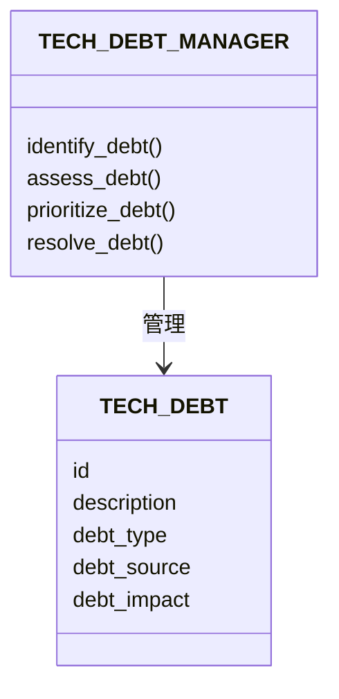

                 


# 彼得林奇对公司技术债务管理能力的评估

> 关键词：技术债务，公司管理，软件架构，技术评估，彼得林奇

> 摘要：本文通过分析技术债务在公司管理中的重要性，探讨如何评估和管理技术债务。从技术债务的定义、分类、影响到管理策略，结合彼得·林奇的评估方法，提出系统化的解决方案，帮助企业在技术债务管理中实现高效和可持续发展。

---

## 第一章: 技术债务的定义与背景

### 1.1 技术债务的定义

#### 1.1.1 技术债务的起源与概念

技术债务这一概念最早由沃德·库特提出，指的是在软件开发过程中为了追求快速交付而采用的临时解决方案所积累的债务。这种债务随着时间的推移会逐渐累积，影响系统的可维护性和扩展性。彼得·林奇将技术债务比作企业发展的隐形负担，如果不加以管理，将严重制约企业的技术竞争力和创新能力。

#### 1.1.2 技术债务的分类与特征

技术债务可以根据来源、影响和解决方式分为以下几类：

- **代码层面的债务**：由于编码不规范、逻辑复杂或设计欠佳导致的债务。
- **架构层面的债务**：由于系统架构设计不合理导致的扩展性差、耦合度过高等问题。
- **工具与流程层面的债务**：由于开发工具落后、测试覆盖率不足或自动化流程缺失导致的效率低下问题。
- **知识层面的债务**：由于技术文档不完善、团队知识断层导致的可维护性下降问题。

技术债务的特征包括累积性、隐蔽性和渐进性。随着时间的推移，技术债务会逐渐积累，并在系统运行过程中逐步显现其负面影响。

#### 1.1.3 技术债务在企业中的重要性

技术债务对企业的影响不容忽视。它不仅会增加维护成本，还可能导致系统崩溃、用户体验下降和客户流失。彼得·林奇认为，技术债务管理是企业技术管理的核心能力之一，只有通过有效的技术债务管理，企业才能在竞争激烈的市场中保持技术优势。

---

### 1.2 技术债务的来源与影响

#### 1.2.1 技术债务的常见来源

技术债务的来源多种多样，主要包括以下几种：

- **开发过程中的捷径**：为了赶进度，开发人员可能会采用临时解决方案，导致技术债务的产生。
- **架构设计不合理**：在系统设计阶段未能充分考虑扩展性和可维护性，导致后续的技术债务累积。
- **团队能力不足**：开发团队技术能力不足或经验不足，导致代码质量和系统设计存在问题。
- **外部环境变化**：市场需求变化、技术标准更新等外部因素可能导致现有系统无法适应新需求，从而产生技术债务。

#### 1.2.2 技术债务对企业的影响

技术债务对企业的负面影响主要体现在以下几个方面：

- **增加维护成本**：技术债务会导致系统维护成本上升，因为需要投入更多资源来修复问题。
- **降低系统性能**：技术债务可能导致系统性能下降，影响用户体验和业务效率。
- **制约创新能力**：技术债务的存在会占用企业资源，限制企业在新技术和创新上的投入。
- **影响企业声誉**：系统崩溃或性能问题可能导致客户流失，损害企业的品牌形象。

#### 1.2.3 技术债务与企业竞争力的关系

技术债务管理是企业技术管理的核心能力之一。彼得·林奇指出，技术债务管理能力越强的企业，在市场中的竞争力也越强。通过有效的技术债务管理，企业可以减少维护成本，提高系统性能，从而在竞争中占据优势。

---

### 1.3 技术债务管理的必要性

#### 1.3.1 技术债务管理的核心目标

技术债务管理的核心目标是通过识别、评估和解决技术债务，降低技术债务对企业的影响，提高系统的可维护性和扩展性。彼得·林奇强调，技术债务管理不仅仅是技术问题，更是一种企业级的管理活动，需要企业从战略层面进行规划和实施。

#### 1.3.2 技术债务管理的边界与外延

技术债务管理的边界包括技术债务的识别、评估、优先级排序和解决。其外延则涉及企业战略、团队协作、资源分配等多个方面。彼得·林奇认为，技术债务管理需要与企业的战略目标相结合，才能真正发挥其价值。

#### 1.3.3 技术债务管理的组织架构

技术债务管理需要建立专门的组织架构，包括技术债务管理团队、技术债务管理委员会等。彼得·林奇建议，企业应设立技术债务管理负责人，负责制定技术债务管理策略，协调各部门的工作，确保技术债务管理的有效实施。

---

## 第二章: 技术债务管理的核心概念

### 2.1 技术债务管理的理论基础

#### 2.1.1 技术债务管理的模型与框架

技术债务管理的模型与框架是技术债务管理的核心理论基础。彼得·林奇提出了一个技术债务管理的三阶段模型，包括识别阶段、评估阶段和解决阶段。

- **识别阶段**：通过代码审查、系统测试等方法，识别系统中存在的技术债务。
- **评估阶段**：对识别出的技术债务进行优先级排序，评估其对系统的影响程度。
- **解决阶段**：根据优先级，制定技术债务解决计划，逐步消除技术债务。

#### 2.1.2 技术债务管理的属性特征对比

技术债务管理的属性特征可以通过对比分析来更好地理解。例如，技术债务的累积性与系统性能的下降性之间的关系。

| 技术债务属性 | 特征描述 |
|--------------|----------|
| 累积性        | 随时间累积，影响范围逐步扩大 |
| 隐蔽性        | 难以被发现，但影响深远 |
| 渐进性        | 逐步显现，但一旦爆发影响巨大 |

#### 2.1.3 技术债务管理的ER实体关系图

以下是技术债务管理的ER实体关系图：

```mermaid
erDiagram
    DEBTMANAGEMENT <--- TECH_DEBT
    TECH_DEBT --> DEBT_TYPE
    TECH_DEBT --> DEBT_SOURCE
    TECH_DEBT --> DEBT_IMPACT
```

---

### 2.2 技术债务管理的流程与步骤

#### 2.2.1 技术债务的识别与评估

技术债务的识别与评估是技术债务管理的第一步。彼得·林奇建议，企业应通过代码审查、系统测试和性能监控等方法，识别系统中存在的技术债务，并对其影响程度进行评估。

#### 2.2.2 技术债务的优先级排序

技术债务的优先级排序是技术债务管理的关键步骤。彼得·林奇提出，技术债务的优先级应根据其对系统性能的影响程度、修复成本和修复时间等因素进行综合评估。

#### 2.2.3 技术债务的缓解与优化

技术债务的缓解与优化是技术债务管理的最后一步。彼得·林奇建议，企业应根据技术债务的优先级，制定技术债务解决计划，逐步消除技术债务，优化系统性能。

---

### 2.3 技术债务管理的工具与方法

#### 2.3.1 技术债务管理的常用工具

技术债务管理的常用工具包括代码审查工具、测试工具、性能监控工具等。彼得·林奇推荐使用以下工具：

- **代码审查工具**：如SonarQube、Checkmarx等。
- **测试工具**：如JMeter、Selenium等。
- **性能监控工具**：如New Relic、Datadog等。

#### 2.3.2 技术债务管理的指标与KPI

技术债务管理的指标与KPI是衡量技术债务管理效果的重要依据。常见的指标包括技术债务总量、技术债务解决率、技术债务影响程度等。

#### 2.3.3 技术债务管理的可视化方法

技术债务的可视化是技术债务管理的重要手段。彼得·林奇建议，企业可以通过技术债务仪表盘、技术债务分布图等可视化方式，直观展示技术债务的现状和变化趋势。

---

## 第三章: 技术债务管理的算法与模型

### 3.1 技术债务管理的算法原理

#### 3.1.1 技术债务的量化算法

技术债务的量化算法是技术债务管理的重要组成部分。彼得·林奇提出了一种基于代码复杂度的技术债务量化算法，通过计算代码的复杂度指标，量化技术债务的规模和影响。

#### 3.1.2 技术债务的度量方法

技术债务的度量方法是技术债务管理的关键步骤。彼得·林奇建议，企业应采用多维度的度量方法，综合考虑技术债务的来源、影响和解决成本等因素。

#### 3.1.3 技术债务的预测算法

技术债务的预测算法是技术债务管理的高级手段。彼得·林奇提出了一种基于时间序列的预测算法，通过分析技术债务的历史数据，预测未来的技术债务发展趋势。

---

### 3.2 技术债务管理的数学模型与公式

#### 3.2.1 技术债务的度量指标公式

技术债务的度量指标公式如下：

$$
\text{技术债务总量} = \sum_{i=1}^{n} \text{技术债务}_i
$$

其中，$\text{技术债务}_i$ 表示第 $i$ 项技术债务的规模。

#### 3.2.2 技术债务的优先级排序公式

技术债务的优先级排序公式如下：

$$
\text{优先级} = \frac{\text{影响程度}}{\text{修复成本}}
$$

其中，$\text{影响程度}$ 表示技术债务对系统性能的影响程度，$\text{修复成本}$ 表示修复该技术债务所需的成本。

#### 3.2.3 技术债务的缓解成本公式

技术债务的缓解成本公式如下：

$$
\text{缓解成本} = \text{修复时间} \times \text{修复资源}
$$

其中，$\text{修复时间}$ 表示修复技术债务所需的时间，$\text{修复资源}$ 表示修复技术债务所需的人力资源。

---

## 第四章: 技术债务管理的系统分析与架构设计

### 4.1 系统功能设计

#### 4.1.1 领域模型设计

以下是技术债务管理系统的领域模型设计：



---

### 4.2 系统架构设计

技术债务管理系统的架构设计如下：


其中，客户端通过API网关访问服务层，服务层负责处理技术债务管理的业务逻辑，数据库负责存储技术债务的相关数据。

---

## 第五章: 技术债务管理的项目实战

### 5.1 项目背景

项目背景：某互联网公司面临系统性能下降的问题，经过分析发现是由于技术债务累积导致的。为了改善系统性能，公司决定实施技术债务管理项目。

### 5.2 项目实施步骤

#### 5.2.1 环境安装

项目实施环境包括以下工具：

- **代码审查工具**：SonarQube
- **测试工具**：JMeter
- **性能监控工具**：New Relic

#### 5.2.2 核心代码实现

以下是技术债务管理系统的核心代码实现：

```python
def identify_debt():
    pass

def assess_debt():
    pass

def prioritize_debt():
    pass

def resolve_debt():
    pass
```

#### 5.2.3 代码应用解读与分析

代码解读：上述代码实现了技术债务的识别、评估、优先级排序和解决四个步骤。每个函数的具体实现可以根据实际需求进行扩展。

#### 5.2.4 案例分析和详细讲解剖析

案例分析：假设某系统存在以下技术债务：

- 代码层面的债务：代码逻辑复杂，难以维护。
- 架构层面的债务：系统架构设计不合理，导致扩展性差。

通过技术债务管理，企业可以逐步消除这些债务，改善系统性能和可维护性。

---

## 第六章: 技术债务管理的最佳实践

### 6.1 小结

技术债务管理是企业技术管理的核心能力之一。通过有效的技术债务管理，企业可以减少维护成本，提高系统性能，从而在竞争中占据优势。彼得·林奇的技术债务管理方法为企业提供了系统的解决方案。

### 6.2 注意事项

企业在实施技术债务管理时，需要注意以下几点：

- **技术债务管理需要长期坚持**：技术债务管理不是一蹴而就的，需要企业长期投入。
- **技术债务管理需要跨部门协作**：技术债务管理涉及开发、测试、运维等多个部门，需要建立良好的协作机制。
- **技术债务管理需要结合企业实际情况**：技术债务管理的策略和方法需要根据企业的实际情况进行调整和优化。

### 6.3 拓展阅读

建议读者进一步阅读以下书籍和文章，深入了解技术债务管理的相关知识：

- 《技术债务实战：如何在企业中有效管理技术债务》
- 《技术债务管理：从理论到实践》
- 《彼得·林奇谈技术债务管理》

---

## 结论

技术债务管理是企业技术管理的核心能力之一。通过有效的技术债务管理，企业可以减少维护成本，提高系统性能，从而在竞争中占据优势。彼得·林奇的技术债务管理方法为企业提供了系统的解决方案。

---

## 作者信息

作者：AI天才研究院/AI Genius Institute & 禅与计算机程序设计艺术 /Zen And The Art of Computer Programming

---

