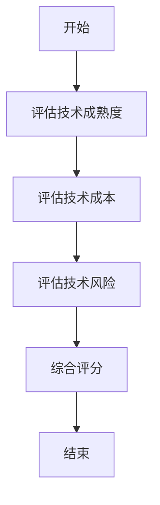
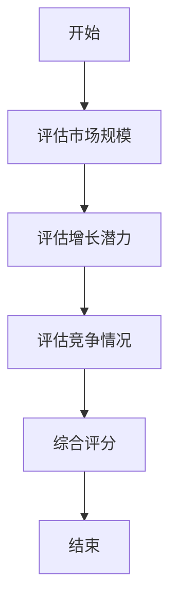
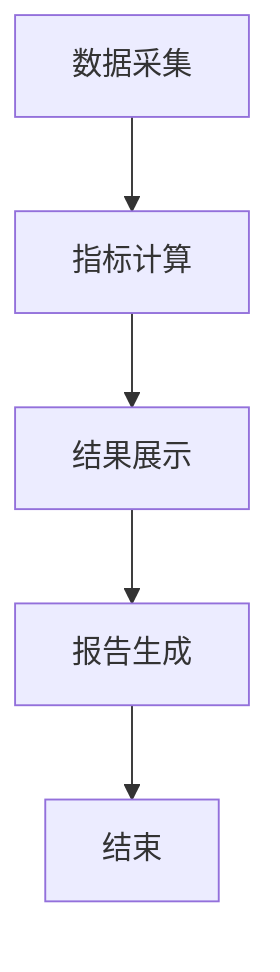
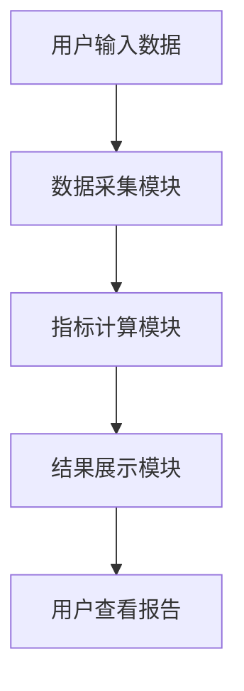

                 

# 彼得林奇对公司技术创新的评估标准

## 关键词：彼得林奇，技术创新，评估标准，投资分析，企业战略，技术评估

## 摘要：  
本文基于彼得林奇的投资理念，详细探讨了他对公司技术创新的评估标准。通过分析技术创新的核心维度，结合实际案例和系统架构，为投资者和企业提供了一套科学的评估方法。文章从背景介绍、核心概念、算法原理、系统架构、项目实战到最佳实践，全面阐述了技术创新评估的全过程。

---

# 第一章: 技术创新评估的背景与重要性

## 1.1 技术创新的定义与内涵  
技术创新是指通过引入新的技术、方法或工具，以改善产品性能、降低成本或提高生产效率的过程。它不仅是企业发展的核心驱动力，也是行业变革的重要推手。

### 1.1.1 技术创新的核心概念  
- 技术创新涉及技术的开发、应用和商业化。  
- 创新可以是渐进式的改进，也可以是颠覆性的突破。  
- 技术创新的核心在于解决实际问题并创造价值。  

### 1.1.2 技术创新与企业发展的关系  
- 技术创新是企业保持竞争优势的关键。  
- 它能够提升企业的生产效率和产品质量。  
- 技术创新还能够拓展新的市场机会。  

### 1.1.3 技术创新在现代经济中的地位  
- 技术创新是经济增长的主要动力。  
- 它推动了产业结构的升级和优化。  
- 技术创新是企业长期发展的基石。  

---

## 1.2 彼得林奇的投资理念  
彼得林奇作为著名的投资专家，以其独特的投资策略闻名。他注重基本面分析，尤其是对技术创新公司的评估。

### 1.2.1 彼得林奇的投资者视角  
- 投资者需要关注企业的技术实力和市场潜力。  
- 彼得林奇认为，技术创新是企业长期增长的核心驱动力。  
- 他倾向于投资那些能够持续创新的企业。  

### 1.2.2 技术创新与投资回报的关系  
- 技术创新能力强的企业往往具有更高的投资回报率。  
- 创新能够降低企业的成本，提高利润率。  
- 技术创新还能够扩大市场占有率。  

### 1.2.3 技术创新对投资决策的影响  
- 技术创新是评估企业投资价值的重要指标。  
- 创新能力强的企业更具抗风险能力。  
- 技术创新能够为企业带来持续的竞争优势。  

---

## 1.3 技术创新评估的重要性  
技术创新评估是企业战略决策的关键环节。

### 1.3.1 技术创新对企业竞争力的影响  
- 技术创新能够提升企业的核心竞争力。  
- 它是企业差异化战略的重要手段。  
- 技术创新能够增强企业的市场影响力。  

### 1.3.2 技术创新对行业格局的重塑作用  
- 技术创新能够改变行业的竞争格局。  
- 它推动了新技术和新产品的出现。  
- 技术创新能够催生新的商业模式。  

### 1.3.3 技术创新与企业可持续发展  
- 技术创新是企业可持续发展的基石。  
- 它能够减少资源浪费和环境污染。  
- 技术创新能够提高企业的社会责任感。  

---

## 1.4 本章小结  
通过本章的分析，我们了解了技术创新的定义、彼得林奇的投资理念以及技术创新评估的重要性。技术创新不仅是企业发展的核心驱动力，也是投资者评估企业价值的关键指标。  

---

## 1.5 技术创新评估的框架  
技术创新评估需要从多个维度进行综合考量，包括技术可行性、市场潜力、竞争优势等。

---

# 第二章: 技术创新评估的维度与框架  

## 2.1 技术创新评估的维度  
技术创新评估需要从多个维度进行分析，以确保评估的全面性和准确性。

### 2.1.1 技术可行性分析  
- 技术可行性是技术创新评估的基础。  
- 需要评估技术的成熟度、可实现性和成本。  
- 技术可行性分析需要考虑技术的局限性和潜在的风险。  

### 2.1.2 市场潜力评估  
- 市场潜力是技术创新成功的重要因素。  
- 需要分析目标市场的规模、增长潜力和竞争情况。  
- 市场潜力评估需要结合行业趋势和消费者需求。  

### 2.1.3 竞争优势分析  
- 竞争优势是技术创新的核心竞争力。  
- 需要评估企业的技术优势、成本优势和资源优势。  
- 竞争优势分析需要考虑行业内的竞争对手和技术差距。  

### 2.1.4 商业化能力评估  
- 商业化能力是技术创新成功的关键。  
- 需要评估企业的市场推广能力、销售能力和售后服务能力。  
- 商业化能力评估需要考虑企业的组织结构和管理能力。  

### 2.1.5 风险与不确定性分析  
- 风险分析是技术创新评估的重要部分。  
- 需要评估技术创新过程中可能遇到的技术风险、市场风险和财务风险。  
- 风险分析需要结合历史数据和行业经验。  

---

## 2.2 彼得林奇的评估框架  
彼得林奇提出了一个基于技术创新评估的框架，结合了技术可行性、市场潜力和竞争优势等维度。

### 2.2.1 技术创新的经济价值模型  
- 经济价值模型是评估技术创新的核心工具。  
- 需要计算技术创新的直接收益和间接收益。  
- 经济价值模型需要考虑技术的生命周期和市场反应。  

### 2.2.2 评估指标的权重分配  
- 评估指标的权重分配需要根据企业的实际情况进行调整。  
- 技术可行性、市场潜力和竞争优势的权重可以根据行业特点和企业战略进行分配。  

### 2.2.3 评估结果的分类与分级  
- 评估结果需要进行分类和分级，以便投资者和企业管理层进行决策。  
- 分类和分级需要结合定量分析和定性分析。  

---

## 2.3 核心概念对比分析  
技术创新评估需要与商业模式创新、管理创新和市场创新进行对比分析，以确保评估的全面性。

### 2.3.1 技术创新与商业模式创新的对比  
- 技术创新注重技术本身，而商业模式创新注重业务模式。  
- 技术创新是商业模式创新的基础，而商业模式创新是技术创新的延伸。  

### 2.3.2 技术创新与管理创新的对比  
- 技术创新注重技术的应用，而管理创新注重管理方式的改进。  
- 技术创新是管理创新的工具，而管理创新是技术创新的保障。  

### 2.3.3 技术创新与市场创新的对比  
- 技术创新注重技术的开发和应用，而市场创新注重市场的开拓和推广。  
- 技术创新是市场创新的核心，而市场创新是技术创新的延伸。  

---

## 2.4 本章小结  
通过本章的分析，我们了解了技术创新评估的核心维度，包括技术可行性、市场潜力、竞争优势等。彼得林奇的评估框架结合了这些维度，为企业和技术投资者提供了一个科学的评估方法。

---

# 第三章: 技术创新评估的算法与模型  

## 3.1 技术创新评估的数学模型  
技术创新评估需要建立数学模型，以量化分析技术创新的价值和潜力。

### 3.1.1 评估指标的加权模型  
- 加权模型是技术创新评估的核心工具。  
- 需要根据各指标的重要性进行权重分配。  
- 加权模型的公式如下：  
  $$ \text{综合评分} = \sum (\text{指标权重} \times \text{指标得分}) $$  

### 3.1.2 综合评分的计算公式  
- 综合评分需要结合各指标的权重和得分进行计算。  
- 综合评分的公式如下：  
  $$ \text{综合评分} = \sum_{i=1}^{n} (w_i \times s_i) $$  
  其中，\( w_i \) 是指标 \( i \) 的权重，\( s_i \) 是指标 \( i \) 的得分。  

---

## 3.2 技术创新评估的算法实现  
技术创新评估的算法实现需要结合具体的技术指标和市场数据。

### 3.2.1 技术可行性分析的算法  
- 技术可行性分析需要考虑技术的成熟度、成本和风险。  
- 可以使用模糊逻辑或概率模型进行评估。  
- 技术可行性分析的流程图如下：  

### 3.2.2 市场潜力评估的算法  
- 市场潜力评估需要考虑市场规模、增长潜力和竞争情况。  
- 可以使用回归分析或时间序列分析进行预测。  
- 市场潜力评估的流程图如下：  

---

## 3.3 技术创新评估的系统架构  
技术创新评估的系统架构需要结合数据采集、模型计算和结果展示。

### 3.3.1 系统功能设计  
- 系统功能包括数据采集、指标计算、结果展示和报告生成。  
- 系统功能的设计需要结合企业的实际情况和需求。  

### 3.3.2 系统架构设计  
- 系统架构需要考虑模块化设计，便于功能扩展和维护。  
- 系统架构的流程图如下：  

---

## 3.4 本章小结  
通过本章的分析，我们了解了技术创新评估的数学模型和算法实现。技术创新评估需要结合技术可行性、市场潜力和竞争优势等指标，建立综合评分模型，以量化分析技术创新的价值和潜力。

---

# 第四章: 技术创新评估的系统实现  

## 4.1 系统功能设计  
技术创新评估系统需要具备数据采集、指标计算和结果展示等功能。

### 4.1.1 数据采集模块  
- 数据采集模块负责收集技术指标和市场数据。  
- 数据采集模块需要考虑数据的来源和格式。  

### 4.1.2 指标计算模块  
- 指标计算模块负责计算各指标的权重和得分。  
- 指标计算模块需要结合数学模型和算法进行计算。  

### 4.1.3 结果展示模块  
- 结果展示模块负责展示综合评分和评估报告。  
- 结果展示模块需要结合可视化工具进行数据呈现。  

---

## 4.2 系统架构设计  
技术创新评估系统的架构设计需要考虑模块化和可扩展性。

### 4.2.1 系统架构图  
- 系统架构图展示了各模块之间的关系和交互。  
- 系统架构图如下：  

### 4.2.2 系统交互流程图  
- 系统交互流程图展示了用户与系统之间的交互流程。  
- 系统交互流程图如下：  

---

## 4.3 本章小结  
通过本章的分析，我们了解了技术创新评估系统的功能设计和架构设计。技术创新评估系统需要具备数据采集、指标计算和结果展示等功能，以支持企业的技术创新评估工作。

---

# 第五章: 技术创新评估的项目实战  

## 5.1 项目背景与目标  
技术创新评估项目的背景和目标需要明确，以便制定合理的评估方案。

### 5.1.1 项目背景  
- 项目背景需要说明技术创新评估的必要性和重要性。  
- 项目背景需要结合企业的实际情况和行业趋势。  

### 5.1.2 项目目标  
- 项目目标需要明确技术创新评估的具体目标和预期成果。  
- 项目目标需要结合企业的战略和实际需求。  

---

## 5.2 项目实施步骤  
技术创新评估项目需要按照一定的步骤进行实施，以确保评估的科学性和有效性。

### 5.2.1 数据采集  
- 数据采集需要收集技术指标和市场数据。  
- 数据采集需要考虑数据的来源和格式。  

### 5.2.2 指标计算  
- 指标计算需要结合数学模型和算法进行计算。  
- 指标计算需要考虑各指标的权重和得分。  

### 5.2.3 结果展示  
- 结果展示需要结合可视化工具进行数据呈现。  
- 结果展示需要明确综合评分和评估报告。  

---

## 5.3 项目案例分析  
技术创新评估项目需要结合具体案例进行分析，以验证评估模型的有效性和可行性。

### 5.3.1 案例背景  
- 案例背景需要说明技术创新评估的具体场景和需求。  
- 案例背景需要结合企业的实际情况和行业趋势。  

### 5.3.2 指标评估  
- 指标评估需要结合具体指标进行分析，如技术可行性和市场潜力。  
- 指标评估需要结合实际数据进行计算和验证。  

### 5.3.3 结果分析  
- 结果分析需要结合综合评分和评估报告进行深入解读。  
- 结果分析需要结合企业的实际情况和行业趋势。  

---

## 5.4 本章小结  
通过本章的分析，我们了解了技术创新评估项目的实施步骤和案例分析。技术创新评估项目需要结合企业的实际情况和行业趋势，制定合理的评估方案，并通过具体案例进行验证和优化。

---

# 第六章: 技术创新评估的最佳实践  

## 6.1 小结  
技术创新评估是企业战略决策的关键环节，需要从多个维度进行综合考量。

### 6.1.1 技术创新的核心维度  
- 技术创新需要从技术可行性、市场潜力和竞争优势等维度进行评估。  
- 各维度的权重和得分需要结合企业的实际情况进行调整。  

### 6.1.2 技术创新评估的框架  
- 彼得林奇的评估框架结合了技术可行性、市场潜力和竞争优势等维度。  
- 评估框架需要根据企业的实际情况进行调整和优化。  

---

## 6.2 注意事项  
技术创新评估需要注意以下几点：

### 6.2.1 数据的准确性和完整性  
- 数据的准确性和完整性是技术创新评估的基础。  
- 数据的收集和处理需要结合企业的实际情况和行业趋势。  

### 6.2.2 模型的合理性和适用性  
- 模型的合理性和适用性是技术创新评估的关键。  
- 模型需要结合企业的实际情况和行业特点进行调整和优化。  

### 6.2.3 评估结果的科学性和可行性  
- 评估结果的科学性和可行性是技术创新评估的核心。  
- 评估结果需要结合企业的实际情况和行业趋势进行深入解读和分析。  

---

## 6.3 拓展阅读  
技术创新评估需要结合更多的理论和实践，以下是一些拓展阅读的方向：

### 6.3.1 技术创新理论  
- 技术创新理论是技术创新评估的理论基础。  
- 需要阅读相关的学术论文和专著，以深入理解技术创新的核心概念和评估方法。  

### 6.3.2 投资分析方法  
- 投资分析方法是技术创新评估的重要工具。  
- 需要阅读相关的投资分析方法和模型，以提高技术创新评估的科学性和有效性。  

### 6.3.3 行业趋势与技术发展  
- 行业趋势与技术发展是技术创新评估的重要背景。  
- 需要关注行业的最新动态和技术的发展趋势，以确保技术创新评估的前瞻性和准确性。  

---

## 作者：AI天才研究院/AI Genius Institute & 禅与计算机程序设计艺术 /Zen And The Art of Computer Programming

---

通过本文的详细分析，我们了解了彼得林奇对公司技术创新的评估标准，以及技术创新评估的核心维度、算法模型和系统架构。技术创新评估是企业战略决策的关键环节，需要从多个维度进行综合考量，并结合实际案例进行验证和优化。希望本文能够为投资者和企业提供科学的评估方法和实践指导。

