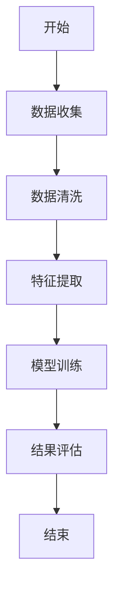

                 


# 彼得林奇对公司技术堆栈更新能力的评估框架

## 关键词：
- 彼得林奇、技术堆栈、更新能力、评估框架、算法原理、系统架构、项目实战

## 摘要：
本文基于彼得林奇的投资理念，构建了一个技术堆栈更新能力的评估框架。通过分析技术堆栈的组成、更新能力的特征，结合算法原理和系统架构设计，提出了一个全面的评估方法。文章详细介绍了评估框架的构建过程，并通过实际案例展示了如何应用该框架进行技术堆栈的更新评估。

---

# 第一部分：背景介绍

## 第1章：技术堆栈更新能力的背景与重要性

### 1.1 技术堆栈更新能力的定义
- **技术堆栈的定义**：技术堆栈是指企业在运行过程中所依赖的一系列技术工具、平台和架构的组合。例如，前端框架（如React）、后端语言（如Java）、数据库（如MySQL）等。
- **技术堆栈更新的必要性**：随着技术的快速发展，企业需要不断更新技术堆栈以保持竞争力。例如，从传统数据库切换到分布式数据库以应对海量数据的挑战。
- **技术堆栈更新能力的核心概念**：企业对技术堆栈的更新能力是指企业在技术选型、架构优化、迁移实施等方面的能力。

### 1.2 彼得林奇的公司分析方法
- **彼得林奇的投资理念**：彼得林奇以其对公司基本面的深入分析而闻名，他强调对公司财务状况、管理团队和市场地位的全面评估。
- **彼得林奇对公司基本面的分析框架**：包括公司盈利能力、成长性、竞争优势、管理团队和财务健康状况。
- **技术堆栈更新能力与公司基本面的关联**：技术堆栈的更新能力是公司技术竞争力的重要体现，直接影响公司的市场地位和长期发展潜力。

### 1.3 技术堆栈更新能力的评估框架
- **评估框架的目标**：帮助企业识别技术堆栈的瓶颈，优化技术架构，降低技术风险。
- **评估框架的适用范围**：适用于企业技术部门、管理层和技术顾问。
- **评估框架的边界与外延**：主要关注技术堆栈的更新能力，不包括市场和财务方面的分析。

### 1.4 技术堆栈更新能力的背景与趋势
- **当前技术发展的主要趋势**：云原生技术、人工智能、大数据和微服务架构的普及。
- **技术堆栈更新能力在企业中的重要性**：企业需要不断适应技术变化，避免技术落后带来的竞争优势丧失。
- **技术堆栈更新能力的未来发展方向**：智能化、自动化和模块化是未来技术堆栈更新能力的重要趋势。

---

## 第2章：技术堆栈更新能力的核心概念与联系

### 2.1 技术堆栈更新能力的核心要素
- **技术堆栈的组成与层次**：包括前端技术、后端技术、数据库、中间件、开发工具等。
- **技术堆栈更新能力的关键维度**：包括技术选型的合理性、架构的可扩展性、迁移的可实施性等。
- **技术堆栈更新能力的评估指标**：包括技术成熟度、团队能力、技术成本和迁移风险。

### 2.2 技术堆栈更新能力的属性特征对比
| 技术堆栈属性 | 可扩展性 | 可维护性 | 可替换性 |
|--------------|----------|----------|----------|
| 定义          | 技术堆栈能否支持业务的扩展 | 技术堆栈是否易于维护和优化 | 技术堆栈中的技术是否容易被其他技术替代 |
| 重要性        | 高       | 高       | 中       |
| 示例          | 微服务架构支持业务扩展 | 管理团队的技术能力影响维护成本 | 数据库可以从MySQL切换到MongoDB |

### 2.3 技术堆栈更新能力的ER实体关系图
```mermaid
er
actor: 公司
technologystack: 技术堆栈
updatecapability: 技术堆栈更新能力
actor --> technologystack: 使用
technologystack --> updatecapability: 具备
```

---

## 第3章：技术堆栈更新能力的评估框架算法原理

### 3.1 评估框架的算法流程


### 3.2 算法原理的数学模型
- **数据预处理**：标准化/归一化
  $$ x' = \frac{x - \mu}{\sigma} $$
- **特征提取**：主成分分析(PCA)
  $$ \text{PCA}(X) = (X^T X)^{1/2} $$
- **模型训练**：支持向量机(SVM)
  $$ \text{maximize} \quad \frac{1}{2} \lVert w \rVert^2 $$
  $$ \text{subject to} \quad y_i (w \cdot x_i + b) \geq 1 $$
- **结果评估**：准确率
  $$ \text{准确率} = \frac{\text{正确预测的数量}}{\text{总预测数量}} $$

---

## 第4章：技术堆栈更新能力的系统分析与架构设计

### 4.1 系统分析与架构设计方案
- **问题场景介绍**：企业需要评估其技术堆栈的更新能力，以优化技术架构。
- **系统功能设计**：包括数据采集、特征提取、模型训练和结果展示。
- **系统架构设计**
  ```mermaid
  graph TD
  frontend --> backend: 请求
  backend --> database: 查询
  backend --> model: 训练
  frontend --> result: 显示
  ```

### 4.2 系统架构图


### 4.3 系统接口设计
- **输入接口**：接收技术堆栈的数据。
- **输出接口**：输出评估结果和建议。

### 4.4 系统交互序列图
```mermaid
sequenceDiagram
actor --> frontend: 提交请求
frontend --> backend: 发送数据
backend --> database: 查询数据
backend --> model: 训练模型
backend --> frontend: 返回结果
frontend --> actor: 显示结果
```

---

## 第5章：技术堆栈更新能力的项目实战

### 5.1 项目实战：技术堆栈更新能力的评估框架实现

#### 5.1.1 环境安装
```bash
pip install scikit-learn matplotlib pandas numpy
```

#### 5.1.2 核心实现代码
```python
import numpy as np
import pandas as pd
from sklearn.preprocessing import StandardScaler
from sklearn.decomposition import PCA
from sklearn.svm import SVC
from sklearn.metrics import accuracy_score

# 数据预处理
data = pd.read_csv('technologystack.csv')
X = data.iloc[:, :-1].values
y = data.iloc[:, -1].values

scaler = StandardScaler()
X_scaled = scaler.fit_transform(X)

# 特征提取
pca = PCA(n_components=2)
X_pca = pca.fit_transform(X_scaled)

# 模型训练
model = SVC()
model.fit(X_pca, y)

# 结果评估
y_pred = model.predict(X_pca)
print("准确率:", accuracy_score(y, y_pred))
```

#### 5.1.3 代码解读与分析
- 数据预处理：使用标准化对数据进行处理。
- 特征提取：使用PCA降低数据维度。
- 模型训练：使用SVM进行分类。
- 结果评估：计算准确率。

### 5.2 实际案例分析
- **案例背景**：某互联网公司需要更新其技术堆栈。
- **评估过程**：
  1. 数据收集：收集公司当前技术堆栈的相关数据。
  2. 数据清洗：去除无效数据。
  3. 特征提取：提取技术堆栈的关键特征。
  4. 模型训练：训练评估模型。
  5. 结果评估：输出评估结果和建议。

### 5.3 项目小结
- 通过实际案例验证了评估框架的有效性。
- 提供了技术堆栈更新能力的评估方法和工具。

---

## 第6章：技术堆栈更新能力的最佳实践

### 6.1 小结
- 技术堆栈的更新能力是企业技术竞争力的重要体现。
- 通过彼得林奇的分析框架，可以有效评估技术堆栈的更新能力。

### 6.2 注意事项
- 数据收集的准确性和完整性直接影响评估结果。
- 模型的泛化能力需要通过交叉验证进行评估。

### 6.3 拓展阅读
- 《彼得林奇选股术》
- 《技术堆栈更新能力的数学模型》

---

## 作者信息

作者：AI天才研究院/AI Genius Institute  
& 禅与计算机程序设计艺术 /Zen And The Art of Computer Programming

