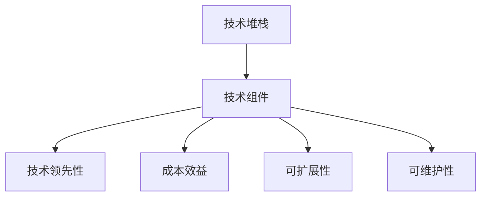
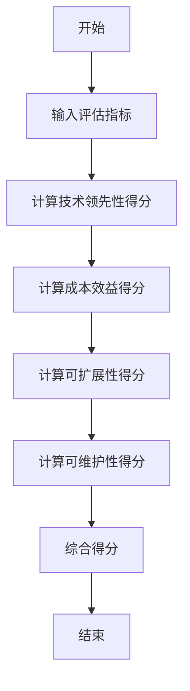
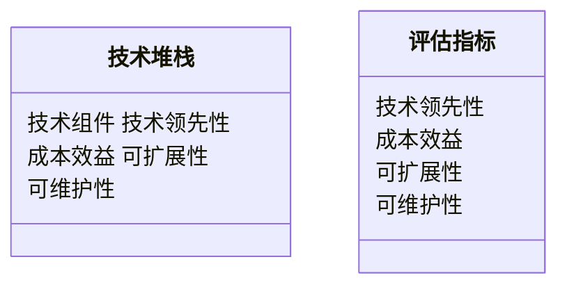
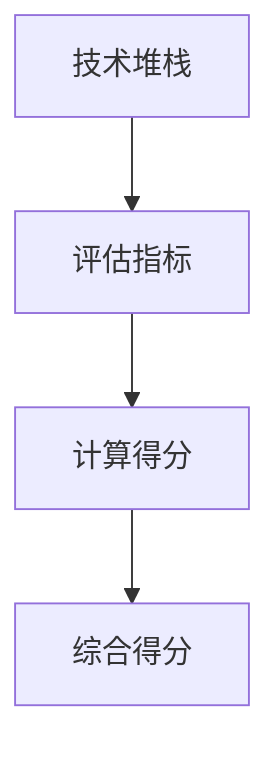
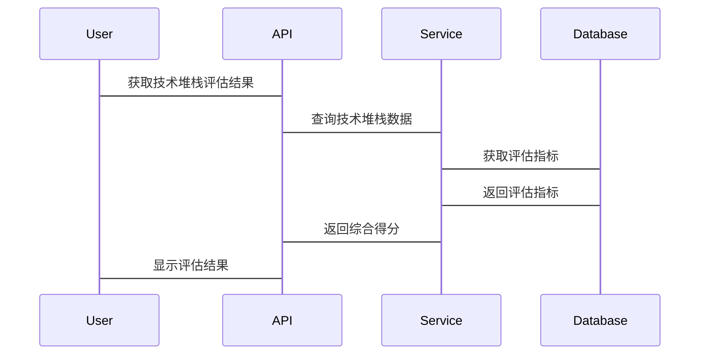

                 


# 彼得林奇对公司技术堆栈的评估方法

> 关键词：彼得·林奇，技术堆栈，评估方法，投资分析，企业技术评估

> 摘要：本文详细探讨了彼得·林奇在评估公司技术堆栈时所采用的方法和策略。通过对技术堆栈的定义、核心概念、评估算法、系统架构设计及实际案例分析，全面解析了林奇的评估方法及其在投资决策中的应用。

---

## 第一部分: 技术堆栈的定义与构成

### 第1章: 技术堆栈的基本概念

#### 1.1 技术堆栈的定义与构成
- **技术堆栈**是指企业在运营过程中所使用的各类技术工具、系统和平台的集合。它包括硬件、软件、网络架构、数据存储、开发工具等多个方面的技术组件。
- 技术堆栈的构成要素包括：
  1. **基础设施**：如服务器、网络设备、云平台等。
  2. **开发工具**：如编程语言、IDE（集成开发环境）、版本控制系统等。
  3. **应用程序**：如前端框架、后端服务、数据库等。
  4. **运维工具**：如监控系统、日志管理工具、自动化部署工具等。

#### 1.2 彼得·林奇的投资理念与方法
- 彼得·林奇是美国著名投资家，以其独特的基本面分析方法闻名。他注重对企业基本面的深入研究，尤其是企业的技术实力和创新能力。
- 林奇的技术分析方法：
  1. **技术领先性**：评估企业是否采用了行业领先的技术。
  2. **成本效益**：评估企业技术的投入与产出的平衡。
  3. **可扩展性**：评估技术的扩展能力，是否能够适应企业未来发展需求。
  4. **可维护性**：评估技术的维护难度，是否易于升级和优化。

#### 1.3 技术堆栈评估的背景与意义
- **背景**：随着信息技术的快速发展，企业的技术堆栈对企业竞争力的影响日益重要。技术堆栈的优劣直接关系到企业的运营效率和创新能力。
- **意义**：通过评估技术堆栈，投资者可以更好地了解企业的技术实力，从而做出更明智的投资决策。

---

## 第二部分: 技术堆栈评估的核心概念与联系

### 第2章: 核心概念与联系

#### 2.1 技术堆栈评估的核心概念
- **技术领先性**：企业是否采用行业领先的技术，是否具有技术创新能力。
- **成本效益**：技术的投入是否能够带来相应的经济效益。
- **可扩展性**：技术是否能够支持企业的业务扩展。
- **可维护性**：技术是否易于维护和升级。

#### 2.2 技术堆栈的属性特征对比
- 通过表格对比不同技术的属性特征：
```markdown
| 技术堆栈属性 | 特征描述 |
|--------------|----------|
| 技术领先性    | 是否采用行业领先的技术 |
| 成本效益      | 技术的成本与效益的平衡 |
| 可扩展性      | 系统的扩展能力 |
| 可维护性      | 系统的维护难度 |
```

#### 2.3 技术堆栈的ER实体关系图


---

## 第三部分: 技术堆栈评估的算法原理

### 第3章: 技术堆栈评估算法原理

#### 3.1 算法概述
- **算法的目标**：通过量化评估指标，计算技术堆栈的综合得分。
- **算法的输入与输出**：
  - 输入：技术堆栈的各组件及其评分。
  - 输出：综合得分。

#### 3.2 算法流程图


#### 3.3 算法实现代码
```python
def calculate_technology_score(technology_stack):
    score = 0
    for component in technology_stack:
        score += component.score
    return score
```

#### 3.4 数学模型与公式
- 技术堆栈的综合得分计算公式：
  $$ \text{综合得分} = \frac{1}{4} \left( \text{技术领先性得分} + \text{成本效益得分} + \text{可扩展性得分} + \text{可维护性得分} \right) $$

---

## 第四部分: 系统分析与架构设计

### 第4章: 系统分析与架构设计

#### 4.1 系统功能设计
- **领域模型类图**


#### 4.2 系统架构设计
- **系统架构图**


#### 4.3 系统接口设计
- **系统接口**：通过API接口获取技术堆栈的各组件及其评分。
- **接口示例**：
  ```http
  GET /api/technology-score
  ```

#### 4.4 系统交互序列图


---

## 第五部分: 项目实战

### 第5章: 项目实战

#### 5.1 项目介绍
- **项目背景**：以一家SaaS公司为例，分析其技术堆栈。
- **项目目标**：评估其技术堆栈的综合得分。

#### 5.2 核心实现
- **技术堆栈**：
  1. **前端**：React框架。
  2. **后端**：Node.js服务。
  3. **数据库**：MongoDB。
  4. **云平台**：AWS。

#### 5.3 代码实现
```python
class TechnologyComponent:
    def __init__(self, name, score):
        self.name = name
        self.score = score

def calculate_technology_score(components):
    total_score = sum(component.score for component in components)
    return total_score

# 示例
components = [
    TechnologyComponent("React", 90),
    TechnologyComponent("Node.js", 85),
    TechnologyComponent("MongoDB", 88),
    TechnologyComponent("AWS", 92)
]

score = calculate_technology_score(components)
print(f"综合得分: {score}")
```

#### 5.4 案例分析
- **分析结果**：综合得分= 89.5分（满分为100分）。
- **分析解读**：该公司的技术堆栈整体表现优秀，但在某些组件（如Node.js）的可维护性方面仍有提升空间。

---

## 第六部分: 总结与展望

### 第6章: 总结与展望

#### 6.1 本章总结
- 本文详细探讨了彼得·林奇在评估公司技术堆栈时所采用的方法和策略，包括技术堆栈的定义、核心概念、评估算法、系统架构设计及实际案例分析。

#### 6.2 最佳实践 tips
1. 投资者在评估技术堆栈时，应注重技术领先性、成本效益、可扩展性和可维护性。
2. 通过量化评估指标，可以更客观地判断技术堆栈的优劣。
3. 结合实际案例分析，可以更好地理解评估方法的应用。

#### 6.3 注意事项
- 技术堆栈的评估应结合企业的实际业务需求。
- 技术评估结果应与其他因素（如财务状况、管理团队）结合考虑。

#### 6.4 拓展阅读
- 推荐阅读彼得·林奇的《彼得·林奇的投资哲学》。
- 参考其他技术评估方法，如SWOT分析法、PEST分析法等。

---

## 作者：AI天才研究院/AI Genius Institute & 禅与计算机程序设计艺术 /Zen And The Art of Computer Programming

---

通过本文的详细分析，读者可以全面了解彼得·林奇的技术堆栈评估方法，并能够在实际投资决策中灵活运用这些方法。

