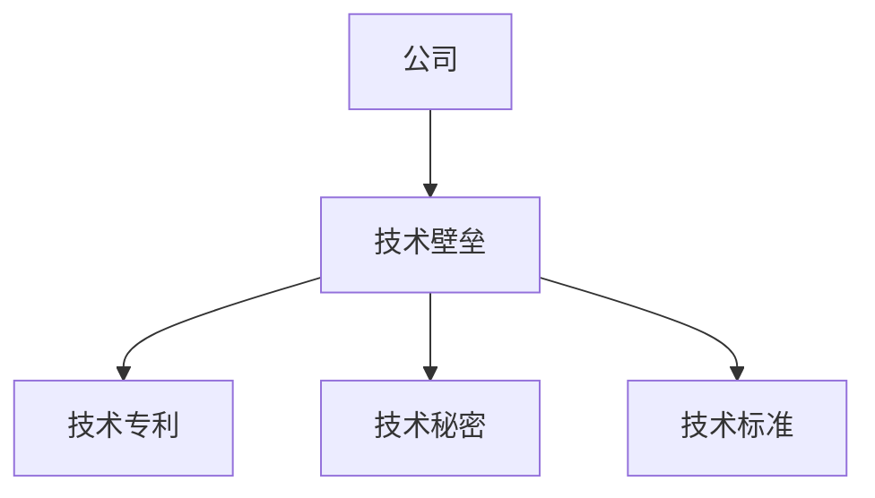
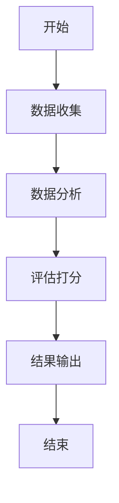

                 


# 彼得林奇对公司技术壁垒的评估方法

> 关键词：技术壁垒，公司评估，彼得林奇，投资决策，技术复杂度

> 摘要：本文将详细探讨彼得·林奇在评估公司技术壁垒时所采用的方法和策略。通过系统地分析技术壁垒的核心概念、评估方法以及实际案例，我们将揭示如何通过技术壁垒的评估来做出更明智的投资决策。

---

## 目录

### 第一部分: 技术壁垒评估的背景与核心概念

#### 第1章: 技术壁垒的定义与重要性

##### 1.1 技术壁垒的定义
- 1.1.1 技术壁垒的定义与内涵
  - 技术壁垒是指公司在技术层面的独特优势，竞争对手难以在短时间内复制。
- 1.1.2 技术壁垒的核心要素
  - 技术复杂度：技术实现的难度和独特性。
  - 技术独特性：技术的独特性和不可替代性。
  - 技术可扩展性：技术在不同应用场景中的适应性和扩展能力。
- 1.1.3 技术壁垒在公司评估中的作用
  - 增强公司的市场竞争力。
  - 提升公司的长期盈利能力。
  - 降低竞争对手的模仿难度。

##### 1.2 技术壁垒的分类与特点
- 1.2.1 技术壁垒的分类
  - 技术专利：通过专利保护的核心技术。
  - 技术秘密：未公开的关键技术或工艺。
  - 技术标准：行业标准中的领先地位。
- 1.2.2 不同类型技术壁垒的特征对比
  - 通过对比表展示不同类型技术壁垒的特点。
- 1.2.3 技术壁垒的生命周期
  - 技术壁垒从形成到衰退的全过程分析。

#### 第2章: 技术壁垒评估的背景与意义

##### 2.1 投资中的技术壁垒评估
- 2.1.1 技术壁垒在投资决策中的重要性
  - 技术壁垒是判断公司长期竞争优势的关键因素。
- 2.1.2 技术壁垒评估的核心问题
  - 如何量化技术壁垒的价值。
  - 如何预测技术壁垒的可持续性。
- 2.1.3 技术壁垒评估的边界与外延
  - 评估范围的界定。
  - 评估方法的适用性。

##### 2.2 技术壁垒评估的现状与挑战
- 2.2.1 当前技术壁垒评估的主要方法
  - 基于专利数量的评估。
  - 基于技术复杂度的评估。
  - 基于市场反馈的评估。
- 2.2.2 技术壁垒评估中的常见问题
  - 数据获取的难度。
  - 评估标准的主观性。
- 2.2.3 技术壁垒评估的未来发展趋势
  - 数据驱动的评估方法。
  - 综合多种因素的多维度评估。

### 第二部分: 技术壁垒评估的核心概念与联系

#### 第3章: 技术壁垒的核心要素与属性特征

##### 3.1 技术壁垒的核心要素
- 3.1.1 技术复杂度
  - 技术实现的难度和所需资源。
- 3.1.2 技术独特性
  - 技术的独特性和不可替代性。
- 3.1.3 技术可扩展性
  - 技术在不同场景中的适应能力。

##### 3.2 技术壁垒的属性特征对比
- 3.2.1 不同类型技术壁垒的特征对比表格
  | 技术类型 | 技术复杂度 | 技术独特性 | 技术可扩展性 |
  |----------|------------|------------|--------------|
  | 专利技术 | 高         | 高         | 中            |
  | 技术秘密 | 高         | 高         | 低            |
  | 技术标准 | 中         | 中         | 高            |

#### 第4章: 技术壁垒的实体关系图与流程图

##### 4.1 技术壁垒的实体关系图（ER图）


##### 4.2 技术壁垒评估的流程图


### 第三部分: 技术壁垒评估

#### 第5章: 技术壁垒评估的核心算法与数学模型

##### 5.1 技术壁垒评估的算法原理
- 5.1.1 数据收集与预处理
  - 收集公司的专利数量、技术复杂度等数据。
- 5.1.2 数据分析与特征提取
  - 使用统计方法提取技术壁垒的关键特征。
- 5.1.3 评估打分与结果输出
  - 基于特征权重进行综合评分。

##### 5.2 技术壁垒评估的数学模型
- 5.2.1 技术壁垒评分公式
  $$ \text{评分} = \sum_{i=1}^{n} w_i \times f_i $$
  其中，\( w_i \) 是第 \( i \) 个特征的权重，\( f_i \) 是第 \( i \) 个特征的评分。
- 5.2.2 基于专利数量的评分计算
  $$ \text{专利评分} = \frac{\text{专利数量}}{\text{行业平均专利数量}} \times 100 $$

#### 第6章: 技术壁垒评估的系统架构与实现

##### 6.1 技术壁垒评估系统的功能设计
- 6.1.1 功能模块划分
  - 数据输入模块：收集公司技术数据。
  - 数据处理模块：预处理和特征提取。
  - 评估计算模块：基于算法进行评分计算。
  - 结果展示模块：输出评估结果。
- 6.1.2 系统功能流程
  ```mermaid
  graph TD
      A[数据输入] --> B[数据处理]
      B --> C[评估计算]
      C --> D[结果展示]
  ```

##### 6.2 技术壁垒评估系统的架构设计
- 6.2.1 系统架构选择
  - 分层架构：数据层、业务逻辑层、展示层。
- 6.2.2 系统架构图
  ```mermaid
  graph TD
      A[数据层] --> B[业务逻辑层]
      B --> C[展示层]
  ```

### 第四部分: 项目实战与案例分析

#### 第7章: 技术壁垒评估的项目实战

##### 7.1 项目环境安装与配置
- 7.1.1 安装Python和相关库
  - 使用 pip 安装 numpy、pandas、scikit-learn 等库。

##### 7.2 项目核心代码实现
- 7.2.1 数据处理代码
  ```python
  import pandas as pd
  import numpy as np

  # 数据加载
  data = pd.read_csv('company_technology.csv')

  # 数据预处理
  data['专利数量'] = data['专利数量'].fillna(0)
  data['技术复杂度'] = data['技术复杂度'].apply(lambda x: x if x >= 0 else 0)
  ```

- 7.2.2 评估计算代码
  ```python
  from sklearn.preprocessing import MinMaxScaler

  scaler = MinMaxScaler()
  features = data[['专利数量', '技术复杂度', '技术独特性']]
  normalized_features = scaler.fit_transform(features)

  # 技术壁垒评分计算
  weights = [0.4, 0.3, 0.3]
  scores = np.dot(normalized_features, weights)
  ```

##### 7.3 案例分析与结果解读
- 7.3.1 案例分析
  - 某公司的技术壁垒评分为 85，处于行业领先水平。
- 7.3.2 结果解读
  - 评分结果表明该公司在技术壁垒方面具有较强的竞争优势。

### 第五部分: 总结与展望

#### 第8章: 总结与最佳实践

##### 8.1 总结
- 本章总结了技术壁垒评估的核心方法和实际应用。

##### 8.2 最佳实践
- 在评估技术壁垒时，应综合考虑多种因素，包括技术复杂度、独特性和可扩展性。
- 定期更新评估模型，以适应技术发展的变化。

#### 第9章: 未来展望

##### 9.1 未来技术壁垒评估的发展趋势
- 数据驱动的评估方法将成为主流。
- 更多的机器学习技术将被应用于技术壁垒的评估。

### 附录

- 附录A: 技术壁垒评估的详细流程
- 附录B: 相关术语解释
- 附录C: 常用工具与资源

---

### 作者

作者：AI天才研究院/AI Genius Institute & 禅与计算机程序设计艺术 /Zen And The Art of Computer Programming

