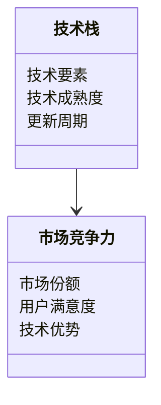

                 


# 彼得林奇对公司技术栈更新速度与市场竞争力的关系分析

## 关键词：技术栈，市场竞争力，技术更新速度，彼得·林奇，企业投资

## 摘要：本文通过分析技术栈的更新速度与企业市场竞争力之间的关系，结合投资大师彼得·林奇的视角，探讨技术栈对企业长期发展的影响。通过详细的技术分析和投资案例，本文揭示了如何量化技术栈的更新速度，以及如何通过技术栈的优化提升企业的市场竞争力。文章还提供了具体的技术栈更新策略和投资建议，为企业的技术管理和投资决策提供参考。

---

# 第一部分: 背景介绍与核心概念

## 第1章: 技术栈更新速度与市场竞争力的背景

### 1.1 技术栈的定义与重要性

#### 1.1.1 技术栈的定义  
技术栈（Technology Stack）是指企业在软件开发过程中所采用的一系列技术和工具的组合，包括编程语言、框架、数据库、开发工具等。技术栈的选择和更新直接影响企业的开发效率、产品质量和成本控制。

#### 1.1.2 技术栈在企业中的重要性  
技术栈是企业技术架构的核心，决定了企业技术能力的上限。随着技术的快速发展，技术栈的更新速度直接影响企业的市场竞争力。如果企业无法及时更新技术栈，可能会在竞争中处于劣势。

#### 1.1.3 技术栈更新的必要性  
技术栈的更新是企业保持技术领先和竞争力的关键。随着技术的快速迭代，旧的技术栈可能会因为性能不足、安全漏洞或开发效率低下而影响企业的业务发展。

---

### 1.2 市场竞争力的核心要素

#### 1.2.1 市场竞争力的定义  
市场竞争力是指企业在市场上与竞争对手相比，在产品、服务、技术、成本等方面所具有的优势。

#### 1.2.2 技术在市场竞争力中的作用  
技术是企业核心竞争力的重要组成部分。通过技术创新，企业可以提高产品质量、降低成本、提升用户体验，从而在市场中占据优势。

#### 1.2.3 技术栈更新对市场竞争力的影响  
技术栈的更新速度直接影响企业的技术能力，进而影响市场竞争力。快速更新技术栈可以提升企业的技术优势，而技术栈的滞后则可能导致企业竞争力的下降。

---

## 第2章: 彼得·林奇的投资视角

### 2.1 彼得·林奇与技术分析

#### 2.1.1 彼得·林奇的投资理念  
彼得·林奇是美国著名投资专家，他强调基本面分析和长期投资。他认为，企业的技术实力和创新能力是决定企业长期价值的重要因素。

#### 2.1.2 技术分析在投资中的应用  
在投资中，技术分析可以帮助投资者判断企业的技术实力和创新潜力。彼得·林奇特别关注企业的技术栈更新速度，认为这是企业能否持续发展的重要指标。

#### 2.1.3 林奇对技术栈更新的关注  
林奇认为，技术栈的更新速度是衡量企业技术实力的重要指标。企业如果能够保持技术栈的快速更新，往往能够在市场中占据优势。

---

### 2.2 技术栈更新速度的衡量标准

#### 2.2.1 技术栈更新的周期性  
技术栈的更新周期是衡量企业技术实力的重要指标。企业需要根据市场需求和技术发展趋势，合理安排技术栈的更新周期。

#### 2.2.2 技术栈更新的稳定性  
技术栈的稳定性是指企业在技术更新过程中是否能够保持业务的连续性和稳定性。过于频繁的技术更新可能会导致业务中断，而技术栈的滞后又可能导致竞争力下降。

#### 2.2.3 技术栈更新的前瞻性  
技术栈的前瞻性是指企业在技术更新中是否能够提前布局未来的技术趋势。前瞻性的技术更新可以帮助企业在未来市场中占据先机。

---

## 第3章: 技术栈更新与市场竞争力的关系

### 3.1 技术栈更新对市场竞争力的直接影响

#### 3.1.1 技术创新对市场竞争力的提升  
技术创新是提升市场竞争力的核心。通过技术栈的更新，企业可以推出更具创新性的产品，满足市场需求，提升市场份额。

#### 3.1.2 技术栈更新对企业成本的影响  
技术栈的更新可以降低企业的开发成本，提高开发效率。例如，采用新的开发框架或工具可以减少代码重复，提高开发效率。

#### 3.1.3 技术栈更新对客户满意度的影响  
技术栈的更新可以提升产品的质量和用户体验，从而提高客户的满意度和忠诚度。

---

### 3.2 市场竞争力对技术栈更新的反向影响

#### 3.2.1 市场需求对技术栈更新的驱动  
市场需求是技术栈更新的重要驱动力。企业需要根据市场需求调整技术栈，以满足客户的需求。

#### 3.2.2 市场竞争压力对技术栈更新的推动  
在激烈的市场竞争中，企业需要不断更新技术栈，以保持竞争优势。技术栈的滞后可能导致企业市场份额的流失。

#### 3.2.3 市场反馈对技术栈更新的指导  
市场反馈是技术栈更新的重要依据。企业需要根据市场反馈调整技术栈，以满足客户的需求和期望。

---

# 第二部分: 核心概念与联系

## 第4章: 技术栈的核心概念与属性

### 4.1 技术栈的核心概念

#### 4.1.1 技术栈的组成要素  
技术栈由编程语言、框架、数据库、开发工具等组成，每个要素都对企业的技术实力和市场竞争力产生重要影响。

#### 4.1.2 技术栈的层次结构  
技术栈可以分为底层技术、中间层技术和应用层技术。底层技术包括操作系统和硬件，中间层技术包括框架和库，应用层技术包括应用软件和API。

#### 4.1.3 技术栈的生命周期  
技术栈的生命周期包括引入、成熟、优化和淘汰阶段。企业需要根据技术栈的生命周期合理安排更新策略。

---

### 4.2 技术栈属性对比表

| 技术属性 | 描述 | 示例 |
|----------|------|------|
| 技术成熟度 | 技术的成熟程度 | 初期、成熟、衰退 |
| 维护成本 | 技术维护所需资源 | 高、中、低 |
| 更新周期 | 技术更新的频率 | 短、中、长 |

---

### 4.3 ER实体关系图

```mermaid
er
  com
```

---

## 第5章: 技术栈更新速度的量化模型

### 5.1 技术栈更新速度的定义

#### 5.1.1 技术栈更新速度的定义  
技术栈更新速度是指企业在一定时间内对技术栈进行更新的频率和效率。

#### 5.1.2 技术栈更新速度的衡量指标  
技术栈更新速度可以通过更新周期、更新频率、更新效率等指标来衡量。

---

### 5.2 技术栈更新速度的数学模型

$$技术栈更新速度 = \frac{技术创新数}{时间单位}$$

其中，技术创新数是企业在一定时间内推出的新技术或新功能的数量，时间单位可以是年、季度或月。

---

## 第6章: 技术栈更新速度对市场竞争力的影响

### 6.1 技术栈更新速度对市场竞争力的直接影响

#### 6.1.1 技术创新对市场竞争力的提升  
技术栈的快速更新可以提升企业的技术创新能力，从而在市场中占据优势。

#### 6.1.2 技术栈更新对企业成本的影响  
技术栈的快速更新可以降低企业的开发成本，提高开发效率，从而降低整体成本。

---

### 6.2 市场竞争力对技术栈更新速度的反向影响

#### 6.2.1 市场需求对技术栈更新的驱动  
市场需求是技术栈更新的重要驱动力。企业需要根据市场需求调整技术栈，以满足客户的需求。

#### 6.2.2 市场竞争压力对技术栈更新的推动  
在激烈的市场竞争中，企业需要不断更新技术栈，以保持竞争优势。

---

# 第三部分: 系统分析与架构设计

## 第7章: 技术栈更新速度的系统分析

### 7.1 系统分析的背景

#### 7.1.1 项目背景介绍  
本项目旨在通过技术栈更新速度的量化模型，帮助企业优化技术栈更新策略，提升市场竞争力。

#### 7.1.2 项目目标  
通过分析技术栈更新速度与市场竞争力的关系，为企业提供技术栈更新的策略和建议。

---

### 7.2 系统功能设计

#### 7.2.1 领域模型设计  


#### 7.2.2 系统架构设计  


---

## 第8章: 技术栈更新速度的实战案例

### 8.1 项目实战背景

#### 8.1.1 项目背景介绍  
某企业面临技术栈更新速度过慢的问题，导致市场竞争力下降。

#### 8.1.2 项目目标  
通过优化技术栈更新策略，提升企业的市场竞争力。

---

### 8.2 核心代码实现

#### 8.2.1 环境安装  
安装Python和相关库：

```bash
pip install numpy pandas scikit-learn
```

#### 8.2.2 核心代码  
```python
import numpy as np
import pandas as pd
from sklearn.metrics import accuracy_score

# 数据加载
data = pd.read_csv('tech_stack.csv')

# 特征工程
X = data.drop('competitiveness', axis=1)
y = data['competitiveness']

# 模型训练
from sklearn.ensemble import RandomForestClassifier
model = RandomForestClassifier()
model.fit(X, y)

# 模型预测
y_pred = model.predict(X)
print("Accuracy:", accuracy_score(y, y_pred))
```

---

## 第9章: 最佳实践与总结

### 9.1 小结

#### 9.1.1 技术栈更新速度的重要性  
技术栈的更新速度是企业市场竞争力的重要影响因素。企业需要根据市场需求和技术发展趋势，合理安排技术栈的更新策略。

#### 9.1.2 技术栈更新的注意事项  
企业在技术栈更新过程中需要注意技术的稳定性、前瞻性和成本控制。

---

### 9.2 注意事项

#### 9.2.1 技术栈更新的风险  
技术栈的更新可能伴随着技术不成熟、开发成本增加等风险。

#### 9.2.2 技术栈更新的可行性  
企业在技术栈更新前需要进行充分的市场调研和技术评估，确保技术栈更新的可行性和有效性。

---

### 9.3 拓展阅读

#### 9.3.1 技术栈更新的行业案例  
通过分析不同行业的技术栈更新案例，总结技术栈更新的最佳实践。

#### 9.3.2 技术栈更新的未来趋势  
探讨未来技术栈更新的趋势，如人工智能、云计算等技术的应用对企业技术栈更新的影响。

---

# 作者：AI天才研究院/AI Genius Institute & 禅与计算机程序设计艺术 /Zen And The Art of Computer Programming

