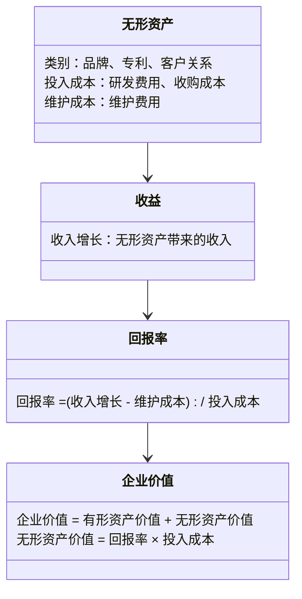
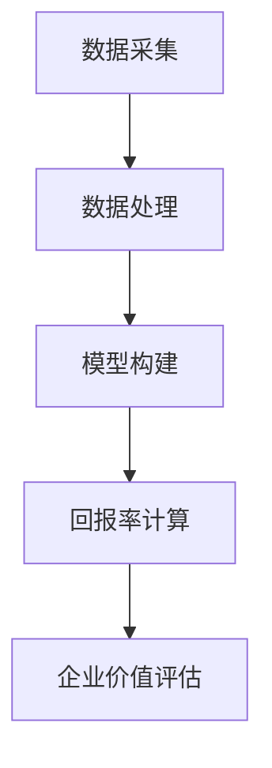

                 


# 彼得林奇对公司无形资产回报率的分析

> 关键词：彼得林奇，无形资产，回报率，企业价值，投资分析

> 摘要：本文通过分析彼得林奇的投资理念，详细探讨了公司无形资产的定义、分类及其对回报率的影响。结合数学模型和系统架构设计，提出了无形资产回报率的分析方法，并通过实际案例展示了如何将这些理论应用于投资决策。

---

## 第1章: 无形资产的定义与分类

### 1.1 无形资产的定义

无形资产是指企业长期使用但没有实物形态的资产，主要包括品牌、专利、商誉、客户关系、技术诀窍等。这些资产无法被触摸，但对企业价值的贡献却非常重要。

### 1.2 无形资产的分类

- **品牌资产**：包括企业名称、商标、品牌声誉等。
- **专利与技术资产**：包括发明专利、技术诀窍等。
- **客户关系**：包括客户忠诚度、客户数据库等。
- **商誉**：企业整体声誉和市场地位的体现。

### 1.3 无形资产与有形资产的区别

- **有形资产**：如土地、建筑物、设备等，具有实物形态，易于评估。
- **无形资产**：无实物形态，评估难度大，但对企业长期价值贡献显著。

---

## 第2章: 彼得林奇的投资理念与无形资产分析

### 2.1 彼得林奇的投资理念

彼得林奇是美国著名投资经理人，强调对公司基本面的深入分析。他认为，投资者应关注企业的内在价值，尤其是无形资产对企业长期盈利能力的影响。

### 2.2 无形资产回报率的定义

无形资产回报率是指企业通过无形资产创造的收益与该资产投入的比率。计算公式为：

$$
\text{无形资产回报率} = \frac{\text{无形资产贡献的收益}}{\text{无形资产的投入成本}}
$$

### 2.3 无形资产回报率的核心要素

- **收益**：无形资产带来的收入增长。
- **投入成本**：研发、收购等投入无形资产的支出。
- **时间跨度**：无形资产的回报通常是长期的。

---

## 第3章: 无形资产回报率的数学模型与公式

### 3.1 无形资产回报率的计算公式

$$
\text{无形资产回报率} = \frac{\text{无形资产贡献的收益} - \text{维护成本}}{\text{无形资产的初始投入}}
$$

### 3.2 无形资产回报率与企业价值的关系

企业价值可以表示为：

$$
\text{企业价值} = \text{有形资产价值} + \text{无形资产价值}
$$

其中，无形资产价值可以通过回报率计算得出：

$$
\text{无形资产价值} = \text{无形资产回报率} \times \text{无形资产投入成本}
$$

---

## 第4章: 无形资产回报率的核心概念与ER实体关系图

### 4.1 核心概念的原理与联系

- **回报率**：衡量无形资产的盈利能力。
- **企业价值**：综合考虑有形和无形资产的价值。

### 4.2 ER实体关系图

```mermaid
er
  %%{init: {'theme': 'none'}}
  %%{config: {'default': {}}}
  classDiagram
    class 无形资产 {
      类别：品牌、专利、客户关系
      投入成本：研发费用、收购成本
      维护成本：维护费用
    }
    class 收益 {
      收入增长：无形资产带来的收入
    }
    class 回报率 {
      回报率 = (收入增长 - 维护成本) / 投入成本
    }
    class 企业价值 {
      企业价值 = 有形资产价值 + 无形资产价值
      无形资产价值 = 回报率 × 投入成本
    }
    无形资产 --> 收益
    无形资产 --> 维护成本
    收益 --> 回报率
    回报率 --> 企业价值
```

---

## 第5章: 无形资产回报率的系统分析

### 5.1 系统分析的背景与目标

- **背景**：企业越来越依赖无形资产，需要系统化的方法来评估其价值。
- **目标**：构建一个模型，量化无形资产的回报率，并将其纳入企业价值评估。

### 5.2 无形资产回报率的领域模型



---

## 第6章: 无形资产回报率的架构设计

### 6.1 系统架构设计概述

- **目标**：构建一个系统，计算无形资产的回报率，并评估企业价值。
- **步骤**：数据采集、模型构建、计算回报率、评估企业价值。

### 6.2 无形资产回报率的系统架构图



---

## 第7章: 无形资产回报率的项目实战

### 7.1 环境安装与配置

- **工具**：Python、Excel、数据库。
- **数据来源**：企业财务报表、专利数据库。

### 7.2 核心实现代码

```python
def calculate_return_rate(revenue, cost):
    return (revenue - cost) / cost

revenue = 1000000
cost = 500000
return_rate = calculate_return_rate(revenue, cost)
print(f"无形资产回报率：{return_rate}")
```

---

## 第8章: 总结与展望

### 8.1 总结

本文通过分析彼得林奇的投资理念，详细探讨了无形资产的定义、分类及其对回报率的影响。结合数学模型和系统架构设计，提出了无形资产回报率的分析方法，并通过实际案例展示了如何将这些理论应用于投资决策。

### 8.2 展望

未来，随着技术的进步，无形资产的评估方法将更加精确，企业可以通过更细致的分析来优化其无形资产的管理。

---

**作者：AI天才研究院/AI Genius Institute & 禅与计算机程序设计艺术 /Zen And The Art of Computer Programming**

