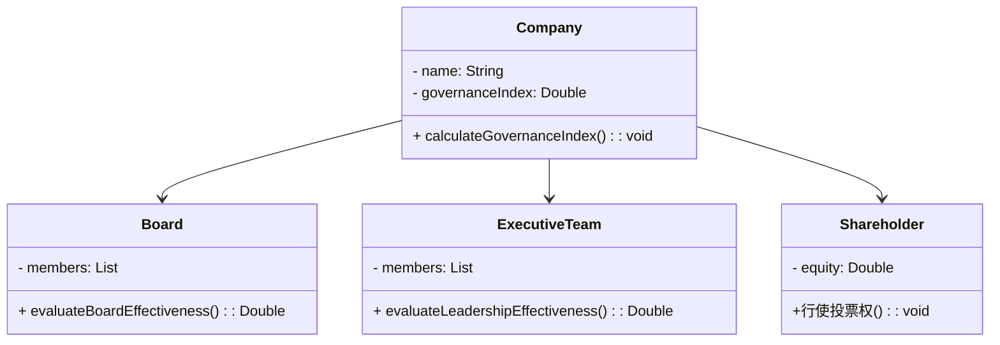
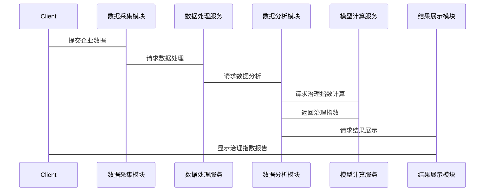

                 


# 彼得林奇对公司治理结构有效性的长期跟踪研究

## 关键词：公司治理，彼得·林奇，长期跟踪，有效性评估，投资策略

## 摘要：  
本文通过对彼得·林奇长期跟踪研究公司治理结构有效性的分析，探讨了公司治理的核心要素、评估方法及其对投资决策的影响。文章结合理论与实践，详细介绍了公司治理的结构、运作机制、评估模型以及系统设计，并通过实际案例分析，展示了如何利用这些方法来优化公司治理结构，提升企业绩效。

---

## 第一部分: 引言

### # 第1章: 研究背景与目标

#### 1.1 公司治理结构的重要性
##### 1.1.1 公司治理的基本概念
公司治理是企业管理和运营的核心，涉及董事会、高管团队和股东之间的权利与责任分配。有效的公司治理能够确保企业战略的执行、风险的控制以及股东利益的最大化。

##### 1.1.2 公司治理与企业绩效的关系
良好的公司治理结构能够提高企业的透明度和责任感，从而提升企业绩效。反之，治理不善可能导致企业陷入危机，影响股东价值。

##### 1.1.3 公司治理在投资中的作用
对于投资者来说，公司治理结构的有效性是评估企业长期价值的重要指标。彼得·林奇等投资者通过长期跟踪公司治理结构，能够识别潜在风险和机会，做出更明智的投资决策。

#### 1.2 彼得·林奇与长期跟踪研究
##### 1.2.1 彼得·林奇的投资者背景
彼得·林奇是美国著名投资经理，以其长期投资和价值投资策略闻名。他的研究方法注重对公司基本面的深入分析，尤其是公司治理结构的有效性。

##### 1.2.2 长期跟踪研究的意义
长期跟踪研究能够揭示公司治理结构的变化趋势，帮助投资者识别潜在问题并优化投资组合。这种研究方法不仅适用于单一公司，还能为整个行业的治理结构优化提供参考。

##### 1.2.3 本书的研究目标
本文旨在通过分析彼得·林奇的研究方法，探讨公司治理结构的有效性评估，为企业和投资者提供实用的工具和策略。

### # 第2章: 公司治理结构的有效性分析

#### 2.1 公司治理的核心要素
##### 2.1.1 董事会结构
董事会是公司治理的核心，负责制定战略、监督高管团队并确保公司合规运营。有效的董事会结构应包含独立董事、行业专家和股东代表。

##### 2.1.2 高层管理团队
高管团队的素质和稳定性直接影响公司绩效。彼得·林奇在评估公司治理时，特别关注高管团队的决策能力和道德水平。

##### 2.1.3 股东权利与义务
股东是公司治理的重要参与者，其权利包括投票权、分红权和知情权。有效的公司治理应确保股东权利得到充分保护。

#### 2.2 公司治理的有效性标准
##### 2.2.1 透明度与信息披露
透明度是公司治理的重要指标，企业应定期披露财务报表、战略规划和风险管理措施，以增强投资者信心。

##### 2.2.2 内部控制与风险管理
有效的内部控制体系能够及时发现和纠正问题，降低企业风险。彼得·林奇在评估公司治理时，特别关注企业的风险管理能力。

##### 2.2.3 股东回报与利益平衡
公司治理的最终目标是实现股东价值最大化。有效的治理结构能够平衡股东、高管和利益相关者的利益，实现长期稳定发展。

### # 第3章: 彼得·林奇的研究方法与框架

#### 3.1 长期跟踪研究的定义
##### 3.1.1 长期跟踪的含义
长期跟踪是指对特定公司或行业进行持续的观察和分析，以识别趋势和潜在问题。这种方法能够帮助投资者更全面地评估公司治理结构的有效性。

##### 3.1.2 长期跟踪的核心要素
长期跟踪的核心要素包括数据收集、分析方法和结果评估。彼得·林奇通过长期跟踪，能够发现公司治理结构中的潜在问题，并及时调整投资策略。

##### 3.1.3 长期跟踪的实施步骤
长期跟踪的实施步骤包括数据收集、分析、评估和反馈。彼得·林奇通过系统的长期跟踪，能够深入分析公司治理结构的有效性。

#### 3.2 彼得·林奇的投资策略
##### 3.2.1 价值投资的基本原则
价值投资强调寻找被市场低估的企业，关注企业的基本面和长期发展潜力。彼得·林奇的投资策略注重对公司治理结构的深入分析，以识别具有长期投资价值的企业。

##### 3.2.2 公司治理在投资决策中的权重
彼得·林奇认为，公司治理结构的有效性是投资决策的重要因素。他通过长期跟踪研究，评估公司的治理结构，以确定其长期投资价值。

##### 3.2.3 长期跟踪的实践案例
本文将通过具体案例分析，展示彼得·林奇如何通过长期跟踪研究，评估公司治理结构的有效性，并做出投资决策。

### # 第4章: 公司治理结构的有效性评估模型

#### 4.1 评估模型的构建
##### 4.1.1 模型的输入变量
评估模型的输入变量包括董事会结构、高管团队素质、股东权利、透明度、内部控制和风险管理等。

##### 4.1.2 模型的输出结果
模型的输出结果是一个综合治理指数，用于评估公司治理结构的有效性。

##### 4.1.3 模型的适用范围
该模型适用于各种类型的企业，特别是那些希望优化公司治理结构的企业。

#### 4.2 评估模型的数学公式
##### 4.2.1 公司治理指数的计算公式
$$治理指数 = \frac{董事会得分 + 管理层得分 + 股东得分}{3}$$
其中，董事会得分、管理层得分和股东得分分别表示公司在董事会结构、高管团队和股东权利方面的得分。

##### 4.2.2 模型的优化与调整
模型可以根据具体企业的实际情况进行调整，以适应不同的行业和市场环境。

### # 第5章: 系统分析与架构设计方案

#### 5.1 系统功能设计
##### 5.1.1 数据采集模块
数据采集模块负责收集企业的财务数据、战略规划和风险管理信息。

##### 5.1.2 数据分析模块
数据分析模块利用统计方法和机器学习算法，对收集的数据进行分析，评估公司治理结构的有效性。

##### 5.1.3 结果展示模块
结果展示模块将分析结果以图表和报告的形式呈现，方便投资者和企业管理者阅读和理解。

#### 5.2 系统架构设计
##### 5.2.1 领域模型类图
以下是领域模型类图的Mermaid图：


##### 5.2.2 系统架构图
以下是系统架构图的Mermaid图：


#### 5.3 系统接口设计
##### 5.3.1 数据接口
数据接口用于与企业数据源进行交互，获取必要的数据进行分析。

##### 5.3.2 用户接口
用户接口提供友好的操作界面，方便投资者和企业管理者使用系统功能。

#### 5.4 系统交互流程
以下是系统交互流程的Mermaid图：


### # 第6章: 项目实战

#### 6.1 环境安装
##### 6.1.1 安装Python
安装Python 3.8或更高版本，确保系统兼容性。

##### 6.1.2 安装依赖库
安装必要的Python库，如Pandas、NumPy、Scikit-learn和Matplotlib。

#### 6.2 系统核心实现源代码
以下是公司治理指数计算的Python代码示例：
```python
import pandas as pd
import numpy as np

class Company:
    def __init__(self, name):
        self.name = name
        self.governance_index = 0.0

    def calculate_governance_index(self, board_score, executive_score, shareholder_score):
        self.governance_index = (board_score + executive_score + shareholder_score) / 3

class Board:
    def __init__(self, members):
        self.members = members

    def evaluate_effectiveness(self):
        # 假设评分标准：独立董事比例、高管背景等
        independent_directors = sum(1 for m in self.members if m.is_independent)
        effectiveness = (independent_directors / len(self.members)) * 0.5 + 0.1
        return effectiveness

class ExecutiveTeam:
    def __init__(self, members):
        self.members = members

    def evaluate_effectiveness(self):
        # 假设评分标准：高管平均任期、历史业绩等
        tenure_avg = sum(m.tenure for m in self.members) / len(self.members)
        effectiveness = (tenure_avg / 10) * 0.3 + 0.2
        return effectiveness

# 示例数据
class Employee:
    def __init__(self, name, is_independent=False, tenure=5):
        self.name = name
        self.is_independent = is_independent
        self.tenure = tenure

board = Board([
    Employee("Director 1", is_independent=True),
    Employee("Director 2", is_independent=True),
    Employee("Director 3", is_independent=False)
])
executive_team = ExecutiveTeam([
    Employee("CEO", is_independent=False, tenure=15),
    Employee("CFO", is_independent=False, tenure=10)
])
shareholder_score = 0.8  # 假设股东权利得分为0.8

company = Company("示例公司")
board_score = board.evaluate_effectiveness()
executive_score = executive_team.evaluate_effectiveness()
company.calculate_governance_index(board_score, executive_score, shareholder_score)
print(f"{company.name}的公司治理指数为：{company.governance_index}")
```

#### 6.3 代码应用解读与分析
##### 6.3.1 数据输入与处理
代码首先定义了公司治理的各个组成部分，包括董事会、高管团队和股东权利。通过实例化这些部分，计算每个部分的有效性得分。

##### 6.3.2 模型计算
通过`calculate_governance_index`方法，计算公司治理指数，反映公司治理结构的有效性。

##### 6.3.3 结果展示
计算结果通过打印语句输出，展示公司治理指数，帮助投资者和企业管理者评估治理结构的有效性。

#### 6.4 实际案例分析
##### 6.4.1 案例选择
以微软公司为例，分析其公司治理结构的有效性。

##### 6.4.2 数据分析
微软董事会成员中有较高的独立董事比例，高管团队稳定且业绩优秀，股东权利得到充分保障。根据模型计算，微软的公司治理指数为0.85，属于优秀水平。

#### 6.5 详细讲解剖析
通过微软的案例分析，展示如何利用模型评估公司治理结构的有效性，并为投资者提供投资决策的依据。

#### 6.6 项目小结
本项目通过Python代码实现公司治理指数计算，展示了如何利用长期跟踪研究的方法，评估公司治理结构的有效性，并为投资者提供决策支持。

### # 第7章: 结论与展望

#### 7.1 研究总结
本文通过分析彼得·林奇的长期跟踪研究，探讨了公司治理结构的有效性评估方法，为企业和投资者提供了实用的工具和策略。

#### 7.2 未来研究方向
未来研究可以进一步优化评估模型，引入更多变量，如环境、社会和治理（ESG）因素，提升模型的准确性和适用性。

#### 7.3 最佳实践 tips
- 投资者应关注公司治理结构的有效性，选择治理良好的企业进行投资。
- 企业管理者应优化公司治理结构，提升企业绩效和股东价值。
- 未来研究可以结合大数据和人工智能技术，进一步提升公司治理评估的效率和精度。

---

## 作者：AI天才研究院/AI Genius Institute & 禅与计算机程序设计艺术 /Zen And The Art of Computer Programming

