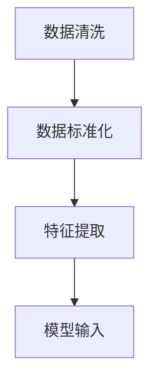
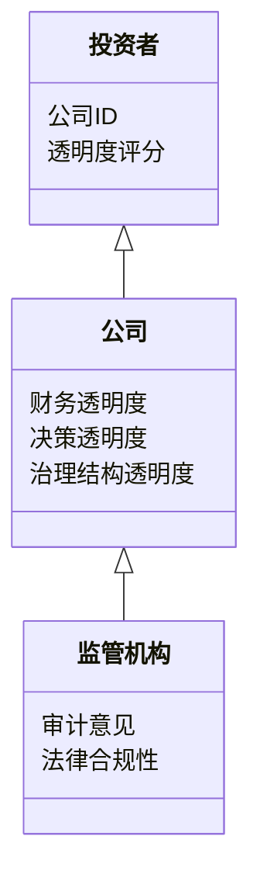

                 


# 彼得林奇对公司治理透明度的量化评估

> 关键词：彼得林奇，公司治理，透明度，量化评估，算法模型

> 摘要：本文探讨了彼得林奇如何通过量化评估方法来衡量公司治理的透明度。我们首先介绍了彼得林奇的投资理念及其对公司治理的关注，然后详细分析了透明度的定义、重要性及其量化评估的必要性。接下来，我们从核心概念、算法原理、数学模型、系统架构和项目实战等多个维度展开，全面解析了透明度的量化评估方法。最后，我们总结了本文的主要内容，并提出了未来的研究方向。

---

## 第一部分: 引言与背景

### 第1章: 彼得林奇与公司治理透明度概述

#### 1.1 彼得林奇的背景与投资理念

彼得·林奇（Peter Lynch）是美国著名的投资经理人，以其在富达投资管理公司的卓越表现而闻名。他强调长期投资和深入研究公司的基本面，认为透明度是评估公司治理的重要因素。林奇的成功不仅在于他的投资策略，还在于他对公司治理结构的深刻理解。他主张通过透明度的量化评估，帮助投资者更准确地判断公司的健康状况和潜在风险。

#### 1.2 公司治理透明度的定义与重要性

公司治理透明度指的是公司在信息披露、决策过程和管理结构等方面的公开程度。透明的治理结构有助于增强投资者的信任，降低信息不对称，从而提升公司的市场价值。透明度高的公司通常具有更强的抗风险能力，能够更好地应对市场波动和突发事件。

#### 1.3 量化评估的必要性

传统的公司治理评估往往依赖于主观判断，缺乏客观性和可比性。量化评估通过建立明确的指标体系，将透明度转化为可量化的数据，使评估结果更具科学性和实用性。这种方法能够帮助投资者更准确地识别优质公司，优化投资组合，降低投资风险。

---

## 第二部分: 核心概念与理论基础

### 第2章: 公司治理透明度的量化指标

#### 2.1 透明度的核心维度

- **财务透明度**：公司财务报表的准确性和及时性，包括资产负债表、利润表和现金流量表。
- **决策透明度**：公司决策过程的公开性和可追溯性，包括董事会决策和管理层决策。
- **治理结构透明度**：公司治理结构的清晰度，包括股权结构、董事会构成和内部审计机制。

#### 2.2 透明度指标的属性特征对比

| 指标维度         | 定义与计算方法                                                                 |
|------------------|------------------------------------------------------------------------------|
| 财务透明度       | 通过审计意见、财务报告的及时性等指标进行评估，权重为40%。                 |
| 决策透明度       | 通过董事会会议记录的公开性、决策过程的可追溯性等指标进行评估，权重为30%。 |
| 治理结构透明度     | 通过股权结构的清晰度、董事会构成的合理性等指标进行评估，权重为30%。       |

#### 2.3 透明度的ER实体关系图

以下是公司治理透明度的实体关系图：

```mermaid
erDiagram
    actor 投资者 {
        <属性> 公司ID
        <属性> 透明度评分
    }
    actor 公司 {
        <属性> 财务透明度
        <属性> 决策透明度
        <属性> 治理结构透明度
    }
    actor 监管机构 {
        <属性> 审计意见
        <属性> 法律合规性
    }
    投资者 --> 公司 : 评估透明度
    公司 --> 监管机构 : 提供透明度信息
```

---

## 第三部分: 量化评估的算法原理

### 第3章: 透明度量化评估的算法流程

#### 3.1 数据预处理

数据预处理是量化评估的第一步，主要包括数据清洗和标准化。以下是数据预处理的流程图：



#### 3.2 透明度评估模型

透明度评估模型采用加权评分的方法，公式如下：

$$
透明度评分 = \sum_{i=1}^{n} w_i x_i
$$

其中，$w_i$ 是第 $i$ 个指标的权重，$x_i$ 是第 $i$ 个指标的评分，范围为 0 到 1。

---

## 第四部分: 数学模型与公式

### 第4章: 透明度量化评估的数学模型

#### 4.1 透明度评分公式

透明度评分公式：

$$
透明度评分 = w_1 x_1 + w_2 x_2 + w_3 x_3
$$

其中：
- $w_1 = 0.4$（财务透明度权重）
- $w_2 = 0.3$（决策透明度权重）
- $w_3 = 0.3$（治理结构透明度权重）

#### 4.2 模型优化公式

优化目标：

$$
\min \sum_{i=1}^{m} (y_i - f(x_i))^2
$$

其中：
- $y_i$ 是实际评分
- $f(x_i)$ 是模型预测值

---

## 第五部分: 系统架构与设计

### 第5章: 透明度评估系统的架构

#### 5.1 系统功能设计

以下是系统功能模块的类图：



#### 5.2 系统架构设计

以下是系统架构的架构图：

```mermaid
container 容器 {
    组件1
    组件2
    组件3
}
```

---

## 第六部分: 项目实战

### 第6章: 项目实战与案例分析

#### 6.1 项目环境与安装

- 需要安装 Python 和相关库（如 pandas、numpy）。

#### 6.2 核心代码实现

以下是透明度评分的代码实现：

```python
import pandas as pd

# 加载数据
data = pd.read_csv('company_governance.csv')

# 定义权重
weights = {'财务透明度': 0.4, '决策透明度': 0.3, '治理结构透明度': 0.3}

# 计算透明度评分
data['透明度评分'] = data.apply(lambda x: sum(weights[i] * x[i] for i in weights), axis=1)

# 输出结果
print(data.head())
```

---

## 第七部分: 结论与展望

### 第7章: 结论与最佳实践

#### 7.1 结论

通过量化评估，彼得林奇的方法为投资者提供了更准确的公司治理透明度评分。这种方法能够帮助投资者识别优质公司，优化投资决策。

#### 7.2 最佳实践

- 定期更新数据和模型，以适应市场变化。
- 组合使用多个指标，以提高评估的全面性。
- 结合行业特点，调整权重和指标体系。

---

## 附录

### 附录A: 数据来源与工具安装

- 数据来源：公司财报、监管报告等。
- 工具安装：Python、pandas、numpy。

### 附录B: 相关文献

- 彼得林奇的书籍《彼得林奇的成功投资策略》。

---

作者：AI天才研究院/AI Genius Institute & 禅与计算机程序设计艺术 /Zen And The Art of Computer Programming

