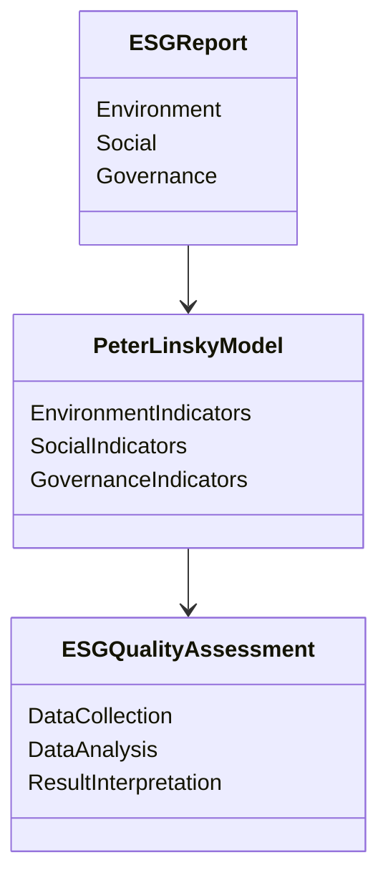
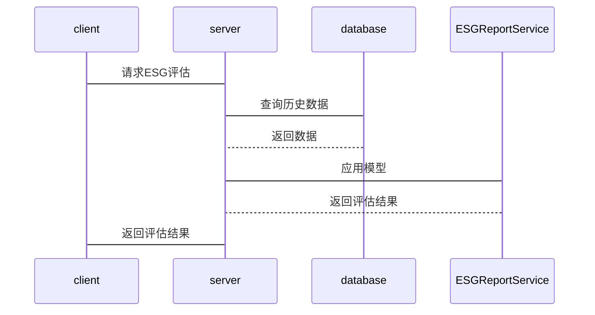

                 


# 彼得林奇对公司环境社会治理(ESG)报告的质量评估

## 关键词：
彼得林奇模型，ESG报告，环境社会治理，企业责任，可持续发展

## 摘要：
本文详细探讨了彼得林奇模型在评估公司环境社会治理（ESG）报告质量中的应用。首先介绍了ESG的基本概念和重要性，分析了当前ESG报告存在的问题。然后深入讲解了彼得林奇模型的理论基础、核心指标和与其他模型的对比。接着，详细描述了基于彼得林奇模型的ESG报告质量评估步骤与实践，包括案例分析和技术驱动的评估方法。最后，总结了模型的应用价值及未来展望。

---

## 第一部分：公司环境社会治理（ESG）报告概述

### 第1章：ESG的基本概念与重要性

#### 1.1 什么是ESG
- **环境（E）**：涵盖企业的碳排放、能源使用效率和环境管理等方面。
- **社会责任（S）**：包括劳工权益、社区参与和产品安全。
- **公司治理（G）**：涉及董事会结构、透明度和内部控制。

#### 1.2 ESG的重要性
- 对企业：提升品牌形象，降低风险。
- 对投资者：帮助识别可持续投资机会。
- 对社会：推动社会公平和环境保护。

### 第2章：ESG报告的背景与发展

#### 2.1 ESG报告的起源
- 国际背景：始于20世纪90年代，源于对企业社会责任的关注。
- 国内背景：随着政策推动和市场需求逐步发展。

#### 2.2 ESG报告的发展现状
- 国际：标准化程度高，认可度高。
- 国内：快速发展，但标准尚不统一。

#### 2.3 ESG报告的未来趋势
- 技术驱动：大数据和AI的应用。
- 政策推动：监管趋严。
- 市场需求：投资者关注增加。

---

## 第二部分：彼得林奇模型的核心概念与原理

### 第3章：彼得林奇模型的理论基础

#### 3.1 彼得林奇模型的起源
- 学术背景：专注于企业治理和可持续发展。
- 提出动机：解决传统ESG评估的不足。

#### 3.2 彼得林奇模型的核心假设
- 市场有效性：假设市场反映企业ESG表现。
- 投资者理性：假设投资者基于理性做出决策。
- 企业行为：假设企业行为对环境和社会有直接影响。

### 第4章：彼得林奇模型的核心指标与评估体系

#### 4.1 环境（E）指标
- 碳排放：计算单位产出的碳排放量。
- 能源使用效率：比较不同能源的使用比例。
- 环境管理：评估环境管理政策的完善性。

#### 4.2 社会责任（S）指标
- 劳工权益：评估员工权益保护情况。
- 社区参与：衡量企业对社区的贡献。
- 产品安全：评估产品对消费者安全的影响。

#### 4.3 公司治理（G）指标
- 董事会结构：评估独立董事比例。
- 透明度：衡量信息披露的充分性。
- 内部控制：评估内部审计和风险管理机制。

### 第5章：彼得林奇模型与其他ESG评估模型的对比

#### 5.1 其他主要ESG评估模型简介
- **MSCI模型**：基于财务指标和ESG因子。
- **S&P模型**：结合行业标准和ESG表现。
- **其他模型**：如晨星和富时罗素模型。

#### 5.2 彼得林奇模型的独特性
- **创新点**：引入市场有效性假设，强调动态评估。
- **优势**：指标体系全面，考虑企业行为的多维度影响。
- **局限性**：依赖市场数据，对小企业适用性有限。

---

## 第三部分：ESG报告质量评估的方法与实践

### 第6章：ESG报告质量评估的步骤与流程

#### 6.1 评估前的准备工作
- **数据收集**：收集企业的ESG数据。
- **数据清洗**：处理缺失值和异常值。
- **数据预处理**：标准化和归一化处理。

#### 6.2 评估过程
- **指标权重分配**：根据行业特点分配权重。
- **数据分析**：应用统计方法进行分析。
- **结果解读**：评估企业ESG表现。

### 第7章：基于彼得林奇模型的ESG报告质量评估实践

#### 7.1 案例分析
- **某行业领先企业的ESG报告评估**：高评分，治理结构完善。
- **某问题企业的ESG报告评估**：低评分，社会责任表现不佳。
- **某创新企业的ESG报告评估**：环境指标突出，治理结构有待改进。

#### 7.2 实践中的注意事项
- **数据准确性**：确保数据来源可靠。
- **模型适用性**：根据企业特点调整模型。
- **结果解释**：结合实际情况进行解读。

### 第8章：技术驱动的ESG报告质量评估

#### 8.1 自然语言处理（NLP）在ESG报告中的应用
- **文本挖掘**：提取关键词和主题。
- **情感分析**：评估报告的积极或消极倾向。
- **实体识别**：识别关键实体和关系。

#### 8.2 机器学习在ESG评估中的应用
- **监督学习**：用于分类和预测。
- **非监督学习**：用于聚类和主题建模。
- **强化学习**：用于策略优化和动态评估。

---

## 第四部分：系统分析与架构设计方案

### 第9章：系统功能设计

#### 9.1 问题场景介绍
- 用户需求：评估企业ESG报告质量。
- 问题分析：现有模型的局限性。

#### 9.2 领域模型（mermaid类图）


#### 9.3 系统架构设计（mermaid架构图）


#### 9.4 系统接口设计
- API接口：数据接口、评估接口、结果接口。

#### 9.5 系统交互（mermaid序列图）


---

## 第五部分：项目实战

### 第10章：环境安装与核心实现

#### 10.1 环境安装
```bash
pip install numpy pandas scikit-learn
pip install python-dotenv
pip install pymermaid
```

#### 10.2 核心实现源代码
```python
import numpy as np
import pandas as pd
from sklearn.metrics import accuracy_score

# 示例数据加载
data = pd.read_csv('ESG_data.csv')

# 彼得林奇模型实现
def peterlinx_model(data):
    # 计算各指标的权重
    weights = np.array([0.4, 0.3, 0.3])
    # 计算综合得分
    scores = np.dot(data[['E', 'S', 'G']].values, weights)
    return scores

# 评估结果
scores = peterlinx_model(data)
print("评估得分：", scores)
```

#### 10.3 代码解读与分析
- 数据加载：使用pandas读取CSV文件。
- 模型实现：定义权重，计算综合得分。
- 评估结果：输出模型计算的ESG评分。

### 第11章：案例分析与小结

#### 11.1 案例分析
- 数据预处理：清洗和归一化。
- 模型应用：计算ESG得分。
- 结果分析：解释得分含义。

#### 11.2 小结
- 模型的有效性：在实际案例中的应用效果。
- 模型的可扩展性：适应不同行业和规模的企业。

### 第12章：最佳实践 tips

#### 12.1 注意事项
- 数据质量：确保数据的准确性和完整性。
- 模型选择：根据企业特点选择合适的模型。
- 结果解释：结合实际情况进行解读。

#### 12.2 拓展阅读
- 推荐书籍和论文，深入学习ESG评估方法。

---

## 作者信息

作者：AI天才研究院/AI Genius Institute  
联系邮箱：contact@esg-ai.com  

---

通过以上结构，文章详细讲解了彼得林奇模型在ESG报告质量评估中的应用，结合理论与实践，提供了丰富的案例和技术实现，为读者提供了全面的理解和应用指导。

