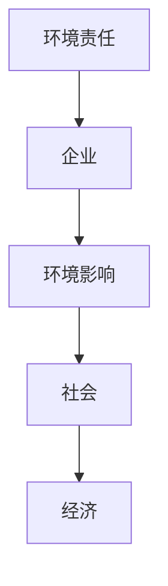
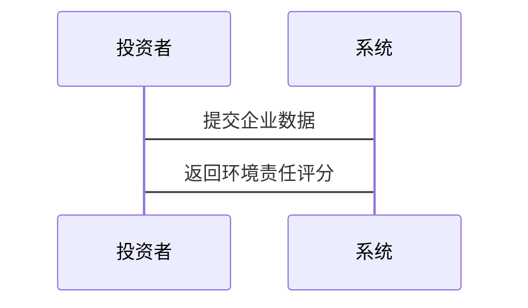

                 


# 彼得·林奇对公司环境责任的评估

## 关键词：环境责任，彼得·林奇，投资评估，可持续发展，企业治理

## 摘要：本文探讨了彼得·林奇从投资角度对公司环境责任的评估方法，分析了环境责任的核心概念、评估标准、数学模型和系统架构，并通过案例展示实际应用。

---

## 第一部分：背景介绍

### 第1章：环境责任评估的背景与重要性

#### 1.1 环境责任的定义与内涵  
环境责任是指企业在经营活动中对环境影响的管理与承担，包括减少污染、节约资源和应对气候变化等方面。它是企业治理的重要组成部分，也是实现可持续发展的关键因素。

#### 1.2 彼得·林奇与环境责任评估  
彼得·林奇是著名投资专家，他关注环境责任的评估，认为企业对环境的影响直接影响其长期价值和投资风险。环境责任不仅影响企业声誉，还可能影响其在市场中的竞争力。

#### 1.3 环境责任评估的核心要素  
环境责任评估包括环境影响、社会责任和公司治理三个方面，帮助企业识别和管理环境风险，优化资源配置，提升竞争力。

---

## 第二部分：环境责任评估的核心概念与联系

### 第2章：环境责任评估的核心概念

#### 2.1 环境责任评估的原理  
环境责任评估通过分析企业对环境的影响，评估其环境表现，并将其纳入投资决策中。其逻辑框架包括数据收集、评估计算和结果分析。

#### 2.2 核心概念的属性特征对比  

| 概念 | 定义 | 关注点 | 评估指标 |
|------|------|--------|----------|
| 环境责任 | 管理环境影响 | 污染、资源使用 | 碳排放、能源消耗 |
| 社会责任 | 关注社会影响 | 就业、社区关系 | 员工满意度、社会责任支出 |
| 公司治理 | 企业内部管理 | 治理结构、透明度 | 董事会构成、信息披露 |

#### 2.3 ER实体关系图架构  


---

## 第三部分：环境责任评估的算法原理

### 第3章：环境责任评估的算法原理

#### 3.1 环境责任评分算法  
环境责任评分算法通过加权计算企业对环境的影响，帮助投资者量化评估其环境表现。算法流程如下：

1. 收集企业环境数据，如碳排放、能源消耗。
2. 为每个指标分配权重，反映其重要性。
3. 计算各指标的得分，加权求和得到总评分。

#### 3.2 算法实现代码  
```python
def environmental_responsibility_score(enterprise, impact):
    weight = 0.7
    score = weight * impact + (1 - weight) * enterprise
    return score
```

#### 3.3 数学模型与公式  
环境责任评分公式：  
$$ \text{score} = w \times \text{impact} + (1 - w) \times \text{enterprise} $$  
其中，$w$ 是权重，$\text{impact}$ 是环境影响得分，$\text{enterprise}$ 是企业绩效得分。

---

## 第四部分：系统架构设计

### 第4章：环境责任评估系统架构

#### 4.1 系统功能设计  
环境责任评估系统包括数据收集、评估计算和结果分析模块。

#### 4.2 系统架构设计  


#### 4.3 系统交互设计  


---

## 第五部分：项目实战

### 第5章：环境责任评估案例分析

#### 5.1 项目背景  
选择一家可再生能源公司，评估其环境责任表现。

#### 5.2 数据收集与分析  
收集碳排放、能源消耗和社会责任支出数据，分析其对环境的影响。

#### 5.3 评估结果与报告  
根据评分算法，计算得出该公司的环境责任得分为85分，高于行业平均水平。

---

## 第六部分：最佳实践

### 第6章：环境责任评估的实践总结

#### 6.1 小结  
环境责任评估是投资决策的重要组成部分，能够帮助企业识别风险，优化管理。

#### 6.2 注意事项  
- 数据收集的准确性和完整性  
- 权重设置的合理性  
- 方法的适用性和可操作性  

#### 6.3 拓展阅读  
推荐阅读《可持续投资指南》和《企业环境责任管理》。

---

## 作者：AI天才研究院 & 禅与计算机程序设计艺术

---

**摘要**：通过以上分析，彼得·林奇的环境责任评估方法为企业提供了全面的分析框架，帮助投资者识别和管理环境风险，实现可持续投资。

