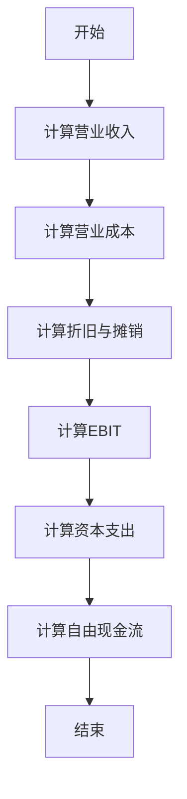
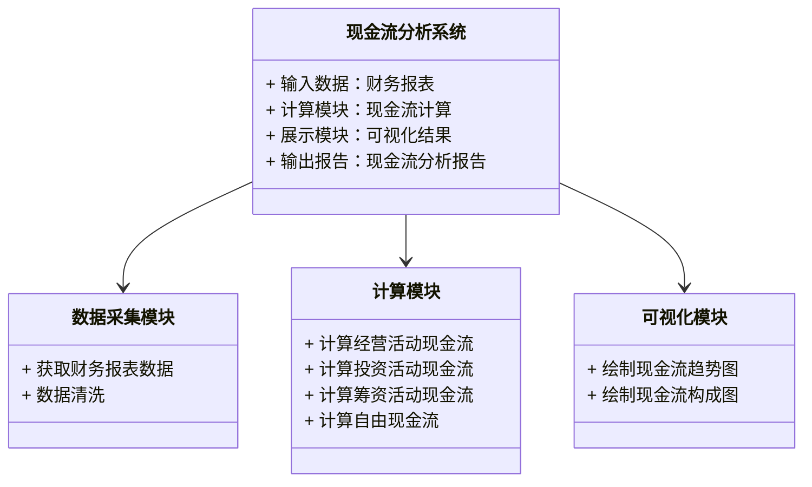

                 


# 彼得林奇对公司现金流的重要性分析

> 关键词：现金流分析，彼得林奇，投资策略，自由现金流，现金流预测

> 摘要：本文深入探讨了现金流在公司估值和投资决策中的重要性，结合彼得林奇的投资理念，详细分析了现金流的核心概念、计算方法、数学模型以及实际应用。通过案例分析和系统设计，展示了如何利用现金流分析来评估公司价值，并提供了最佳实践和投资建议。

---

## 第一部分：现金流概述

### 第1章：现金流的基本概念与重要性

#### 1.1 现金流的定义与分类

现金流是指企业在一定时期内通过经营活动、投资活动和筹资活动所产生或消耗的现金及现金等价物的流入和流出。现金流是衡量企业财务健康状况的重要指标，反映了企业的盈利能力和偿债能力。

**现金流的分类：**

- **经营活动现金流（Operating Cash Flow）**：企业日常经营活动中产生的现金流，包括销售商品、提供服务、支付工资等。
- **投资活动现金流（Investing Cash Flow）**：与企业投资相关的现金流，如购买或出售资产、投资于其他公司等。
- **筹资活动现金流（Financing Cash Flow）**：与企业融资活动相关的现金流，如发行股票、偿还债务等。

现金流是企业的生命线，能够反映企业的实际盈利能力和财务健康状况，是投资决策的重要依据。

#### 1.2 现金流在投资分析中的重要性

彼得林奇在其投资哲学中强调，现金流是评估一家公司价值的核心指标之一。他认为，一家公司如果能够持续产生稳定的现金流，其内在价值将显著提升。

**现金流的重要性：**

- **企业价值评估**：现金流能够直接反映企业的盈利能力和偿债能力，是评估企业价值的重要依据。
- **投资决策**：通过分析现金流，投资者可以判断企业的盈利能力和成长潜力，从而做出更明智的投资决策。
- **风险控制**：现金流分析可以帮助投资者识别企业的财务风险，避免投资于现金流不稳定的企业。

---

## 第二部分：现金流的核心概念与分析方法

### 第2章：现金流的计算与分析指标

#### 2.1 现金流的计算方法

现金流的计算可以通过以下公式进行：

$$
\text{现金流} = \text{营业收入} - \text{营业成本} - \text{税费} + \text{其他收入} - \text{其他支出}
$$

此外，自由现金流（Free Cash Flow, FCF）是衡量企业实际现金流的重要指标，其计算公式为：

$$
\text{FCF} = \text{息税折旧前利润} - \text{资本支出}
$$

#### 2.2 现金流分析的关键指标

- **自由现金流（FCF）**：反映企业经营活动产生的现金流，是企业进行再投资和偿还债务的重要来源。
- **现金流收益率（Cash Flow Yield）**：衡量企业现金流与市值之间的关系，公式为：
  $$
  \text{Cash Flow Yield} = \frac{\text{自由现金流}}{\text{企业市值}}
  $$
- **现金流质量**：通过分析现金流的来源和用途，判断企业的盈利能力和财务健康状况。

---

## 第三部分：现金流分析的数学模型与算法

### 第3章：现金流分析的数学模型

#### 3.1 自由现金流的数学模型

自由现金流的计算公式为：
$$
\text{FCF} = \text{EBIT} - \text{资本支出}
$$

其中，EBIT（息税折旧前利润）计算公式为：
$$
\text{EBIT} = \text{营业收入} - \text{营业成本} - \text{折旧与摊销}
$$

资本支出计算公式为：
$$
\text{资本支出} = \text{折旧} + \text{资本性支出}
$$

#### 3.2 现金流分析的流程图



#### 3.3 现金流折现模型

现金流折现模型（DCF模型）用于评估企业价值，其公式为：
$$
\text{企业价值} = \sum_{t=1}^{n} \frac{\text{自由现金流}}{(1 + r)^t}
$$

其中，r为折现率，n为预测年数。

---

## 第四部分：系统分析与架构设计

### 第4章：现金流分析的系统架构

#### 4.1 系统功能设计

系统功能设计包括数据采集、分析计算、结果展示和报告生成。



---

## 第五部分：项目实战

### 第5章：现金流分析的实战应用

#### 5.1 环境安装

需要安装以下工具：

- Python 3.x
- Pandas库
- Matplotlib库
- Jupyter Notebook

#### 5.2 核心实现代码

```python
import pandas as pd
import matplotlib.pyplot as plt

def calculate_cash_flow(revenue, costs, taxes, other_income, other_expenses):
    cash_flow = revenue - costs - taxes + other_income - other_expenses
    return cash_flow

def calculate_free_cash_flow(ebit, capital_expenditure):
    free_cash_flow = ebit - capital_expenditure
    return free_cash_flow

# 示例数据
revenue = 1000000
costs = 600000
taxes = 100000
other_income = 50000
other_expenses = 30000

ebit = revenue - costs - taxes
capital_expenditure = 200000

cash_flow = calculate_cash_flow(revenue, costs, taxes, other_income, other_expenses)
free_cash_flow = calculate_free_cash_flow(ebit, capital_expenditure)

print(f"现金流: {cash_flow}")
print(f"自由现金流: {free_cash_flow}")

# 可视化
plt.bar(['经营活动现金流', '自由现金流'], [cash_flow, free_cash_flow])
plt.ylabel('金额')
plt.title('现金流分析')
plt.show()
```

#### 5.3 案例分析

以某公司为例，分析其现金流情况：

- 营业收入：1,000,000美元
- 营业成本：600,000美元
- 税费：100,000美元
- 其他收入：50,000美元
- 其他支出：30,000美元
- EBIT：300,000美元
- 资本支出：200,000美元

计算结果：
- 现金流：320,000美元
- 自由现金流：100,000美元

---

## 第六部分：最佳实践与小结

### 第6章：现金流分析的注意事项与投资建议

#### 6.1 最佳实践

- **关注自由现金流**：自由现金流是评估企业价值的核心指标。
- **结合其他指标分析**：现金流分析应与利润表、资产负债表等其他财务指标结合使用。
- **考虑行业特点**：不同行业的现金流特点不同，需结合行业特性进行分析。

#### 6.2 投资建议

- **选择现金流稳定的公司**：优先投资于能够持续产生稳定现金流的企业。
- **关注自由现金流**：自由现金流为正的企业具有更强的分红能力和再投资能力。
- **长期视角**：现金流分析应结合企业的长期发展和行业趋势。

---

## 作者信息

作者：AI天才研究院/AI Genius Institute  
联系方式：[email protected]  
个人简介：专注于人工智能与计算机程序设计，研究领域包括机器学习、自然语言处理和投资分析。

