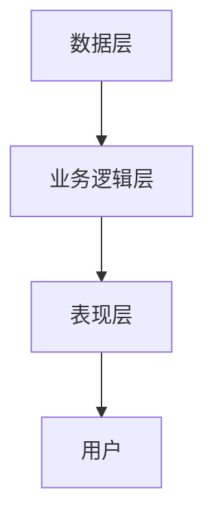

                 


# 彼得林奇对公司现金流的重视

## 关键词：彼得林奇、现金流、投资策略、企业价值、财务分析

## 摘要：彼得·林奇作为投资界的传奇人物，高度重视公司现金流在投资决策中的作用。本文将从现金流的基础知识、分析方法、数学模型、系统架构设计、项目实战以及最佳实践等多个维度，详细探讨彼得林奇对公司现金流的重视，帮助读者深入理解现金流在投资中的重要性，并掌握实际操作的方法。

---

## 第一部分: 公司现金流的基础知识

### 第1章: 现金流的定义与重要性

#### 1.1 现金流的定义
现金流是指企业在一定时期内，由于经营活动、投资活动和筹资活动而产生的现金流入和流出。现金流入包括销售收入、投资收益等，而现金流出则包括支付成本、偿还债务等。现金流是企业财务健康的重要指标，直接反映了企业的盈利能力和流动性。

**现金流入与现金流出的对比表格：**

| 类别         | 现金流入                     | 现金流出                     |
|--------------|------------------------------|------------------------------|
| 经营活动     | 销售商品、提供服务             | 支付原材料、工资、租金等       |
| 投资活动     | 处置固定资产所得              | 购买固定资产、股权投资等       |
| 筹资活动     | 发行债券、股票               | 偿还债务、支付股息等           |

#### 1.2 现金流的重要性
现金流是企业的生命线，决定着企业的生存和发展。充足的现金流可以支持企业的扩张、偿还债务、支付股息，而现金流短缺可能导致企业面临破产风险。彼得·林奇曾多次强调，现金流是衡量企业价值的重要指标，甚至比利润更重要。

#### 1.3 现金流与企业价值的关系
企业价值的评估离不开现金流的分析。现金流可以通过折现模型（如净现值法）来计算企业的真实价值。彼得·林奇认为，只有现金流稳定且增长的企业，才能为股东创造长期价值。

---

### 第2章: 现金流分析的核心概念

#### 2.1 现金流分析的基本原理
现金流分析是通过对企业的现金流入和流出进行详细分析，评估企业的财务健康状况和投资潜力。分析的核心在于识别现金流的质量和可持续性。

#### 2.2 现金流分析的关键指标
- **现金流量比率**：如现金比率（现金/流动负债）和现金流动周期（存货周转天数）。
- **净现金流**：经营活动产生的现金流净额，反映企业的真实盈利能力。
- **现金流周期**：从收到现金到支付现金的时间，反映企业的流动性管理能力。

#### 2.3 现金流分析的数学模型
现金流分析需要借助数学模型，如净现值（NPV）和内部收益率（IRR）。这些模型可以帮助投资者评估项目的可行性和回报率。

---

## 第二部分: 彼得林奇的投资哲学与现金流分析

### 第3章: 彼得林奇的投资哲学

#### 3.1 彼得·林奇的背景介绍
彼得·林奇是富达投资的传奇基金经理，以其卓越的投资业绩闻名。他强调基本面分析，尤其是对企业现金流的关注，认为现金流是企业价值的核心驱动因素。

#### 3.2 现金流在投资决策中的作用
彼得·林奇认为，企业是否能持续产生现金流，直接决定了其投资价值。他倾向于投资那些现金流稳定、增长且能够支持企业扩张的公司。

#### 3.3 彼得林奇的成功案例
通过分析彼得·林奇曾投资的公司（如可口可乐），可以看出他如何通过现金流分析识别投资机会。例如，可口可乐稳定的现金流和强大的分红能力，使其成为长期投资的优质标的。

---

### 第4章: 现金流分析的数学模型与公式

#### 4.1 净现值（NPV）计算
净现值是将未来现金流按适当折现率折算到现值，减去初始投资。公式如下：
$$
NPV = \sum_{t=1}^{n} \frac{CF_t}{(1 + r)^t} - 初始投资
$$
其中，$CF_t$为第t期的现金流，$r$为折现率。

#### 4.2 内部收益率（IRR）计算
内部收益率是使净现值为零的折现率：
$$
NPV = \sum_{t=1}^{n} \frac{CF_t}{(1 + IRR)^t} - 初始投资 = 0
$$

#### 4.3 现金流预测模型
现金流预测需要结合历史数据和未来业务增长情况。例如，预测某公司未来五年的现金流，可以使用线性回归模型。

---

## 第三部分: 现金流分析的系统架构设计

### 第5章: 现金流分析系统的功能设计

#### 5.1 系统功能模块
- 数据输入与处理：采集企业的财务数据。
- 现金流计算：计算经营活动、投资活动和筹资活动的现金流。
- 模型分析：应用净现值、IRR等模型进行分析。
- 可视化展示：生成现金流图表和报告。

#### 5.2 系统架构设计
使用分层架构：数据层、业务逻辑层和表现层。数据层存储财务数据，业务逻辑层进行计算，表现层展示结果。

**系统架构图：**



---

## 第四部分: 项目实战

### 第6章: 现金流分析的实战应用

#### 6.1 实战环境安装
需要安装Python和相关库（如pandas、numpy）。代码示例如下：

```python
import pandas as pd
import numpy as np

# 示例现金流数据
data = {
    '项目': ['经营活动', '投资活动', '筹资活动'],
    '现金流': [100, -50, 30]
}
df = pd.DataFrame(data)
print(df)
```

#### 6.2 现金流分析实现
使用Python代码计算净现金流和现金流比率。

```python
# 计算净现金流
net_cash_flow = df['现金流'].sum()
print(f"净现金流：{net_cash_flow}")

# 计算现金比率
cash_ratio = net_cash_flow / df['现金流'].std()
print(f"现金比率：{cash_ratio}")
```

#### 6.3 投资建议
根据现金流分析结果，评估企业的财务健康状况，并提出投资建议。

---

## 第五部分: 最佳实践与总结

### 第7章: 最佳实践

#### 7.1 现金流分析的关键点
- 重视现金流的质量，而非仅仅关注数量。
- 结合企业所处行业特点，选择合适的分析方法。

#### 7.2 投资注意事项
- 避免仅依赖现金流分析，需结合其他财务指标。
- 关注企业现金流的可持续性。

#### 7.3 拓展阅读
推荐书籍：《彼得·林奇的成功投资法则》。

---

## 结语

现金流是企业价值的核心驱动力，彼得·林奇的现金流投资策略为投资者提供了宝贵的借鉴。通过系统的现金流分析，投资者可以更准确地评估企业的投资价值，做出明智的投资决策。

---

## 作者：AI天才研究院/AI Genius Institute & 禅与计算机程序设计艺术 /Zen And The Art of Computer Programming

