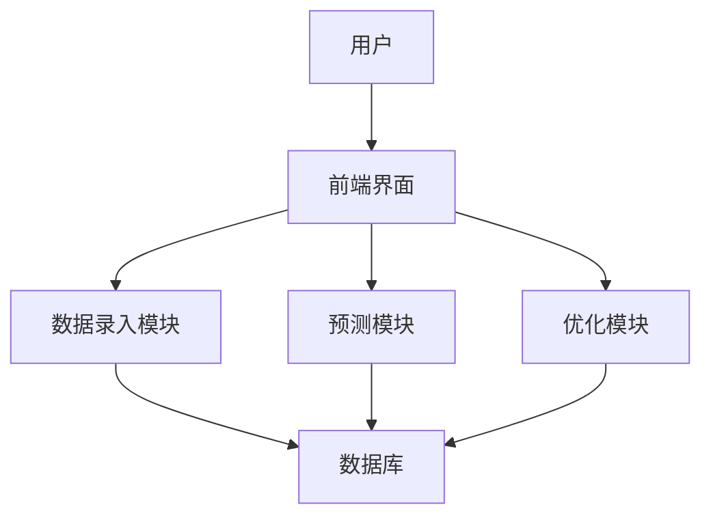

                 

# 彼得林奇对公司现金流管理的看法

## 关键词：现金流管理、彼得·林奇、投资策略、企业价值、现金流量表、财务分析、现金流预测

## 摘要：  
现金流管理是企业财务管理的核心内容之一，而彼得·林奇作为全球著名投资经理，对现金流管理有着独到的见解。本文从现金流管理的基本概念、核心算法、系统设计和实战案例等方面，详细探讨彼得·林奇的现金流管理思想，并结合技术实现和系统架构，为企业提供现金流管理的实践指导。

---

## 第一章：现金流管理的背景与重要性

### 1.1 现金流管理的基本概念

#### 1.1.1 现金流的定义与分类  
现金流是指企业在一定时期内现金的流入和流出。根据来源和用途，现金流可以分为以下三类：  
- **经营活动现金流**：企业日常经营活动中产生的现金流，如销售商品、支付员工工资等。  
- **投资活动现金流**：与企业投资活动相关的现金流，如购买设备、出售投资等。  
- **筹资活动现金流**：与企业筹资活动相关的现金流，如发行债券、偿还贷款等。  

#### 1.1.2 现金流在企业运营中的作用  
现金流是企业生存和发展的血液。良好的现金流管理可以确保企业正常运营、偿还债务、投资扩张，同时还能为股东创造价值。  

#### 1.1.3 现金流管理的重要性  
现金流管理的重要性体现在以下几个方面：  
1. 保障企业短期偿债能力。  
2. 支持企业长期发展。  
3. 优化企业资金配置。  
4. 提高企业抗风险能力。  

### 1.2 彼得·林奇与现金流管理

#### 1.2.1 彼得·林奇的背景与投资理念  
彼得·林奇是美国著名的投资经理，曾任富达投资集团麦哲伦基金的经理。他以选股能力著称，强调基本面分析和长期投资。他认为，企业的现金流是衡量企业价值的重要指标，现金流充裕的企业更具投资价值。  

#### 1.2.2 彼得·林奇对现金流管理的重视  
彼得·林奇认为，企业的现金流是企业健康的核心指标。他通过分析企业的现金流，评估企业的盈利能力和抗风险能力，从而做出投资决策。  

#### 1.2.3 现金流管理在投资决策中的地位  
在彼得·林奇的投资体系中，现金流管理是评估企业价值的关键步骤。他认为，现金流充裕的企业更能抵御市场波动，为股东创造长期价值。  

---

## 第二章：现金流管理的核心概念与联系

### 2.1 现金流管理的核心概念

#### 2.1.1 现金流管理的定义  
现金流管理是指对企业现金流入和流出的规划、监控和优化，以实现企业财务目标的过程。  

#### 2.1.2 现金流管理的核心要素  
现金流管理的核心要素包括：  
- 现金流预测：基于历史数据和未来预期，预测企业的现金流。  
- 现金流监控：实时跟踪企业的现金流状况，及时发现异常。  
- 现金流优化：通过调整企业经营策略，优化现金流结构。  

#### 2.1.3 现金流管理的边界与外延  
现金流管理的边界包括企业的日常经营、投资和筹资活动。其外延则延伸至企业战略、风险管理等领域。  

### 2.2 现金流管理的核心概念与联系

#### 2.2.1 现金流与企业价值的关系  
现金流与企业价值密切相关。企业价值的评估通常基于未来现金流的现值，而现金流的稳定性和增长性是决定企业价值的关键因素。  

#### 2.2.2 现金流与企业利润的关系  
现金流与利润是两个不同的概念。利润是会计上的净收益，而现金流反映企业的实际资金流动情况。两者共同构成企业财务健康的核心指标。  

#### 2.2.3 现金流与企业风险的关系  
现金流充裕的企业更能抵御市场风险和经营风险。现金流管理是企业风险管理的重要组成部分。  

---

## 第三章：现金流管理的数学模型与算法

### 3.1 现金流管理的数学模型

#### 3.1.1 现金流贴现模型  
现金流贴现模型（DCF模型）是评估企业价值的核心工具。其基本公式为：  
$$ \text{企业价值} = \sum_{t=1}^{n} \frac{\text{现金流}_t}{(1+r)^t} + \frac{\text{残值}}{(1+r)^n} $$  
其中，$r$ 是折现率，$n$ 是预测期数，$\text{现金流}_t$ 是第$t$年的现金流。  

#### 3.1.2 现金流预测模型  
现金流预测模型通常基于历史数据和未来预期。常用的预测方法包括：  
1. 简单线性回归模型：$$ \text{现金流}_t = a \cdot t + b $$  
2. 时间序列模型：ARIMA（自回归积分滑动平均模型）。  

#### 3.1.3 现金流波动模型  
现金流波动模型用于评估现金流的不确定性。常用模型包括：  
1. 随机游走模型：$$ \text{现金流}_{t+1} = \text{现金流}_t + \epsilon $$  
2. 马尔可夫链模型：基于状态转移的概率模型。  

### 3.2 现金流管理的算法原理

#### 3.2.1 现金流预测的算法流程  
1. 数据收集：收集企业的历史财务数据。  
2. 数据清洗：剔除异常值和缺失值。  
3. 模型选择：选择合适的预测模型（如线性回归或时间序列模型）。  
4. 模型训练：基于历史数据训练模型。  
5. 预测现金流：基于模型预测未来现金流。  

#### 3.2.2 现金流波动的算法实现  
1. 确定现金流波动的分布特征（如正态分布或对数正态分布）。  
2. 生成随机数：基于分布特征生成随机现金流数据。  
3. 模拟现金流波动：使用蒙特卡洛模拟方法预测现金流波动。  

#### 3.2.3 现金流优化的算法设计  
1. 确定优化目标（如最大化净现值或最小化风险）。  
2. 建立优化模型（如线性规划或动态规划模型）。  
3. 求解优化模型：使用遗传算法或模拟退火算法。  

---

## 第四章：现金流管理的系统分析与架构设计

### 4.1 现金流管理系统的需求分析

#### 4.1.1 系统目标与范围  
现金流管理系统的目标是实现对企业现金流的实时监控、预测和优化。其范围包括企业的经营、投资和筹资活动。  

#### 4.1.2 系统功能需求  
1. 现金流数据录入与管理。  
2. 现金流预测与分析。  
3. 现金流优化与模拟。  

#### 4.1.3 系统性能需求  
1. 实时数据处理能力。  
2. 高效的预测与优化算法。  
3. 可视化的现金流报表。  

### 4.2 现金流管理系统的架构设计

#### 4.2.1 系统架构图  

#### 4.2.2 系统模块划分  
1. 数据录入模块：负责录入现金流数据。  
2. 预测模块：基于历史数据预测未来现金流。  
3. 优化模块：优化现金流结构，降低风险。  

#### 4.2.3 系统接口设计  
1. 数据接口：与企业财务系统对接。  
2. 用户接口：提供直观的用户界面。  

---

## 第五章：现金流管理的项目实战

### 5.1 现金流管理系统的环境搭建

#### 5.1.1 开发环境的选择  
推荐使用Python和MySQL进行开发。  

#### 5.1.2 开发工具的安装  
安装Python、MySQL和相关开发工具（如PyCharm、Navicat）。  

#### 5.1.3 数据库的搭建  
创建MySQL数据库，设计现金流表结构。  

### 5.2 现金流管理系统的实现

#### 5.2.1 核心算法的实现  
1. 现金流预测算法：使用线性回归模型预测现金流。  
2. 现金流优化算法：基于动态规划模型优化现金流结构。  

#### 5.2.2 系统功能的实现  
1. 数据录入功能：用户输入现金流数据。  
2. 预测功能：显示预测的现金流报表。  
3. 优化功能：生成优化后的现金流方案。  

#### 5.2.3 系统测试与优化  
1. 功能测试：验证系统功能是否正常。  
2. 性能测试：测试系统的处理能力。  
3. 优化：根据测试结果优化系统性能。  

---

## 第六章：现金流管理的最佳实践与小结

### 6.1 现金流管理的最佳实践

#### 6.1.1 现金流管理的注意事项  
1. 定期更新现金流数据。  
2. 结合企业实际情况选择预测模型。  
3. 合理配置现金流结构。  

#### 6.1.2 现金流管理的常见误区  
1. 过度依赖历史数据。  
2. 忽视现金流波动风险。  
3. 仅关注短期现金流。  

#### 6.1.3 现金流管理的优化建议  
1. 引入先进的预测算法。  
2. 建立风险预警机制。  
3. 加强现金流管理的培训。  

### 6.2 现金流管理的未来趋势  
随着人工智能和大数据技术的发展，现金流管理将更加智能化和精准化。企业需要结合新技术，不断优化现金流管理策略，提升企业的竞争力。  

---

## 作者：AI天才研究院/AI Genius Institute & 禅与计算机程序设计艺术 /Zen And The Art of Computer Programming  

---

通过本文的详细讲解，我们深入探讨了彼得·林奇对公司现金流管理的看法，并结合技术实现和系统架构，为企业提供了现金流管理的实践指导。希望本文能够帮助读者更好地理解和应用现金流管理的理念与方法。

