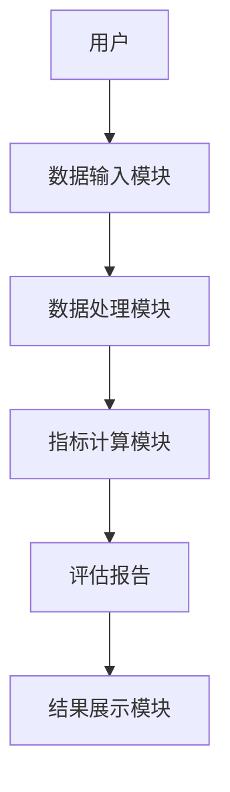
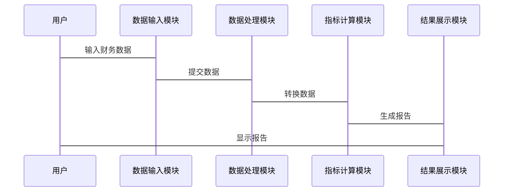

                 

<think>
好的，我将按照您的要求，逐步构建《彼得林奇对公司现金流质量的分析》的目录大纲。这个过程需要我仔细分析每个部分，确保内容的完整性和逻辑性。

首先，我需要明确文章的核心内容，即现金流质量的分析，特别是彼得·林奇的方法。接下来，我将按照您提供的结构，依次构建每个章节和小节。

**# 《彼得林奇对公司现金流质量的分析》**

> **关键词：** 现金流质量分析, 彼得·林奇, 投资分析, 现金流指标, 财务分析, 现金流结构

> **摘要：**  
> 本文详细探讨了彼得·林奇在分析公司现金流质量方面的方法和见解。通过对现金流的分类、关键指标、分析流程、系统设计、实战案例的深入分析，结合图表和数学模型，帮助读者全面理解现金流质量评估的重要性及其在投资决策中的应用。文章旨在为投资者提供实用的工具和方法，以识别高质量的现金流结构，从而做出明智的投资决策。

---

## 第1章: 引言

### 1.1 现金流质量分析的重要性
- 现金流是企业财务健康的核心指标，直接影响企业的生存和发展。
- 彼得·林奇强调现金流质量的重要性，认为高质量的现金流是企业长期盈利能力的基石。

### 1.2 彼得·林奇的投资理念
- 林奇的投资策略以基本面分析为主，特别关注企业的现金流状况。
- 他提出了通过现金流分析来评估企业的盈利能力和抗风险能力。

### 1.3 本章小结
- 现金流质量分析是投资决策的关键因素。
- 彼得·林奇的方法为投资者提供了系统的分析框架。

---

## 第2章: 现金流质量分析的核心概念

### 2.1 现金流的分类
- **经营活动现金流：** 反映企业日常运营的现金流情况。
- **投资活动现金流：** 反映企业对外投资和资本支出的情况。
- **筹资活动现金流：** 反映企业通过融资活动获得的现金流。

### 2.2 现金流质量的核心要素
- **稳定性：** 现金流是否稳定，能否支撑企业日常运营。
- **可持续性：** 现金流是否能够长期持续，反映企业的盈利能力。
- **可预测性：** 现金流的未来趋势是否容易预测，帮助企业做出投资决策。

### 2.3 现金流质量分析的指标体系
- **现金流比率分析：** 如现金比率、流动比率等。
- **现金流与收入的比例：** 现金流量与营业收入的比例，衡量现金流的充足性。
- **现金流质量的综合评价指标：** 结合多种指标进行综合评价。

### 2.4 本章小结
- 现金流质量分析需要从多个维度进行评估。
- 彼得·林奇的方法注重现金流的稳定性和可持续性。

---

## 第3章: 现金流质量分析的系统设计

### 3.1 现金流分析的系统架构
- **数据收集模块：** 收集企业的财务报表数据，包括现金流量表。
- **分析模块：** 对现金流进行分类和计算，生成关键指标。
- **评估模块：** 基于指标进行综合评估，得出现金流质量的评分。

### 3.2 系统功能设计
- **输入数据：** 用户输入企业的财务数据。
- **数据处理：** 对数据进行清洗和转换。
- **指标计算：** 计算现金流的各项指标。
- **结果展示：** 生成评估报告，展示现金流质量的评分和分析结果。

### 3.3 系统架构图（使用 Mermaid）



### 3.4 系统接口设计
- **数据接口：** 提供API接口，方便与其他系统集成。
- **用户界面：** 提供友好的操作界面，方便用户输入和查看结果。

### 3.5 系统交互流程（使用 Mermaid）



### 3.6 本章小结
- 现金流分析系统的设计需要模块化和系统化。
- 通过系统化的分析，能够更准确地评估现金流质量。

---

## 第4章: 现金流质量分析的实战案例

### 4.1 实战环境安装
- **工具准备：** 安装Python、Pandas、Matplotlib等工具。
- **数据准备：** 获取企业的财务报表数据，包括现金流量表。

### 4.2 现金流质量分析的代码实现
```python
import pandas as pd
import matplotlib.pyplot as plt

# 读取数据
df = pd.read_csv('cash_flow.csv')

# 计算现金流质量指标
cf_operating = df['Operating Cash Flow'].values[0]
cf_investing = df['Investing Cash Flow'].values[0]
cf_financing = df['Financing Cash Flow'].values[0]

# 现金流结构分析
total_cash_flow = cf_operating + cf_investing + cf_financing
cash_flow_ratio = cf_operating / total_cash_flow * 100

print(f"现金流结构：经营活动现金流 {cf_operating}, 投资活动现金流 {cf_investing}, 筹资活动现金流 {cf_financing}")
print(f"现金流结构比例：{cash_flow_ratio}%")
```

### 4.3 实战案例分析
- **案例介绍：** 以某公司为例，分析其现金流质量。
- **数据解读：** 解释各项现金流指标的含义。
- **结果分析：** 基于现金流质量评分，得出投资建议。

### 4.4 本章小结
- 通过实战案例，读者可以理解现金流质量分析的实际应用。
- 代码实现帮助读者掌握现金流分析的具体操作步骤。

---

## 第5章: 总结与展望

### 5.1 本章总结
- 现金流质量分析是投资决策的重要组成部分。
- 彼得·林奇的方法提供了系统的分析框架和实用工具。

### 5.2 注意事项
- 数据的准确性和完整性对分析结果至关重要。
- 投资者需要结合其他财务指标进行综合分析。

### 5.3 未来展望
- 现金流分析的自动化和智能化是未来发展的趋势。
- 结合人工智能技术，提升现金流分析的准确性和效率。

---

## 作者信息

**作者：AI天才研究院/AI Genius Institute & 禅与计算机程序设计艺术 /Zen And The Art of Computer Programming**

---

通过以上目录大纲，文章将系统地介绍彼得·林奇的现金流质量分析方法，结合理论和实战，帮助读者全面理解和应用这些分析工具。

