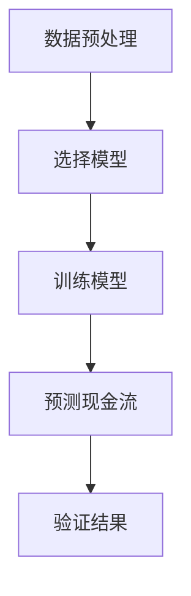

                 


# 彼得林奇对公司现金流质量的跨周期分析

> **关键词**：彼得·林奇、现金流质量、跨周期分析、投资策略、财务分析、现金流预测  
> 
> **摘要**：本文深入探讨了彼得·林奇对公司现金流质量的跨周期分析方法，从现金流的定义、重要性到跨周期分析的框架、方法，再到实际案例分析和现金流预测模型的设计与实现，全面揭示了现金流质量对投资决策的关键作用。通过本文，读者可以掌握如何通过现金流质量分析来评估企业价值，并制定长期稳健的投资策略。

---

## 第一章：现金流质量的核心概念

### 1.1 现金流的定义与分类

现金流是企业在一定时期内通过经营活动、投资活动和筹资活动所产生的现金流入和流出。现金流是企业财务健康状况的重要指标，反映了企业的盈利能力和偿债能力。

#### 现金流的分类：
1. **经营活动现金流**：企业日常经营活动中产生的现金流，包括销售商品、提供服务等。
2. **投资活动现金流**：企业投资于长期资产或处置长期资产所产生的现金流。
3. **筹资活动现金流**：企业通过发行股票、债券或其他债务融资活动所产生的现金流。

### 1.2 现金流质量的定义与关键特征

现金流质量是指企业在一定时期内产生的现金流的稳定性和可持续性。高质量的现金流意味着企业在经营活动中能够持续产生正向现金流，且波动较小。

#### 现金流质量的关键特征：
1. **稳定性**：现金流波动小，周期性影响弱。
2. **可持续性**：现金流来源稳定，能够持续为企业发展提供资金支持。
3. **盈利性**：现金流与企业利润密切相关，高质量现金流通常伴随着较高的盈利能力。

### 1.3 现金流质量与企业价值的关系

现金流质量是衡量企业价值的重要指标。高质量的现金流能够增强企业的偿债能力，降低财务风险，同时为股东创造更多的价值。

---

## 第二章：现金流的跨周期分析方法

### 2.1 时间序列分析

时间序列分析是一种通过分析历史数据来预测未来趋势的方法。在现金流分析中，时间序列分析可以帮助我们识别现金流的周期性波动。

#### 时间序列分析的步骤：
1. **数据收集**：收集企业过去几年的现金流数据。
2. **数据预处理**：去除异常值，处理缺失数据。
3. **模型选择**：选择适合的模型，如ARIMA（自回归积分滑动平均模型）。
4. **模型训练**：利用历史数据训练模型。
5. **预测与验证**：使用训练好的模型预测未来现金流，并验证预测结果。

### 2.2 现金流波动的周期性分解

现金流波动往往受到经济周期的影响。通过周期性分解，我们可以识别现金流波动的周期性特征，并制定相应的投资策略。

#### 周期性分解的方法：
1. **傅里叶变换**：将时间序列分解为不同频率的成分。
2. **移动平均法**：通过计算移动平均值来识别周期性波动。
3. **经验模态分解（EMD）**：将时间序列分解为多个本征模态函数（IMF）。

### 2.3 跨周期分析的核心指标

在跨周期分析中，我们需要关注以下核心指标：
1. **现金流波动率**：衡量现金流的波动程度。
2. **现金流周期性强度**：反映现金流波动中周期性成分的占比。
3. **现金流预测误差**：衡量预测模型的准确性。

---

## 第三章：彼得·林奇的现金流分析框架

### 3.1 彼得·林奇的投资策略

彼得·林奇以其独特的投资策略闻名，他注重企业的基本面分析，尤其是现金流质量。他认为，只有能够持续产生高质量现金流的企业，才能为股东创造长期价值。

#### 彼得·林奇的核心观点：
1. **关注经营活动现金流**：经营活动现金流是企业核心竞争力的体现。
2. **避免周期性波动**：选择那些现金流波动较小的企业。
3. **长期投资**：通过长期持有优质资产，获得稳定的现金流回报。

### 3.2 现金流质量的评价标准

彼得·林奇提出了以下现金流质量评价标准：
1. **经营活动现金流为正**：企业能够通过经营活动获得正向现金流。
2. **现金流波动小**：现金流波动较小，受经济周期影响弱。
3. **现金流与利润匹配**：现金流与企业利润密切相关，表明企业盈利质量高。

### 3.3 跨周期分析的实战案例

以苹果公司为例，我们可以分析其现金流质量的跨周期表现。

#### 苹果公司的现金流分析：
1. **经营活动现金流**：苹果公司经营活动现金流长期为正，且波动较小。
2. **投资活动现金流**：苹果公司在研发和资本支出上的投入较大，但整体现金流仍然保持健康。
3. **筹资活动现金流**：苹果公司通过发行债券和股票融资，但筹资活动现金流对整体现金流影响较小。

---

## 第四章：现金流预测模型的设计与实现

### 4.1 现金流预测模型的设计

现金流预测模型的设计需要考虑以下几个方面：
1. **数据来源**：选择可靠的财务数据来源。
2. **模型选择**：根据数据特点选择适合的预测模型。
3. **模型训练**：利用历史数据训练模型。
4. **模型验证**：通过回测验证模型的准确性。

#### 现金流预测模型的流程图：


### 4.2 基于ARIMA模型的现金流预测

ARIMA（自回归积分滑动平均模型）是一种常用的时序预测模型。以下是ARIMA模型的实现步骤：

#### ARIMA模型的数学公式：
$$ ARIMA(p, d, q) $$
其中，p为自回归阶数，d为差分阶数，q为滑动平均阶数。

#### Python代码实现：
```python
from statsmodels.tsa.arima_model import ARIMA
import pandas as pd

# 数据预处理
data = pd.read_csv('cash_flow.csv')
train_data = data['现金流'].values

# 模型训练
model = ARIMA(train_data, order=(5, 1, 0))
model_fit = model.fit()

# 预测未来现金流
future_periods = 5
forecast = model_fit.forecast(future_periods)
```

### 4.3 模型验证与优化

模型验证是预测模型的重要环节。我们可以通过以下方法验证模型的准确性：
1. **回测**：使用历史数据验证模型的预测能力。
2. **误差分析**：计算预测误差，如均方误差（MSE）和平均绝对误差（MAE）。
3. **参数优化**：通过调整模型参数，优化预测结果。

#### 误差分析公式：
$$ MSE = \frac{1}{n}\sum_{i=1}^{n}(实际值_i - 预测值_i)^2 $$
$$ MAE = \frac{1}{n}\sum_{i=1}^{n}|实际值_i - 预测值_i| $$

---

## 第五章：现金流预测模型的实战分析与策略优化

### 5.1 实战分析：以苹果公司为例

#### 苹果公司现金流预测：
1. **数据来源**：使用苹果公司过去10年的现金流数据。
2. **模型训练**：训练ARIMA模型。
3. **预测结果**：预测未来5年的现金流。

#### 预测结果分析：
- 苹果公司未来5年的经营活动现金流预计将继续保持正增长。
- 投资活动现金流波动较大，需关注研发支出的合理性。
- 筹资活动现金流对整体现金流影响较小。

### 5.2 投资策略优化

基于现金流预测结果，我们可以制定以下投资策略：
1. **长期持有优质资产**：选择那些现金流稳定、波动小的企业。
2. **动态调整投资组合**：根据现金流预测结果，动态调整投资组合。
3. **风险控制**：通过分散投资降低风险，避免过度依赖单一企业或行业。

---

## 第六章：总结与展望

### 6.1 总结

本文深入探讨了彼得·林奇对公司现金流质量的跨周期分析方法，从现金流的定义、重要性到跨周期分析的框架、方法，再到实际案例分析和现金流预测模型的设计与实现，全面揭示了现金流质量对投资决策的关键作用。

### 6.2 展望

未来，随着人工智能和大数据技术的发展，现金流预测模型将更加精准。我们可以尝试引入机器学习算法，如LSTM（长短期记忆网络），进一步提高现金流预测的准确性。

---

**作者：AI天才研究院/AI Genius Institute & 禅与计算机程序设计艺术 /Zen And The Art of Computer Programming**

