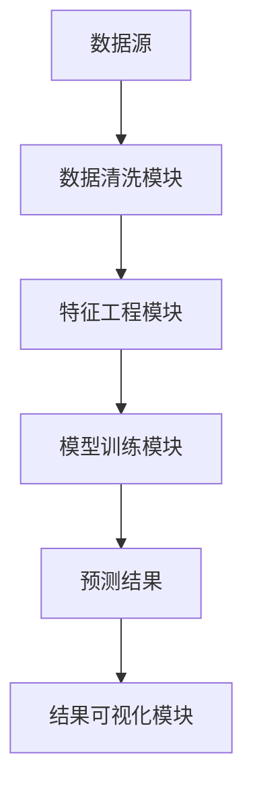

                 


# 彼得林奇对公司现金流预测准确性的分析

## 关键词：现金流预测, 彼得·林奇, 投资分析, DCF模型, 现金流贴现, 预测准确性, 投资决策

## 摘要：  
现金流预测是公司估值和投资决策中的关键环节，彼得·林奇以其独特的投资理念和方法，深入分析了现金流预测的准确性。本文从现金流预测的基本概念出发，结合彼得·林奇的投资策略，详细探讨了现金流预测的数学模型、误差分析以及系统架构设计方案。通过实际案例分析和Python代码实现，本文为投资者提供了实用的现金流预测方法，并总结了最佳实践和注意事项。

---

## 第一部分：现金流预测的背景与重要性

### 第1章：现金流预测的基本概念

#### 1.1 什么是现金流预测  
现金流预测是通过分析公司未来经营活动、投资活动和筹资活动所产生的现金流入和流出，估算未来一定时期内公司现金流的大小和时间分布的过程。  

- **现金流的分类**：  
  - 经营活动现金流：公司日常运营产生的现金流。  
  - 投资活动现金流：公司投资于资产或处置资产产生的现金流。  
  - 筹资活动现金流：公司通过融资活动获得或偿还的现金流。  

- **现金流预测的用途**：  
  - 公司内部管理：用于预算制定、资金规划和投资决策。  
  - 投资者评估：用于公司估值、投资决策和风险评估。  

---

### 第2章：现金流预测在公司估值中的作用

#### 2.1 公司估值的基本方法  
现金流贴现模型（DCF模型）是公司估值中最常用的方法之一，其核心是将公司未来自由现金流折现为现值，以评估公司价值。  

- **股权自由现金流模型**：  
  股权自由现金流（FCFF）是指公司扣除所有资本成本后的现金流，用于评估股权价值。  
  $$ FCFF = EBIT(1 - 税率) + 折旧 - 资本支出 $$  

- **企业价值与股权价值的区别**：  
  - 企业价值（EV）：包括股权价值和债权价值。  
  - 股权价值：仅包括股东的权益部分。  

- **DCF模型的应用步骤**：  
  1. 预测未来自由现金流。  
  2. 选择合适的贴现率（WACC）。  
  3. 计算未来现金流的现值。  
  4. 加上终值，得到公司估值。  

---

### 第3章：彼得·林奇的投资理念与现金流预测

#### 3.1 彼得·林奇的投资者简介  
彼得·林奇是美国著名的投资专家，以其在富达投资管理公司的长期任职中取得了卓越的投资业绩。他强调基本面分析和对公司管理层的信任，尤其关注公司的现金流状况。  

- **彼得·林奇的投资风格**：  
  - 价值投资：寻找被市场低估的公司。  
  - 深入研究：分析公司的财务报表、行业地位和管理层能力。  
  - 长期持有：避免频繁交易，长期持有优质股票。  

#### 3.2 现金流预测与彼得·林奇的投资决策  
彼得·林奇认为，现金流预测的准确性是评估公司价值的关键因素。他通过以下方式分析现金流预测的准确性：  

- **财务报表分析**：  
  通过分析公司的历史现金流数据，评估管理层预测的合理性。  

- **管理层能力评估**：  
  管理层的诚信和能力直接影响现金流预测的准确性。  

- **市场环境判断**：  
  宏观经济环境和行业趋势会影响现金流预测的实现。  

---

## 第二部分：现金流预测的数学模型与分析方法

### 第5章：现金流预测的数学模型

#### 5.1 现金流贴现模型（DCF模型）  
DCF模型是现金流预测的核心工具，通过将未来现金流折现为现值来评估公司价值。  

- **DCF模型的基本公式**：  
  $$ PV = \frac{CF_t}{(1 + r)^t} $$  
  其中，CF_t是第t年的现金流，r是贴现率，t是时间跨度。  

- **永续年金的现值计算**：  
  如果公司现金流在t年后以恒定增长率g持续增长，则永续年金的现值为：  
  $$ PV = \frac{CF}{r - g} $$  

#### 5.2 现金流预测的敏感性分析  
现金流预测对模型参数的敏感性分析有助于理解预测结果的可靠性。  

- **对贴现率的敏感性**：  
  贴现率的变化会影响现值的计算，通常采用情景分析法进行评估。  

- **对增长率的敏感性**：  
  现金流增长率的变化会影响未来现金流的现值，需结合行业趋势进行判断。  

---

### 第6章：现金流预测的误差分析

#### 6.1 误差的来源  
现金流预测的误差主要来源于以下几个方面：  

- **数据误差**：历史数据的不准确或不完整。  
- **模型误差**：模型假设与实际不符。  
- **假设误差**：对未来的假设过于乐观或悲观。  

#### 6.2 误差的度量  
常用的误差度量方法包括：  

- **平均绝对误差（MAE）**：  
  $$ MAE = \frac{1}{n}\sum_{i=1}^{n}|实际值_i - 预测值_i| $$  

- **均方误差（MSE）**：  
  $$ MSE = \frac{1}{n}\sum_{i=1}^{n}(实际值_i - 预测值_i)^2 $$  

- **毛氏系数（R²）**：  
  $$ R^2 = 1 - \frac{\sum_{i=1}^{n}(实际值_i - 预测值_i)^2}{\sum_{i=1}^{n}(实际值_i - \bar{y})^2} $$  

---

## 第三部分：现金流预测的系统分析与架构设计方案

### 第7章：系统架构设计

#### 7.1 系统功能设计  
现金流预测系统的功能模块包括：  

- **数据收集模块**：收集历史财务数据、行业数据和宏观经济数据。  
- **模型选择模块**：选择适合的现金流预测模型（如线性回归、时间序列分析等）。  
- **风险评估模块**：评估预测结果的不确定性。  

#### 7.2 系统架构设计  
以下是现金流预测系统的架构图：  



---

## 第四部分：项目实战

### 第8章：现金流预测案例分析

#### 8.1 环境安装  
需要安装Python、Pandas、NumPy和Scikit-learn等库。  

#### 8.2 核心实现代码  
以下是一个现金流预测的Python代码示例：  

```python
import pandas as pd
import numpy as np
from sklearn.linear_model import LinearRegression
from sklearn.metrics import mean_absolute_error, mean_squared_error, r2_score

# 数据加载
data = pd.read_csv('cash_flow.csv')

# 特征与目标变量分离
X = data[[' revenue', 'operating_cost', 'tax_rate']]
y = data['cash_flow']

# 模型训练
model = LinearRegression()
model.fit(X, y)

# 预测
y_pred = model.predict(X)

# 误差分析
mae = mean_absolute_error(y, y_pred)
mse = mean_squared_error(y, y_pred)
r2 = r2_score(y, y_pred)

print(f"MAE: {mae}")
print(f"MSE: {mse}")
print(f"R²: {r2}")
```

---

## 第五部分：总结与最佳实践

### 第9章：总结与注意事项

#### 9.1 总结  
现金流预测是投资决策中的关键环节，彼得·林奇通过深入分析现金流预测的准确性，为投资者提供了实用的分析方法。  

#### 9.2 投资中的注意事项  
- **关注管理层能力**：管理层的诚信和能力直接影响现金流预测的准确性。  
- **结合市场环境**：宏观经济环境和行业趋势会影响现金流预测的实现。  
- **定期更新模型**：随着市场变化，及时更新现金流预测模型。  

#### 9.3 未来研究方向  
- **改进预测模型**：引入机器学习算法提高预测准确性。  
- **多因素分析**：考虑更多影响现金流的因素，如供应链风险、政策变化等。  

---

## 作者：AI天才研究院/AI Genius Institute & 禅与计算机程序设计艺术 /Zen And The Art of Computer Programming

