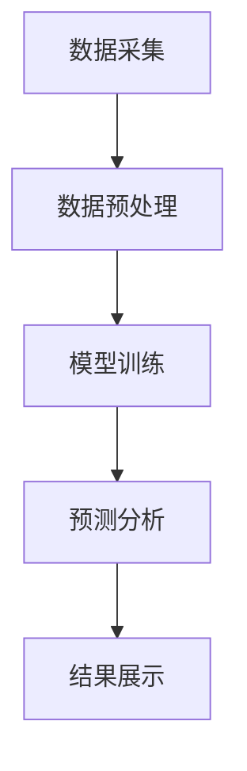
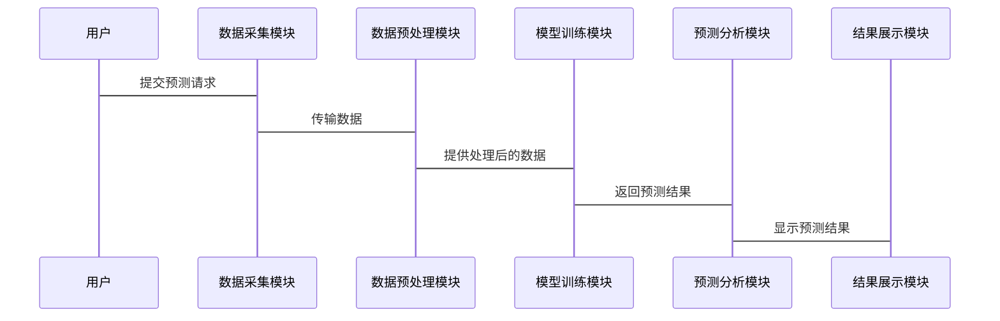

                 


```markdown
# 彼得林奇对公司现金流预测准确性的历史分析

## 关键词：彼得林奇，现金流预测，公司估值，投资策略，技术分析

## 摘要：  
彼得·林奇作为一位传奇的基金经理，以其对公司现金流预测的精准分析而闻名。本文将深入探讨彼得林奇的历史分析方法，解析他在现金流预测准确性方面的独特见解。通过结合技术分析和基本面分析，本文将详细讲解彼得林奇的现金流预测模型，分析其数学基础、系统架构以及实际应用。最后，我们将通过一个项目实战案例，展示如何基于彼得林奇的理论构建现金流预测系统，并结合实际数据进行预测与验证。

---

## 第一部分：彼得林奇的背景与现金流预测的重要性

### 第1章：彼得林奇的投资哲学  
#### 1.1 彼得林奇的生平简介  
彼得·林奇是美国著名基金经理人，曾管理富达麦哲伦基金，创造了辉煌的投资业绩。他的投资哲学以基本面分析为核心，注重对公司现金流的深入研究。  
#### 1.2 现金流预测的核心地位  
现金流预测是彼得林奇投资决策的重要依据。他认为，现金流是公司财务健康的核心指标，能够反映公司的盈利能力和抗风险能力。  
#### 1.3 彼得林奇的现金流预测方法  
彼得林奇提出了现金流三表法，即通过利润表、资产负债表和现金流量表的综合分析，预测公司未来的现金流情况。  

---

### 第2章：现金流预测的理论基础  
#### 2.1 现金流预测的基本原理  
现金流预测是基于历史数据和公司经营状况，对未来现金流进行估算的过程。其公式为：  
$$ \text{现金流} = \text{营业收入} - \text{营业成本} - \text{税费} - \text{利息支出} $$  
#### 2.2 现金流预测的分类与特点  
现金流预测可以分为单变量预测和多变量预测。单变量预测基于历史数据，而多变量预测则结合市场环境、行业趋势等外部因素。  

---

## 第二部分：现金流预测的数学模型与算法

### 第3章：现金流预测的数学模型  
#### 3.1 线性回归模型  
线性回归是现金流预测的常用方法之一。其公式为：  
$$ \text{现金流} = a \times x + b $$  
其中，\( x \) 是自变量（如营业收入），\( a \) 是回归系数，\( b \) 是截距。  
#### 3.2 指数平滑模型  
指数平滑模型适用于时间序列数据的预测，其公式为：  
$$ \text{预测现金流} = \alpha \times \text{实际现金流} + (1-\alpha) \times \text{上期预测现金流} $$  
其中，\( \alpha \) 是平滑因子，取值范围为0到1。  

---

### 第4章：现金流预测的系统架构  
#### 4.1 系统功能设计  
现金流预测系统包括数据采集、模型训练、预测分析和结果展示四大模块。  
#### 4.2 系统架构设计  
以下是现金流预测系统的架构图：



#### 4.3 接口设计与交互流程  
系统的交互流程如下：



---

## 第三部分：彼得林奇现金流预测的项目实战

### 第5章：项目环境与数据准备  
#### 5.1 环境安装  
需要安装Python、Pandas、Scikit-learn和Matplotlib等库。  
#### 5.2 数据获取  
从公开的财务报表中获取历史现金流数据。  

### 第6章：现金流预测模型的实现  
#### 6.1 数据预处理  
使用Pandas进行数据清洗和特征工程。  
#### 6.2 模型训练  
基于线性回归或指数平滑模型进行训练。  
#### 6.3 模型验证  
通过均方误差（MSE）和R平方值评估模型性能。  

### 第7章：结果分析与优化  
#### 7.1 结果展示  
通过可视化工具展示预测结果与实际值的对比。  
#### 7.2 模型优化  
调整平滑因子或引入更多特征变量以提高预测准确性。  

---

## 第四部分：总结与展望

### 第8章：总结与最佳实践  
#### 8.1 总结  
彼得林奇的现金流预测方法结合了基本面分析和技术分析，具有较高的准确性。  
#### 8.2 最佳实践  
在实际应用中，建议结合多种预测方法，并定期更新模型以适应市场变化。  

### 第9章：注意事项与未来展望  
#### 9.1 注意事项  
现金流预测模型的准确性依赖于数据质量和模型选择。  
#### 9.2 未来展望  
随着人工智能技术的发展，现金流预测将更加智能化和精准化。  

---

## 作者：AI天才研究院 & 禅与计算机程序设计艺术
```

