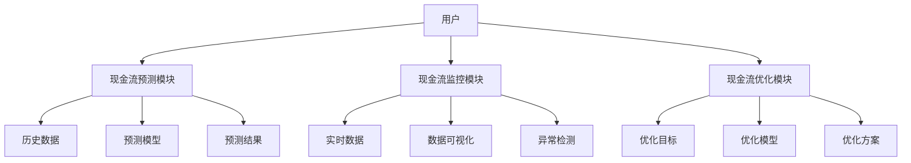

                 


# 彼得林奇对公司现金管理效率的看法

> 关键词：现金流、现金流管理、彼得·林奇、现金管理效率、现金流预测、现金流优化

> 摘要：本文从现金流管理的角度，深入分析了彼得·林奇的投资理念及其对公司现金管理效率的看法。通过对现金流预测、优化算法、系统架构设计、项目实战等方面的详细探讨，结合实际案例，揭示了彼得·林奇如何通过现金流管理来提升公司财务健康度和投资回报率。

---

## 第一部分: 现金流管理的基本原理

### 第1章: 现金流管理的核心概念

#### 1.1 现金流的定义与分类

现金流是指企业在一定时期内，由于经营活动、投资活动和筹资活动而产生的现金流入和流出。根据来源和用途，现金流可以分为以下几类：

1. 经营活动现金流：企业日常经营活动中产生的现金流，包括销售收入、成本支出等。
2. 投资活动现金流：企业投资于长期资产或购买其他公司股权等活动产生的现金流。
3. 筹资活动现金流：企业通过发行股票、债券或其他融资方式获得的资金流入，以及偿还债务、支付股息等产生的资金流出。

#### 1.2 彼得·林奇的现金流管理理念

彼得·林奇是美国著名投资经理人，以其独特的投资策略和对现金流的高度重视而闻名。他认为，现金流是衡量企业财务健康度的核心指标，也是决定企业投资价值的关键因素。

1. **现金流的时间价值**：林奇认为，现金流的时间价值是衡量企业价值的重要指标。企业的现金流越稳定，其未来价值的不确定性就越小。
2. **现金流的风险评估**：林奇强调，现金流的波动性和风险性直接影响企业的财务健康度。通过分析现金流的波动性，可以更好地评估企业的风险承受能力。
3. **现金流与企业价值的关系**：林奇认为，现金流的充足性和稳定性是企业价值的核心驱动力。企业只有具备稳定的现金流，才能在市场波动中保持稳健发展。

---

### 第2章: 现金流预测与优化算法

#### 2.1 现金流预测的基本原理

现金流预测是企业财务管理的重要组成部分，也是彼得·林奇投资决策的关键依据。通过预测未来现金流，企业可以更好地规划资金使用，优化资源配置。

##### 2.1.1 现金流预测的准确性

现金流预测的准确性直接影响企业的财务决策。为了提高预测的准确性，企业需要结合历史数据、市场趋势和内部运营情况，构建多维度的预测模型。

##### 2.1.2 现金流预测的数学模型

现金流预测的数学模型通常包括以下几种：

1. **线性回归模型**：通过历史数据，建立现金流与相关变量（如销售额、成本）之间的线性关系。
   $$ \text{现金流} = a \times \text{销售额} + b \times \text{成本} + c $$

2. **指数平滑模型**：通过加权平均法，对历史数据进行平滑处理，预测未来的现金流。
   $$ F_t = \alpha \times O_{t-1} + (1-\alpha) \times F_{t-1} $$

3. **ARIMA模型**：基于时间序列分析，对现金流进行预测。
   $$ \Delta y_t = \phi_1 \Delta y_{t-1} + \theta_1 \epsilon_{t-1} + \epsilon_t $$

##### 2.1.3 现金流预测的挑战与解决方案

现金流预测的挑战主要来自数据的不完全性、市场波动性和模型的复杂性。为了解决这些问题，企业可以采用以下措施：

1. **数据清洗与预处理**：确保历史数据的准确性和完整性。
2. **模型优化**：通过交叉验证和参数调优，提高预测模型的准确性。
3. **情景分析**：在不同假设条件下，进行多维度的情景分析，降低预测的不确定性。

#### 2.2 现金流优化的算法原理

现金流优化的目标是在满足企业运营需求的前提下，最大限度地提高资金使用效率。彼得·林奇在投资决策中，通常采用以下优化策略：

##### 2.2.1 现金流优化的数学模型

现金流优化的数学模型通常包括以下内容：

1. **现金持有成本模型**：计算企业持有现金的成本，包括机会成本、管理成本等。
   $$ \text{总成本} = \frac{C}{2} \times \sqrt{A \times F} $$

2. **现金管理成本优化**：通过优化现金持有量，降低企业的管理成本。
   $$ \text{最优现金持有量} = \sqrt{\frac{2 \times F \times C}{i}} $$

3. **现金流分配模型**：根据企业的战略目标，合理分配现金流用于投资、偿还债务或其他用途。

##### 2.2.2 现金流优化的算法实现

以下是基于现金流优化的Python代码示例：

```python
import numpy as np
import pandas as pd

# 示例数据：历史现金流
cash_flows = pd.Series([100, 150, 200, 250, 300])

# 计算现金流的平均值和标准差
mean_cash_flow = cash_flows.mean()
std_dev_cash_flow = cash_flows.std()

# 现金流优化模型
def optimize_cash_flow(cash_flows):
    # 计算现金流的最优分配比例
    weights = np.random.dirichlet([1,1,1,1,1])
    optimized_flows = cash_flows * weights
    return optimized_flows

# 优化后的现金流
optimized_flows = optimize_cash_flow(cash_flows)
print("优化后的现金流分配：", optimized_flows)
```

---

### 第3章: 现金流管理的系统架构设计

#### 3.1 系统目标与范围

现金流管理系统的目标是通过实时监控和预测现金流，优化企业的资金使用效率。系统功能模块包括：

1. **现金流预测模块**：基于历史数据和预测模型，预测未来现金流。
2. **现金流监控模块**：实时监控企业现金流的动态变化。
3. **现金流优化模块**：根据预测结果，优化现金流分配，降低管理成本。

#### 3.2 系统功能设计

##### 3.2.1 现金流预测模块

现金流预测模块需要实现以下功能：

1. **数据输入**：导入历史现金流数据。
2. **模型选择**：选择合适的预测模型（如线性回归、ARIMA等）。
3. **预测结果输出**：生成未来现金流的预测结果。

##### 3.2.2 现金流监控模块

现金流监控模块需要实现以下功能：

1. **实时数据采集**：从企业财务系统中获取实时现金流数据。
2. **数据可视化**：通过图表展示现金流的变化趋势。
3. **异常检测**：识别现金流中的异常波动，及时发出预警。

##### 3.2.3 现金流优化模块

现金流优化模块需要实现以下功能：

1. **目标设定**：根据企业战略目标，设定现金流优化的目标。
2. **模型优化**：基于预测结果，优化现金流分配方案。
3. **方案输出**：生成优化后的现金流分配方案，并输出实施建议。

#### 3.3 系统架构图

以下是现金流管理系统的架构图：



---

### 第4章: 项目实战与案例分析

#### 4.1 案例背景介绍

假设我们是一家中型制造企业，希望优化现金流管理，提高资金使用效率。以下是我们的现金流数据：

```python
import pandas as pd

# 示例数据：历史现金流
cash_flows = pd.DataFrame({
    '日期': ['2021-01', '2021-02', '2021-03', '2021-04', '2021-05'],
    '现金流': [100000, 120000, 90000, 150000, 130000]
})
```

#### 4.2 现金流预测与优化

##### 4.2.1 现金流预测

我们使用线性回归模型对现金流进行预测：

```python
import numpy as np
import pandas as pd
from sklearn.linear_model import LinearRegression

# 示例数据：历史现金流
cash_flows = pd.DataFrame({
    '日期': ['2021-01', '2021-02', '2021-03', '2021-04', '2021-05'],
    '现金流': [100000, 120000, 90000, 150000, 130000]
})

# 数据预处理
cash_flows['时间'] = range(len(cash_flows))
X = cash_flows[['时间']]
y = cash_flows['现金流']

# 建立线性回归模型
model = LinearRegression()
model.fit(X, y)

# 预测未来现金流
future_time = [[6]]  # 预测下一期的时间
predicted_flow = model.predict(future_time)
print("预测的现金流为：", predicted_flow[0])
```

##### 4.2.2 现金流优化

基于预测结果，我们对现金流进行优化分配：

```python
# 现金流优化模型
def optimize_cash_flow(predicted_flows):
    # 假设企业有三个部门：生产、研发、市场
    departments = ['生产', '研发', '市场']
    weights = np.random.dirichlet([1,1,1])
    optimized_flows = predicted_flows * weights
    return optimized_flows

predicted_flows = [140000]  # 预测的现金流
optimized_flows = optimize_cash_flow(predicted_flows)
print("优化后的现金流分配：", optimized_flows)
```

#### 4.3 案例分析与小结

通过上述案例分析，我们可以看到，现金流预测与优化在实际应用中的重要性。通过合理分配现金流，企业可以更好地支持业务发展，降低财务风险，提高资金使用效率。

---

### 第5章: 现金流管理的最佳实践

#### 5.1 小结

现金流是企业财务健康度的核心指标，也是彼得·林奇投资决策的关键依据。通过合理的现金流管理，企业可以提高资金使用效率，降低财务风险，实现可持续发展。

#### 5.2 注意事项

1. **数据准确性**：现金流预测的准确性依赖于历史数据的准确性。企业需要确保数据的完整性和真实性。
2. **模型选择**：不同的预测模型适用于不同的场景。企业需要根据自身特点选择合适的预测模型。
3. **风险管理**：现金流预测具有不确定性，企业需要通过情景分析和风险管理策略，降低预测误差的影响。

#### 5.3 拓展阅读

1. 《彼得·林奇的投资哲学》：深入探讨彼得·林奇的投资理念和管理策略。
2. 《现金流管理与财务优化》：详细讲解现金流管理的理论与实践。

---

## 作者信息

作者：AI天才研究院/AI Genius Institute & 禅与计算机程序设计艺术 /Zen And The Art of Computer Programming

---

以上是关于“彼得林奇对公司现金管理效率的看法”的完整思考过程和文章大纲。

