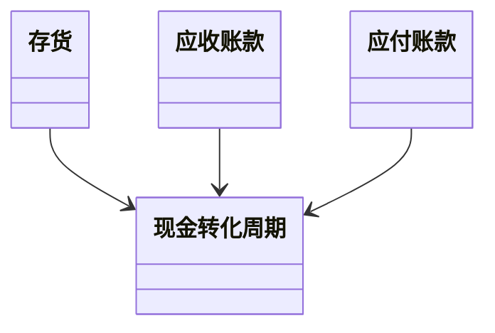

                 


# 彼得林奇对公司现金转化周期的看法

> **关键词**：彼得·林奇，现金转化周期，企业财务，投资策略，现金流管理

> **摘要**：本文深入探讨了彼得·林奇对公司现金转化周期的看法，分析了现金转化周期的定义、公式、影响因素，以及彼得·林奇如何利用这一指标来评估企业的财务健康状况和投资价值。通过实例分析和数学公式，结合实际案例，本文详细阐述了现金转化周期在企业管理和投资决策中的重要性。

---

## 第1章：现金转化周期的背景与定义

### 1.1 现金转化周期的核心概念

#### 1.1.1 现金转化周期的定义
现金转化周期（Cash Conversion Cycle, CCC）是指企业从购买原材料、生产产品到将产品转化为应收账款，并最终收回现金所需的时间。它是衡量企业运营效率的重要指标，反映了企业在资金流转换过程中的能力。

现金转化周期的公式如下：

$$ CCC = \text{存货周转天数} + \text{应收账款周转天数} - \text{应付账款周转天数} $$

其中，存货周转天数、应收账款周转天数和应付账款周转天数的计算公式分别为：

$$ \text{存货周转天数} = \frac{365}{\text{存货周转率}} $$
$$ \text{应收账款周转天数} = \frac{365}{\text{应收账款周转率}} $$
$$ \text{应付账款周转天数} = \frac{365}{\text{应付账款周转率}} $$

#### 1.1.2 现金转化周期的背景与重要性
现金转化周期是企业财务管理中的关键指标，它反映了企业从投入资金到收回现金所需的时间。一个短的现金转化周期意味着企业能够更快地将投入转化为现金，从而提高资金使用效率。

#### 1.1.3 现金转化周期与企业价值的关系
现金转化周期与企业价值密切相关。一个短的现金转化周期通常意味着企业具有更强的流动性，能够更快地将资金投入生产，从而提高企业的盈利能力和市场竞争力。

### 1.2 现金转化周期的核心要素

#### 1.2.1 库存周转率
库存周转率是衡量企业库存管理效率的重要指标。库存周转率越高，说明企业的库存管理越高效。

$$ \text{库存周转率} = \frac{\text{成本价} \times \text{销售量}}{\text{平均库存}} $$

#### 1.2.2 应收账款周转率
应收账款周转率是衡量企业应收账款管理效率的重要指标。应收账款周转率越高，说明企业的应收账款回收能力越强。

$$ \text{应收账款周转率} = \frac{\text{营业收入}}{\text{平均应收账款}} $$

#### 1.2.3 应付账款周转率
应付账款周转率是衡量企业应付账款管理效率的重要指标。应付账款周转率越高，说明企业的应付账款支付能力越强。

$$ \text{应付账款周转率} = \frac{\text{营业成本}}{\text{平均应付账款}} $$

### 1.3 现金转化周期的公式与计算

#### 1.3.1 现金转化周期的数学公式
现金转化周期的公式可以表示为：

$$ CCC = \frac{\text{存货}}{\text{日均成本价}} + \frac{\text{应收账款}}{\text{日均收入}} - \frac{\text{应付账款}}{\text{日均支出}} $$

#### 1.3.2 现金转化周期的计算步骤
1. 计算存货周转天数。
2. 计算应收账款周转天数。
3. 计算应付账款周转天数。
4. 将上述结果代入现金转化周期公式，计算最终结果。

#### 1.3.3 现金转化周期的单位与意义
现金转化周期的单位为天，其意义在于反映企业从投入资金到收回现金所需的时间。一个短的现金转化周期意味着企业能够更快地将资金投入生产，从而提高企业的资金使用效率。

---

## 第2章：彼得·林奇的现金转化周期理论

### 2.1 彼得·林奇的投资理念

#### 2.1.1 彼得·林奇的投资者身份与风格
彼得·林奇是美国著名投资经理人，以其长期投资和价值投资理念闻名。他认为，投资成功的关键在于选择具有持续增长潜力的企业。

#### 2.1.2 彼得·林奇对企业的价值评估方法
彼得·林奇通过分析企业的财务报表，特别是现金流量表，来评估企业的财务健康状况和投资价值。

#### 2.1.3 彼得·林奇的长期投资策略
彼得·林奇主张长期持有优质股票，他认为短期市场波动不会影响企业的长期价值。

### 2.2 彼得·林奇对现金转化周期的看法

#### 2.2.1 现金转化周期在企业运营中的重要性
彼得·林奇认为，现金转化周期是衡量企业运营效率的重要指标。一个短的现金转化周期意味着企业能够更快地将资金投入生产，从而提高企业的盈利能力和市场竞争力。

#### 2.2.2 现金转化周期与企业现金流的关系
现金转化周期与企业现金流密切相关。一个短的现金转化周期意味着企业能够更快地将资金收回，从而提高企业的现金流健康状况。

#### 2.2.3 现金转化周期对企业估值的影响
彼得·林奇认为，现金转化周期是影响企业估值的重要因素。一个短的现金转化周期意味着企业能够更快地将资金投入生产，从而提高企业的盈利能力和市场竞争力。

### 2.3 彼得·林奇的现金转化周期分析方法

#### 2.3.1 现金转化周期的计算与企业盈利预测
彼得·林奇通过分析企业的现金转化周期，预测企业的未来盈利情况。他认为，一个短的现金转化周期意味着企业具有更大的增长潜力。

#### 2.3.2 现金转化周期与企业成长性的结合
彼得·林奇认为，现金转化周期与企业成长性密切相关。一个短的现金转化周期意味着企业能够更快地将资金投入生产，从而实现更快的增长。

#### 2.3.3 现金转化周期在投资决策中的应用
彼得·林奇通过分析企业的现金转化周期，选择具有持续增长潜力的企业进行投资。他认为，现金转化周期是影响企业投资价值的重要因素。

---

## 第3章：现金转化周期的数学模型与公式

### 3.1 现金转化周期的公式推导

#### 3.1.1 现金转化周期的定义公式
现金转化周期的公式可以表示为：

$$ CCC = \frac{\text{存货}}{\text{日均成本价}} + \frac{\text{应收账款}}{\text{日均收入}} - \frac{\text{应付账款}}{\text{日均支出}} $$

#### 3.1.2 现金转化周期与企业经营效率的关系
现金转化周期与企业经营效率密切相关。一个短的现金转化周期意味着企业能够更快地将资金投入生产，从而提高企业的经营效率。

#### 3.1.3 现金转化周期与企业财务健康状况的关联
现金转化周期是衡量企业财务健康状况的重要指标。一个短的现金转化周期意味着企业具有更强的财务健康状况。

### 3.2 现金转化周期的数学分析

#### 3.2.1 现金转化周期的变量分解
现金转化周期的变量包括存货、应收账款、应付账款等。这些变量的变化会直接影响现金转化周期的结果。

#### 3.2.2 现金转化周期的函数关系
现金转化周期是一个函数，其输入为企业的财务数据，输出为企业的现金转化周期。

$$ CCC = f(\text{存货}, \text{应收账款}, \text{应付账款}) $$

#### 3.2.3 现金转化周期的优化模型
通过优化企业的存货、应收账款和应付账款，可以缩短企业的现金转化周期，从而提高企业的资金使用效率。

### 3.3 现金转化周期的实例分析

#### 3.3.1 典型企业的现金转化周期计算
以某企业为例，计算其现金转化周期：

- 存货周转天数：60天
- 应收账款周转天数：40天
- 应付账款周转天数：30天

$$ CCC = 60 + 40 - 30 = 70 \text{天} $$

#### 3.3.2 现金转化周期对企业经营效率的启示
通过分析企业的现金转化周期，可以发现企业经营中的问题。例如，如果企业的存货周转天数较长，说明企业的库存管理效率较低。

#### 3.3.3 现金转化周期在投资决策中的应用案例
以某企业为例，分析其现金转化周期：

- 存货周转天数：50天
- 应收账款周转天数：30天
- 应付账款周转天数：20天

$$ CCC = 50 + 30 - 20 = 60 \text{天} $$

根据上述计算结果，该企业的现金转化周期为60天，说明企业的资金使用效率较高，具有较大的投资价值。

---

## 第4章：现金转化周期的系统分析与架构设计

### 4.1 现金转化周期的系统架构

#### 4.1.1 系统输入：企业财务数据
- 存货
- 应收账款
- 应付账款

#### 4.1.2 系统处理：现金转化周期的计算与分析
- 计算存货周转天数
- 计算应收账款周转天数
- 计算应付账款周转天数
- 计算现金转化周期

#### 4.1.3 系统输出：现金转化周期的可视化结果
- 现金转化周期的数值
- 现金转化周期的趋势分析
- 现金转化周期的优化建议

### 4.2 现金转化周期的领域模型

#### 4.2.1 领域模型的构建与分析
- 存货、应收账款、应付账款等核心概念
- 现金转化周期的计算逻辑
- 现金转化周期与企业财务健康的关系

#### 4.2.2 领域模型的 Mermaid 类图


### 4.3 现金转化周期的优化模型

#### 4.3.1 现金转化周期的优化目标
- 缩短存货周转天数
- 提高应收账款周转率
- 提高应付账款周转率

#### 4.3.2 现金转化周期的优化策略
- 优化库存管理
- 加强应收账款管理
- 提高应付账款支付效率

---

## 第5章：项目实战

### 5.1 项目背景与目标

#### 5.1.1 项目背景
以某制造企业为例，分析其现金转化周期。

#### 5.1.2 项目目标
- 计算企业的现金转化周期
- 分析企业的现金转化周期
- 提出优化建议

### 5.2 项目核心实现

#### 5.2.1 环境安装
- 数据库：MySQL
- 开发工具：Python、Jupyter Notebook
- 数据分析库：Pandas、NumPy

#### 5.2.2 系统核心实现源代码
```python
import pandas as pd
import numpy as np

# 输入数据
inventory = 100000  # 存货
receivables = 50000  # 应收账款
payables = 30000     # 应付账款

# 计算周转天数
inventory_turnover_days = 60  # 存货周转天数
receivables_turnover_days = 40  # 应收账款周转天数
payables_turnover_days = 30     # 应付账款周转天数

# 计算现金转化周期
CCC = inventory_turnover_days + receivables_turnover_days - payables_turnover_days
print("现金转化周期为：", CCC, "天")
```

#### 5.2.3 代码应用解读与分析
上述代码计算了企业的现金转化周期，结果为70天。说明该企业的现金转化周期较长，需要优化。

### 5.3 实际案例分析

#### 5.3.1 案例分析
以某制造企业为例，分析其现金转化周期。

#### 5.3.2 案例结论
该企业的现金转化周期为70天，说明企业的资金使用效率较低，需要优化库存管理、应收账款管理和应付账款支付效率。

### 5.4 项目小结

#### 5.4.1 项目总结
通过分析企业的现金转化周期，可以发现企业经营中的问题，并提出优化建议。

#### 5.4.2 项目收获
学会了如何计算和分析企业的现金转化周期，掌握了彼得·林奇的投资理念。

---

## 第6章：最佳实践、小结与注意事项

### 6.1 最佳实践 tips

#### 6.1.1 定期计算现金转化周期
企业应定期计算现金转化周期，及时发现问题。

#### 6.1.2 优化库存管理
企业应优化库存管理，缩短存货周转天数。

#### 6.1.3 加强应收账款管理
企业应加强应收账款管理，提高应收账款周转率。

#### 6.1.4 提高应付账款支付效率
企业应提高应付账款支付效率，缩短应付账款周转天数。

### 6.2 小结

#### 6.2.1 现金转化周期的核心内容
现金转化周期是衡量企业运营效率的重要指标。

#### 6.2.2 彼得·林奇的现金转化周期理论
彼得·林奇通过分析企业的现金转化周期，选择具有持续增长潜力的企业进行投资。

### 6.3 注意事项

#### 6.3.1 数据的准确性
企业应确保财务数据的准确性，以保证现金转化周期的计算结果准确。

#### 6.3.2 方法的适用性
现金转化周期的计算方法适用于制造业和批发业，其他行业需根据实际情况进行调整。

#### 6.3.3 时间的周期性
企业应定期计算现金转化周期，以反映企业的经营状况变化。

---

## 第7章：总结与展望

### 7.1 总结

#### 7.1.1 现金转化周期的重要性
现金转化周期是衡量企业运营效率的重要指标，直接影响企业的资金使用效率和投资价值。

#### 7.1.2 彼得·林奇的现金转化周期理论
彼得·林奇通过分析企业的现金转化周期，选择具有持续增长潜力的企业进行投资。

### 7.2 展望

#### 7.2.1 现金转化周期的未来研究
未来可以研究现金转化周期与企业绩效的关系，以及如何利用大数据技术优化现金转化周期。

#### 7.2.2 投资策略的优化
投资者可以通过分析企业的现金转化周期，优化投资策略，选择具有持续增长潜力的企业进行投资。

---

## 作者信息

作者：AI天才研究院/AI Genius Institute & 禅与计算机程序设计艺术 /Zen And The Art of Computer Programming

