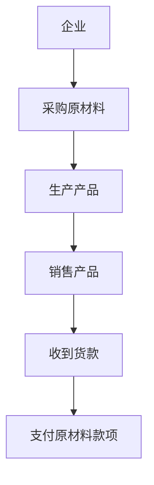
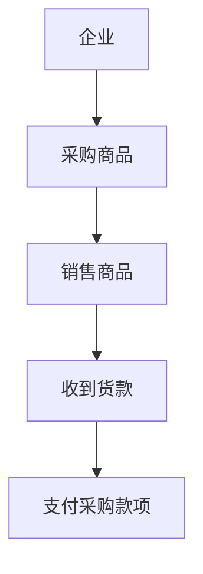
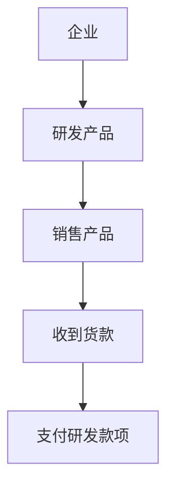
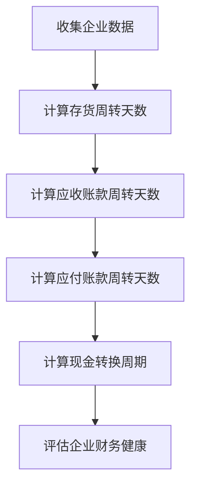
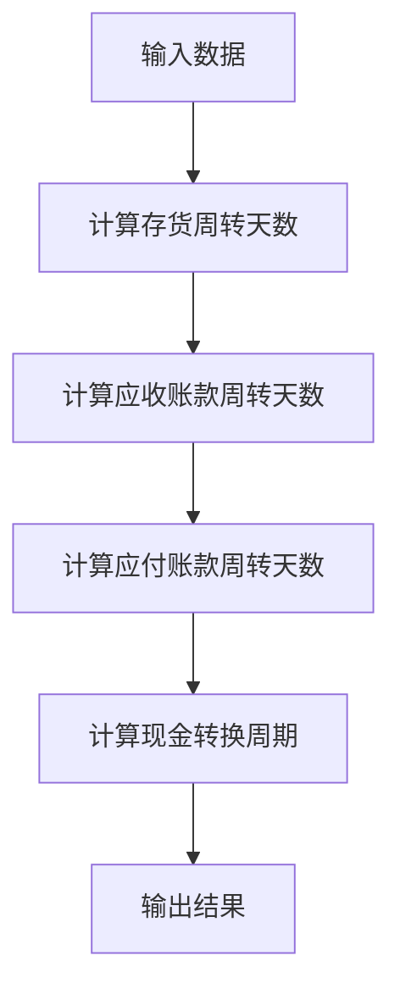
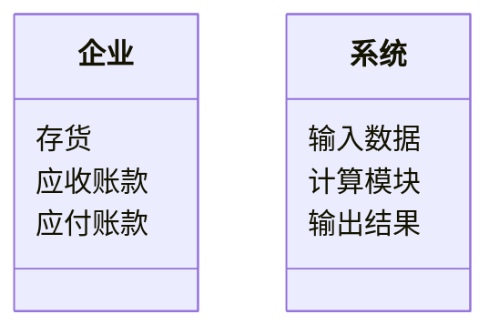
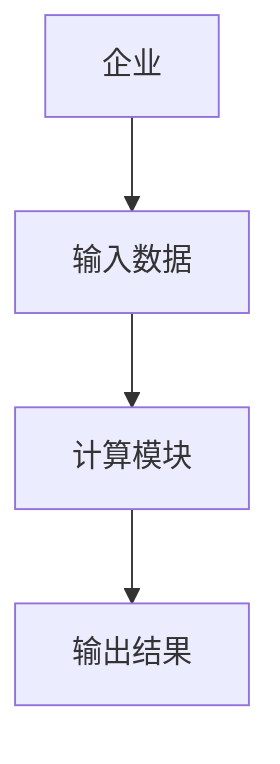

                 


# 彼得林奇对公司现金转换周期的跨行业比较研究

## 关键词：
- 彼得·林奇，现金转换周期，跨行业比较，投资策略，企业财务分析

## 摘要：
本文深入探讨了彼得·林奇如何利用现金转换周期在不同行业中进行比较研究。通过分析现金转换周期的定义、计算方法及其在不同行业的特点，结合彼得·林奇的投资哲学和实际案例，揭示了现金转换周期对企业财务健康和投资决策的重要影响。文章还详细讲解了现金转换周期的算法原理，并通过系统架构设计和项目实战展示了其在跨行业分析中的实际应用。

---

## 第一部分：现金转换周期的背景与概念

### 第1章：现金转换周期的定义与计算方法

#### 1.1 现金转换周期的定义
现金转换周期（Cash Conversion Cycle，简称CCC）是企业从购买原材料到最终收到销售货款的时间跨度，反映了企业的运营效率和资金周转能力。现金转换周期越短，企业的资金使用效率越高，财务健康状况越好。

**计算公式**：
$$
\text{现金转换周期} = \text{存货周转天数} + \text{应收账款周转天数} - \text{应付账款周转天数}
$$

其中：
- 存货周转天数：$$\frac{\text{平均存货}}{\text{销售成本/365天}}$$
- 应收账款周转天数：$$\frac{\text{平均应收账款}}{\text{销售收入/365天}}$$
- 应付账款周转天数：$$\frac{\text{平均应付账款}}{\text{采购成本/365天}}$$

#### 1.2 现金转换周期的核心概念
现金转换周期的核心在于企业的三要素：存货、应收账款和应付账款。三者之间的关系如下：

**概念属性特征对比表**：

| **要素**       | **定义**                                      | **影响因素**                          | **目标**                              |
|----------------|-----------------------------------------------|---------------------------------------|---------------------------------------|
| 存货           | 企业尚未售出的产品或原材料                   | 采购周期、生产效率、库存管理策略     | 最小化库存，减少资金占用               |
| 应收账款       | 企业因销售而尚未收回的款项                   | 信用政策、客户付款习惯、账期管理       | 最大化账期，缩短收款周期               |
| 应付账款       | 企业尚未支付的采购款项                       | 供应商信用政策、付款周期、采购管理     | 最大化账期，延迟付款                  |

**ER实体关系图**：

```mermaid
er
    企业
    存货
    应收账款
    应付账款
    供应商
    客户
    财务部门
    采购部门
    销售部门
    产品
```

---

### 第2章：现金转换周期的行业差异分析

#### 2.1 制造业的现金转换周期特点
制造业的现金转换周期通常较长，主要由于存货周转天数较长，而应收账款周转天数和应付账款周转天数相对稳定。

**流程图**：



制造业的现金转换周期计算：

$$
\text{CCC} = \text{存货周转天数（60天）} + \text{应收账款周转天数（45天）} - \text{应付账款周转天数（30天）} = 75 \text{天}
$$

#### 2.2 零售业的现金转换周期特点
零售业的现金转换周期较短，主要由于存货周转天数较短，而应收账款周转天数较长。

**流程图**：



零售业的现金转换周期计算：

$$
\text{CCC} = \text{存货周转天数（30天）} + \text{应收账款周转天数（60天）} - \text{应付账款周转天数（45天）} = 45 \text{天}
$$

#### 2.3 科技行业的现金转换周期特点
科技行业的现金转换周期因公司而异，通常由于应收账款周转天数较长，而存货周转天数和应付账款周转天数相对稳定。

**流程图**：



科技行业的现金转换周期计算：

$$
\text{CCC} = \text{存货周转天数（45天）} + \text{应收账款周转天数（75天）} - \text{应付账款周转天数（60天）} = 60 \text{天}
$$

---

## 第二部分：彼得·林奇的现金转换周期分析方法

### 第3章：彼得·林奇的投资哲学与现金转换周期

#### 3.1 彼得·林奇的投资哲学概述
彼得·林奇认为，现金转换周期是评估企业财务健康的重要指标。他强调，企业应通过优化存货、应收账款和应付账款的周转天数来缩短现金转换周期。

**投资策略**：
1. 优先投资现金转换周期较短的企业。
2. 关注企业的三要素（存货、应收账款、应付账款）的优化情况。
3. 通过现金转换周期预测企业的未来表现。

#### 3.2 彼得·林奇的现金转换周期分析方法
彼得·林奇通过以下步骤分析企业的现金转换周期：

**步骤流程图**：



---

### 第4章：彼得·林奇的现金转换周期分析案例

#### 4.1 美国制造业企业的现金转换周期分析
以某美国制造企业为例：

**计算公式**：

$$
\text{CCC} = \text{存货周转天数（60天）} + \text{应收账款周转天数（45天）} - \text{应付账款周转天数（30天）} = 75 \text{天}
$$

**结论**：
该企业的现金转换周期为75天，属于行业平均水平，但仍有优化空间。

---

## 第三部分：现金转换周期的系统分析与架构设计方案

### 第5章：现金转换周期的算法原理

#### 5.1 算法原理
现金转换周期的计算基于存货、应收账款和应付账款的周转天数。算法步骤如下：

**流程图**：



#### 5.2 算法实现
以下是Python代码实现：

```python
def calculate_cash_conversion_cycle(inventory_turnover_days, receivables_turnover_days, payables_turnover_days):
    return inventory_turnover_days + receivables_turnover_days - payables_turnover_days

# 示例数据
inventory_turnover_days = 60
receivables_turnover_days = 45
payables_turnover_days = 30

ccc = calculate_cash_conversion_cycle(inventory_turnover_days, receivables_turnover_days, payables_turnover_days)
print(f"现金转换周期：{ccc}天")
```

---

### 第6章：现金转换周期的系统架构设计

#### 6.1 系统功能设计
**领域模型**：



#### 6.2 系统架构设计
**系统架构图**：



---

### 第7章：项目实战

#### 7.1 环境配置
安装Python和相关库：

```bash
pip install pandas numpy matplotlib
```

#### 7.2 核心实现源代码
以下是Python代码实现：

```python
import pandas as pd
import numpy as np
import matplotlib.pyplot as plt

# 示例数据
data = {
    '存货周转天数': [60, 45, 30],
    '应收账款周转天数': [45, 60, 75],
    '应付账款周转天数': [30, 45, 60],
    '行业': ['制造业', '零售业', '科技行业']
}

df = pd.DataFrame(data)

# 计算现金转换周期
df['现金转换周期'] = df['存货周转天数'] + df['应收账款周转天数'] - df['应付账款周转天数']

# 可视化
plt.figure(figsize=(10, 6))
plt.bar(df['行业'], df['现金转换周期'])
plt.title('不同行业的现金转换周期')
plt.xlabel('行业')
plt.ylabel('现金转换周期（天）')
plt.show()
```

#### 7.3 实际案例分析
以制造业为例：

- 存货周转天数：60天
- 应收账款周转天数：45天
- 应付账款周转天数：30天
- 现金转换周期：75天

**结论**：
该制造业企业的现金转换周期为75天，高于行业平均水平，需要优化存货和应收账款的周转天数。

---

## 第四部分：总结与展望

### 第8章：总结

#### 8.1 最佳实践 tips
1. 企业应定期计算现金转换周期，评估财务健康。
2. 通过优化存货、应收账款和应付账款的周转天数，缩短现金转换周期。
3. 投资者应关注企业的现金转换周期，选择周期较短的企业进行投资。

#### 8.2 小结
现金转换周期是评估企业财务健康的重要指标，跨行业比较为企业提供了优化的方向。彼得·林奇的投资哲学为企业管理者提供了有益的启示。

### 第9章：注意事项

#### 9.1 注意事项
1. 数据的准确性是计算现金转换周期的关键。
2. 不同行业的现金转换周期特点不同，需结合行业特性进行分析。
3. 现金转换周期的优化需要综合考虑企业的三要素。

### 第10章：拓展阅读

#### 10.1 拓展阅读
1. 彼得·林奇的《选股的艺术》
2. 企业财务分析的相关书籍
3. 跨行业比较的其他财务指标研究

---

## 作者：AI天才研究院/AI Genius Institute & 禅与计算机程序设计艺术 /Zen And The Art of Computer Programming

---

通过本文的详细分析，读者可以全面了解彼得·林奇如何利用现金转换周期在不同行业中进行比较研究，并掌握实际应用的方法和技巧。

