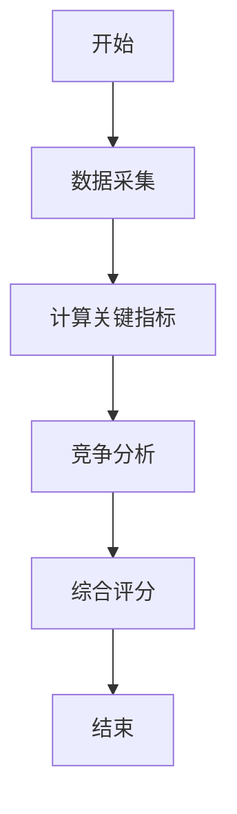

                 


```markdown
# 彼得林奇对公司盈利模式可持续性的判断

## 关键词：彼得·林奇，盈利模式，可持续性，投资分析，企业战略

## 摘要：本文深入探讨了彼得·林奇在判断公司盈利模式可持续性方面的方法和见解，结合技术背景，分析了其投资理念如何应用于现代企业的盈利模式分析。通过详细的分析框架和实例，揭示了盈利模式的判断对投资决策的重要性。

---

## 第一部分: 盈利模式的背景与核心概念

### 第1章: 彼得·林奇的投资哲学与盈利模式

#### 1.1 彼得·林奇的投资哲学
彼得·林奇以价值投资闻名，注重长期稳健的投资策略，而非短期波动。他认为，投资的核心在于理解企业的盈利模式，判断其是否具备可持续性。

#### 1.2 盈利模式的定义与分类
- **定义**：盈利模式是企业通过何种方式获取收入和利润的结构。
- **分类**：
  - 产品型：依赖销售产品。
  - 服务型：依赖提供服务。
  - 平台型：依赖平台撮合交易。
  - 订阅型：依赖定期订阅收入。

#### 1.3 盈利模式的可持续性标准
- **稳定性**：收入来源是否稳定。
- **可扩展性**：是否能够扩大规模。
- **创新性**：是否能够适应市场变化。

### 第2章: 盈利模式的外部环境分析

#### 2.1 行业环境的影响
分析行业周期、竞争程度和市场容量，判断企业的盈利模式是否具备长期竞争优势。

#### 2.2 市场需求的变化
通过市场调研和数据分析，判断市场需求是否能够支撑企业的盈利模式。

#### 2.3 竞争格局与公司定位
分析企业在市场中的定位，判断其盈利模式是否具有独特性和竞争力。

### 第3章: 盈利模式的系统架构设计

#### 3.1 ER实体关系图
- 实体：公司、收入来源、成本结构、盈利能力。
- 关系：收入来源与公司的关联，成本结构与收入来源的关联，盈利能力的计算。

#### 3.2 系统架构图
- 层次结构：数据层、业务逻辑层、用户界面层。
- 模块：数据采集、分析处理、结果展示。

#### 3.3 接口设计
- 数据接口：收入数据接口、成本数据接口、利润计算接口。
- API设计：RESTful API，用于数据交互。

---

## 第二部分: 盈利模式的数学模型与算法

### 第4章: 盈利能力分析公式

#### 4.1 净利润率公式
$$\text{利润率} = \frac{\text{净利润}}{\text{收入}} \times 100\%$$

#### 4.2 盈利模式的可持续性指数
$$S = \frac{R}{C} \times \frac{E}{T}$$
其中：
- R：收入增长率
- C：成本占比
- E：企业效率
- T：市场趋势

### 第5章: 可持续性判断算法

#### 5.1 算法步骤
1. 数据采集：收集公司过去5年的财务数据。
2. 计算关键指标：利润率、收入增长率、成本占比。
3. 竞争分析：判断企业在市场中的位置。
4. 综合评分：根据指标计算可持续性指数。

#### 5.2 算法流程图


---

## 第三部分: 项目实战与案例分析

### 第6章: 项目实战

#### 6.1 环境安装
- 安装Python和相关库（pandas, numpy）。
- 数据源：公开财务数据。

#### 6.2 核心代码实现
```python
import pandas as pd

# 数据采集
df = pd.read_csv('financial_data.csv')

# 计算利润率
profit_margin = df['净利润'] / df['收入'] * 100

# 可持续性指数
s = (profit_margin.mean() / (df['成本'].mean() / df['收入'].mean())) * (df['收入增长率'].mean() / df['市场趋势'].mean())
```

#### 6.3 案例分析
以某公司为例，分析其盈利模式的可持续性，展示如何通过代码计算出结果，并解读结果。

---

## 第四部分: 总结与展望

### 第7章: 总结与展望

#### 7.1 本章总结
彼得·林奇的盈利模式分析方法结合了技术与商业，提供了判断企业可持续性的有效工具。

#### 7.2 未来展望
随着技术进步，盈利模式分析将更加精准，数据驱动的投资决策将成为趋势。

---

## 作者：AI天才研究院/AI Genius Institute & 禅与计算机程序设计艺术 /Zen And The Art of Computer Programming
```

