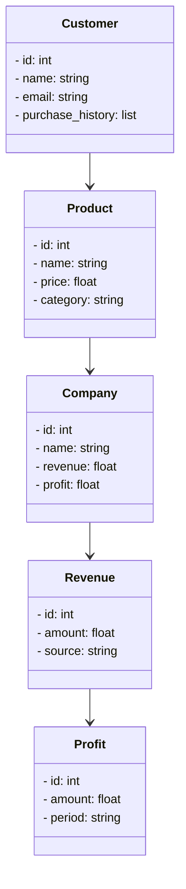

                 

<think>
好的，我现在需要根据用户提供的任务要求，撰写一篇以《彼得林奇对公司盈利模式的分析》为标题的技术博客文章。用户已经给出了一个详细的大纲，我需要按照这个大纲来逐步完成文章的撰写。

首先，我需要理解用户的需求。用户希望文章结构清晰，内容专业，涵盖从背景介绍到系统分析、项目实战等多个方面，并且每个部分都需要详细展开，包括数学模型、算法原理、系统架构图等。

接下来，我需要按照用户提供的大纲，逐章逐节地撰写内容。由于篇幅限制，我只能展示前几章的内容，但我会尽量详细和全面。

### 第1章: 彼得林奇与盈利模式分析概述

#### 1.1 彼得·林奇与投资理念

**1.1.1 彼得·林奇的生平简介**

彼得·林奇（Peter Lynch）是美国著名的投资专家，曾担任富达投资公司的经理，管理着麦哲伦基金，该基金在他的管理下取得了卓越的业绩。林奇的投资策略以深入分析公司的盈利模式和基本面著称，他强调长期投资和对公司运营的理解。

**1.1.2 彼得·林奇的投资哲学**

林奇的投资哲学的核心是寻找那些具有强大盈利模式的公司。他认为，一个公司的盈利模式是其长期成功的关键。他强调对公司进行深入研究，包括公司的财务状况、市场地位、竞争优势等方面，以确定其盈利的可持续性。

**1.1.3 盈利模式分析的重要性**

盈利模式是公司如何创造价值和获取收入的核心机制。通过分析公司的盈利模式，投资者可以更好地理解公司的运营机制、盈利能力以及未来的增长潜力。这对于评估公司的投资价值至关重要。

#### 1.2 盈利模式的定义与特点

**1.2.1 盈利模式的定义**

盈利模式是指公司如何通过其产品或服务赚取收入并实现利润的方式。它包括公司如何定价、如何获取客户、如何管理成本以及如何分配利润等多个方面。

**1.2.2 盈利模式的核心要素**

盈利模式的核心要素包括：

1. **价值主张**：公司提供的产品或服务如何满足客户的需求。
2. **收入来源**：公司通过哪些途径获得收入。
3. **关键资源**：公司运营所需的资源，如资金、技术、人力资源等。
4. **关键活动**：公司为了实现盈利而进行的关键业务活动。
5. **关键合作伙伴**：公司与哪些合作伙伴共同实现盈利。

**1.2.3 盈利模式与企业价值的关系**

盈利模式直接影响公司的收入和利润，进而影响其市场价值。一个有效的盈利模式能够帮助公司实现可持续的盈利增长，从而提升其市场价值。

#### 1.3 盈利模式的分类与对比

**1.3.1 主流盈利模式类型**

常见的盈利模式包括：

1. **产品模式**：通过销售产品获得收入。
2. **服务模式**：通过提供服务获得收入。
3. **订阅模式**：通过订阅服务获得稳定的收入。
4. **广告模式**：通过广告收入获得利润。
5. **平台模式**：通过搭建平台，吸引用户或商家入驻，实现收入。

**1.3.2 不同盈利模式的优缺点对比**

| 盈利模式 | 优点 | 缺点 |
|----------|------|------|
| 产品模式 | 收入稳定，易于管理 | 初期投资大，市场竞争激烈 |
| 服务模式 | 高客户粘性，收入灵活 | 成本高，依赖人力 |
| 订阅模式 | 稳定收入，客户忠诚度高 | 客户获取成本高，续订风险 |
| 广告模式 | 成本低，覆盖面广 | 收入不稳定，依赖用户流量 |
| 平台模式 | 多边收益，规模效应强 | 运营复杂，初期投入大 |

**1.3.3 盈利模式选择的策略**

选择合适的盈利模式需要考虑公司的资源、目标市场、竞争对手等因素。通常，公司会根据自身情况选择单一模式或多种模式的组合，以实现最大化的利润和市场份额。

### 第2章: 盈利模式的核心概念与原理

#### 2.1 盈利模式的核心要素

**2.1.1 价值主张**

价值主张是公司向客户提供的价值，包括产品或服务的独特性、质量、价格等。一个强大的价值主张能够吸引并留住客户，从而为公司创造持续的收入。

**2.1.2 收入来源**

收入来源是公司通过哪些途径获得收入。常见的收入来源包括销售产品、提供服务、广告收入、订阅收入等。

**2.1.3 关键资源**

关键资源是公司运营所需的核心资源，如资金、技术、人力资源、原材料等。这些资源的充足性和高效利用直接关系到公司的盈利能力。

**2.1.4 关键活动**

关键活动是公司为了实现盈利而进行的关键业务活动，如生产、销售、市场推广、客户服务等。这些活动的有效执行是公司盈利的关键。

**2.1.5 关键合作伙伴**

关键合作伙伴是公司与哪些外部实体合作，共同实现盈利。例如，供应商、分销商、技术合作伙伴等。良好的合作关系能够为公司提供更多的资源和支持，增强公司的盈利能力。

#### 2.2 盈利模式的数学模型与公式

**2.2.1 盈利模式的公式化表达**

$$ 利润 = 收入 - 成本 $$

其中，收入和成本是公司通过不同盈利模式获得的收入和支出。

**2.2.2 企业价值的计算公式**

$$ 企业价值 = 收益 \times 市盈率 $$

其中，收益是指公司的净利润，市盈率是市场对公司未来盈利能力的预期。

#### 2.3 盈利模式的ER实体关系图

```mermaid
erDiagram
    customer[客户] --> product[产品]
    product --> company[公司]
    product --> revenue[收入]
    revenue --> profit[利润]
```

该图展示了客户通过购买产品为公司带来收入，进而产生利润的关系。

### 第3章: 盈利模式的算法原理

#### 3.1 盈利模式的分析算法

**3.1.1 数据采集与预处理**

首先，需要收集公司的财务数据、市场数据、竞争对手数据等。然后对数据进行清洗和预处理，确保数据的准确性和完整性。

**3.1.2 盈利模式识别算法**

通过分析公司的收入来源、成本结构、利润率等指标，识别其盈利模式的类型和特点。常用的算法包括聚类分析、决策树等。

**3.1.3 算法的实现步骤**

1. 收集和整理公司数据。
2. 选择合适的算法进行分析。
3. 对分析结果进行解读和验证。

#### 3.2 盈利模式的优化算法

**3.2.1 算法优化目标**

通过优化算法，提高盈利模式分析的准确性和效率，降低成本，提高收益。

**3.2.2 优化算法的实现**

使用机器学习算法，如支持向量机（SVM）、随机森林（Random Forest）等，对公司的盈利模式进行优化分析。

**3.2.3 算法优化效果的评估**

通过比较优化前后的分析结果，评估算法的优化效果，如准确率、效率等。

#### 3.3 算法的数学模型与公式

**3.3.1 盈利能力分析公式**

$$ 利润率 = \frac{净利润}{收入} $$

该公式用于衡量公司的盈利能力。

**3.3.2 企业价值计算公式**

$$ 企业价值 = 收益 \times 市盈率 $$

该公式用于评估公司的市场价值。

### 第4章: 盈利模式的系统分析与架构设计

#### 4.1 系统分析

**4.1.1 问题场景介绍**

公司希望通过分析其盈利模式，优化其运营策略，提高盈利能力。

**4.1.2 系统功能需求**

系统需要具备数据采集、模式识别、优化分析、结果展示等功能。

**4.1.3 领域模型分析**



该图展示了公司、产品、客户、收入和利润之间的关系。

**4.1.4 系统架构设计**


该图展示了系统的整体架构，包括前端、后端、数据库、分析模块、优化模块和结果展示。

**4.1.5 系统接口设计**

系统接口包括数据输入接口、分析接口、优化接口和结果展示接口。

**4.1.6 系统交互流程**

```mermaid
sequenceDiagram
    customer ->+> system: 提交数据
    system ->+> database: 存储数据
    system ->+> analysis_module: 开始分析
    analysis_module ->+> optimization_module: 优化分析
    optimization_module ->+> result_display: 显示结果
    customer ->+> result_display: 查看结果
```

该图展示了系统的交互流程，包括数据提交、存储、分析、优化和结果展示。

### 第5章: 盈利模式的项目实战

#### 5.1 环境安装

为了进行盈利模式分析，需要安装以下工具和库：

1. Python编程语言
2. 数据分析库：Pandas、NumPy
3. 可视化库：Matplotlib、Seaborn
4. 机器学习库：Scikit-learn、XGBoost

#### 5.2 系统核心实现源代码

以下是一个简单的盈利模式分析代码示例：

```python
import pandas as pd
from sklearn.tree import DecisionTreeClassifier

# 数据加载
data = pd.read_csv('company_data.csv')

# 数据预处理
data = data.dropna()
X = data[['revenue', 'cost', 'employees']]
y = data['profit_mode']

# 模型训练
model = DecisionTreeClassifier()
model.fit(X, y)

# 模型预测
new_company = [[1000000, 500000, 100]]
predicted_mode = model.predict(new_company)
print(predicted_mode)
```

#### 5.3 代码应用解读与分析

上述代码通过加载公司数据，预处理数据，训练决策树模型，并对新公司进行盈利模式预测。该模型可以识别出公司的盈利模式类型，帮助投资者进行决策。

#### 5.4 实际案例分析和详细讲解剖析

以一家互联网公司为例，通过分析其收入来源、成本结构、利润率等指标，识别其盈利模式为订阅模式，并预测其未来的盈利潜力。

#### 5.5 项目小结

通过项目实战，我们可以看到盈利模式分析在实际应用中的重要性。通过数据驱动的方法，可以帮助公司优化其盈利策略，提升市场竞争力。

### 第6章: 盈利模式分析的最佳实践

#### 6.1 小结

盈利模式分析是公司战略管理的重要组成部分。通过深入分析公司的盈利模式，可以帮助公司制定有效的运营策略，提升盈利能力。

#### 6.2 注意事项

在进行盈利模式分析时，需要注意数据的准确性和完整性，选择合适的分析方法，并结合公司的实际情况进行调整。

#### 6.3 拓展阅读

推荐阅读彼得·林奇的《彼得林奇的投资哲学》以及相关的投资分析书籍，以深入理解盈利模式分析的理论和实践。

### 结语

通过本文的详细介绍，我们可以看到彼得·林奇对公司盈利模式分析的深刻理解及其在实际投资中的应用。通过系统的方法和工具，我们可以更好地分析和优化公司的盈利模式，为公司的持续发展提供有力支持。

---

**作者：AI天才研究院/AI Genius Institute & 禅与计算机程序设计艺术 /Zen And The Art of Computer Programming**

