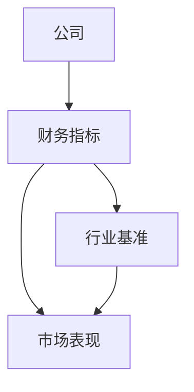
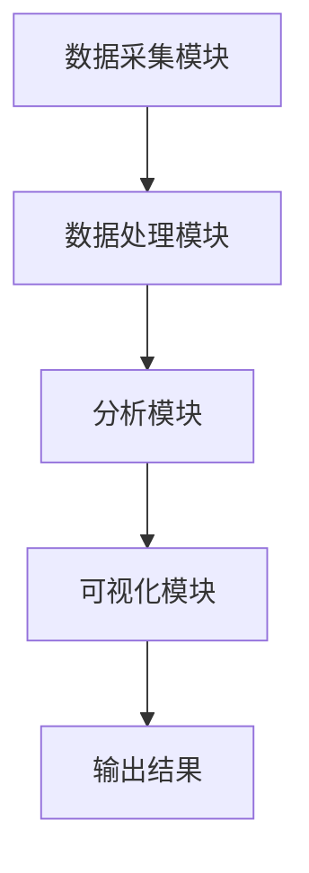

                 


# 彼得林奇对公司盈利质量的分析方法

> 关键词：彼得·林奇、盈利质量分析、财务指标、投资分析、价值投资、ROE

> 摘要：本文深入探讨了彼得·林奇对公司盈利质量的分析方法，从背景介绍、核心概念到算法原理、系统设计、项目实战，最后总结最佳实践。通过详细讲解，帮助读者掌握如何利用财务指标和行业基准分析企业盈利质量，从而做出明智的投资决策。

---

## 第一章：背景介绍

### 1.1 盈利质量分析的背景

在投资领域，盈利质量分析是评估企业财务健康和投资价值的核心方法。随着全球经济的快速发展，企业盈利质量的重要性日益凸显。投资者需要通过分析企业的财务数据，判断其盈利能力和成长潜力，从而做出明智的投资决策。

彼得·林奇作为全球著名投资经理，以其独特的盈利质量分析方法闻名。他的分析方法不仅关注企业的财务指标，还注重企业所处的行业环境和市场表现。这种方法帮助投资者识别出那些具有持续盈利能力和成长潜力的优质企业。

### 1.2 彼得·林奇的介绍

彼得·林奇是富达投资集团的前主席，以其卓越的投资业绩和独特的分析方法著称。他在投资领域的主要贡献在于对企业盈利质量的深入研究。彼得·林奇认为，企业的盈利能力不仅取决于财务数据，还与行业环境、市场地位等因素密切相关。

### 1.3 盈利质量分析的核心要素

盈利质量分析的核心在于多维度评估企业的盈利能力。这包括以下几个方面：

1. **盈利能力的多维度评估**：包括净利润率、ROE（净资产收益率）、毛利率等指标。
2. **盈利质量与企业价值的关系**：企业盈利质量越高，其市场价值通常也越高。
3. **彼得·林奇分析方法的核心思想**：通过横向比较和纵向比较，识别出那些具有持续盈利能力和成长潜力的企业。

---

## 第二章：核心概念与联系

### 2.1 盈利质量分析的原理

盈利质量分析的原理在于通过对企业的财务指标进行多维度分析，评估其盈利能力和财务健康状况。这包括以下几个步骤：

1. **财务指标分析**：计算企业的ROE、净利润率等关键指标。
2. **横向比较**：将企业的财务指标与同行业其他企业进行比较，判断其相对优势。
3. **纵向比较**：分析企业在不同时间段的财务指标变化，判断其盈利能力的稳定性。

### 2.2 盈利质量分析的概念对比

为了更好地理解盈利质量分析的核心概念，我们可以将其与其他相关概念进行对比。

#### 表2-1：盈利质量分析与其他概念的对比

| 概念               | 描述                                         | 关键区别                                 |
|--------------------|----------------------------------------------|----------------------------------------|
| 盈利能力           | 企业的盈利能力，包括净利润率、ROE等         | 突出企业盈利能力的高低                   |
| 成长能力           | 企业的成长潜力，包括收入增长率、资产增长率等 | 突出企业未来的增长潜力                   |
| 财务健康性         | 企业的财务状况，包括资产负债率、流动比率等   | 突出企业的财务稳定性                     |

### 2.3 盈利质量分析的ER实体关系图

为了更好地理解盈利质量分析的实体关系，我们可以通过ER图来展示。



---

## 第三章：算法原理讲解

### 3.1 盈利质量分析的算法流程

盈利质量分析的算法流程可以分为以下几个步骤：

1. **数据收集**：收集企业的财务数据，包括收入、利润、资产等。
2. **数据清洗**：对收集到的数据进行清洗，确保数据的准确性和完整性。
3. **计算关键指标**：计算企业的ROE、净利润率等关键财务指标。
4. **横向比较**：将企业的财务指标与同行业其他企业进行比较。
5. **纵向比较**：分析企业在不同时间段的财务指标变化，判断其盈利能力的稳定性。
6. **得出结论**：根据分析结果，判断企业的盈利质量和投资价值。

### 3.2 盈利质量分析的Python实现

为了更好地理解盈利质量分析的算法流程，我们可以使用Python代码进行实现。

```python
import pandas as pd

# 示例数据
data = {
    '公司': ['A', 'B', 'C'],
    '收入': [100, 200, 150],
    '利润': [20, 40, 30],
    '资产': [50, 100, 75]
}

df = pd.DataFrame(data)

# 计算ROE
df['ROE'] = df['利润'] / df['资产']

# 横向比较
df = df.sort_values('ROE', ascending=False)
```

### 3.3 盈利质量分析的数学模型

在盈利质量分析中，ROE（净资产收益率）是一个重要的财务指标。其计算公式为：

$$ROE = \frac{净利润}{平均股东权益}$$

通过计算ROE，我们可以评估企业的盈利能力。例如，如果企业A的ROE为20%，而行业平均水平为15%，那么企业A的盈利能力更强。

---

## 第四章：系统分析与架构设计

### 4.1 系统分析

为了实现盈利质量分析的自动化，我们可以构建一个基于Python的分析系统。该系统主要包括以下几个模块：

1. **数据采集模块**：负责从数据库或互联网获取企业的财务数据。
2. **数据处理模块**：对收集到的数据进行清洗和预处理。
3. **分析模块**：计算企业的ROE、净利润率等关键指标，并进行横向和纵向比较。
4. **可视化模块**：将分析结果以图表形式展示出来。

### 4.2 系统架构设计

为了实现上述功能，我们可以设计如下的系统架构：



### 4.3 系统接口设计

系统接口设计如下：

1. 数据采集模块接口：
   - 输入：企业名称
   - 输出：企业的财务数据

2. 数据处理模块接口：
   - 输入：原始数据
   - 输出：清洗后的数据

3. 分析模块接口：
   - 输入：清洗后的数据
   - 输出：ROE、净利润率等关键指标

4. 可视化模块接口：
   - 输入：关键指标
   - 输出：图表

---

## 第五章：项目实战

### 5.1 项目环境安装

为了实现盈利质量分析，我们需要安装以下Python库：

```bash
pip install pandas matplotlib
```

### 5.2 核心实现代码

以下是实现盈利质量分析的核心代码：

```python
import pandas as pd
import matplotlib.pyplot as plt

# 示例数据
data = {
    '公司': ['A', 'B', 'C'],
    '收入': [100, 200, 150],
    '利润': [20, 40, 30],
    '资产': [50, 100, 75]
}

df = pd.DataFrame(data)

# 计算ROE
df['ROE'] = df['利润'] / df['资产']

# 横向比较
df = df.sort_values('ROE', ascending=False)

# 可视化
plt.figure(figsize=(10, 6))
plt.bar(df['公司'], df['ROE'])
plt.title('ROE比较')
plt.ylabel('ROE')
plt.show()
```

### 5.3 案例分析与解读

以公司A为例，我们计算其ROE为：

$$ROE_A = \frac{20}{50} = 0.4 = 40\%$$

而行业平均水平为15%，因此公司A的ROE显著高于行业平均水平，显示出较强的盈利能力。

---

## 第六章：最佳实践

### 6.1 小结

通过本文的介绍，我们深入探讨了彼得·林奇对公司盈利质量的分析方法。从背景介绍、核心概念到算法原理、系统设计、项目实战，我们全面了解了如何通过财务指标和行业基准分析企业盈利质量。

### 6.2 投资建议

1. **关注ROE**：ROE是评估企业盈利能力的重要指标，通常选择ROE高于行业平均水平的企业进行投资。
2. **横向与纵向比较**：通过横向和纵向比较，识别出那些具有持续盈利能力和成长潜力的企业。
3. **结合市场环境**：在分析企业盈利质量时，还需结合市场环境和行业趋势，做出综合判断。

### 6.3 注意事项

1. **数据准确性**：盈利质量分析依赖于准确的财务数据，因此数据的收集和清洗至关重要。
2. **行业差异**：不同行业的企业盈利质量分析标准有所不同，需结合行业特点进行分析。
3. **动态调整**：市场环境不断变化，需定期更新企业的财务数据和行业基准，进行动态调整。

### 6.4 拓展阅读

1. 彼得·林奇的《投资之道》
2. 财务分析相关的书籍和文献
3. 行业分析与市场研究的深入学习

---

## 作者信息

作者：AI天才研究院/AI Genius Institute & 禅与计算机程序设计艺术/Zen And The Art of Computer Programming

---

通过本文的详细介绍，读者可以全面掌握彼得·林奇对公司盈利质量的分析方法，并在实际投资中灵活运用这些方法，做出明智的投资决策。

