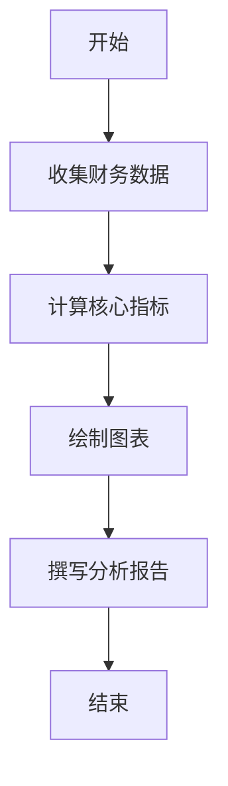
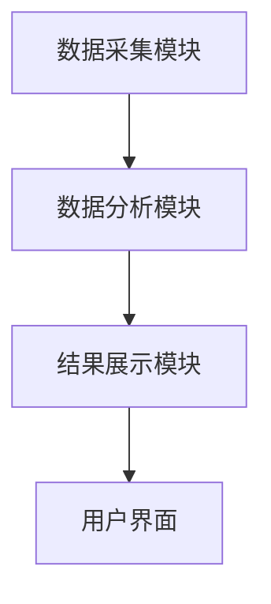

                 


# 彼得林奇对公司盈利质量的深度分析

> 关键词：彼得·林奇，盈利质量，投资分析，财务指标，企业价值

> 摘要：本文从彼得·林奇的投资哲学出发，深入分析了公司盈利质量的核心要素、分析方法及其与企业价值的关系。通过构建数学模型、流程图和系统架构图，详细讲解了盈利质量分析的算法原理和系统设计，并通过实际案例展示了如何运用这些方法进行投资决策。文章最后总结了最佳实践和注意事项，为投资者提供了实用的指导。

---

## 第1章: 盈利质量分析的背景与重要性

### 1.1 什么是盈利质量

#### 1.1.1 盈利质量的定义与核心要素
盈利质量是衡量一家公司财务健康状况的重要指标，它不仅关注公司是否盈利，还关注盈利的可持续性和质量。以下是盈利质量的核心要素：

- **净利润率**：净利润 / 营业收入
- **营业利润率**：营业利润 / 营业收入
- **资产周转率**：营业收入 / 平均资产总额
- **成本控制**：毛利率 = （营业收入 - 营业成本）/ 营业收入

#### 1.1.2 盈利质量与企业价值的关系
盈利质量直接关系到企业的价值。一家公司如果能够保持稳定的高盈利能力，其股票价值通常会高于同行业竞争对手。以下是盈利质量与企业价值的关系：

- **高盈利质量**：企业价值增长潜力大
- **低盈利质量**：企业价值增长潜力小

#### 1.1.3 盈利质量分析的现实意义
在投资决策中，盈利质量分析可以帮助投资者识别出那些具有持续盈利能力的公司，从而做出更明智的投资决策。

---

### 1.2 彼得·林奇的投资哲学

#### 1.2.1 彼得·林奇的投资者画像
彼得·林奇是一位价值投资的倡导者，他主张长期持有优质股票，并通过深入分析公司的财务状况和行业地位来选择投资标的。

#### 1.2.2 林奇投资方法的核心理念
林奇的投资方法以基本面分析为核心，重点关注公司的盈利能力、财务健康状况和行业地位。

#### 1.2.3 林奇对公司盈利质量的关注点
林奇认为，盈利能力是衡量一家公司是否值得投资的核心指标。他特别关注以下几点：

- 净利润率
- 营业利润率
- 资产周转率
- 成本控制能力

---

### 1.3 盈利质量分析的边界与外延

#### 1.3.1 盈利质量分析的适用范围
盈利质量分析适用于所有行业，但不同行业的盈利质量分析侧重点有所不同。例如，制造业更关注资产周转率，而服务业更关注营业利润率。

#### 1.3.2 盈利质量分析的局限性
盈利质量分析并不是万能的，它有以下局限性：

- 无法预测行业周期性变化
- 无法预测公司管理团队的重大决策
- 无法反映宏观经济环境的变化

#### 1.3.3 盈利质量与企业生命周期的关系
盈利质量分析与企业生命周期密切相关。例如，处于成长期的企业可能盈利质量较低，但具有较高的增长潜力。

---

## 第2章: 盈利质量分析的核心概念与联系

### 2.1 盈利质量的核心要素

#### 2.1.1 净利润与每股收益
净利润是公司税后利润，每股收益是净利润除以总股本。以下是计算公式：

$$每股收益 = \frac{净利润}{总股本}$$

#### 2.1.2 营业利润率与成本控制
营业利润率是营业利润与营业收入的比率，以下是计算公式：

$$营业利润率 = \frac{营业利润}{营业收入}$$

#### 2.1.3 资产周转率与运营效率
资产周转率是营业收入与平均资产总额的比率，以下是计算公式：

$$资产周转率 = \frac{营业收入}{平均资产总额}$$

---

### 2.2 盈利质量分析的属性特征对比

#### 2.2.1 盈利质量与财务报表的关系
以下是盈利质量与财务报表的关系：

| 指标       | 财务报表位置 | 计算公式                           |
|------------|--------------|------------------------------------|
| 净利润     | 损益表       | 净利润 = 营业收入 - 营业成本 - 费用 |
| 营业利润   | 损益表       | 营业利润 = 营业收入 - 营业成本     |
| 资产周转率 | 资产负债表   | 资产周转率 = 营业收入 / 平均资产总额 |

#### 2.2.2 盈利质量与企业成长性的对比
以下是盈利质量与企业成长性的对比：

| 指标         | 盈利质量       | 企业成长性       |
|--------------|----------------|------------------|
| 关注点       | 净利润、营业利润率 | 营收增长率、净利润增长率 |
| 数据来源     | 损益表、资产负债表 | 损益表           |
| 分析目的     | 评估盈利能力   | 评估增长潜力     |

#### 2.2.3 盈利质量与行业特性的关联
不同行业的盈利质量分析侧重点不同。例如，制造业关注资产周转率，而科技行业关注研发投入占比。

---

### 2.3 盈利质量的ER实体关系图

以下是盈利质量分析的ER实体关系图：

```mermaid
erDiagram
    customer[投资者] {
        <属性>
        投资者ID : integer
        投资者名称 : string
        投资目标 : string
    }
    company[公司] {
        <属性>
        公司ID : integer
        公司名称 : string
        行业 : string
        净利润 : integer
        营业收入 : integer
        营业成本 : integer
    }
    transaction[交易] {
        <属性>
        交易ID : integer
        交易日期 : date
        交易金额 : integer
    }
    customer --> company : 投资
    company --> transaction : 产生
```

---

## 第3章: 盈利质量分析的算法原理

### 3.1 盈利质量分析的数学模型

#### 3.1.1 净利润率计算
$$净利润率 = \frac{净利润}{营业收入} \times 100\%$$

#### 3.1.2 营业利润率计算
$$营业利润率 = \frac{营业利润}{营业收入} \times 100\%$$

#### 3.1.3 资产周转率计算
$$资产周转率 = \frac{营业收入}{平均资产总额}$$

---

### 3.2 盈利质量分析的流程图

以下是盈利质量分析的流程图：



---

### 3.3 盈利质量分析的Python实现

以下是Python代码实现：

```python
import pandas as pd

# 数据加载
df = pd.read_csv('financial_data.csv')

# 净利润率计算
net_profit_margin = df['净利润'] / df['营业收入']

# 营业利润率计算
operating_profit_margin = df['营业利润'] / df['营业收入']

# 资产周转率计算
asset_turnover = df['营业收入'] / df['平均资产总额']

# 绘制图表
import matplotlib.pyplot as plt

plt.plot(net_profit_margin, label='净利润率')
plt.plot(operating_profit_margin, label='营业利润率')
plt.plot(asset_turnover, label='资产周转率')
plt.legend()
plt.show()
```

---

## 第4章: 盈利质量分析的系统架构设计

### 4.1 系统功能设计

#### 4.1.1 数据采集模块
- 数据来源：财务报表、行业报告
- 数据清洗：去除缺失值、异常值

#### 4.1.2 数据分析模块
- 核心指标计算：净利润率、营业利润率、资产周转率
- 图表生成：柱状图、折线图

#### 4.1.3 结果展示模块
- 可视化界面：仪表盘
- 报告生成：PDF、Word

---

### 4.2 系统架构图

以下是系统架构图：



---

## 第5章: 项目实战

### 5.1 环境安装与配置
- Python版本：3.8及以上
- 需要安装的库：pandas、numpy、matplotlib

### 5.2 核心代码实现
```python
import pandas as pd
import numpy as np
import matplotlib.pyplot as plt

# 数据加载
df = pd.read_csv('financial_data.csv')

# 净利润率计算
net_profit_margin = df['净利润'] / df['营业收入']

# 营业利润率计算
operating_profit_margin = df['营业利润'] / df['营业收入']

# 资产周转率计算
asset_turnover = df['营业收入'] / df['平均资产总额']

# 绘制图表
plt.figure(figsize=(10, 6))
plt.plot(net_profit_margin, label='净利润率')
plt.plot(operating_profit_margin, label='营业利润率')
plt.plot(asset_turnover, label='资产周转率')
plt.title('盈利质量分析')
plt.xlabel('时间')
plt.ylabel('比率')
plt.legend()
plt.show()
```

---

## 第6章: 最佳实践与注意事项

### 6.1 最佳实践
- 定期更新财务数据
- 结合行业趋势分析
- 考虑宏观经济环境

### 6.2 小结
本文从彼得·林奇的投资哲学出发，详细讲解了盈利质量分析的核心要素、算法原理和系统架构设计，并通过实际案例展示了如何运用这些方法进行投资决策。

### 6.3 注意事项
- 数据来源的可靠性
- 分析结果的可解释性
- 投资决策的综合性

### 6.4 拓展阅读
- 彼得·林奇的书籍
- 盈利质量分析的经典案例

---

作者：AI天才研究院/AI Genius Institute & 禅与计算机程序设计艺术 /Zen And The Art of Computer Programming

