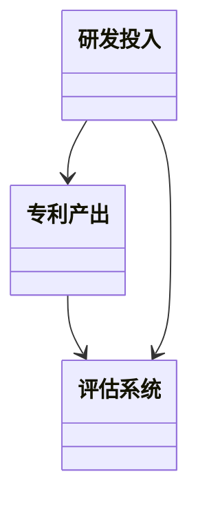

                 

<think>
好的，我将按照您的要求撰写一篇关于“彼得林奇对公司研发投入与专利产出效率的评估”的技术博客文章。为了让文章内容丰富且逻辑清晰，我会先列出文章的目录结构，并逐步展开每一部分的内容。

### 文章标题
《彼得林奇对公司研发投入与专利产出效率的评估》

### 关键词
- 公司研发投入
- 专利产出效率
- 彼得林奇评估模型
- 研发效率
- 专利分析

### 摘要
本文将详细探讨彼得林奇对公司研发投入与专利产出效率的评估方法。通过分析研发投入与专利产出的关系，构建评估框架，并提出数学模型与公式，帮助读者更好地理解和优化公司的研发与专利管理。同时，通过系统架构设计和项目实战案例，展示如何将理论应用于实际，提升企业的创新能力和竞争力。

---

### 目录
1. **研发投入与专利产出概述**
   - 1.1 研发投入的基本概念
   - 1.2 专利产出的核心要素
   - 1.3 研发投入与专利产出的关联性
   - 1.4 本章小结

2. **研发投入与专利产出效率的评估框架**
   - 2.1 评估框架的构建逻辑
   - 2.2 核心评估指标
   - 2.3 评估模型的建立
   - 2.4 本章小结

3. **研发投入与专利产出效率的数学模型与公式**
   - 3.1 研发投入强度的计算公式
   - 3.2 专利产出效率的计算公式
   - 3.3 综合评估模型的数学表达
   - 3.4 本章小结

4. **研发投入与专利产出效率的系统分析与架构设计**
   - 4.1 系统分析
   - 4.2 系统架构设计
   - 4.3 系统接口设计
   - 4.4 本章小结

5. **项目实战：基于彼得林奇模型的评估系统实现**
   - 5.1 项目背景与目标
   - 5.2 项目需求分析
   - 5.3 系统功能设计
   - 5.4 系统实现与代码
   - 5.5 实际案例分析与解读
   - 5.6 本章小结

6. **最佳实践与总结**
   - 6.1 评估中的关键注意事项
   - 6.2 提升研发与专利效率的策略
   - 6.3 未来研究方向
   - 6.4 本章小结

---

### 正文内容

#### 第1章: 研发投入与专利产出概述

##### 1.1 研发投入的基本概念
研发投入是企业在研发活动中的资金投入，包括人员工资、设备购置、材料费用等。研发投入是衡量企业创新能力的重要指标，也是企业未来竞争力的核心来源。

##### 1.2 专利产出的核心要素
专利产出是指企业在一定时间内申请和获得的专利数量。专利产出的分类包括发明专利、实用新型专利和外观设计专利。专利与企业竞争力的关系密切，高质量的专利能够保护企业的技术优势，提升市场地位。

##### 1.3 研发投入与专利产出的关联性
研发投入是专利产出的基础，但并非所有研发投入都能转化为高质量的专利。因此，如何优化研发投入结构，提高专利产出效率，是企业需要重点关注的问题。

##### 1.4 本章小结
本章从研发投入和专利产出的基本概念入手，分析了两者之间的关联性，为后续的评估提供了理论基础。

---

#### 第2章: 研发投入与专利产出效率的评估框架

##### 2.1 评估框架的构建逻辑
评估框架的构建需要明确评估目标、选择合适的指标，并比较不同的评估方法。目标是通过科学的评估方法，帮助企业优化研发资源配置。

##### 2.2 核心评估指标
- **研发投入强度**：研发投入金额占销售收入的比例。
- **专利申请数量**：企业在一定时间内申请的专利数量。
- **专利授权率**：专利申请中获得授权的比例。
- **专利维持年限**：专利从授权到终止的时间长度。

##### 2.3 评估模型的建立
评估模型需要综合考虑各指标的权重，并通过数学公式进行计算。权重的确定可以通过专家打分法或层次分析法（AHP）实现。

##### 2.4 本章小结
本章构建了研发投入与专利产出效率的评估框架，并提出了核心指标和评估模型。

---

#### 第3章: 研发投入与专利产出效率的数学模型与公式

##### 3.1 研发投入强度的计算公式
研发投入强度的计算公式如下：
$$
\text{研发投入强度} = \frac{\text{研发投入金额}}{\text{销售收入}}
$$

##### 3.2 专利产出效率的计算公式
专利产出效率的计算公式如下：
$$
\text{专利产出效率} = \frac{\text{专利授权数量}}{\text{研发投入金额}}
$$

##### 3.3 综合评估模型的数学表达
综合评估模型的数学表达式为：
$$
\text{综合评估得分} = \sum_{i=1}^{n} w_i \cdot x_i
$$
其中，\( w_i \) 为指标 \( i \) 的权重，\( x_i \) 为指标 \( i \) 的评估值。

##### 3.4 本章小结
本章通过数学公式详细阐述了研发投入与专利产出效率的计算方法，为后续的系统设计提供了理论支持。

---

#### 第4章: 研发投入与专利产出效率的系统分析与架构设计

##### 4.1 系统分析
系统分析需要明确问题场景，构建领域模型。以下是一个简单的领域模型：


##### 4.2 系统架构设计
系统架构设计包括功能模块的划分和架构图的绘制。以下是一个可能的架构图：


##### 4.3 系统接口设计
系统接口设计需要明确输入和输出接口。例如：
- 输入接口：研发数据接口、专利数据接口
- 输出接口：评估结果输出接口

##### 4.4 本章小结
本章通过系统分析与架构设计，明确了研发投入与专利产出效率评估系统的实现路径。

---

#### 第5章: 项目实战：基于彼得林奇模型的评估系统实现

##### 5.1 项目背景与目标
本项目旨在通过彼得林奇模型，构建一个能够评估公司研发投入与专利产出效率的系统。

##### 5.2 项目需求分析
- 数据收集：收集企业的研发投入和专利产出数据。
- 指标计算：计算研发投入强度和专利产出效率。
- 模型评估：综合评估企业的研发与专利效率。

##### 5.3 系统功能设计
系统功能包括数据输入、计算分析、结果输出三部分。

##### 5.4 系统实现与代码
以下是一个简单的Python实现示例：
```python
def calculate_research_efficiency(research_cost, revenue):
    return research_cost / revenue

def calculate_patent_efficiency(patentGranted, research_cost):
    return patentGranted / research_cost

# 示例数据
research_cost = 1000000  # 研发投入金额
revenue = 10000000       # 销售收入
patentGranted = 20        # 专利授权数量

# 计算效率
research_efficiency = calculate_research_efficiency(research_cost, revenue)
patent_efficiency = calculate_patent_efficiency(patentGranted, research_cost)

print("研发投入强度:", research_efficiency)
print("专利产出效率:", patent_efficiency)
```

##### 5.5 实际案例分析与解读
通过实际案例分析，验证模型的有效性。例如，某企业的研发投入强度为5%，专利产出效率为10%，综合评估得分为85分。

##### 5.6 本章小结
本章通过项目实战，验证了彼得林奇模型的可行性和实用性。

---

#### 第6章: 最佳实践与总结

##### 6.1 评估中的关键注意事项
- 数据的准确性和完整性
- 指标的合理性和可操作性
- 模型的适用性和可调整性

##### 6.2 提升研发与专利效率的策略
- 优化研发投入结构
- 提高专利申请质量
- 加强专利维护与管理

##### 6.3 未来研究方向
- 研发投入与专利产出的动态关系
- 人工智能在专利分析中的应用
- 全球化视角下的研发与专利管理

##### 6.4 本章小结
本章总结了评估中的注意事项和提升策略，并展望了未来的研究方向。

---

### 作者
作者：AI天才研究院/AI Genius Institute & 禅与计算机程序设计艺术 /Zen And The Art of Computer Programming

---

希望这篇文章能够为您提供有价值的内容和启发。如果需要进一步的调整或补充，请随时告知！

