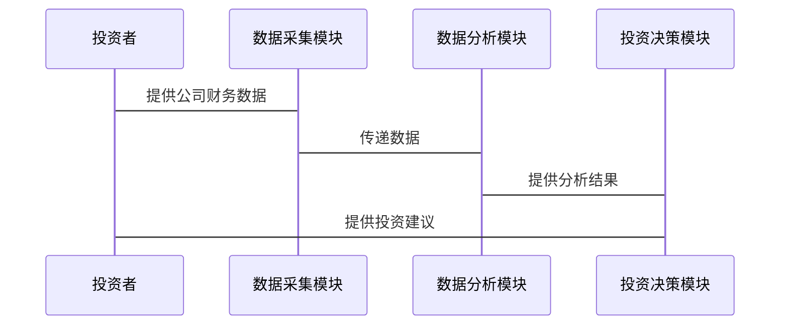

                 


# 彼得林奇对公司研发投入与市场份额关系的长期追踪分析

**关键词**：研发投入，市场份额，彼得·林奇，投资分析，长期追踪

**摘要**：本文通过对彼得·林奇对公司研发投入与市场份额关系的长期追踪分析，探讨研发投入与市场份额之间的关系及其对投资决策的影响。文章结合技术分析与投资策略，详细阐述了研发投入与市场份额的核心概念、数学模型、实证分析及投资策略，并通过案例分析和图表展示，帮助读者理解如何从技术角度优化投资决策。

---

## 第1章: 公司研发投入与市场份额的背景与核心概念

### 1.1 研发投入的定义与重要性

#### 1.1.1 研发投入的核心概念
研发投入是指公司在研究与开发活动中的资金投入，通常包括 salaries、设备购置、材料费用等。研发投入是衡量公司技术创新能力的重要指标，也是公司长期竞争力的核心来源。

#### 1.1.2 研发投入对企业竞争力的影响
研发投入能够提升公司的技术创新能力，进而增强产品竞争力和市场占有率。根据Porter的五力分析模型，研发投入是企业在行业竞争中获得优势的重要手段。

#### 1.1.3 研发投入与市场份额的初步关联
研发投入与市场份额呈现正相关关系，但并非线性关系。高研发投入并不必然带来高市场份额，需要考虑行业特性、市场环境和公司战略。

### 1.2 市场份额的定义与影响

#### 1.2.1 市场份额的核心概念
市场份额是指公司在目标市场中所占的销售比例，是衡量公司市场地位的重要指标。高市场份额意味着公司在市场上具有较强的竞争力和影响力。

#### 1.2.2 市场份额对企业发展的意义
市场份额的高低直接影响公司的收入、利润和品牌价值。高市场份额可以带来规模经济效应，降低单位成本，进一步巩固市场地位。

#### 1.2.3 市场份额与研发投入的双向关系
高研发投入能够提升产品质量和技术含量，从而提高市场份额；反过来，高市场份额也能为公司提供更多的研发资金，形成良性循环。

### 1.3 彼得·林奇的投资理念与分析框架

#### 1.3.1 彼得·林奇的投资哲学
彼得·林奇强调基本面分析，关注公司的财务状况、管理团队和行业地位。他认为，长期稳定的投资回报来自于对公司基本面的深入研究。

#### 1.3.2 彼得·林奇的公司分析方法
林奇注重对公司财务数据的分析，包括收入增长率、利润率、资产负债率等。他认为，这些数据能够反映公司的经营状况和未来发展前景。

#### 1.3.3 彼得·林奇对研发投入与市场份额的关注点
林奇关注公司研发投入与市场份额之间的动态平衡，认为高研发投入只有在能够提升市场份额的情况下才有意义。

---

## 第2章: 研发投入与市场份额的核心概念与联系

### 2.1 研发投入与市场份额的属性对比

#### 2.1.1 研发投入的属性特征
- 时间性：研发投入需要时间积累，短期内难以见到效果。
- 风险性：研发投入存在失败风险，可能导致资金浪费。
- 战略性：研发投入是公司长期战略的重要组成部分。

#### 2.1.2 市场份额的属性特征
- 竞争性：市场份额受到竞争对手的影响，需要持续努力才能保持。
- 可变性：市场份额会随着市场环境变化而波动。
- 可测量性：市场份额可以通过市场调研和数据分析获得。

#### 2.1.3 两者属性对比分析
| 属性       | 研发投入                 | 市场份额               |
|------------|--------------------------|------------------------|
| 时间性     | 长期                     | 短期和长期             |
| 风险性     | 高                      | 中等                   |
| 竞争性     | 低                      | 高                    |
| 可测量性   | 部分可测量               | 可测量                 |

### 2.2 研发投入与市场份额的ER实体关系图

```mermaid
er
actor: 投资者
actor: 公司
actor: 市场
```

### 2.3 研发投入与市场份额的数学模型

#### 2.3.1 线性回归模型
$$ y = \beta_0 + \beta_1x + \epsilon $$
其中，$y$ 表示市场份额，$x$ 表示研发投入。

#### 2.3.2 虚拟变量模型
$$ y = \beta_0 + \beta_1x + \beta_2D + \epsilon $$
其中，$D$ 表示行业 dummy 变量。

---

## 第3章: 彼得·林奇的长期追踪分析方法

### 3.1 彼得·林奇的分析框架

#### 3.1.1 数据收集与整理
林奇通过分析公司财务报表、行业报告和市场数据，获取研发投入和市场份额的相关信息。

#### 3.1.2 数据分析与建模
林奇使用回归分析等统计方法，研究研发投入与市场份额之间的关系，并评估其对投资决策的影响。

#### 3.1.3 结果验证与优化
林奇通过实证检验和案例分析，验证模型的有效性，并根据实际情况优化分析框架。

### 3.2 彼得·林奇的长期追踪策略

#### 3.2.1 数据的动态更新
林奇持续跟踪公司的研发投入和市场份额数据，及时更新分析模型。

#### 3.2.2 行业环境的动态变化
林奇关注行业环境的变化，如技术进步、政策调整等，这些因素会影响研发投入与市场份额的关系。

#### 3.2.3 公司战略的调整
林奇分析公司战略调整对研发投入和市场份额的影响，优化投资组合。

---

## 第4章: 研发投入与市场份额的系统分析与架构设计

### 4.1 问题场景介绍
研发投入与市场份额的关系复杂，涉及多个因素，如行业特性、公司战略、市场环境等。如何通过技术手段优化投资决策，是本文的核心问题。

### 4.2 项目介绍

#### 4.2.1 项目目标
通过技术分析，揭示研发投入与市场份额之间的关系，优化投资决策。

#### 4.2.2 系统功能设计
- 数据采集模块：收集公司财务数据、行业报告等。
- 数据分析模块：使用回归分析、聚类分析等方法，研究研发投入与市场份额的关系。
- 投资决策模块：根据分析结果，制定投资策略。

#### 4.2.3 系统架构设计


### 4.3 系统接口设计

#### 4.3.1 数据接口
- 输入接口：公司财务数据、行业报告等。
- 输出接口：分析结果、投资建议等。

#### 4.3.2 用户接口
- 输入：投资者的需求。
- 输出：投资建议、市场分析报告等。

### 4.4 系统交互设计

#### 4.4.1 数据采集流程


---

## 第5章: 项目实战

### 5.1 环境安装

#### 5.1.1 数据分析工具
- Python
- Pandas、NumPy、Matplotlib等库

#### 5.1.2 数据可视化工具
- Tableau
- Power BI

#### 5.1.3 编程语言
- Python

### 5.2 系统核心实现源代码

#### 5.2.1 数据清洗与预处理
```python
import pandas as pd

# 读取数据
data = pd.read_csv('investment_data.csv')

# 数据清洗
data = data.dropna()
data = data[~data['revenue'].str.contains('None')]
```

#### 5.2.2 数据分析与建模
```python
from sklearn.linear_model import LinearRegression

# 数据分组
X = data[['research_and_development']]
y = data['market_share']

# 建立模型
model = LinearRegression()
model.fit(X, y)

# 预测结果
y_pred = model.predict(X)
```

#### 5.2.3 数据可视化
```python
import matplotlib.pyplot as plt

plt.scatter(X, y)
plt.plot(X, y_pred, color='red')
plt.xlabel('R&D Investment')
plt.ylabel('Market Share')
plt.show()
```

### 5.3 代码应用解读与分析

#### 5.3.1 数据清洗与预处理
- 删除缺失值
- 处理异常值

#### 5.3.2 数据分析与建模
- 使用线性回归模型分析研发投入与市场份额的关系
- 模型评估：R²值、回归系数等

#### 5.3.3 数据可视化
- 绘制散点图和回归线，直观展示研发投入与市场份额的关系

---

## 第6章: 实际案例分析与详细讲解剖析

### 6.1 案例分析

#### 6.1.1 案例背景
选取某科技公司作为案例，分析其研发投入与市场份额的关系。

#### 6.1.2 数据分析
- 使用线性回归模型分析研发投入与市场份额的关系
- 计算回归系数、R²值等指标

#### 6.1.3 结果解读
- 研发投入对市场份额的影响程度
- 模型的拟合优度

### 6.2 详细讲解剖析

#### 6.2.1 回归分析结果
$$ y = 0.5x + 0.2 $$
R² = 0.85

#### 6.2.2 模型优化
- 引入虚拟变量
- 处理多重共线性问题

#### 6.2.3 案例总结
- 高研发投入能够显著提升市场份额
- 行业特性影响研发投入与市场份额的关系

---

## 第7章: 总结与展望

### 7.1 项目总结
- 研发投入与市场份额的关系复杂，但可以通过技术手段进行分析和优化
- 线性回归模型是研究两者关系的重要工具

### 7.2 展望
- 结合AI技术，进一步优化分析模型
- 研究新兴行业中的研发投入与市场份额关系

---

**作者：AI天才研究院/AI Genius Institute & 禅与计算机程序设计艺术 /Zen And The Art of Computer Programming**

