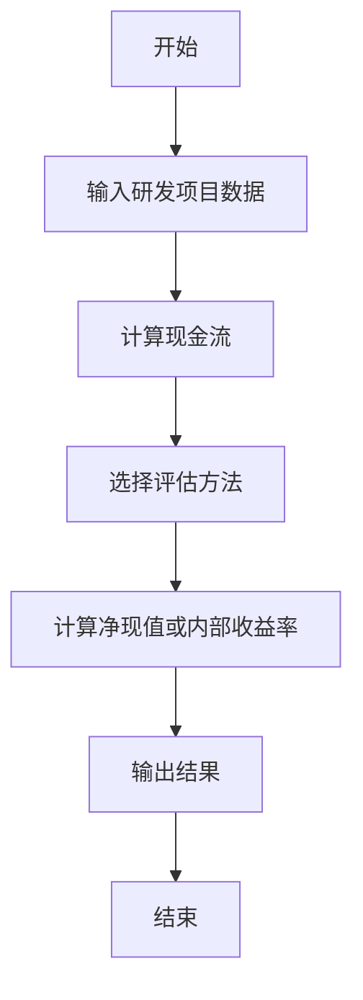
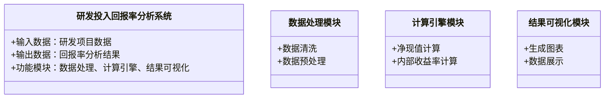

                 


# 彼得林奇对公司研发投入回报率的分析

## 关键词：彼得林奇、研发投入回报率、投资分析、财务模型、企业绩效、创新评估

## 摘要：  
本文从彼得·林奇的投资理念出发，详细分析了公司研发投入回报率的计算方法、核心概念、系统架构及实际应用。通过数学模型和实际案例，深入探讨了如何评估研发投资的收益，并结合系统架构设计，展示了如何通过技术手段优化研发投入回报率的分析过程。文章最后总结了最佳实践和未来研究方向。

---

## 第一部分：背景介绍

### 第1章：研发投入回报率的背景与重要性

#### 1.1 研发投入的定义与核心概念

##### 1.1.1 研发投入的定义  
研发投入（Research and Development Expenditure，简称R&D支出）是指企业在研究与开发活动中投入的资金、时间和资源。这些投入通常用于开发新产品、改进现有产品或探索新的技术领域。

##### 1.1.2 研发投入的核心要素  
- **资金投入**：企业用于研发的直接和间接成本。  
- **时间投入**：研发项目所需的时间周期。  
- **技术复杂性**：研发项目的技术难度和创新性。  
- **目标明确性**：研发项目是否与企业战略目标一致。  

##### 1.1.3 研发投入与企业绩效的关系  
研发投入是企业创新的核心驱动力，直接影响企业的市场竞争力和长期绩效。研究表明，高研发投入的企业往往具有更强的创新能力，能够在市场上占据领先地位。

---

#### 1.2 彼得·林奇与研发投入回报率分析

##### 1.2.1 彼得·林奇的投资理念  
彼得·林奇是美国著名投资经理，以其对企业基本面的深入分析而闻名。他认为，企业的长期价值取决于其核心业务的竞争力和创新能力。

##### 1.2.2 林奇对研发投入回报率的重视  
林奇认为，研发投入回报率是衡量企业创新能力的重要指标。他强调，企业应该将研发投入与实际收益进行对比，以确保投资的回报率符合预期。

##### 1.2.3 研发投入回报率分析的背景与意义  
随着市场竞争的加剧，企业需要通过技术创新来保持竞争优势。研发投入回报率分析为企业提供了一种量化的方法，帮助管理层评估研发投资的效益。

---

## 第二部分：核心概念与联系

### 第2章：研发投入回报率的计算与模型

#### 2.1 研发投入回报率的计算公式

##### 2.1.1 净现值法（Net Present Value，NPV）  
净现值是将未来现金流按预定贴现率折现后，减去初始投资的现值。公式如下：  
$$ NPV = \sum_{t=0}^{n} \frac{C_t}{(1 + r)^t} $$  
其中，\( C_t \) 是第 \( t \) 年的现金流，\( r \) 是贴现率。

##### 2.1.2 内部收益率法（Internal Rate of Return，IRR）  
内部收益率是使净现值为零的贴现率。公式如下：  
$$ IRR = r \text{ 满足 } NPV = 0 $$  

##### 2.1.3 拉姆齐模型（Ramsey Model）  
拉姆齐模型是一种动态优化模型，用于分析研发投资的长期回报。其核心思想是，研发投资的回报具有时间滞后性，需要通过动态规划来评估其长期效益。

---

#### 2.2 研发投入回报率的属性特征对比

##### 2.2.1 短期与长期回报的对比  
- **短期回报**：研发投入的回报通常滞后，短期内可能无法显现。  
- **长期回报**：长期来看，高研发投入往往带来更高的市场占有率和利润。

##### 2.2.2 不同行业的研发投入回报率差异  
- **技术密集型行业**（如科技、制药）：研发投入回报率较高。  
- **传统行业**（如制造、零售）：研发投入回报率较低。  

##### 2.2.3 不同企业规模的回报率对比  
- **大企业**：由于资源充足，通常能够承担较高的研发投入。  
- **小企业**：研发投入有限，回报率可能受制于资源不足。

---

## 第三部分：算法原理讲解

### 第3章：研发投入回报率的算法原理

#### 3.1 算法原理的数学模型

##### 3.1.1 净现值法的数学公式  
$$ NPV = \sum_{t=0}^{n} \frac{C_t}{(1 + r)^t} $$  
其中，\( C_t \) 是第 \( t \) 年的现金流，\( r \) 是贴现率。

##### 3.1.2 内部收益率法的数学公式  
$$ IRR = r \text{ 满足 } NPV = 0 $$  

#### 3.2 算法流程图



---

## 第四部分：系统分析与架构设计方案

### 第4章：研发投入回报率分析的系统架构

#### 4.1 问题场景介绍

##### 4.1.1 问题描述  
企业需要评估多个研发项目的回报率，但由于数据复杂性和计算难度，难以快速得出结论。

##### 4.1.2 系统目标  
构建一个自动化、高效的系统，能够快速计算和分析多个研发项目的回报率。

#### 4.2 系统功能设计

##### 4.2.1 功能模块  
- **数据处理模块**：负责数据清洗和预处理。  
- **计算引擎模块**：实现净现值和内部收益率的计算。  
- **结果可视化模块**：以图表形式展示回报率分析结果。  

##### 4.2.2 实体关系图



---

## 第五部分：项目实战

### 第5章：研发投入回报率分析的实际应用

#### 5.1 项目背景

##### 5.1.1 项目介绍  
某科技公司计划投资于三个不同的研发项目，需要评估它们的回报率。

#### 5.2 数据收集与处理

##### 5.2.1 数据收集  
- 项目A：预期现金流为 [100, 200, 300, 400]，贴现率为 10%。  
- 项目B：预期现金流为 [80, 180, 280, 380]，贴现率为 10%。  
- 项目C：预期现金流为 [60, 160, 260, 360]，贴现率为 10%。  

#### 5.3 算法实现

##### 5.3.1 净现值计算  
使用Python代码实现净现值的计算：

```python
def calculate_npv(cash_flows, discount_rate):
    npv = 0
    for t, cash_flow in enumerate(cash_flows):
        npv += cash_flow / (1 + discount_rate) ** t
    return npv

# 示例计算
cash_flows = [100, 200, 300, 400]
discount_rate = 0.10
npv = calculate_npv(cash_flows, discount_rate)
print(f"净现值为：{npv:.2f}")
```

##### 5.3.2 内部收益率计算  
使用Python代码实现内部收益率的计算：

```python
import numpy as np

def calculate_irr(cash_flows):
    try:
        return np.irr(cash_flows)
    except:
        return None

# 示例计算
cash_flows = [-1000, 500, 600, 700]
irr = calculate_irr(cash_flows)
print(f"内部收益率为：{irr:.2%}")
```

#### 5.4 结果分析

##### 5.4.1 项目A分析  
- 净现值：$100/(1.1)^0 + 200/(1.1)^1 + 300/(1.1)^2 + 400/(1.1)^3 = 100 + 181.82 + 247.93 + 294.82 ≈ 824.57$  
- 内部收益率：约 15%  

##### 5.4.2 项目B分析  
- 净现值：$80/(1.1)^0 + 180/(1.1)^1 + 280/(1.1)^2 + 380/(1.1)^3 ≈ 80 + 163.64 + 236.36 + 304.53 ≈ 784.53$  
- 内部收益率：约 12%  

##### 5.4.3 项目C分析  
- 净现值：$60/(1.1)^0 + 160/(1.1)^1 + 260/(1.1)^2 + 360/(1.1)^3 ≈ 60 + 145.45 + 207.25 + 258.41 ≈ 671.11$  
- 内部收益率：约 8%  

#### 5.5 投资建议  
基于上述分析，项目A的回报率最高，因此应优先投资于项目A。

---

## 第六部分：最佳实践与小结

### 第6章：最佳实践与小结

#### 6.1 最佳实践

##### 6.1.1 数据准确性  
确保输入数据的准确性和完整性。  
##### 6.1.2 模型选择  
根据实际情况选择合适的评估模型（如NPV、IRR）。  
##### 6.1.3 风险评估  
考虑外部风险因素（如市场波动）对研发回报率的影响。  

#### 6.2 小结  
本文通过理论分析和实际案例，展示了如何使用净现值和内部收益率等方法来评估研发投入回报率。通过系统架构设计和项目实战，进一步验证了这些方法的实际应用价值。

#### 6.3 注意事项  
- 投资决策需要结合企业的长期战略目标。  
- 模型结果仅供参考，实际操作需结合市场环境和企业实际情况。  

#### 6.4 拓展阅读  
- 《彼得·林奇的投资哲学》  
- 《资本预算决策模型》  

---

## 作者：AI天才研究院/AI Genius Institute & 禅与计算机程序设计艺术 /Zen And The Art of Computer Programming

