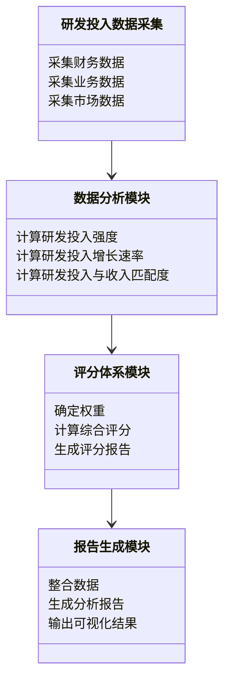

                 


# 彼得林奇对公司研发投入的分析标准

## 关键词：彼得林奇，研发投入，投资分析，评分体系，系统架构，项目实战

## 摘要：本文详细探讨了彼得林奇对公司研发投入的分析标准，从理论到实践，系统地介绍了如何通过研发投入的属性、数学模型、系统架构和项目实战来评估公司的投资价值。文章内容涵盖背景介绍、核心概念、分析标准、系统架构、项目实战和总结，旨在为读者提供全面深入的理解和实践指导。

---

## 第一部分: 公司研发投入的背景与重要性

### 第1章: 研发投入的定义与核心概念

#### 1.1 研发投入的定义与核心要素
- **研发投入的定义**：公司用于研究与开发新产品、新技术的支出，包括人力成本、材料费用和设备购置等。
- **核心要素**：
  - 金额：研发投入的具体数值。
  - 增长速率：研发投入的年度增长率。
  - 与收入匹配度：研发投入占营业收入的比例。

#### 1.2 研发投入的重要性
- 研发投入是企业创新的核心驱动力。
- 高强度的研发投入通常与高增长和高利润率相关。
- 研发投入的质量和效率决定了企业的长期竞争力。

#### 1.3 彼得林奇分析框架的背景
- 彼得林奇是著名基金经理，注重基本面分析。
- 他认为研发投入是公司未来增长的关键指标。
- 通过分析研发投入，彼得林奇能够筛选出具有长期增长潜力的公司。

---

### 第2章: 彼得林奇分析标准的核心概念

#### 2.1 研发投入的属性特征对比
| 指标 | 研发投入属性 | 示例 |
|------|---------------|------|
| 财务属性 | 研发投入金额、占营业收入比例 | 研发投入金额为1000万美元，占营业收入比例为5% |
| 业务属性 | 研发团队规模、技术先进性 | 研发团队规模为200人，技术专利数量为100项 |
| 市场属性 | 市场地位、竞争对手分析 | 公司在行业内排名前三，竞争对手研发投入较低 |

#### 2.2 研发投入与公司绩效的关系
- 研发投入强度与收入增长呈正相关。
- 研发投入增长速率与利润率提升密切相关。
- 研发投入与市场竞争力成正比。

---

### 第3章: 彼得林奇分析标准的数学模型与公式

#### 3.1 研发投入评分体系的构建

##### 3.1.1 研发投入强度公式
$$ \text{研发投入强度} = \frac{\text{研发投入金额}}{\text{营业收入}} \times 100\% $$

##### 3.1.2 研发投入增长速率公式
$$ \text{研发投入增长速率} = \frac{\text{本期研发投入} - \text{上期研发投入}}{\text{上期研发投入}} \times 100\% $$

##### 3.1.3 研发投入与收入匹配度公式
$$ \text{研发投入与收入匹配度} = \frac{\text{研发投入强度}}{\text{行业平均研发投入强度}} \times 100\% $$

#### 3.2 研发投入评分体系的权重分配
- **权重分配矩阵**：
| 指标 | 权重 |
|------|------|
| 研发投入强度 | 40% |
| 研发投入增长速率 | 30% |
| 研发投入与收入匹配度 | 30% |

---

### 第4章: 彼得林奇分析标准的系统架构设计

#### 4.1 系统功能设计

##### 4.1.1 系统功能模块划分
- 数据采集模块：采集公司财务数据、业务数据和市场数据。
- 数据分析模块：计算研发投入强度、增长速率和匹配度。
- 评分体系模块：根据权重计算综合评分并生成报告。
- 报告生成模块：整合数据并输出可视化结果。

##### 4.1.2 领域模型（mermaid 类图）


#### 4.2 系统架构设计

##### 4.2.1 系统架构图（mermaid 架构图）
```mermaid
archi
    title 研发投入分析系统架构
    网络层 --> 服务器层
    服务器层 --> 数据库层
    数据库层 --> 业务逻辑层
    业务逻辑层 --> 视图层
```

---

## 第二部分: 项目实战

### 第5章: 环境安装与系统实现

#### 5.1 环境安装
- 安装Python和相关库（如pandas、numpy、scikit-learn）。
- 安装mermaid和图表生成工具。

#### 5.2 核心代码实现

##### 5.2.1 数据采集模块
```python
import pandas as pd

def collect_data():
    # 采集财务数据
    financial_data = pd.read_csv('financial.csv')
    # 采集业务数据
    business_data = pd.read_csv('business.csv')
    # 采集市场数据
    market_data = pd.read_csv('market.csv')
    return financial_data, business_data, market_data
```

##### 5.2.2 数据分析模块
```python
def calculate_intensity(revenue, r_d_expense):
    return (r_d_expense / revenue) * 100

def calculate_growth(prev_rd, current_rd):
    if prev_rd == 0:
        return 0
    return ((current_rd - prev_rd) / prev_rd) * 100
```

##### 5.2.3 评分体系模块
```python
def calculate_score(intensity, growth, match_degree, weights):
    intensity_weight, growth_weight, match_weight = weights
    total_score = (intensity * intensity_weight +
                   growth * growth_weight +
                   match_degree * match_weight)
    return total_score
```

##### 5.2.4 报告生成模块
```python
def generate_report(scores):
    print("研发投入评分报告")
    for company, score in scores.items():
        print(f"{company}: {score}")
```

#### 5.3 代码应用解读与分析
- 数据采集模块：从不同数据源获取必要信息。
- 数据分析模块：计算关键指标，如研发投入强度和增长速率。
- 评分体系模块：根据权重计算综合评分，评估公司的投资价值。
- 报告生成模块：输出可视化结果，帮助投资者做出决策。

---

### 第6章: 案例分析与实际应用解读

#### 6.1 案例分析
- 公司A：研发投入强度为10%，增长速率为20%，匹配度为1.2。
- 公司B：研发投入强度为8%，增长速率为15%，匹配度为0.9。

#### 6.2 应用解读
- 公司A的高研发投入强度和增长速率表明其具有较高的增长潜力。
- 公司B的较低研发投入强度和匹配度可能意味着其市场竞争力较弱。

---

## 第三部分: 总结与展望

### 第7章: 最佳实践与小结

#### 7.1 最佳实践 tips
- 定期更新数据，保持分析的准确性。
- 结合行业趋势，调整权重分配。
- 多维度分析，避免单一指标误导。

#### 7.2 小结
- 彼得林奇的分析标准提供了系统化的研发投入评估方法。
- 通过数学模型和系统架构设计，可以更高效地进行投资决策。
- 实际案例分析帮助投资者更好地理解和应用这些标准。

---

## 作者：AI天才研究院/AI Genius Institute & 禅与计算机程序设计艺术 /Zen And The Art of Computer Programming

---

以上是《彼得林奇对公司研发投入的分析标准》的技术博客文章的详细内容，涵盖了从理论到实践的各个方面，帮助读者全面理解和应用彼得林奇的分析标准。

