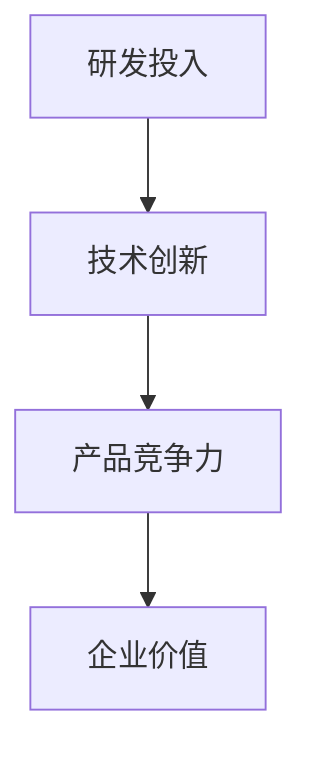
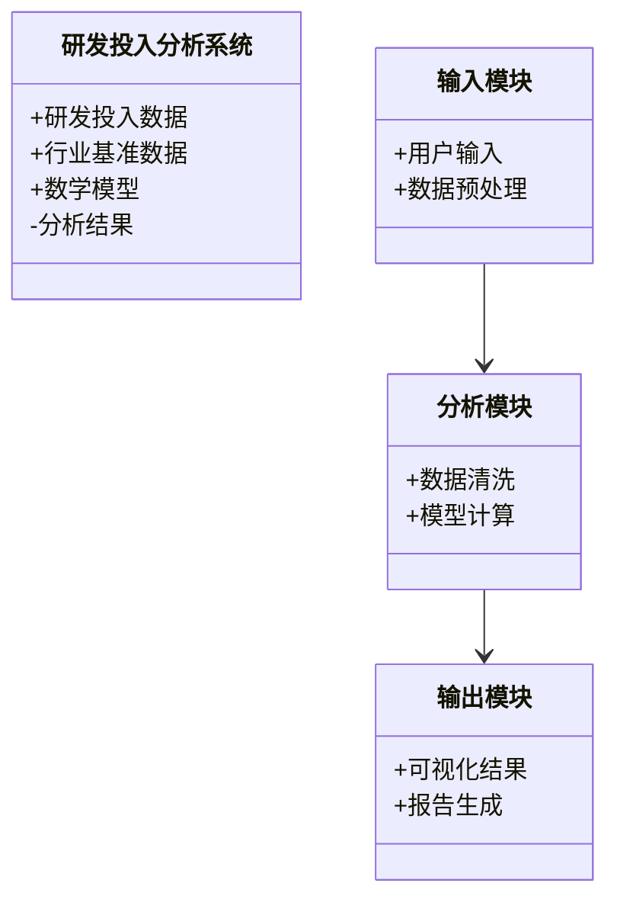
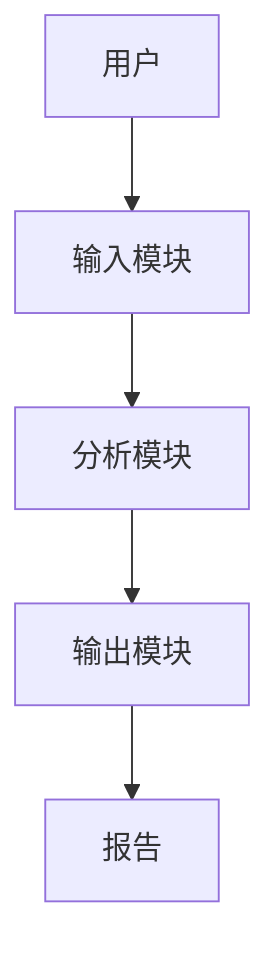

                 


# 彼得林奇对公司研发投入结构的深度分析

> 关键词：彼得·林奇，研发投入，投资分析，数学模型，系统架构

> 摘要：本文通过分析彼得·林奇对公司研发投入的深度研究，结合数学模型和系统架构，详细阐述了如何从研发投入结构中挖掘投资价值。文章内容包括背景介绍、核心概念、算法原理、系统分析、项目实战以及总结与展望等部分，为投资者提供了科学的投资分析方法。

---

## 第一章: 背景介绍

### 1.1 背景与问题描述

- **核心概念**：公司研发投入是指企业在研发新产品、新技术或改进现有产品上的投入，包括资金、人力和时间等资源。
- **问题背景**：研发投入是企业长期竞争力的核心，但短期可能影响利润。投资者需要平衡短期收益与长期增长。
- **问题解决**：通过分析研发投入的结构和效率，投资者可以评估企业的潜在价值。

### 1.2 彼得·林奇的投资风格

- **投资理念**：林奇注重基本面分析，尤其是企业的财务健康和管理能力。
- **研发投入的重要性**：他认为研发投入是企业长期增长的关键，尤其在科技行业。

### 1.3 研发投入的结构与外延

- **结构**：包括研发人员、设备、材料和专利等。
- **外延**：影响企业的技术壁垒、市场竞争力和创新能力。

---

## 第二章: 核心概念与联系

### 2.1 研发投入的核心属性

| 属性 | 描述 |
|------|------|
| 投资性 | 长期投入，短期可能影响利润 |
| 创新性 | 用于新技术或产品的研发 |
| 战略性 | 关系到企业的长期竞争力 |

### 2.2 研发投入与企业价值的关系



---

## 第三章: 研发投入的数学模型

### 3.1 研发投入强度模型

$$ \text{研发投入强度} = \frac{\text{研发投入金额}}{\text{营业收入}} \times 100\% $$

### 3.2 线性回归模型

$$ R^2 = \sum (\hat{y}_i - \bar{y})(y_i - \bar{y}) $$

### 3.3 Python代码实现

```python
import pandas as pd
import numpy as np

def calculate_r_squared(y_true, y_pred):
    y_mean = np.mean(y_true)
    numerator = np.sum((y_pred - y_mean) * (y_true - y_mean))
    denominator = np.sum((y_true - y_mean) ** 2)
    r_squared = numerator ** 2 / denominator
    return r_squared

# 示例数据
y_true = np.array([1, 2, 3, 4, 5])
y_pred = np.array([1.1, 2.3, 2.9, 4.1, 5.2])
print(calculate_r_squared(y_true, y_pred))
```

---

## 第四章: 系统分析与架构设计

### 4.1 系统功能设计



### 4.2 系统架构设计



---

## 第五章: 项目实战

### 5.1 环境安装

- **工具**：Python、Pandas、NumPy
- **安装命令**：
  ```bash
  pip install pandas numpy
  ```

### 5.2 核心代码实现

```python
import pandas as pd
import numpy as np

def analyze_research_development(revenue, r_d_expense):
    r_d_intensity = (r_d_expense / revenue) * 100
    return r_d_intensity

# 示例数据
revenue_data = [100, 200, 300, 400, 500]
r_d_expense_data = [20, 30, 40, 50, 60]

for i in range(len(revenue_data)):
    print(f"Year {i+1}: {analyze_research_development(revenue_data[i], r_d_expense_data[i])}%")
```

### 5.3 案例分析

以苹果公司为例，分析其研发投入结构和强度，评估其技术创新能力。

---

## 第六章: 总结与展望

### 6.1 本章总结

- 彼得·林奇的分析框架提供了科学的评估方法。
- 数学模型和系统架构为投资决策提供了支持。

### 6.2 未来展望

- 结合AI技术优化分析模型。
- 扩展更多行业案例研究。

---

## 小结

- **注意事项**：数据来源和质量影响分析结果。
- **最佳实践**：结合多种指标进行综合评估。
- **拓展阅读**：建议阅读彼得·林奇的原著。

---

作者：AI天才研究院/AI Genius Institute & 禅与计算机程序设计艺术 /Zen And The Art of Computer Programming

