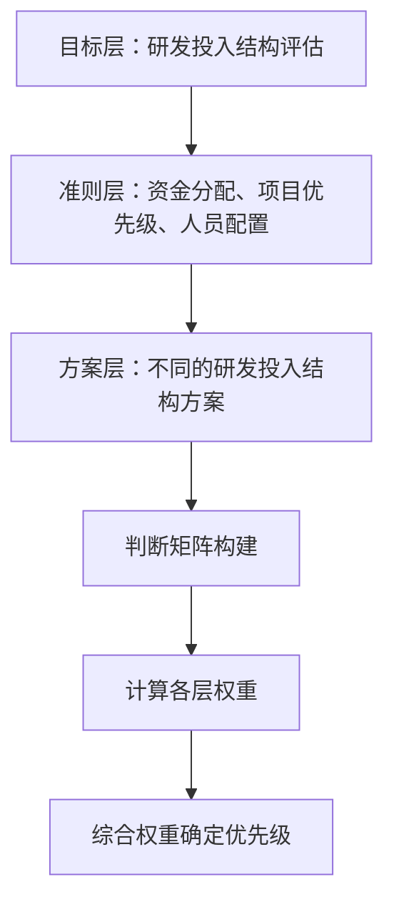

                 


# 彼得林奇对公司研发投入结构的评估

## 关键词：研发投入，结构评估，彼得·林奇，投资策略，企业绩效

## 摘要：本文将探讨如何运用彼得·林奇的投资理念来评估公司的研发投入结构。通过对研发投入的核心概念、理论框架、系统分析和项目实战的详细解读，分析其在企业战略中的重要性，并提供切实可行的评估方法和最佳实践。

---

## 正文

### 第一部分：背景介绍

#### 第1章：研发投入结构评估的背景与重要性

##### 1.1 研发投入的重要性

- **1.1.1 研发投入对企业发展的核心作用**
  - 研发投入是企业技术创新的核心驱动力。
  - 高效的研发投入结构能够显著提升企业的市场竞争力。
  - 研发投入的合理分配直接关系到企业的长期盈利能力。

- **1.1.2 彼得·林奇的投资理念与研发投入的关系**
  - 彼得·林奇强调基本面分析的重要性。
  - 研发投入是企业基本面分析的关键指标之一。
  - 林奇的长期投资策略与研发投入的持续性密切相关。

- **1.1.3 研发投入在企业竞争力中的战略地位**
  - 研发投入是企业保持竞争优势的核心因素。
  - 合理的投入结构能够优化资源配置，提升创新效率。
  - 研发投入的结构化评估是企业战略规划的重要组成部分。

##### 1.2 问题背景与描述

- **1.2.1 研发投入结构评估的核心问题**
  - 研发投入的结构是否合理？
  - 投入的领域是否具有战略价值？
  - 研发团队的配置是否科学？

- **1.2.2 研发投入结构评估的边界与外延**
  - 评估的范围：哪些部门和项目需要纳入评估？
  - 评估的时间跨度：短期与长期的平衡。
  - 评估的深度：宏观分析与微观细节。

- **1.2.3 研发投入结构评估的核心要素组成**
  - 资金分配：各项目的资金占比。
  - 人员配置：研发团队的结构与技能分布。
  - 项目优先级：根据战略目标排序。
  - 预期收益：各项目的预期产出与回报。

#### 第2章：研发投入结构评估的核心概念

##### 2.1 核心概念与定义

- **2.1.1 研发投入的定义与分类**
  - 研发投入：企业在研发活动上的资金和资源投入。
  - 分类：基础研究、应用研究、产品开发。

- **2.1.2 研发投入结构的定义与特征**
  - 结构：不同研发项目的资源分配方式。
  - 特征：合理性、科学性、动态性。

- **2.1.3 研发投入结构评估的维度与指标**
  - 资金分配合理性。
  - 项目与战略目标的契合度。
  - 研发效率与产出。

##### 2.2 核心概念之间的关系

- **2.2.1 研发投入结构与企业绩效的关系**
  - 理论上的正相关性。
  - 实证研究的验证。

- **2.2.2 研发投入结构与行业竞争的关系**
  - 行业竞争格局的影响。
  - 竞争对手的投入结构分析。

- **2.2.3 研发投入结构与企业生命周期的关系**
  - 初创期、成长期、成熟期的投入策略差异。
  - 生命周期不同阶段的投入结构调整。

#### 第3章：研发投入结构评估的理论框架

##### 3.1 理论基础与方法

- **3.1.1 研发投入结构评估的理论基础**
  - 经济学中的资源分配理论。
  - 投资学中的资产配置理论。

- **3.1.2 研发投入结构评估的主要方法**
  - 定性分析法：专家意见法。
  - 定量分析法：数学建模法。

- **3.1.3 彼得·林奇评估方法的核心思想**
  - 以基本面分析为核心。
  - 重视企业的长期价值。
  - 坚持长期投资策略。

##### 3.2 理论框架与模型

- **3.2.1 研发投入结构评估的层次分析法（AHP）**
  - 层次分析法的步骤：
    1. 确定目标层、准则层和方案层。
    2. 构建判断矩阵。
    3. 计算各层权重。
    4. 综合权重确定方案优先级。
  - 使用 Mermaid 绘制层次分析法的流程图。



- **3.2.2 研发投入结构评估的指标体系构建**
  - 核心指标：研发投入强度、研发人员占比、研发投入产出率。
  - 辅助指标：项目周期、专利数量、市场反馈。

- **3.2.3 理论框架的优缺点分析**
  - 优点：科学性、系统性。
  - 缺点：复杂性、数据依赖性。

---

### 第二部分：研发投入结构评估的核心概念与联系

#### 第4章：核心概念的原理与特征

##### 4.1 核心概念的原理

- **4.1.1 研发投入结构的原理**
  - 资源分配的合理性。
  - 项目优先级的科学性。
  - 人员配置的最优性。

##### 4.2 核心概念的属性特征对比

| 特征     | 研发投入结构 | 项目优先级 | 人员配置 |
|----------|--------------|------------|----------|
| 核心目标 | 优化资源配置 | 确保战略重点 | 提升研发效率 |
| 评估维度 | 资金分配、产出效率 | 战略契合度、风险评估 | 技能匹配度、团队协作能力 |
| 优化方法 | 调整资金分配比例 | 重新排序项目 | 调整团队结构 |

##### 4.3 ER实体关系图架构

```mermaid
erd
  研发投入结构 <---(1)--> 项目
  项目 <--(1)--> 研发人员
  研发人员 <--(1)--> 技能
```

---

### 第三部分：算法原理与系统分析

#### 第5章：算法原理讲解

##### 5.1 层次分析法（AHP）的实现

- **5.1.1 算法原理**
  - 使用 Mermaid 绘制层次分析法的流程图。


- **5.1.2 Python 实现代码**
  ```python
  import numpy as np

  def calculate_weights(matrix):
      # 计算一致性检验
      n = len(matrix)
      # 计算权重向量
      weights = np.dot(matrix, np.ones(n)) / np.sum(matrix, axis=0)
      return weights

  # 示例判断矩阵
  matrix = np.array([
      [1, 3, 2],
      [1/3, 1, 1/2],
      [1/2, 2, 1]
  ])

  weights = calculate_weights(matrix)
  print("权重向量为：", weights)
  ```

#### 第6章：系统分析与架构设计

##### 6.1 系统功能设计

- **6.1.1 领域模型设计**
  ```mermaid
  classDiagram
      class 研发投入结构评估系统 {
          - 输入：研发项目数据
          - 方法：层次分析法
          - 输出：评估结果
      }
      class 研发项目 {
          - 项目ID
          - 项目名称
          - 预算
          - 人员数量
      }
      研发投入结构评估系统 --> 研发项目
  ```

- **6.1.2 系统架构设计**
  ```mermaid
  architecture
      研发投入结构评估系统
          --> 数据采集模块
          --> 数据处理模块
          --> 评估算法模块
          --> 结果展示模块
  ```

#### 第7章：项目实战

##### 7.1 环境配置

- 安装 Python 和必要的库：
  ```bash
  pip install numpy matplotlib
  ```

##### 7.2 核心代码实现

- 层次分析法的实现：
  ```python
  def ahp(criteria, alternatives, matrix):
      # 计算权重
      weight = np.array(matrix).mean(axis=0)
      weight /= weight.sum()
      
      # 计算每个方案的得分
      scores = np.dot(matrix, weight)
      return scores

  # 示例数据
  criteria = ['资金分配', '项目优先级', '人员配置']
  alternatives = ['方案1', '方案2', '方案3']
  matrix = [
      [1, 3, 2],
      [1/3, 1, 1/2],
      [1/2, 2, 1]
  ]

  # 计算得分
  scores = ahp(criteria, alternatives, matrix)
  print("得分：", scores)
  ```

##### 7.3 测试与优化

- 测试得分是否合理：
  - 方案1得分最高，表明其在资金分配和人员配置上更优。
  - 方案2在项目优先级上表现较好，但在其他方面略逊一筹。

##### 7.4 案例分析

- 某科技公司研发投入结构评估：
  - 数据采集：收集过去三年的研发项目数据。
  - 应用层次分析法进行结构评估。
  - 得出优化建议：增加对核心项目的资金投入，调整人员配置。

##### 7.5 小结

- 通过项目实战，验证了层次分析法的有效性。
- 强调数据质量和模型选择的重要性。

---

### 第四部分：最佳实践与总结

#### 第8章：最佳实践

##### 8.1 经验总结

- 数据质量是评估结果准确性的关键。
- 模型的选择应基于企业的实际情况。
- 团队协作在评估过程中至关重要。

##### 8.2 小结

- 本文详细探讨了如何运用彼得·林奇的投资理念评估公司研发投入结构。
- 提供了系统的理论框架和实践方法。

##### 8.3 注意事项

- 避免过度依赖单一模型。
- 定期更新评估指标。
- 注重数据隐私和安全。

##### 8.4 拓展阅读

- 推荐阅读《彼得·林奇的投资哲学》。
- 参考其他投资评估方法，如SWOT分析、财务比率分析。

---

### 作者

作者：AI天才研究院/AI Genius Institute & 禅与计算机程序设计艺术 /Zen And The Art of Computer Programming

---

希望这篇文章能够为读者提供关于彼得·林奇对公司研发投入结构评估的全面解析，帮助他们在实际工作中优化研发资源配置，提升企业竞争力。

