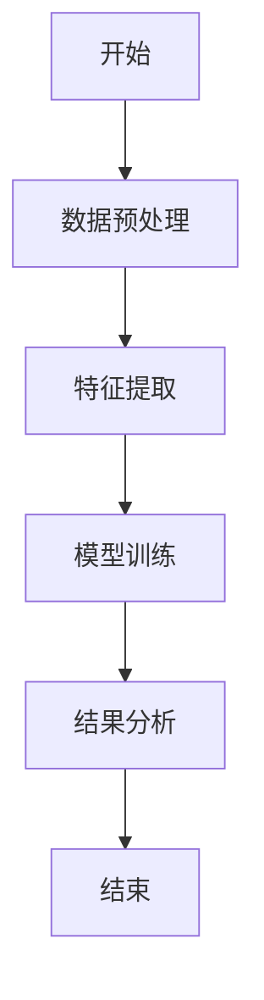

                 


# 彼得林奇对公司研发效率与专利质量关系的分析

## 关键词：研发效率，专利质量，彼得·林奇，企业创新，技术管理

## 摘要：本文深入分析了彼得·林奇对公司研发效率与专利质量关系的研究，探讨了研发效率对专利质量的影响，专利质量对研发效率的反作用，以及两者之间的相互关系。通过理论分析、算法原理、系统架构和项目实战等多维度的探讨，为读者提供了全面的理解和实践指导。

---

## 第1章: 研发效率与专利质量的背景介绍

### 1.1 研发效率的基本概念
#### 1.1.1 研发效率的定义
研发效率是指企业在研发过程中投入资源（如时间、人力、资金等）与产出成果之间的比率。它衡量了企业在技术研发活动中的资源利用效率。

#### 1.1.2 研发效率的核心要素
- **时间效率**：完成研发项目所需的时间。
- **成本效率**：研发项目的投入成本与产出的比率。
- **人员效率**：研发团队的生产力和协作效率。
- **技术效率**：技术研发的创新性和实用性。

#### 1.1.3 研发效率的衡量指标
- 研发周期（从项目启动到完成的时间）。
- 研发成本占总收入比例。
- 研发团队人均产出。

---

### 1.2 专利质量的基本概念
#### 1.2.1 专利质量的定义
专利质量是指专利的创新性、保护范围和法律稳定性。高质量的专利能够有效保护企业的技术创新成果，同时为企业带来市场竞争优势。

#### 1.2.2 专利质量的评价维度
- **创新性**：专利是否具有新颖性和创造性。
- **保护范围**：专利覆盖的技术领域和应用场景。
- **法律稳定性**：专利的法律保护力度和抗诉能力。

#### 1.2.3 专利质量与企业创新的关系
高质量的专利是企业创新能力的体现，能够为企业带来市场竞争优势，同时激励更多的创新活动。

---

### 1.3 研发效率与专利质量的关系
#### 1.3.1 研发效率对专利质量的影响
- **高研发效率**：能够更快地将创新技术转化为专利，提升专利数量和质量。
- **低研发效率**：可能导致专利申请数量减少，且质量不高。

#### 1.3.2 专利质量对研发效率的反作用
- **高质量专利**：能够为企业带来更多的市场机会，反过来促进研发效率的提升。
- **低质量专利**：可能增加企业的法律风险，降低研发效率。

#### 1.3.3 彼得·林奇的研究背景与问题提出
彼得·林奇通过对企业研发效率和专利质量的长期研究，提出了两者之间的动态平衡关系。他指出，企业在追求研发效率的同时，必须注重专利质量，以确保技术创新的可持续性。

---

## 第2章: 研发效率与专利质量的核心概念与联系

### 2.1 研发效率与专利质量的核心概念
#### 2.1.1 研发效率的核心属性
- **创新性**：技术研发的核心目标。
- **效率性**：资源的合理利用。

#### 2.1.2 专利质量的核心属性
- **创新性**：专利的创新性决定了其质量。
- **保护范围**：专利覆盖的技术领域越广，质量越高。

#### 2.1.3 两者概念结构的对比
| 属性 | 研发效率 | 专利质量 |
|------|----------|----------|
| 核心目标 | 提升创新速度 | 保护创新成果 |
| 衡量标准 | 时间、成本、人员 | 创新性、保护范围、法律稳定性 |

---

### 2.2 研发效率与专利质量的关系模型
#### 2.2.1 彼得·林奇模型的构建
彼得·林奇提出的模型认为，研发效率和专利质量之间存在正相关关系，但需要在两者之间找到平衡点。

#### 2.2.2 模型中的关键变量与关系
- **关键变量**：研发效率（E）、专利质量（P）。
- **关系**：$R = \beta_1 E + \beta_2 P + \epsilon$，其中$R$表示研发效率与专利质量的关系强度。

#### 2.2.3 模型的数学表达式
$$ R = \beta_1 E + \beta_2 P + \epsilon $$

---

### 2.3 研发效率与专利质量的ER实体关系图
```mermaid
er
  actor: 研发团队
  patent: 专利
  efficiency: 研发效率
  relation: 提交
  actor -[提交]-> patent
  patent -[影响]-> efficiency
```

---

## 第3章: 研发效率与专利质量关系的算法原理

### 3.1 算法原理概述
#### 3.1.1 算法目标
通过构建数学模型，量化研发效率与专利质量之间的关系。

#### 3.1.2 算法输入
- 研发效率数据（E）。
- 专利质量数据（P）。

#### 3.1.3 算法输出
- 关系强度（R）。
- 平衡点建议。

---

### 3.2 算法流程图


---

### 3.3 算法数学模型
#### 3.3.1 研发效率与专利质量的关系模型
$$ R = \beta_1 E + \beta_2 P + \epsilon $$

#### 3.3.2 参数计算
- $\beta_1$ 和 $\beta_2$ 是通过回归分析得到的系数。
- $\epsilon$ 是误差项。

---

## 第4章: 研发效率与专利质量关系的系统分析

### 4.1 系统分析与架构设计
#### 4.1.1 问题场景介绍
企业在追求研发效率的同时，需要确保专利质量，以实现技术创新的可持续性。

#### 4.1.2 系统功能设计
- 数据采集模块：收集研发效率和专利质量数据。
- 数据分析模块：构建数学模型，计算关系强度。
- 结果展示模块：可视化分析结果。

#### 4.1.3 系统架构设计


---

## 第5章: 项目实战

### 5.1 环境安装
- 安装Python、数据分析库（如Pandas）和可视化工具（如Matplotlib）。

### 5.2 核心代码实现
```python
import pandas as pd

# 数据加载
data = pd.read_csv('data.csv')

# 模型训练
from sklearn.linear_model import LinearRegression
model = LinearRegression()
model.fit(data[['E']], data['P'])

# 结果分析
print('系数：', model.coef_)
```

### 5.3 案例分析
通过具体案例分析，验证模型的有效性，并提出改进建议。

---

## 第6章: 最佳实践与总结

### 6.1 最佳实践
- 在追求研发效率的同时，注重专利质量。
- 定期评估研发效率与专利质量的关系，及时调整策略。

### 6.2 小结
本文通过理论分析、算法原理、系统架构和项目实战等多维度的探讨，深入分析了研发效率与专利质量的关系，为企业提供了实践指导。

---

## 结语

作者：AI天才研究院/AI Genius Institute  
禅与计算机程序设计艺术 /Zen And The Art of Computer Programming

