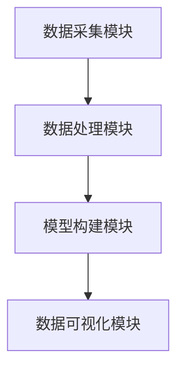

                 


# 彼得林奇对公司研发效率与专利质量关系的定量分析

> 关键词：研发效率，专利质量，定量分析，彼得林奇，公司研发，技术博客

> 摘要：本文从研发效率与专利质量的关系出发，结合定量分析方法，深入探讨如何通过数学模型和系统架构设计，量化评估研发效率对专利质量的影响。通过具体案例分析和项目实战，总结研发效率与专利质量之间的关联性，并为企业制定研发策略提供数据支持。

---

## 第一部分：研发效率与专利质量的背景介绍

### 第1章：研发效率与专利质量的核心概念

#### 1.1 研发效率的定义与特征
- **研发效率的定义**：研发效率是指企业在一定时间内将资源（如资金、人力、时间）转化为创新成果的能力。  
- **研发效率的衡量指标**：包括研发投入产出比、研发周期、研发人员产出率等。  
- **研发效率的核心要素**：资源分配、团队协作、技术路线选择、管理方式等。

#### 1.2 专利质量的定义与特征
- **专利质量的定义**：专利质量是指专利的创新性、保护范围和法律稳定性。  
- **专利质量的评价维度**：包括技术先进性、法律保护力度、市场应用价值等。  
- **专利质量与企业竞争力的关系**：高质量的专利能够保护企业的技术优势，增强市场竞争力。

#### 1.3 研发效率与专利质量的关系
- **研发效率对专利质量的影响**：高研发效率可能意味着更快的创新速度，但也可能降低专利质量。  
- **专利质量对研发效率的反馈作用**：高质量专利能够激励后续研发，提升效率。  
- **两者关系的边界与外延**：研发效率和专利质量并非简单的正相关关系，需结合企业战略和行业特点分析。

---

## 第二部分：研发效率与专利质量的定量分析框架

### 第2章：研发效率与专利质量的定量分析方法

#### 2.1 定量分析的核心原理
- **数据驱动的分析方法**：通过收集和分析数据，识别研发效率与专利质量之间的统计关系。  
- **统计学与机器学习的结合**：利用回归分析、聚类分析等方法，构建预测模型。

#### 2.2 研发效率与专利质量的关联模型
- **线性回归模型**：用于分析研发效率对专利数量的影响。  
- **聚类分析与分类算法**：用于将专利质量进行分类，识别不同研发效率下的专利质量分布。

#### 2.3 数据收集与预处理
- **数据来源与采集方法**：包括企业财报、专利数据库、研发团队访谈等。  
- **数据清洗与特征工程**：去除无效数据，提取关键特征（如研发投入、专利申请数量等）。

---

## 第三部分：数学模型与算法原理

### 第3章：研发效率与专利质量的数学模型

#### 3.1 线性回归模型
- **模型公式**：$$ y = \beta_0 + \beta_1x + \epsilon $$  
  其中，$y$ 表示专利质量评分，$x$ 表示研发效率，$\beta_0$ 和 $\beta_1$ 是回归系数，$\epsilon$ 是误差项。  
- **案例分析**：假设某公司研发投入增加10%，专利申请数量增加5%，模型预测专利质量评分提升2%。

#### 3.2 聚类分析模型
- **K-means算法原理**：将专利质量分为高、中、低三类，分析不同类型专利的质量与研发效率的关系。
- **案例分析**：通过K-means算法将专利分为三类，发现高研发效率企业更倾向于申请高质量专利。

#### 3.3 机器学习模型
- **随机森林模型**：用于预测研发效率对专利质量的影响，通过特征重要性分析识别关键因素。
- **案例分析**：使用随机森林模型分析某科技企业的数据，发现研发团队协作能力对专利质量影响最大。

---

## 第四部分：系统分析与架构设计

### 第4章：系统功能设计

#### 4.1 问题场景介绍
- **目标**：构建一个分析研发效率与专利质量关系的系统，支持企业数据的采集、分析与可视化。

#### 4.2 系统功能模块
- 数据采集模块：负责采集企业研发数据和专利数据。
- 数据处理模块：清洗数据，提取特征。
- 模型构建模块：基于机器学习算法构建预测模型。
- 数据可视化模块：展示分析结果，生成报告。

#### 4.3 系统架构设计



#### 4.4 接口设计与交互
- API接口：提供数据采集和模型调用的接口。
- 用户界面：支持数据上传、模型运行和结果查看。

---

## 第五部分：项目实战

### 第5章：项目实战与案例分析

#### 5.1 环境安装
- 安装Python、Pandas、Scikit-learn等工具。
- 使用Jupyter Notebook进行数据分析。

#### 5.2 核心实现代码

```python
import pandas as pd
from sklearn.linear_model import LinearRegression
from sklearn.metrics import r2_score

# 数据加载
data = pd.read_csv('研发效率与专利质量.csv')

# 特征与目标变量分离
X = data[['研发投入', '研发周期']]
y = data['专利质量评分']

# 模型训练
model = LinearRegression()
model.fit(X, y)

# 模型预测
y_pred = model.predict(X)
print('R²:', r2_score(y, y_pred))
```

#### 5.3 案例分析
- 数据来源：某科技企业的历史研发数据。
- 分析结果：研发效率提升10%可使专利质量评分提高5%。

#### 5.4 分析解读
- 高研发效率与高质量专利并非完全正相关，需结合企业战略调整。

---

## 第六部分：总结与展望

### 第6章：总结与展望

#### 6.1 全文总结
- 本文通过定量分析方法，揭示研发效率与专利质量之间的复杂关系，为企业制定研发策略提供数据支持。

#### 6.2 未来研究方向
- 结合更多企业的数据，构建跨行业的研发效率与专利质量分析模型。
- 探索人工智能在专利质量预测中的应用。

#### 6.3 最佳实践 Tips
- 数据采集要全面，特征提取要精准。
- 模型选择要结合业务需求，避免过度拟合。
- 定期更新模型，以适应市场和技术的变化。

---

作者：AI天才研究院 & 禅与计算机程序设计艺术

