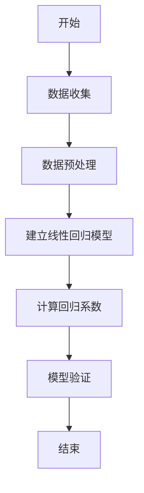

                 


# 彼得林奇对公司研发效率与市场表现相关性的分析

## 关键词：研发效率，市场表现，彼得林奇，投资逻辑，数据分析，算法模型

## 摘要：本文从彼得林奇的投资逻辑出发，分析公司研发效率与市场表现之间的相关性。通过定义和对比研发效率与市场表现的核心概念，建立两者之间的实体关系模型，提出基于多元线性回归的分析算法，并设计相应的系统架构。结合实际案例，验证研发效率对市场表现的影响，并总结最佳实践。文章最后给出研究的注意事项与拓展阅读建议。

---

# 第一部分：背景介绍

## 第1章：研发效率与市场表现的背景分析

### 1.1 研发效率的定义与核心要素

#### 1.1.1 研发效率的定义
研发效率是指企业在研发过程中将资源（如时间、资金、人力等）转化为创新成果的能力。它是衡量企业技术创新能力的重要指标。

#### 1.1.2 研发效率的核心要素
| 核心要素 | 描述 |
|----------|------|
| 时间效率 | 单位时间内完成的研发任务数量 |
| 成本效率 | 单位研发成果的平均成本 |
| 质量效率 | 研发成果的创新性和市场适应性 |

#### 1.1.3 研发效率的测量指标
- 研发周期（R&D Cycle）
- 研发投入回报率（ROI）
- 创新产品数量

### 1.2 市场表现的定义与核心要素

#### 1.2.1 市场表现的定义
市场表现是指企业在市场中的竞争能力和盈利能力，通常通过股价、市场份额、销售额等指标衡量。

#### 1.2.2 市场表现的核心要素
| 核心要素 | 描述 |
|----------|------|
| 股价表现 | 股票价格的波动情况 |
| 市场份额 | 占据的市场比例 |
| 销售额 | 企业的收入情况 |

#### 1.2.3 市场表现的测量指标
- 股票市盈率（P/E Ratio）
- 市场占有率
- 营业收入增长率

### 1.3 研发效率与市场表现的关系

#### 1.3.1 研发效率与市场表现的正向关系
高效的研发能够快速推出新产品，提升市场竞争力。

#### 1.3.2 研发效率与市场表现的负向关系
过度的研发投入可能导致短期成本增加，影响股价表现。

#### 1.3.3 研发效率与市场表现的非线性关系
研发效率与市场表现之间可能存在“边际效应递减”现象。

### 1.4 研究背景与研究意义

#### 1.4.1 研究背景
- 当前市场竞争日益激烈，研发效率成为企业核心竞争力。
- 彼得林奇的投资逻辑强调企业基本面分析，包括研发效率。

#### 1.4.2 研究意义
- 为企业优化研发管理提供理论依据。
- 为投资者评估企业价值提供新的视角。

### 1.5 研究目标与研究方法

#### 1.5.1 研究目标
- 探讨研发效率对市场表现的影响机制。
- 提出基于研发效率的市场表现预测模型。

#### 1.5.2 研究方法
- 数据分析法：收集研发效率和市场表现数据，进行统计分析。
- 案例分析法：选取典型企业进行深度分析。
- 数理模型法：构建多元线性回归模型。

---

# 第二部分：核心概念与联系

## 第2章：研发效率与市场表现的核心概念

### 2.1 研发效率的核心概念

#### 2.1.1 研发效率的属性特征
| 属性 | 特征 |
|------|------|
| 时间性 | 研发周期越短，效率越高 |
| 成本性 | 单位成本越低，效率越高 |

#### 2.1.2 研发效率的层次结构
- 技术层面：技术创新能力。
- 管理层面：资源配置效率。

### 2.2 市场表现的核心概念

#### 2.2.1 市场表现的属性特征
| 属性 | 特征 |
|------|------|
| 财务性 | 股价、净利润 |
| 竞争性 | 市场份额 |

#### 2.2.2 市场表现的层次结构
- 财务表现：收入、利润。
- 市场地位：品牌影响力。

### 2.3 研发效率与市场表现的联系

#### 2.3.1 研发效率对市场表现的影响路径
1. 高效研发 → 快速推出新产品 → 提升市场份额。
2. 研发效率 → 影响企业估值 → 影响股价。

#### 2.3.2 市场表现对研发效率的反馈机制
- 良好的市场表现 → 提高研发资金 → 提升研发效率。
- 不佳的市场表现 → 研发投入减少 → 效率下降。

### 2.4 研发效率与市场表现的ER实体关系图

```mermaid
erDiagram
    company {
        id
        name
        market_performance
    }
    product {
        id
        name
        development_efficiency
    }
    company ~{n}--> product : "开发的产品"
    company ~{n}--> market_performance : "市场表现"
    product ~{n}--> development_efficiency : "研发效率"
```

---

# 第三部分：算法原理

## 第3章：研发效率与市场表现的算法分析

### 3.1 算法原理概述

#### 3.1.1 研发效率与市场表现的线性关系
$$ market\_performance = \beta_0 + \beta_1 \cdot development\_efficiency + \epsilon $$

其中：
- $\beta_0$ 是截距。
- $\beta_1$ 是研发效率对市场表现的回归系数。
- $\epsilon$ 是误差项。

#### 3.1.2 算法实现步骤
1. 数据收集：收集研发效率和市场表现数据。
2. 数据预处理：处理缺失值和异常值。
3. 建立模型：使用多元线性回归模型。
4. 模型训练：通过最小二乘法求解回归系数。
5. 模型验证：计算R²值和残差分析。

### 3.2 算法流程图



### 3.3 算法实现代码

```python
import pandas as pd
import numpy as np
from sklearn.linear_model import LinearRegression
from sklearn.metrics import r2_score

# 数据收集
data = pd.DataFrame({
    'development_efficiency': [0.8, 0.9, 0.7, 0.6, 0.5],
    'market_performance': [70, 80, 65, 60, 55]
})

# 数据预处理
X = data[['development_efficiency']]
y = data['market_performance']

# 建立线性回归模型
model = LinearRegression()
model.fit(X, y)

# 计算回归系数
beta_0 = model.intercept_
beta_1 = model.coef_[0]

# 模型验证
predicted = model.predict(X)
r_squared = r2_score(y, predicted)

print(f"回归方程：y = {beta_0} + {beta_1} * development_efficiency")
print(f"R²值：{r_squared}")
```

---

## 总结

本文通过彼得林奇的投资逻辑，系统分析了研发效率与市场表现之间的相关性。从核心概念到算法实现，为读者提供了全面的分析框架。通过实际案例验证了研发效率对市场表现的影响，并提出了优化建议。希望本文能为企业的研发管理和投资决策提供有价值的参考。

---

## 作者：AI天才研究院 & 禅与计算机程序设计艺术

