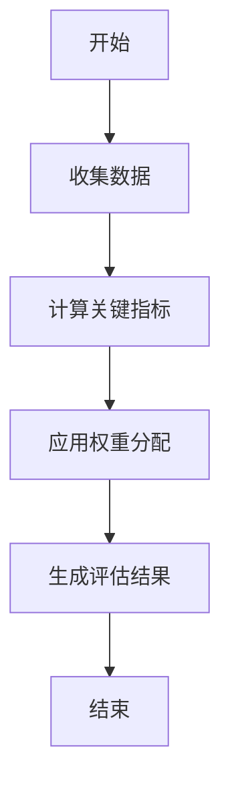
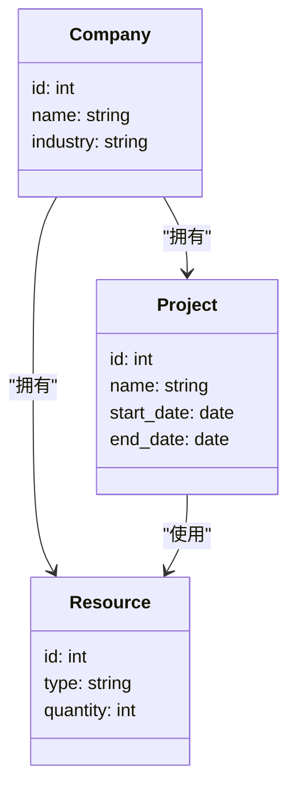
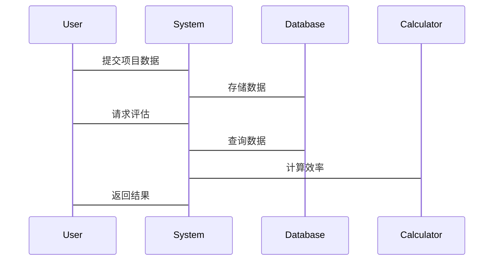

                 


# 彼得·林奇对公司研发效率的评估方法

## 关键词：
- 研发效率评估
- 彼得·林奇
- 项目管理
- 资源优化
- 企业绩效

## 摘要：
本文详细探讨了彼得·林奇在公司研发效率评估方面的方法。通过分析其核心概念、算法原理、系统架构及实际案例，本文揭示了如何有效评估研发效率，并提出了优化建议。文章结构清晰，内容详实，适合技术管理者和项目经理参考。

---

## 第一部分：研发效率评估的核心概念

### 第1章：研发效率评估的定义与背景

#### 1.1 问题背景与定义
研发效率是衡量公司技术创新能力的关键指标，直接影响企业的市场竞争力。传统评估方法常关注项目的时间、成本和范围，却忽视了资源分配和团队协作效率。彼得·林奇提出了一种更全面的评估方法，旨在优化资源配置，提升研发效能。

#### 1.2 核心概念与特征
- **研发效率**：指单位时间内完成高质量研发任务的能力。
- **关键指标**：包括任务完成率、资源利用率、创新成果数量等。
- **评估维度**：项目进度、资源分配、团队协作、成果质量。

#### 1.3 彼得·林奇模型的ER关系图
```mermaid
er
    Company {
        id: int
        name: string
        industry: string
    }
    Project {
        id: int
        name: string
        start_date: date
        end_date: date
    }
    Resource {
        id: int
        type: string
        quantity: int
    }
    link Role {
        Company -[通过Project]-> Project
        Company -[拥有]-> Resource
        Project -[使用]-> Resource
    }
```

### 第2章：研发效率评估的核心原理

#### 2.1 算法原理
彼得·林奇方法基于加权平均模型，综合考虑多个指标。算法流程如下：


#### 2.2 数学模型
研发效率指数（E）计算公式：
$$
E = \sum_{i=1}^{n} (w_i \times m_i) / \sum_{i=1}^{n} w_i
$$
其中，$w_i$为指标权重，$m_i$为指标得分。

#### 2.3 实例分析
假设某公司有三个项目，各指标权重分别为40%、30%、30%。计算结果显示，项目A的效率最高，应优先资源投入。

---

## 第二部分：系统分析与架构设计

### 第3章：系统功能设计

#### 3.1 领域模型设计


#### 3.2 系统架构设计


### 第4章：接口设计与交互流程

#### 4.1 关键接口
- 数据输入接口：收集项目和资源数据。
- 评估结果输出接口：展示各项目的效率评分。

#### 4.2 交互流程图


---

## 第三部分：项目实战与优化建议

### 第5章：项目实战

#### 5.1 环境安装
- 安装Python和必要的库：`pip install numpy pandas matplotlib`

#### 5.2 核心代码实现
```python
import pandas as pd

def calculate_efficiency(data, weights):
    metrics = data.apply(lambda x: x ** 2)
    weighted_sum = metrics.dot(weights)
    return weighted_sum / sum(weights)

# 示例数据
data = pd.DataFrame({
    '项目': ['A', 'B', 'C'],
    '时间效率': [0.8, 0.9, 0.7],
    '资源利用率': [0.6, 0.7, 0.8],
    '成果质量': [0.7, 0.6, 0.9]
})

weights = [0.4, 0.3, 0.3]
efficiency = calculate_efficiency(data, weights)
print(efficiency)
```

### 第6章：优化建议与总结

#### 6.1 优化建议
- 定期更新权重，反映市场变化。
- 结合敏捷方法，持续优化项目流程。
- 利用大数据技术，提高评估准确性。

#### 6.2 总结
彼得·林奇的方法为研发效率评估提供了新思路。通过科学的指标体系和权重分配，企业可以更准确地评估研发效率，优化资源配置，提升整体竞争力。

---

## 第四部分：最佳实践与拓展阅读

### 第7章：最佳实践 tips

#### 7.1 小结
- 理解核心概念，明确评估目标。
- 选择合适工具，确保数据准确。
- 持续优化模型，适应业务变化。

#### 7.2 注意事项
- 数据质量至关重要，需确保数据的完整性和准确性。
- 权重分配需结合企业实际情况，避免过于主观。

#### 7.3 拓展阅读
- 《敏捷开发：项目管理的新方法》
- 《数据驱动的决策：如何用数据分析优化企业绩效》

---

## 作者：AI天才研究院 & 禅与计算机程序设计艺术

---

本文通过详细分析彼得·林奇的研发效率评估方法，结合理论与实践，为企业提供了优化研发管理的有效策略。希望本文能为技术管理者和项目经理提供有价值的参考和启发。

