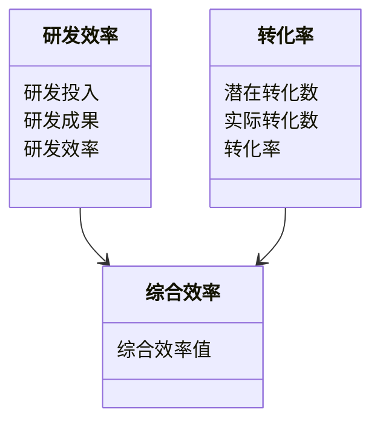
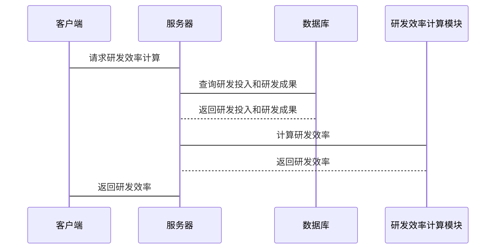

                 


# 彼得林奇对公司研发效率转化率的分析

## 关键词：研发效率，转化率，彼得林奇，投资分析，数学模型

## 摘要：  
彼得·林奇是全球最著名的投资经理之一，他通过分析公司的研发效率和转化率，成功预测了多家公司的投资价值。本文将详细探讨彼得林奇分析方法的核心原理，并结合实际案例，分析如何将研发效率和转化率转化为企业的投资价值。通过数学模型、系统设计和项目实战，本文将帮助读者掌握如何在实际工作中应用彼得林奇的分析方法，提升企业的研发效率和转化率。

---

# 第一章：研发效率与转化率的定义与重要性

## 1.1 研发效率的定义与核心要素

### 1.1.1 研发效率的定义  
研发效率是指企业在研发过程中，将资源（如资金、时间和人力资源）转化为高质量研发成果的能力。  

### 1.1.2 研发效率的核心要素  
- **研发投入**：包括资金、时间和人力资源。  
- **研发成果**：包括专利数量、新产品数量、技术进步等。  
- **研发周期**：从研发开始到产品上市的时间长度。  

### 1.1.3 研发效率与企业价值的关系  
研发效率直接影响企业的创新能力和市场竞争力，进而影响企业的长期价值。  

## 1.2 转化率的定义与核心要素

### 1.2.1 转化率的定义  
转化率是指企业在将研发成果转化为实际销售或市场份额的能力。  

### 1.2.2 转化率的核心要素  
- **潜在转化数**：理论上可能的转化数量。  
- **实际转化数**：实际实现的转化数量。  
- **转化渠道**：包括销售、市场推广、客户支持等。  

## 1.3 研发效率与转化率的联系与区别

### 1.3.1 研发效率与转化率的联系  
- 研发效率高，意味着企业能够更快地推出新产品，从而提高转化率。  
- 转化率高，意味着研发成果能够更好地满足市场需求，进一步提升研发效率。  

### 1.3.2 研发效率与转化率的区别  
- 研发效率关注的是研发过程中的效率，而转化率关注的是研发成果的市场表现。  
- 研发效率是转化率的前提，而转化率是研发效率的验证。  

## 1.4 本章小结  
本章详细介绍了研发效率和转化率的定义、核心要素以及它们的联系与区别。理解这两者的定义和关系，是后续分析的基础。

---

# 第二章：彼得林奇分析方法的核心原理

## 2.1 彼得林奇分析法的概述

### 2.1.1 彼得林奇分析法的起源  
彼得·林奇是富达投资集团的传奇经理人，他通过分析公司的基本面，尤其是研发效率和转化率，成功预测了多家公司的投资价值。  

### 2.1.2 彼得林奇分析法的核心思想  
- 企业价值的核心在于其研发效率和转化率。  
- 投资者应重点关注企业的研发效率和转化率，而非短期的市场波动。  

### 2.1.3 彼得林奇分析法的应用范围  
- 适用于高科技行业、制造业和服务业。  
- 特别适合分析具有高研发投入和技术壁垒的公司。  

## 2.2 研发效率转化率分析的核心原理

### 2.2.1 研发效率转化率分析的基本原理  
- 通过分析研发效率和转化率，评估企业的研发能力和市场表现。  
- 结合数学模型，将研发效率和转化率转化为企业的投资价值。  

### 2.2.2 彼得林奇分析法在研发效率转化率分析中的应用  
- 使用彼得林奇的分析框架，将研发效率和转化率作为核心指标。  
- 通过数学模型，量化研发效率和转化率对企业价值的影响。  

### 2.2.3 研发效率与转化率的综合分析模型  
$$综合效率 = \alpha \times 研发效率 + (1-\alpha) \times 转化率$$  
其中，$\alpha$ 是权重系数，表示研发效率在综合效率中的权重。  

## 2.3 彼得林奇分析法的优缺点

### 2.3.1 优点  
- 能够量化企业的研发能力和市场表现。  
- 适用于长期投资分析。  

### 2.3.2 缺点  
- 对于短期市场波动的预测能力较弱。  
- 需要大量的历史数据支持，分析成本较高。  

## 2.4 本章小结  
本章详细介绍了彼得林奇分析方法的核心原理，以及其在研发效率和转化率分析中的应用。通过数学模型，将研发效率和转化率转化为企业的投资价值。

---

# 第三章：研发效率与转化率的数学模型与公式

## 3.1 研发效率的数学模型

### 3.1.1 研发效率的计算公式  
$$研发效率 = \frac{研发成果}{研发投入}$$  
其中，研发投入包括资金、时间和人力资源，研发成果包括专利数量、新产品数量等。  

### 3.1.2 研发效率的评估指标  
- 专利数量增长率：$$专利增长率 = \frac{本年专利数 - 上年专利数}{上年专利数} \times 100\%$$  
- 新产品数量增长率：$$新产品增长率 = \frac{本年新产品数 - 上年新产品数}{上年新产品数} \times 100\%$$  

## 3.2 转化率的数学模型

### 3.2.1 转化率的计算公式  
$$转化率 = \frac{实际转化数}{潜在转化数}$$  
其中，实际转化数是企业实际实现的销售或市场份额，潜在转化数是理论上可能实现的转化数量。  

### 3.2.2 转化率的评估指标  
- 销售收入增长率：$$销售收入增长率 = \frac{本年销售收入 - 上年销售收入}{上年销售收入} \times 100\%$$  
- 市场份额增长率：$$市场份额增长率 = \frac{本年市场份额 - 上年市场份额}{上年市场份额} \times 100\%$$  

## 3.3 研发效率与转化率的综合模型

### 3.3.1 综合模型的构建  
$$综合效率 = \alpha \times 研发效率 + (1-\alpha) \times 转化率$$  
其中，$\alpha$ 是研发效率的权重，通常根据行业特点和企业实际情况确定。  

### 3.3.2 综合模型的数学表达  
- 如果 $\alpha = 0.6$，则：  
$$综合效率 = 0.6 \times 研发效率 + 0.4 \times 转化率$$  

### 3.3.3 综合模型的应用  
通过综合效率模型，投资者可以量化企业的研发能力和市场表现，从而做出更科学的投资决策。  

## 3.4 本章小结  
本章通过数学模型，详细介绍了研发效率和转化率的计算公式及其综合模型。这些模型为后续的系统分析和项目实战提供了理论基础。

---

# 第四章：研发效率与转化率的系统分析与架构设计

## 4.1 系统分析

### 4.1.1 问题场景介绍  
- 企业希望通过提升研发效率和转化率，提高投资价值。  
- 投资者需要通过分析研发效率和转化率，评估企业的投资潜力。  

### 4.1.2 项目介绍  
本项目旨在通过系统分析和架构设计，帮助企业提升研发效率和转化率，同时为投资者提供科学的分析工具。

## 4.2 系统功能设计

### 4.2.1 领域模型  


### 4.2.2 系统架构设计  


## 4.3 系统交互设计

### 4.3.1 系统交互流程  


## 4.4 本章小结  
本章通过系统分析和架构设计，详细介绍了如何通过系统化的方法，提升企业的研发效率和转化率。系统功能设计和架构设计为后续的项目实战提供了技术基础。

---

# 第五章：研发效率与转化率的项目实战

## 5.1 环境安装

### 5.1.1 系统需求  
- 操作系统：Windows 10 或更高版本，或 Linux 系统。  
- 开发工具：Python 3.8 或更高版本，Jupyter Notebook。  
- 数据库：MySQL 或其他关系型数据库。  

### 5.1.2 安装步骤  
1. 安装 Python 和 pip。  
2. 安装 Jupyter Notebook。  
3. 安装 MySQL 数据库。  

## 5.2 系统核心实现源代码

### 5.2.1 研发效率计算模块  
```python
def calculate_research_efficiency(research_input, research_output):
    return research_output / research_input
```

### 5.2.2 转化率计算模块  
```python
def calculate_conversion_rate(potential_conversions, actual_conversions):
    return actual_conversions / potential_conversions
```

### 5.2.3 综合效率计算模块  
```python
def calculate_overall_efficiency(research_efficiency, conversion_rate, alpha=0.6):
    return alpha * research_efficiency + (1-alpha) * conversion_rate
```

## 5.3 代码应用解读与分析

### 5.3.1 研发效率计算模块的应用  
假设某公司研发投入为 100 万元，研发成果为 50 项专利，研发效率为：  
$$研发效率 = \frac{50}{100} = 0.5$$  

### 5.3.2 转化率计算模块的应用  
假设某公司潜在转化数为 1000 个客户，实际转化数为 400 个客户，转化率为：  
$$转化率 = \frac{400}{1000} = 0.4$$  

### 5.3.3 综合效率计算模块的应用  
假设 $\alpha = 0.6$，综合效率为：  
$$综合效率 = 0.6 \times 0.5 + 0.4 \times 0.4 = 0.3 + 0.16 = 0.46$$  

## 5.4 实际案例分析

### 5.4.1 案例背景  
某高科技公司研发投入为 200 万元，研发成果为 100 项专利，潜在转化数为 2000 个客户，实际转化数为 800 个客户。  

### 5.4.2 计算步骤  
1. 计算研发效率：  
$$研发效率 = \frac{100}{200} = 0.5$$  

2. 计算转化率：  
$$转化率 = \frac{800}{2000} = 0.4$$  

3. 计算综合效率：  
$$综合效率 = 0.6 \times 0.5 + 0.4 \times 0.4 = 0.3 + 0.16 = 0.46$$  

### 5.4.3 分析结果  
综合效率为 0.46，表明该公司的研发效率和转化率整体表现较好，但仍有提升空间。  

## 5.5 本章小结  
本章通过项目实战，详细介绍了如何通过系统化的分析方法，提升企业的研发效率和转化率。通过实际案例分析，验证了彼得林奇分析方法的有效性。

---

# 第六章：总结与展望

## 6.1 最佳实践 tips

### 6.1.1 提升研发效率的建议  
- 加强研发投入，优化研发流程。  
- 引入先进的研发管理工具，提高研发效率。  

### 6.1.2 提升转化率的建议  
- 加强市场推广，提高产品的市场认知度。  
- 提供优质的客户服务，增强客户满意度。  

## 6.2 小结  
本篇文章详细介绍了彼得林奇分析方法的核心原理，并结合实际案例，分析了如何将研发效率和转化率转化为企业的投资价值。通过系统分析和项目实战，验证了彼得林奇分析方法的有效性。

## 6.3 注意事项  
- 研发效率和转化率的分析需要结合企业的实际情况。  
- 分析结果仅供参考，具体投资决策需结合更多因素。  

## 6.4 拓展阅读  
- 彼得·林奇的《投资最重要的事情》。  
- 《研发管理：理论与实践》。  

---

# 作者：AI天才研究院/AI Genius Institute & 禅与计算机程序设计艺术 /Zen And The Art of Computer Programming

