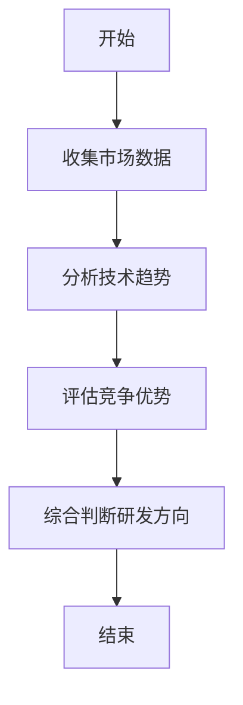
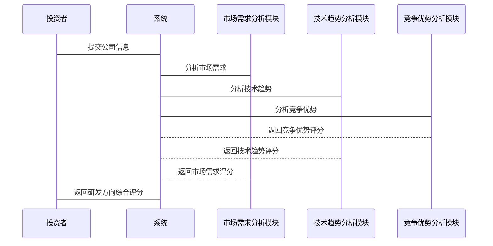

                 


# 彼得林奇对公司研发方向的前瞻性分析

## 关键词：
彼得林奇、研发方向、投资分析、市场需求、技术趋势、竞争优势

## 摘要：
本文将深入分析彼得·林奇在公司研发方向上的前瞻性分析方法，探讨其投资哲学、分析框架和实际应用案例。通过对比分析和系统设计，揭示研发方向分析的核心要素及其相互关系，结合数学模型和算法原理，提供切实可行的分析工具和最佳实践建议。

---

# 第1章 彼得林奇与投资分析概述

## 1.1 彼得林奇的生平与投资理念

### 1.1.1 彼得林奇的生平简介
- 彼得·林奇的早期经历与职业生涯
- 彼得林奇在富达投资集团的成就
- 彼得林奇的投资哲学与核心理念

### 1.1.2 彼得林奇的投资哲学
- 价值投资的核心思想
- 长期投资与股东价值最大化
- 彼得林奇对市场的独特见解

### 1.1.3 彼得林奇对研发方向的重视
- 研发方向在投资决策中的重要性
- 彼得林奇如何识别具有前瞻性研发方向的公司
- 研发投入与公司长期增长的关系

## 1.2 研发方向分析的背景与意义

### 1.2.1 研发方向分析的背景
- 现代企业竞争的核心：技术创新与研发能力
- 研发方向对企业长期发展的战略影响
- 投资者如何通过研发方向分析评估企业潜力

### 1.2.2 研发方向分析的意义
- 识别具有成长性的投资标的
- 预测公司未来盈利能力的关键因素
- 为投资者提供决策支持的科学依据

### 1.2.3 研发方向分析的核心要素
- 市场需求分析
- 技术可行性评估
- 竞争优势分析

## 1.3 彼得林奇分析方法的核心框架

### 1.3.1 市场需求分析
- 彼得林奇如何识别市场需求的变化
- 从消费者行为到市场趋势的分析方法
- 市场需求与研发方向的关联性

### 1.3.2 技术趋势分析
- 彼得林奇对技术发展的敏感性
- 如何通过技术趋势预测企业研发方向
- 技术创新对企业竞争优势的影响

### 1.3.3 竞争优势分析
- 彼得林奇如何评估企业的竞争优势
- 核心技术与研发能力的关联
- 竞争环境对研发方向选择的影响

## 1.4 本章小结
- 彼得林奇投资分析的核心框架
- 研发方向分析的关键要素
- 从市场需求、技术趋势到竞争优势的综合分析

---

# 第2章 研发方向分析的核心概念与联系

## 2.1 研发方向分析的关键要素

### 2.1.1 市场需求
- 市场需求的定义与分类
- 影响市场需求的主要因素
- 如何通过市场需求分析预测研发方向

### 2.1.2 技术可行性
- 技术可行性评估的步骤与方法
- 技术趋势分析的工具与技巧
- 技术可行性与研发方向的关系

### 2.1.3 竞争环境
- 竞争环境的定义与影响
- 竞争对手分析在研发方向选择中的作用
- 竞争优势的动态变化与研发方向调整

## 2.2 核心概念对比分析

### 2.2.1 市场需求与技术可行性对比
- 市场需求的驱动因素
- 技术可行性的关键要素
- 两者在研发方向选择中的权重

### 2.2.2 技术可行性与竞争优势对比
- 技术可行性对竞争优势的影响
- 竞争优势的动态变化
- 技术可行性和竞争优势的综合评估

### 2.2.3 市场需求与竞争优势的综合分析
- 市场需求与竞争优势的协同关系
- 综合分析方法与应用案例
- 综合评估对研发方向选择的指导意义

## 2.3 研发方向分析的ER实体关系图

### 2.3.1 实体关系图的构建
```mermaid
erDiagram
    customer[投资者] {
        <属性>
        投资者ID : integer
        投资者名称 : string
        投资目标 : string
    }
    company[公司] {
        <属性>
        公司ID : integer
        公司名称 : string
        主要业务 : string
    }
    research_direction[研发方向] {
        <属性>
        方向ID : integer
        方向名称 : string
        技术类型 : string
    }
    competition[竞争环境] {
        <属性>
        竞争对手ID : integer
        竞争对手名称 : string
        竞争优势 : string
    }
    market_demand[市场需求] {
        <属性>
        市场ID : integer
        市场规模 : integer
        市场趋势 : string
    }
```

### 2.3.2 实体关系图的分析
- 实体关系图的结构与含义
- 各实体之间的关联关系
- 如何通过实体关系图进行研发方向的综合分析

## 2.4 本章小结
- 研发方向分析的核心概念
- 核心概念之间的相互关系
- 综合分析方法的应用价值

---

# 第3章 研发方向分析的算法原理讲解

## 3.1 算法原理概述

### 3.1.1 算法原理的核心思想
- 算法原理的背景与目标
- 算法的基本原理与步骤
- 算法的输入与输出

### 3.1.2 算法的流程图


### 3.1.3 算法的数学模型与公式
- 算法的数学模型
$$
\text{研发方向得分} = \frac{市场需求权重 \times 市场需求评分 + 技术趋势权重 \times 技术趋势评分 + 竞争优势权重 \times 竞争优势评分}{3}
$$

## 3.2 算法的实现步骤

### 3.2.1 数据收集与预处理
- 数据来源与收集方法
- 数据清洗与特征提取
- 数据标准化与归一化

### 3.2.2 市场需求分析
- 市场需求的指标体系
- 市场需求评分的计算方法
- 市场需求对研发方向的影响权重

### 3.2.3 技术趋势分析
- 技术趋势的指标体系
- 技术趋势评分的计算方法
- 技术趋势对研发方向的影响权重

### 3.2.4 竞争优势分析
- 竞争优势的指标体系
- 竞争优势评分的计算方法
- 竞争优势对研发方向的影响权重

## 3.3 算法的代码实现

### 3.3.1 环境安装
- Python版本要求
- 需要安装的库与工具
- 环境配置步骤

### 3.3.2 核心代码实现
```python
def calculate_research_direction_score(market_demand_score, technology_trend_score, competitive_advantage_score):
    return (market_demand_score + technology_trend_score + competitive_advantage_score) / 3

# 示例数据
market_demand_score = 80
technology_trend_score = 75
competitive_advantage_score = 85

# 计算研发方向得分
score = calculate_research_direction_score(market_demand_score, technology_trend_score, competitive_advantage_score)
print(f"研发方向得分为: {score}")
```

### 3.3.3 代码解读与分析
- 代码的功能与作用
- 代码的运行结果与分析
- 代码的优化与改进

## 3.4 本章小结
- 算法原理的详细讲解
- 算法实现的步骤与方法
- 算法在研发方向分析中的应用价值

---

# 第4章 研发方向分析的系统分析与架构设计

## 4.1 系统分析

### 4.1.1 问题场景介绍
- 研发方向分析的典型问题场景
- 问题场景的特征与特点
- 问题场景的解决方案

### 4.1.2 系统功能设计
- 系统功能模块划分
- 每个模块的功能描述
- 模块之间的交互关系

## 4.2 架构设计

### 4.2.1 系统架构设计


### 4.2.2 模块划分与职责
- 市场需求分析模块
- 技术趋势分析模块
- 竞争优势分析模块
- 综合评分模块

### 4.2.3 系统交互设计


## 4.3 本章小结
- 系统分析的方法与步骤
- 系统架构设计的思路与方法
- 系统交互设计的实现与优化

---

# 第5章 研发方向分析的项目实战

## 5.1 项目背景与目标

### 5.1.1 项目背景
- 项目来源与背景介绍
- 项目目标与预期成果
- 项目实施的可行性分析

## 5.2 项目实施步骤

### 5.2.1 环境安装
- 开发环境的配置与安装
- 数据库的搭建与配置
- 工具链的安装与配置

### 5.2.2 系统核心实现

#### 5.2.2.1 数据收集与预处理
- 数据来源与收集方法
- 数据清洗与特征提取
- 数据标准化与归一化

#### 5.2.2.2 市场需求分析
- 市场需求的指标体系
- 市场需求评分的计算方法
- 市场需求对研发方向的影响权重

#### 5.2.2.3 技术趋势分析
- 技术趋势的指标体系
- 技术趋势评分的计算方法
- 技术趋势对研发方向的影响权重

#### 5.2.2.4 竞争优势分析
- 竞争优势的指标体系
- 竞争优势评分的计算方法
- 竞争优势对研发方向的影响权重

#### 5.2.2.5 综合评分与决策
- 综合评分的计算方法
- 决策规则的制定与实施
- 综合评分结果的解读与应用

### 5.2.3 项目实现代码
```python
def calculate_research_direction_score(market_demand_score, technology_trend_score, competitive_advantage_score):
    return (market_demand_score + technology_trend_score + competitive_advantage_score) / 3

# 示例数据
market_demand_score = 80
technology_trend_score = 75
competitive_advantage_score = 85

# 计算研发方向得分
score = calculate_research_direction_score(market_demand_score, technology_trend_score, competitive_advantage_score)
print(f"研发方向得分为: {score}")
```

### 5.2.4 代码解读与分析
- 代码的功能与作用
- 代码的运行结果与分析
- 代码的优化与改进

## 5.3 项目小结

### 5.3.1 项目成果
- 项目实施的成果与收获
- 研发方向分析模型的实际应用效果
- 模型的准确性和可靠性评估

### 5.3.2 经验总结
- 项目实施中的经验和教训
- 关键问题与解决方案
- 未来改进的方向与建议

---

# 第6章 研发方向分析的最佳实践与注意事项

## 6.1 最佳实践

### 6.1.1 数据收集与处理
- 数据来源的多样性和可靠性
- 数据清洗与特征提取的关键点
- 数据标准化与归一化的注意事项

### 6.1.2 指标体系设计
- 指标体系的科学性和合理性
- 指标权重的合理分配
- 指标的动态调整与优化

### 6.1.3 分析结果的解读与应用
- 分析结果的直观呈现与可视化
- 结果的解读与实际应用
- 结果对投资决策的指导意义

## 6.2 注意事项

### 6.2.1 数据质量控制
- 数据清洗与预处理的重要性
- 数据偏差的识别与修正
- 数据安全与隐私保护

### 6.2.2 模型的局限性
- 模型的适用范围与限制
- 模型的可解释性与透明度
- 模型的动态调整与优化

### 6.2.3 伦理与法律问题
- 数据使用的合法性与合规性
- 模型的公平性与公正性
- 伦理风险的识别与控制

## 6.3 本章小结
- 最佳实践的核心要点
- 实施中的注意事项与解决方案
- 研发方向分析的未来发展趋势

---

# 第7章 总结与展望

## 7.1 总结

### 7.1.1 核心内容回顾
- 彼得林奇分析方法的核心框架
- 研发方向分析的关键要素
- 算法原理与系统设计的要点
- 项目实战与最佳实践的经验总结

### 7.1.2 实施效果评估
- 模型的准确性和可靠性
- 分析结果的实际应用效果
- 投资者与企业的反馈与评价

## 7.2 展望

### 7.2.1 研发方向分析的未来发展趋势
- 新技术与新方法的应用前景
- 数据科学与人工智能的深度融合
- 全球化背景下的研发方向分析

### 7.2.2 投资者与企业的应对策略
- 投资者如何提升研发方向分析能力
- 企业如何优化自身的研发方向选择
- 未来投资环境的变化与应对策略

### 7.2.3 研发方向分析的创新方向
- 新算法与新工具的研发
- 数据共享与合作机制的建立
- 全球化与本地化的平衡与协调

---

# 参考文献

---

# 作者

作者：AI天才研究院/AI Genius Institute & 禅与计算机程序设计艺术 /Zen And The Art of Computer Programming

