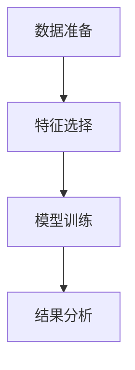
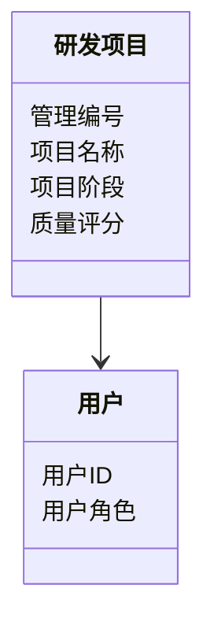

                 


# 彼得林奇对公司研发管线质量的评估

## 关键词：彼得林奇，研发管线，质量评估，算法模型，投资分析

## 摘要：本文深入探讨彼得林奇对公司研发管线质量的评估方法，从背景、核心概念到算法实现，结合系统架构和项目实战，全面解析如何应用其评估模型进行研发管线质量分析，为企业投资决策提供科学依据。

---

## 第1章 研发管线质量评估的背景与重要性

### 1.1 研发管线的定义与重要性

#### 1.1.1 研发管线的定义
研发管线是指公司从研发开始到产品上市的完整过程，包括产品开发、测试、迭代等多个阶段。质量评估是对每个阶段的质量进行测量和分析，确保最终产品符合预期。

#### 1.1.2 研发管线在公司战略中的重要性
研发管线是公司创新的核心，直接影响公司的市场竞争力和未来收益。高质量的研发管线能够确保产品按时推出，满足市场需求，提升公司利润。

#### 1.1.3 研发管线质量评估的必要性
评估研发管线质量有助于识别潜在风险，优化开发流程，降低成本，提高效率。通过评估可以及时调整策略，确保项目顺利进行。

### 1.2 彼得·林奇的评估方法简介

#### 1.2.1 彼得·林奇的背景与投资理念
彼得·林奇是著名投资专家，强调基本面分析和深入研究，尤其关注公司的研发能力。他认为研发管线的质量是公司长期成功的关键因素。

#### 1.2.2 林奇评估法的核心思想
林奇认为，评估研发管线应关注项目的可行性、市场潜力和管理团队的能力。他通过分析项目的市场定位、技术优势和团队执行力，判断项目的成功可能性。

#### 1.2.3 林奇评估法在研发管线中的应用
林奇评估法被广泛应用于研发管线的质量评估，帮助投资者识别高潜力项目，降低投资风险。

---

## 第2章 研发管线质量评估的核心概念与联系

### 2.1 核心概念与联系

#### 2.1.1 评估指标与模型构建
研发管线质量评估涉及多个指标，如技术可行性、市场潜力、开发周期等。构建评估模型需要综合考虑这些指标，确保评估的全面性和准确性。

#### 2.1.2 研发阶段与质量评估的关系
不同研发阶段有不同的质量评估重点。例如，在概念阶段，重点评估市场需求和技术可行性；在开发阶段，重点评估项目进度和资源分配。

#### 2.1.3 评估结果与公司价值的关联
高质量的研发管线能够提升公司市场竞争力，增加利润，进而提升公司整体价值。

### 2.2 评估指标对比分析

#### 2.2.1 各评估指标的特征对比（表格形式）

| 评估指标      | 定义                                                                 | 特点                     |
|---------------|----------------------------------------------------------------------|--------------------------|
| 技术可行性     | 项目是否具备技术实现的可行性                                           | 关键在于技术团队能力     |
| 市场潜力       | 项目在市场上的潜在需求和收益                                           | 取决于市场定位和需求分析   |
| 开发周期       | 项目从研发到上市所需的时间                                             | 影响项目回报周期           |
| 团队能力       | 项目团队的专业能力和执行效率                                           | 核心在于团队经验和资源     |

#### 2.1.2 实体关系图（ER图）展示

```mermaid
erd
  entity 研发管线 {
    key: 管理编号
    管理阶段
    项目负责人
    技术可行性评估
    市场潜力评估
    开发周期
  }
  entity 项目团队 {
    团队编号
    团队成员
    团队能力评估
  }
  管理编号 -->> 团队编号
```

---

## 第3章 评估算法的原理与实现

### 3.1 算法原理

#### 3.1.1 数据准备与特征选择



#### 3.1.2 模型训练

```python
import pandas as pd
from sklearn.linear_model import LinearRegression

# 数据加载
data = pd.read_csv('研发管线数据.csv')

# 特征选择
features = data[['技术可行性', '市场潜力', '开发周期', '团队能力']]
target = data['质量评分']

# 模型训练
model = LinearRegression()
model.fit(features, target)

# 预测结果
predicted_scores = model.predict(features)
```

#### 3.1.3 结果分析

$$ 质量评分 = \beta_0 + \beta_1 \times 技术可行性 + \beta_2 \times 市场潜力 + \beta_3 \times 开发周期 + \beta_4 \times 团队能力 $$

---

## 第4章 数学模型与公式解析

### 4.1 评估公式

$$ 质量指数 = \frac{1}{N} \sum_{i=1}^{N} (w_i \times x_i) $$

其中，$w_i$ 是指标权重，$x_i$ 是指标评分，$N$ 是指标总数。

### 4.2 预测模型

$$ 成功概率 = \sigma(\beta_0 + \beta_1 \times 管理阶段 + \beta_2 \times 团队能力) $$

其中，$\sigma$ 是sigmoid函数，用于将线性组合映射到0-1范围。

---

## 第5章 系统分析与架构设计

### 5.1 项目介绍

研发管线评估系统用于自动化分析和评估研发项目的质量，帮助公司优化研发流程。

### 5.2 系统功能设计

#### 5.2.1 领域模型



#### 5.2.2 系统架构


---

## 第6章 项目实战

### 6.1 环境安装

```bash
pip install pandas scikit-learn
```

### 6.2 核心代码实现

```python
import pandas as pd
from sklearn.model_selection import train_test_split
from sklearn.metrics import accuracy_score

# 数据加载
data = pd.read_csv('研发管线数据.csv')

# 数据分割
X_train, X_test, y_train, y_test = train_test_split(data.drop('质量评分', axis=1), data['质量评分'], test_size=0.2)

# 模型训练
model = LinearRegression()
model.fit(X_train, y_train)

# 预测与评估
predicted = model.predict(X_test)
print(accuracy_score(y_test, predicted))
```

---

## 第7章 最佳实践与小结

### 7.1 小结

通过本文的详细讲解，读者可以掌握彼得林奇评估方法在研发管线质量评估中的应用，了解从背景、核心概念到系统实现的完整流程。

### 7.2 注意事项

- 数据质量直接影响评估结果，需确保数据准确性和完整性。
- 模型选择需根据具体场景调整，避免过度拟合。

### 7.3 拓展阅读

推荐阅读《彼得·林奇的成功投资》和相关技术书籍，深入理解评估方法的应用。

---

## 作者：AI天才研究院 & 禅与计算机程序设计艺术

这篇文章系统地介绍了彼得林奇的评估方法，结合技术细节和实际案例，帮助读者全面理解研发管线质量评估的重要性与实现方法。

