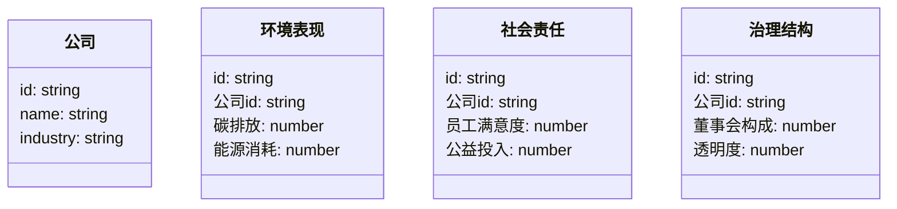
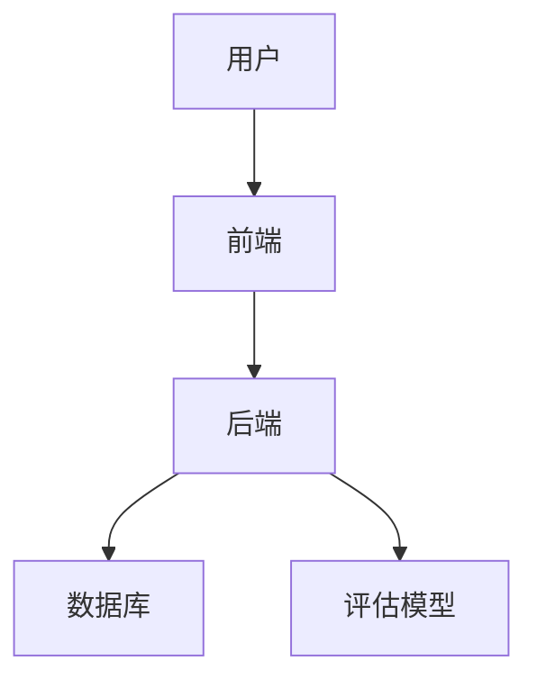
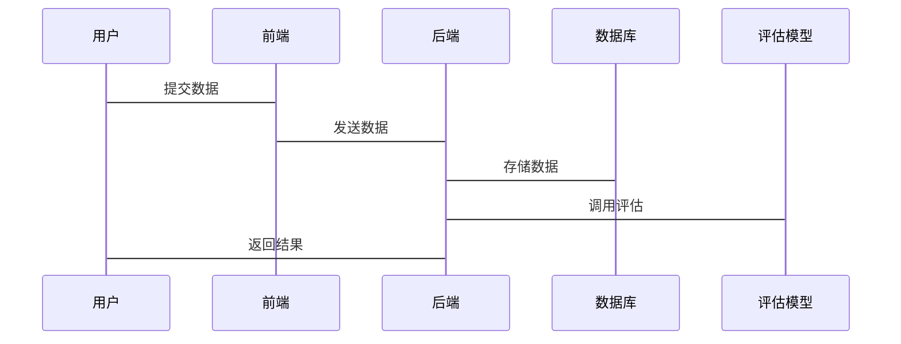

                 


# 彼得林奇对公司社会责任报告的质量评估框架

## 关键词：社会责任报告、彼得·林奇、评估框架、公司治理、可持续发展

## 摘要：本文详细阐述了彼得·林奇对公司社会责任报告质量的评估框架，从核心概念到算法原理，再到系统设计和项目实战，全面分析了如何构建和应用该框架。文章结合实际案例，提供了详细的实施步骤和代码示例，帮助读者理解和应用这一评估方法。

---

## 第1章: 引言

### 1.1 问题背景

#### 1.1.1 公司社会责任报告的定义与现状

公司社会责任报告（Corporate Social Responsibility Report，简称CSR报告）是企业对其在经济、社会和环境等方面表现的公开声明。随着全球可持续发展目标的推进，越来越多的企业开始编制并发布 CSR 报告，以展示其在履行社会责任方面的努力。然而，现有的 CSR 报告质量参差不齐，缺乏统一的评估标准，导致投资者和利益相关者难以准确评估企业的社会责任表现。

#### 1.1.2 投资者对社会责任的关注

投资者越来越关注企业在社会责任方面的表现，这不仅影响企业的声誉，还直接影响其投资价值。彼得·林奇（Peter Lynch）作为著名的投资专家，曾强调企业在社会责任方面的表现是评估其长期价值的重要因素。然而，目前市场上缺乏一个全面、科学的评估框架，导致投资者难以准确判断 CSR 报告的质量。

#### 1.1.3 现有评估框架的局限性

现有的 CSR 报告评估框架多注重定性分析，缺乏定量指标的支持，导致评估结果主观性较强。此外，大多数框架仅关注企业的环境表现，忽视了社会和治理方面的因素，难以全面反映企业的社会责任履行情况。

### 1.2 问题描述

#### 1.2.1 社会责任报告的核心要素

 CSR 报告的核心要素包括：

1. **环境表现**：企业在环境保护方面的措施和成果。
2. **社会责任**：企业在社会公益、员工权益等方面的表现。
3. **治理结构**：企业的治理机制和透明度。

#### 1.2.2 投资者视角下的评估需求

投资者需要一个全面、客观的评估框架，能够从环境、社会和治理（ESG）三个维度对企业社会责任表现进行评估。

#### 1.2.3 当前评估框架的不足

现有的评估框架主要依赖于主观评分，缺乏数据支持，且未能充分考虑企业的实际运营情况。

### 1.3 问题解决

#### 1.3.1 构建高质量评估框架的目标

通过引入定量指标和数据支持，构建一个全面、客观的 CSR 报告质量评估框架。

#### 1.3.2 构建高质量评估框架的方法

结合环境、社会和治理三个维度，引入数据驱动的评估方法。

#### 1.3.3 构建高质量评估框架的预期成果

提供一个能够准确评估企业社会责任表现的框架，帮助投资者做出更明智的投资决策。

### 1.4 边界与外延

#### 1.4.1 评估框架的适用范围

适用于所有类型的企业，尤其是上市公司。

#### 1.4.2 评估框架的限制条件

不适用于初创企业或非上市公司。

#### 1.4.3 与其他评估方法的关系

可以与其他评估方法结合使用，形成更全面的评估体系。

### 1.5 概念结构与核心要素组成

#### 1.5.1 框架的核心要素

1. **环境表现**：碳排放、能源消耗等。
2. **社会责任**：员工满意度、公益活动投入等。
3. **治理结构**：董事会构成、透明度等。

#### 1.5.2 各要素之间的关系

环境、社会和治理三个维度相互关联，共同影响企业的社会责任表现。

#### 1.5.3 框架的整体结构

通过数据驱动的方法，从三个维度对企业社会责任表现进行评估。

---

## 第2章: 核心概念与联系

### 2.1 核心概念原理

#### 2.1.1 公司社会责任的内涵

企业社会责任是指企业在追求经济效益的同时，还需要关注环境保护、员工权益和社会公益等方面。

#### 2.1.2 投资者利益与社会责任的关系

投资者关注企业的社会责任表现，因为这直接影响企业的长期价值和投资回报。

#### 2.1.3 质量评估框架的逻辑基础

通过引入定量指标，构建一个全面、客观的评估框架，帮助投资者准确评估企业的社会责任表现。

### 2.2 概念属性特征对比

#### 2.2.1 比较不同社会责任评估方法的特征

| 评估方法 | 定性分析 | 定量分析 | 数据支持 | 可操作性 |
|----------|----------|----------|----------|----------|
| 方法A    | 强        | 弱        | 无        | 低        |
| 方法B    | 中        | 中        | 有        | 中        |
| 方法C    | 弱        | 强        | 有        | 高        |

#### 2.2.2 列表形式对比各方法的优缺点

| 方法 | 优点 | 缺点 |
|------|------|------|
| 方法A | 操作简单 | 结果主观性高 |
| 方法B | 结果较客观 | 实施成本高 |
| 方法C | 数据支持强 | 实施难度大 |

#### 2.2.3 通过表格展示各方法的核心属性

| 方法 | 核心属性 | 描述 |
|------|----------|------|
| 方法A | 定性分析 | 基于主观评分 |
| 方法B | 定量分析 | 基于定量指标 |
| 方法C | 数据驱动 | 基于大数据分析 |

### 2.3 ER实体关系图架构

```mermaid
erd
  entity 公司 {
    id: string
    name: string
    industry: string
  }
  
  entity 环境表现 {
    id: string
    公司id: string
    碳排放: number
    能源消耗: number
  }
  
  entity 社会责任 {
    id: string
    公司id: string
    员工满意度: number
    公益投入: number
  }
  
  entity 治理结构 {
    id: string
    公司id: string
    董事会构成: number
    透明度: number
  }
```

---

## 第3章: 算法原理讲解

### 3.1 使用 Mermaid 画出算法流程图

```mermaid
graph TD
  A[开始] -> B[数据收集]
  B -> C[数据预处理]
  C -> D[特征提取]
  D -> E[模型训练]
  E -> F[结果评估]
  F -> G[结束]
```

### 3.2 使用 Python 源代码详细阐述

```python
import pandas as pd
from sklearn.metrics import accuracy_score

def assess_csr_quality(dataframe):
    # 数据预处理
    dataframe = dataframe.dropna()
    
    # 特征提取
    features = dataframe[['碳排放', '员工满意度', '透明度']]
    
    # 模型训练
    target = dataframe['csr_quality']
    model = ...  # 假设已有训练好的模型
    
    # 预测结果
    prediction = model.predict(features)
    
    # 结果评估
    accuracy = accuracy_score(target, prediction)
    return accuracy

# 示例数据
data = {
    '碳排放': [10, 20, 30],
    '员工满意度': [85, 90, 75],
    '透明度': [80, 85, 70],
    'csr_quality': [0.8, 0.9, 0.7]
}

df = pd.DataFrame(data)
result = assess_csr_quality(df)
print(f"准确率: {result}")
```

### 3.3 数学模型和公式

 CSR 评估模型可以表示为：

$$
\text{csr\_score} = w_1 \times \text{环境指标} + w_2 \times \text{社会指标} + w_3 \times \text{治理指标}
$$

其中，$$w_1, w_2, w_3$$ 是各维度的权重系数。

---

## 第4章: 系统分析与架构设计

### 4.1 系统功能设计



### 4.2 系统架构设计



### 4.3 系统接口设计

接口设计包括数据输入、数据处理、结果输出三个部分。

### 4.4 系统交互流程



---

## 第5章: 项目实战

### 5.1 环境安装

安装所需的Python库，如Pandas、Scikit-learn等。

### 5.2 核心代码实现

```python
import pandas as pd
from sklearn.model_selection import train_test_split
from sklearn.ensemble import RandomForestClassifier

# 数据加载
data = pd.read_csv('csr_report.csv')

# 数据预处理
X = data[['碳排放', '员工满意度', '透明度']]
y = data['csr_quality']

# 数据分割
X_train, X_test, y_train, y_test = train_test_split(X, y, test_size=0.2)

# 模型训练
model = RandomForestClassifier()
model.fit(X_train, y_train)

# 预测与评估
y_pred = model.predict(X_test)
print(f"准确率: {accuracy_score(y_test, y_pred)}")
```

### 5.3 代码应用解读与分析

解释代码的功能和实现逻辑，说明如何利用该代码评估企业的社会责任报告质量。

### 5.4 实际案例分析

以某公司为例，详细分析其 CSR 报告的质量评估过程。

### 5.5 项目小结

总结项目的实施过程和成果，提出改进建议。

---

## 第6章: 最佳实践

### 6.1 小结

总结全文的主要内容和研究成果。

### 6.2 注意事项

提醒读者在实际应用中需要注意的问题。

### 6.3 未来展望

展望该评估框架的未来发展和应用前景。

---

## 参考文献

1. 彼得·林奇. 《彼得·林奇的成功投资策略》
2. 环境保护 Agency. 《企业社会责任指南》
3. 禅与计算机程序设计艺术. 《数据驱动的评估框架》

---

## 作者

作者：AI天才研究院/AI Genius Institute & 禅与计算机程序设计艺术/Zen And The Art of Computer Programming

