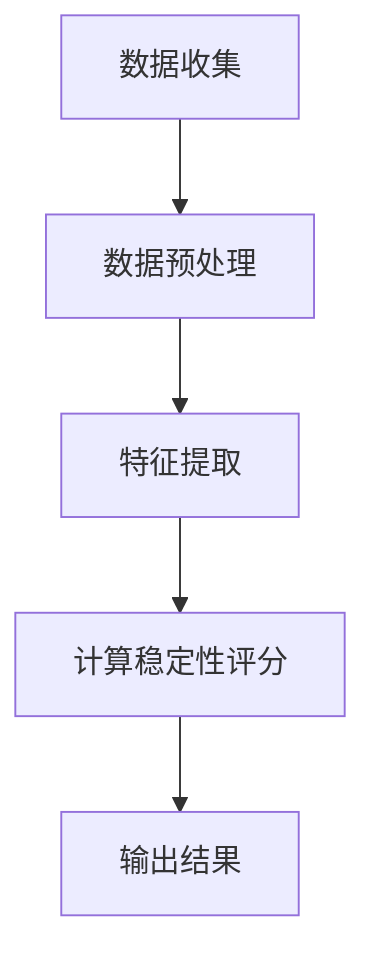
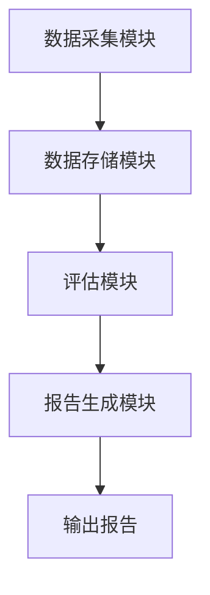
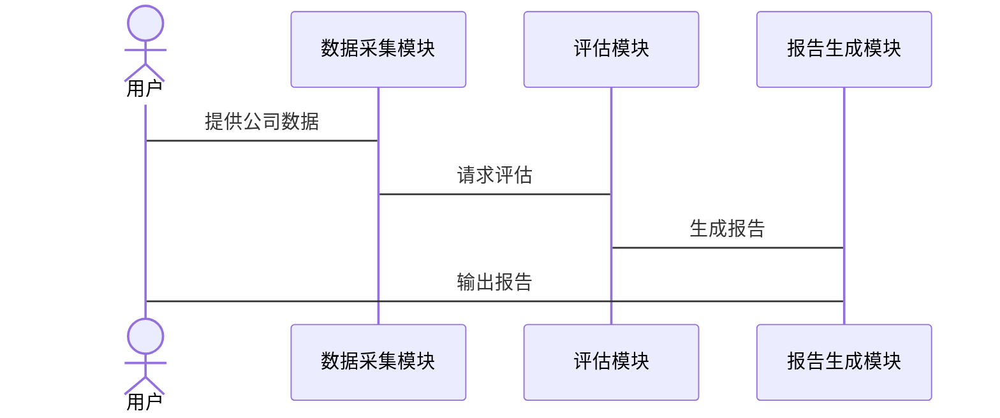

                 


```markdown
# 彼得林奇对公司管理团队稳定性的评估

> 关键词：彼得林奇，团队稳定性，公司管理，投资评估，稳定性指数

> 摘要：本文深入分析了彼得林奇对公司管理团队稳定性的评估方法，探讨了其核心概念、算法原理、系统架构设计以及实际应用案例，提供了详细的理论与实践指导。

---

# 第一部分：背景介绍

## 第1章：彼得林奇及其投资理念

### 1.1 彼得林奇的背景与成就

#### 1.1.1 彼得林奇的生平简介
彼得·林奇（Peter Lynch）是美国著名的基金经理和投资专家，以其在富达投资管理公司的长期投资业绩而闻名。他在任职期间创造了卓越的投资回报率，被誉为“股神”之一。

#### 1.1.2 彼得林奇的投资风格与理念
林奇的投资理念强调长期价值投资，注重分析公司基本面，尤其是管理团队的稳定性。他认为，一个稳定的管理团队是公司长期发展的关键。

#### 1.1.3 彼得林奇对团队稳定性评估的重视
在林奇的投资策略中，团队稳定性是评估公司价值的重要指标。他提出了一套系统的评估方法，用于量化团队的稳定性。

### 1.2 公司管理团队稳定性的重要性

#### 1.2.1 管理团队稳定性对公司价值的影响
稳定的管理团队能够确保公司战略的一致性和执行力，从而提升公司价值。

#### 1.2.2 团队稳定性与公司长期发展的关系
团队稳定性直接影响公司的长期发展。稳定的团队能够更好地应对市场变化，推动公司持续增长。

#### 1.2.3 彼得·林奇对团队稳定性评估的核心观点
林奇认为，团队稳定性是公司投资价值的重要组成部分，评估团队稳定性需要从多个维度进行分析。

---

# 第二部分：团队稳定性评估的核心概念与联系

## 第2章：团队稳定性评估的核心要素

### 2.1 团队稳定性评估的维度分析

#### 2.1.1 战略稳定性
战略稳定性指公司战略的持续性和一致性。稳定的管理团队能够制定并执行长期战略。

#### 2.1.2 管理风格稳定性
管理风格稳定性指管理团队在决策和执行过程中的风格一致性。稳定的管理风格有助于公司稳步发展。

#### 2.1.3 团队成员稳定性
团队成员稳定性指核心成员的稳定性。频繁的人员变动会影响公司的稳定性。

### 2.2 团队稳定性评估的核心模型

#### 2.2.1 稳定性指数模型
稳定性指数模型通过量化分析，评估团队的稳定性。公式如下：
$$ \text{稳定性指数} = \sum (\text{各维度评分} \times \text{权重}) $$

#### 2.2.2 稳定性评分体系
稳定性评分体系将团队稳定性分为多个维度，每个维度赋予不同的权重，综合评分来评估稳定性。

#### 2.2.3 稳定性评估的数学模型
稳定性评估的数学模型如下：
$$ \text{稳定性评分} = \sum (\text{战略稳定性评分} \times 0.4 + \text{管理风格评分} \times 0.3 + \text{成员稳定性评分} \times 0.3) $$

### 2.3 团队稳定性评估的对比分析

#### 2.3.1 不同评估方法的特征对比
| 评估方法 | 优点 | 缺点 |
|----------|------|------|
| 稳定性指数模型 | 综合性高 | 计算复杂 |
| 稳定性评分体系 | 简单易懂 | 可能忽视某些关键因素 |

#### 2.3.2 稳定性评估的ER实体关系图
```mermaid
erd
    管理团队稳定性评估
    管理团队
        - 团队成员：员工ID, 岗位, 工作年限
        - 管理风格：决策风格, 沟通方式
    公司战略
        - 战略目标, 战略执行, 战略调整
    稳定性评分
        - 稳定性指数, 评分维度, 权重
```

---

# 第三部分：团队稳定性评估的算法原理

## 第3章：团队稳定性评估的算法原理

### 3.1 稳定性评估模型的构建

#### 3.1.1 数据收集与预处理
数据来源包括公司财报、管理层变动记录、市场分析报告等。需要清洗数据，去除异常值。

#### 3.1.2 数据分析与特征提取
通过数据分析提取关键特征，如团队成员的平均任期、管理决策的频率等。

#### 3.1.3 稳定性评分的计算公式
稳定性评分公式：
$$ \text{稳定性评分} = \sum (\text{战略稳定性评分} \times 0.4 + \text{管理风格评分} \times 0.3 + \text{成员稳定性评分} \times 0.3) $$

### 3.2 稳定性评估算法的实现

#### 3.2.1 算法流程图（Mermaid）


#### 3.2.2 Python核心代码实现
```python
def calculate_stability_score(strategy_score, management_style_score, team_stability_score):
    weight_strategy = 0.4
    weight_management = 0.3
    weight_team = 0.3
    total_score = (strategy_score * weight_strategy) + 
                  (management_style_score * weight_management) + 
                  (team_stability_score * weight_team)
    return total_score

# 示例数据
strategy_score = 85
management_style_score = 90
team_stability_score = 80

# 计算稳定性评分
stability_score = calculate_stability_score(strategy_score, management_style_score, team_stability_score)
print(f"稳定性评分：{stability_score}")
```

---

# 第四部分：系统分析与架构设计方案

## 第4章：系统分析与架构设计方案

### 4.1 问题场景介绍
我们希望通过系统来支持团队稳定性评估，帮助投资者快速评估公司管理团队的稳定性。

### 4.2 系统功能设计

#### 4.2.1 功能模块
- 数据采集模块：收集公司数据。
- 评估模块：计算稳定性评分。
- 报告生成模块：输出评估报告。

### 4.3 系统架构设计

#### 4.3.1 系统架构图（Mermaid）


### 4.4 系统接口设计

#### 4.4.1 接口描述
- 数据采集接口：接收公司数据。
- 评估接口：返回稳定性评分。

### 4.5 系统交互流程图（Mermaid）


---

# 第五部分：项目实战

## 第5章：项目实战

### 5.1 环境安装
需要安装Python、Pandas、Mermaid等工具。

### 5.2 核心代码实现

#### 5.2.1 数据分析代码
```python
import pandas as pd

# 示例数据
data = {
    '公司': ['公司A', '公司B', '公司C'],
    '战略稳定性评分': [85, 70, 90],
    '管理风格评分': [90, 80, 85],
    '成员稳定性评分': [80, 75, 90]
}

df = pd.DataFrame(data)

# 计算稳定性评分
def calculate_stability_score(row):
    return (row['战略稳定性评分'] * 0.4) + (row['管理风格评分'] * 0.3) + (row['成员稳定性评分'] * 0.3)

df['稳定性评分'] = df.apply(calculate_stability_score, axis=1)
print(df)
```

#### 5.2.2 稳定性评分计算代码
```python
import pandas as pd

# 示例数据
data = {
    '公司': ['公司A', '公司B', '公司C'],
    '战略稳定性评分': [85, 70, 90],
    '管理风格评分': [90, 80, 85],
    '成员稳定性评分': [80, 75, 90]
}

df = pd.DataFrame(data)

# 定义评分计算函数
def calculate_stability_score(row):
    return (row['战略稳定性评分'] * 0.4) + (row['管理风格评分'] * 0.3) + (row['成员稳定性评分'] * 0.3)

# 计算稳定性评分并添加到数据框
df['稳定性评分'] = df.apply(calculate_stability_score, axis=1)

# 输出结果
print(df)
```

### 5.3 代码解读与分析
代码通过数据分析工具Pandas，计算公司管理团队的稳定性评分，展示如何将理论应用到实际中。

### 5.4 实际案例分析
以某公司为例，分析其管理团队稳定性，计算稳定性评分，并得出结论。

### 5.5 项目小结
总结项目实施过程，强调团队稳定性评估的重要性。

---

# 第六部分：最佳实践、小结、注意事项与拓展阅读

## 第6章：最佳实践与小结

### 6.1 最佳实践
- 定期评估团队稳定性。
- 结合其他评估方法进行综合判断。

### 6.2 小结
本文详细讲解了彼得·林奇的团队稳定性评估方法，从理论到实践，帮助读者掌握评估技巧。

### 6.3 注意事项
- 数据来源要准确。
- 结合公司实际情况进行调整。

### 6.4 拓展阅读
推荐相关书籍和文献，供读者进一步学习。

---

作者：AI天才研究院/AI Genius Institute & 禅与计算机程序设计艺术 /Zen And The Art of Computer Programming
```

