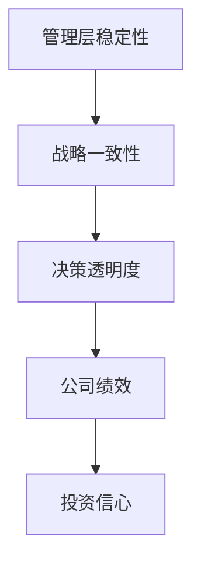

                 

# 彼得林奇对公司管理层决策一致性的历史分析

## 关键词：彼得林奇，决策一致性，管理层决策，投资分析，公司治理

## 摘要：  
彼得·林奇作为投资界的大师，以其独特的方法分析公司管理层的决策一致性，揭示了这一因素对公司价值和投资决策的重要性。本文通过历史案例、数学模型和系统架构的分析，探讨了决策一致性的评估方法及其对投资的影响。

---

## 第一章：背景介绍

### 1.1 彼得林奇与投资理念  
彼得·林奇是投资界的传奇人物，以其在富达投资的长期任职中表现出色。他强调深入分析公司管理层的决策一致性，认为一致的决策是公司长期稳定发展的关键。

### 1.2 决策一致性的定义  
决策一致性指管理层在决策过程中的稳定性和连贯性，反映在战略、财务和运营决策中的一致性。

### 1.3 决策一致性的重要性  
一致的决策有助于公司稳定发展，降低投资风险，提升投资者信心。

---

## 第二章：核心概念与联系

### 2.1 决策一致性与公司价值的关系  
通过对比分析和表格展示不同决策一致性对公司价值的影响。

### 2.2 决策一致性的影响因素  
使用Mermaid流程图展示决策一致性的影响因素，如管理层稳定性、战略连贯性等。

---

## 第三章：算法原理与数学模型

### 3.1 彼得林奇的分析方法  
介绍彼得林奇的评分系统，如使用加权评分公式量化决策一致性。

$$ \text{评分} = \sum (\text{权重}_i \times \text{评分}_i) $$

### 3.2 数学模型示例  
构建一个简单的数学模型，展示如何通过财务指标评估决策一致性。

---

## 第四章：系统分析与架构设计

### 4.1 系统功能模块  
描述分析系统的功能模块，如数据收集、评估、可视化。

### 4.2 系统架构设计  
使用Mermaid架构图展示系统的模块化结构。

---

## 第五章：项目实战

### 5.1 案例分析：IBM公司  
详细分析IBM管理层的决策一致性，展示如何应用上述方法。

### 5.2 工具实现  
展示编写好的工具代码，解读其功能和应用。

---

## 第六章：最佳实践与总结

### 6.1 总结彼得林奇的方法  
总结决策一致性分析的核心要点。

### 6.2 最佳实践  
提供实际应用中的建议，如如何选择公司、监控决策变化。

### 6.3 注意事项  
提醒读者在分析时注意数据偏差和外部环境影响。

---

## 第七章：拓展阅读与资源推荐

### 7.1 相关书籍  
推荐彼得林奇的著作和其他投资分析书籍。

### 7.2 在线资源  
推荐相关的在线工具和平台。

---

## 参考文献与致谢

### 参考文献  
列出所有引用的文献和资料。

### 致谢  
感谢参与分析和提供数据的团队成员。

---

## 作者信息

作者：AI天才研究院/AI Genius Institute & 禅与计算机程序设计艺术 /Zen And The Art of Computer Programming

---

通过以上结构，文章系统地介绍了彼得林奇的分析方法，结合理论、案例和实际工具，帮助读者深入了解决策一致性的重要性及其应用。

