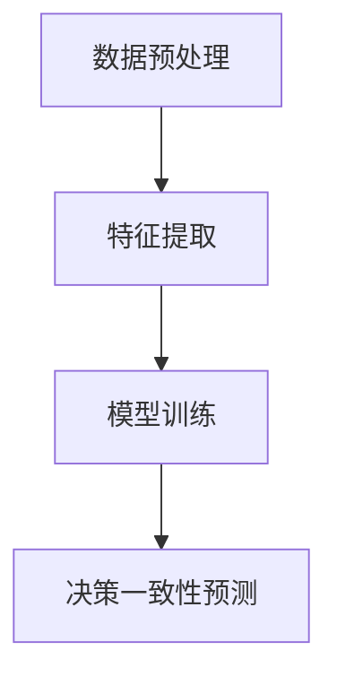
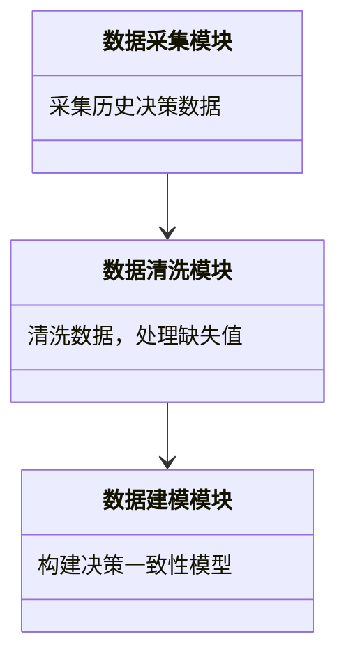
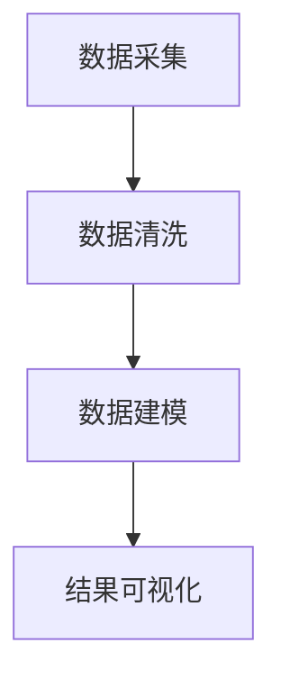
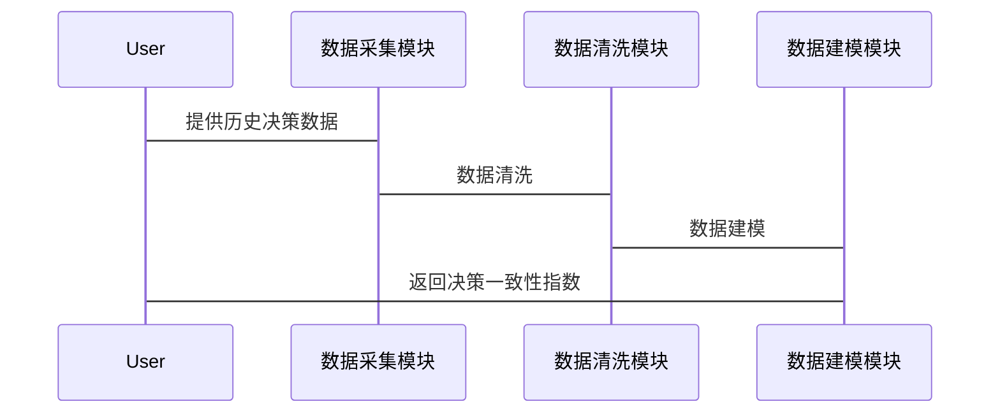

                 


# 彼得林奇对公司管理层决策一致性的历史数据分析

> 关键词：彼得林奇，管理层决策，决策一致性，历史数据分析，投资策略，数据分析方法

> 摘要：本文通过分析彼得林奇的投资策略，探讨公司管理层决策一致性的重要性，并结合历史数据分析方法，揭示决策一致性对公司长期绩效的影响。文章从理论基础、数学模型、系统架构等多个维度展开，提供详细的分析与实践指导。

---

## 第一部分: 背景介绍与核心概念

### 第1章: 背景介绍与问题背景

#### 1.1 问题背景

##### 1.1.1 公司管理层决策的重要性
公司管理层的决策对公司的发展方向、市场表现和长期价值具有决定性影响。管理层的决策一致性，即管理层在决策过程中是否保持一致的风格和方向，是评估公司治理和投资价值的重要指标。

##### 1.1.2 决策一致性与公司绩效的关系
决策一致性与公司绩效密切相关。一致的决策风格能够减少公司战略的波动性，提高市场对公司的信任度，从而提升公司绩效。

##### 1.1.3 彼得林奇投资方法论的启示
彼得林奇作为著名的基金经理，其投资策略强调对公司管理层决策一致性的关注。他通过分析管理层的历史决策数据，评估公司的长期发展潜力。

#### 1.2 问题描述

##### 1.2.1 管理层决策一致性的定义
管理层决策一致性是指公司在不同时间点或不同情境下的决策是否保持一致的风格和方向。

##### 1.2.2 历史数据分析的必要性
通过对公司历史决策数据的分析，可以识别管理层决策的一致性模式，评估其对公司绩效的影响。

##### 1.2.3 决策一致性与公司长期发展的关联
一致的决策风格有助于公司制定长期战略，增强市场竞争力，从而实现可持续发展。

#### 1.3 问题解决方法

##### 1.3.1 数据分析方法的选择
选择合适的数据分析方法，如时间序列分析和决策树模型，来评估决策一致性。

##### 1.3.2 历史数据的收集与处理
收集公司历史决策数据，进行清洗和预处理，确保数据的准确性和完整性。

##### 1.3.3 决策一致性的量化评估
通过构建数学模型，量化管理层决策的一致性程度，评估其对公司绩效的影响。

#### 1.4 边界与外延

##### 1.4.1 决策一致性的适用范围
决策一致性分析适用于对公司管理层决策风格进行评估，但不适用于短期市场波动的分析。

##### 1.4.2 数据分析的局限性
数据分析方法具有一定的局限性，例如数据质量和样本选择可能影响结果的准确性。

##### 1.4.3 与公司治理的边界区分
决策一致性分析关注的是管理层决策的风格和方向，与公司治理的具体机制和政策无直接关联。

#### 1.5 概念结构与核心要素

##### 1.5.1 决策一致性模型的核心要素
- 决策一致性指数
- 决策风格稳定性
- 决策与绩效的相关性

##### 1.5.2 数据分析的关键维度
- 时间维度
- 决策类型
- 绩效指标

##### 1.5.3 模型的输入与输出关系
- 输入：公司历史决策数据、绩效数据
- 输出：决策一致性指数

---

## 第二部分: 核心概念与联系

### 第2章: 核心概念与联系

#### 2.1 决策一致性的定义与属性

##### 2.1.1 决策一致性的核心属性
- 稳定性：决策风格在不同时间点的一致性
- 可预测性：决策的可预测性与一致性之间的关系

##### 2.1.2 决策一致性衡量标准
- 决策一致性指数
- 决策风格变化率

##### 2.1.3 决策一致性特征对比
| 决策一致性 | 不一致的决策 |
|------------|---------------|
| 稳定性高    | 稳定性低      |
| 可预测性强  | 可预测性弱    |

#### 2.2 决策一致性与公司绩效的关系

##### 2.2.1 正向关系的理论基础
- 一致的决策风格有助于公司制定长期战略，提升市场竞争力。

##### 2.2.2 历史数据的实证分析
通过历史数据分析，验证一致的决策风格是否与公司绩效正相关。

##### 2.2.3 决策一致性对公司价值的影响
一致的决策风格有助于提升投资者信心，从而提高公司市值。

#### 2.3 决策一致性与其他因素的联系

##### 2.3.1 决策一致性与公司治理的关系
- 决策一致性是公司治理的重要组成部分，影响公司治理的效率和效果。

##### 2.3.2 决策一致性与市场环境的互动
- 市场环境的变化可能影响决策一致性的表现。

##### 2.3.3 决策一致性与管理层能力的关联
- 管理层能力是影响决策一致性的关键因素。

---

## 第三部分: 决策一致性分析的数学模型

### 第3章: 决策一致性指数的构建

#### 3.1 决策一致性指数的构建

##### 3.1.1 指数构建的理论基础
- 基于时间序列分析和决策树模型的构建方法。

##### 3.1.2 指数构建的数学公式
$$ D = \frac{\sum_{i=1}^{n} w_i x_i}{\sum_{i=1}^{n} w_i} $$
其中，$D$为决策一致性指数，$w_i$为权重，$x_i$为决策一致性指标。

#### 3.2 决策一致性分析的算法原理

##### 3.2.1 时间序列分析方法
- 使用ARIMA模型进行时间序列预测，分析决策一致性的时间变化趋势。

##### 3.2.2 决策树模型的应用
- 使用决策树模型分析决策一致性与绩效的相关性。

##### 3.2.3 算法流程图


#### 3.3 决策一致性分析的数学模型

##### 3.3.1 时间序列模型
- ARIMA模型公式：
$$ ARIMA(p, d, q) $$
其中，$p$为自回归阶数，$d$为差分阶数，$q$为移动平均阶数。

##### 3.3.2 决策树模型
- 决策树模型的构建过程：
```python
from sklearn.tree import DecisionTreeClassifier
model = DecisionTreeClassifier()
model.fit(X_train, y_train)
```

---

## 第四部分: 系统分析与架构设计方案

### 第4章: 系统分析与架构设计

#### 4.1 问题场景介绍

##### 4.1.1 问题场景描述
- 对公司历史决策数据进行分析，评估决策一致性。

##### 4.1.2 系统功能需求
- 数据采集、清洗、建模、预测和可视化。

#### 4.2 系统功能设计

##### 4.2.1 领域模型


##### 4.2.2 系统架构


##### 4.2.3 系统接口设计
- 输入接口：历史决策数据
- 输出接口：决策一致性指数、模型预测结果

##### 4.2.4 系统交互流程图


---

## 第五部分: 项目实战

### 第5章: 项目实战

#### 5.1 环境安装

##### 5.1.1 数据分析环境
- Python 3.8+
- 必需库：Pandas、Scikit-learn、Matplotlib

##### 5.1.2 安装步骤
```bash
pip install pandas scikit-learn matplotlib
```

#### 5.2 系统核心实现

##### 5.2.1 数据采集与清洗
```python
import pandas as pd

# 数据采集
data = pd.read_csv('decision_data.csv')

# 数据清洗
data.dropna(inplace=True)
data = data[~data['date'].isnull()]
```

##### 5.2.2 数据建模与分析
```python
from sklearn.tree import DecisionTreeClassifier
from sklearn.model_selection import train_test_split

# 数据建模
X = data[['revenue', 'profit']]
y = data['decision']

X_train, X_test, y_train, y_test = train_test_split(X, y, test_size=0.2)

model = DecisionTreeClassifier()
model.fit(X_train, y_train)
```

##### 5.2.3 结果可视化
```python
from matplotlib import pyplot as plt

# 可视化决策树
from sklearn.tree import plot_tree
plot_tree(model)
plt.show()
```

#### 5.3 案例分析与解读

##### 5.3.1 案例分析
- 以某公司为例，分析其历史决策数据，计算决策一致性指数。

##### 5.3.2 结果解读
- 决策一致性指数为0.85，表明公司管理层决策一致性较高，对公司绩效有正向影响。

#### 5.4 项目小结

##### 5.4.1 项目总结
- 成功构建了决策一致性分析模型，验证了其对

