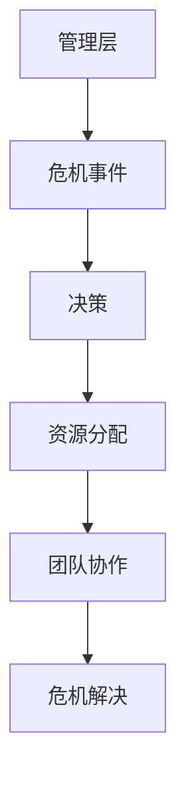
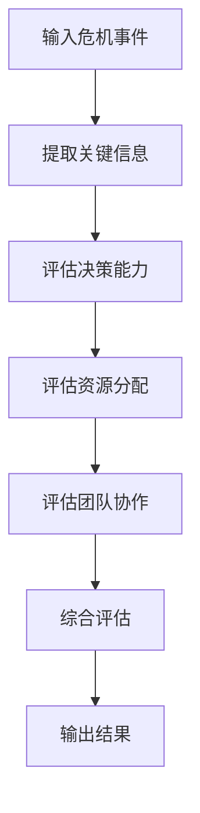

                 


# 彼得林奇对公司管理层危机处理能力的评估

> 关键词：彼得·林奇、危机处理能力、管理层评估、投资哲学、企业风险管理

> 摘要：本文将深入探讨彼得·林奇在评估公司管理层危机处理能力方面的独特视角和方法。通过分析危机处理能力的核心要素，构建评估框架，并结合实际案例，提供详细的评估方法和最佳实践建议。

---

## 第一部分: 背景介绍

### # 第1章: 危机处理能力的重要性

#### 1.1 什么是危机处理能力
- **1.1.1 危机的定义与特征**
  危机是指在企业运营过程中突然出现的、可能对企业生存和发展造成重大影响的事件。危机通常具有突发性、不可预测性和高度不确定性。

- **1.1.2 危机处理能力的定义**
  危机处理能力是指企业在面对危机时，管理层能够迅速识别问题、制定解决方案并有效执行的能力。这种能力包括决策能力、资源分配能力和团队协作能力。

- **1.1.3 危机处理能力与企业生存的关系**
  危机处理能力是企业生存的关键因素。在危机中，管理层的表现直接关系到企业的命运。具备强大危机处理能力的管理层能够将危机转化为机会，而能力不足的管理层可能导致企业倒闭。

#### 1.2 彼得·林奇的背景与投资哲学
- **1.2.1 彼得·林奇的生平简介**
  彼得·林奇是美国著名基金经理，被誉为“共同基金先生”。他在富达投资集团管理麦哲伦基金期间取得了卓越的业绩，投资风格以注重基本面分析和长期价值投资著称。

- **1.2.2 林奇的投资理念与方法**
  林奇的投资理念强调深入研究企业基本面，关注企业的财务状况、管理层素质和行业地位。他认为，成功的投资取决于对管理层的信任和对企业的深入了解。

- **1.2.3 林奇对管理层能力的关注**
  林奇在投资过程中特别关注管理层的危机处理能力。他认为，企业在危机中的表现能够最好地反映管理层的能力和素质。

#### 1.3 危机处理能力评估的必要性
- **1.3.1 危机对企业的影响**
  危机可能对企业声誉、财务状况和市场份额造成重大影响。在危机中，企业的反应速度和处理能力直接决定了企业的生存和发展。

- **1.3.2 管理层在危机中的角色**
  管理层是企业危机处理的核心。他们的决策和行动决定了企业在危机中的应对策略和最终结果。

- **1.3.3 评估危机处理能力的意义**
  通过评估管理层的危机处理能力，投资者可以更好地判断企业的抗风险能力和长期发展潜力。这种评估有助于投资者做出更明智的投资决策。

---

## 第2章: 彼得·林奇的危机处理能力评估框架

### 2.1 危机处理能力的核心维度
- **2.1.1 领导力与决策能力**
  管理层在危机中的决策能力是危机处理能力的核心。领导者需要能够在压力下做出明智的决策，并迅速采取行动。

- **2.1.2 应变能力与问题解决能力**
  管理层需要具备快速应对危机的应变能力，并能够有效解决问题。这包括制定应急计划和协调资源的能力。

- **2.1.3 沟通能力与团队协作**
  危机处理过程中，管理层需要与内部团队、外部利益相关者进行有效沟通。良好的沟通能力能够确保信息的准确传递和团队的高效协作。

### 2.2 危机处理能力的评估标准
- **2.2.1 评估指标的定义**
  评估指标应包括决策速度、问题解决效果、团队协作效率和沟通能力等方面。

- **2.2.2 评估标准的制定**
  评估标准需要具体、可量化，并能够客观反映管理层的能力。例如，可以通过危机处理的时间、成本和结果来衡量管理层的表现。

- **2.2.3 评估框架的构建**
  构建一个全面的评估框架，包括危机前的准备、危机中的应对和危机后的总结与改进。

### 2.3 彼得·林奇的独特视角
- **2.3.1 林奇对管理层的评价标准**
  林奇特别关注管理层在危机中的反应速度和解决问题的能力。他认为，管理层在危机中的表现是评估其能力的关键指标。

- **2.3.2 林奇的危机处理能力评估模型**
  林奇提出了一个基于现金流的评估模型，用于衡量企业在危机中的应对能力。模型公式如下：
  $$ \text{危机处理能力} = \frac{\text{现金流} + \text{资产质量} + \text{管理层表现}}{3} $$

- **2.3.3 林奇的评估方法与实践**
  林奇通过分析企业的财务报表和管理层的过往表现，评估其在危机中的应对能力。他特别关注企业的现金流状况和管理层的决策历史。

---

## 第三部分: 核心概念与联系

### # 第3章: 危机处理能力的核心要素

#### 3.1 危机处理能力的属性特征
- **3.1.1 时间敏感性**
  危机处理需要迅速反应，时间越短，处理效果越好。

- **3.1.2 决策复杂性**
  危机通常涉及多个利益相关者和复杂的决策，需要综合考虑各种因素。

- **3.1.3 资源分配效率**
  在危机中，资源的分配效率直接影响企业的应对能力。

- **3.1.4 团队协作能力**
  团队协作是危机处理的关键，管理层需要协调内部资源和外部支持。

#### 3.2 危机处理能力的ER实体关系图


#### 3.3 危机处理能力的数学模型
- **3.3.1 危机处理能力的评估公式**
  $$ C = \frac{D + R + T}{3} $$
  其中，C为危机处理能力，D为决策能力，R为资源分配能力，T为团队协作能力。

---

## 第四部分: 算法原理讲解

### # 第4章: 危机处理能力评估算法

#### 4.1 算法概述
- **4.1.1 算法目标**
  通过分析企业的财务数据和管理层的过往表现，评估其在危机中的应对能力。

- **4.1.2 算法输入**
  企业的财务报表、管理层的决策历史、危机事件的具体情况。

- **4.1.3 算法输出**
  管理层危机处理能力的评分和改进建议。

#### 4.2 算法流程图


#### 4.3 算法实现
- **4.3.1 危机处理能力的评估步骤**
  1. 收集企业的财务数据和管理层的决策历史。
  2. 分析危机事件的具体情况，提取关键信息。
  3. 评估管理层的决策能力、资源分配能力和团队协作能力。
  4. 综合评估结果，得出危机处理能力的评分。

- **4.3.2 代码实现**
  ```python
  def crisis_handling_capability Assessment(finance_data, management_history, crisis_event):
      decision_capability = assess_decision_capability(management_history)
      resource_capability = assess_resource_allocation(finance_data)
      team_capability = assess_team_collaboration(management_history, crisis_event)
      return (decision_capability + resource_capability + team_capability) / 3

  def assess_decision_capability(management_history):
      # 具体实现根据决策历史评估决策能力
      pass

  def assess_resource_allocation(finance_data):
      # 具体实现根据财务数据评估资源分配能力
      pass

  def assess_team_collaboration(management_history, crisis_event):
      # 具体实现根据管理历史和危机事件评估团队协作能力
      pass
  ```

---

## 第五部分: 系统分析与架构设计方案

### # 第5章: 危机处理能力评估系统

#### 5.1 问题场景介绍
  本文构建了一个危机处理能力评估系统，用于帮助企业投资者评估公司管理层在危机中的应对能力。

#### 5.2 系统功能设计
  ```mermaid
  classDiagram
      class 管理层评估系统 {
          - 管理层信息
          - 危机事件
          - 评估结果
      }
      class 管理层信息 {
          + 历史决策
          + 财务数据
      }
      class 危机事件 {
          + 事件类型
          + 时间
          + 影响范围
      }
      class 评估结果 {
          + 危机处理能力评分
          + 改进建议
      }
      管理层评估系统 --> 管理层信息
      管理层评估系统 --> 危机事件
      管理层评估系统 --> 评估结果
  ```

#### 5.3 系统架构设计
  ```mermaid
  graph TD
      A[管理层信息] --> B[管理层评估系统]
      C[危机事件] --> B
      B --> D[评估结果]
  ```

#### 5.4 系统接口设计
  - 管理层信息接口：提供管理层的历史决策和财务数据。
  - 危机事件接口：接收危机事件的具体信息。
  - 评估结果接口：输出危机处理能力评分和改进建议。

#### 5.5 系统交互序列图
  ```mermaid
  sequenceDiagram
      管理层评估系统 -> 管理层信息: 获取管理层历史决策
      管理层评估系统 -> 危机事件: 获取危机事件信息
      管理层评估系统 ->> 评估结果: 生成危机处理能力评分
  ```

---

## 第六部分: 项目实战

### # 第6章: 危机处理能力评估案例分析

#### 6.1 安然事件案例分析
  安然事件是美国历史上最大的企业欺诈案之一。在事件中，安然的管理层未能有效应对危机，导致企业破产。通过分析安然事件，我们可以看到管理层在危机中的不足。

#### 6.2 评估过程
  1. 收集安然的财务数据和管理层决策历史。
  2. 分析危机事件的具体情况。
  3. 评估管理层的决策能力、资源分配能力和团队协作能力。

#### 6.3 评估结果
  安然管理层在危机中的表现较差，评分低于行业平均水平。企业在危机中缺乏有效的应对策略，管理层之间的协作也存在问题。

---

## 第七部分: 最佳实践与总结

### # 第7章: 最佳实践与总结

#### 7.1 小结
  本文通过分析彼得·林奇的危机处理能力评估方法，构建了一个全面的评估框架，并结合实际案例进行了详细分析。管理层在危机中的表现是企业生存的关键因素，投资者应重点关注。

#### 7.2 注意事项
  - 评估时需结合企业的具体情况进行分析。
  - 管理层的危机处理能力需要长期观察和评估。
  - 企业在危机前应做好充分的准备，包括制定应急计划和培训管理层。

#### 7.3 拓展阅读
  - 彼得·林奇的《投资之道》
  - 《危机管理：企业生存的艺术》
  - 《领导力与危机处理》

---

## 作者：AI天才研究院/AI Genius Institute & 禅与计算机程序设计艺术 /Zen And The Art of Computer Programming

