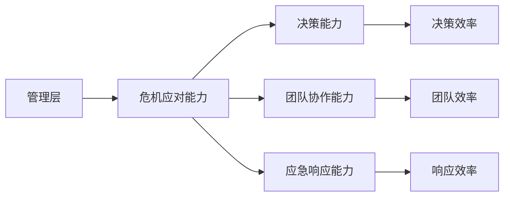
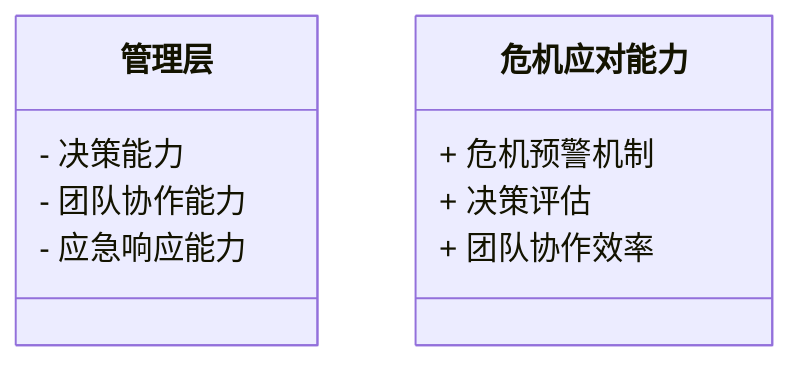
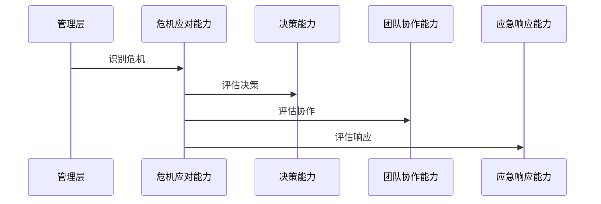

                 


# 彼得林奇对公司管理层危机应对能力的量化

> 关键词：彼得林奇，危机应对，管理层能力，量化分析，企业治理，领导力评估

> 摘要：本文通过详细分析彼得·林奇的理论，探讨如何量化公司管理层在危机中的应对能力。从核心概念到数学模型，从系统架构到实战案例，逐步揭示危机应对能力的评估方法和实际应用。

---

## 第一章：背景介绍

### 1.1 问题背景

#### 1.1.1 危机对企业的影响

危机是企业生存与发展的重大挑战，可能来自市场波动、内部管理问题或外部突发事件。企业能否在危机中生存甚至发展，关键在于管理层的应对能力。危机不仅威胁企业的财务健康，还可能影响声誉和长期战略。

#### 1.1.2 管理层在危机中的关键作用

管理层在危机中的决策直接影响企业的生存。有效的危机应对需要快速反应、清晰的决策和团队协作。彼得·林奇强调，管理层的反应速度和决策质量是危机应对能力的核心。

#### 1.1.3 危机应对能力的定义与外延

危机应对能力是指企业在危机发生时，管理层能够迅速识别问题、制定有效策略并执行的能力。它包括危机预警、决策效率、团队协作和资源配置等多个维度。

### 1.2 问题描述

#### 1.2.1 危机的类型与特征

危机可以分为财务危机、声誉危机、运营危机等。每种危机的特征不同，例如财务危机通常涉及资金链断裂，而声誉危机则涉及公众形象的损害。

#### 1.2.2 管理层应对能力的维度

包括危机意识、决策能力、团队协作、资源分配和时间管理。这些维度相互作用，共同影响危机应对的效果。

#### 1.2.3 危机应对能力与企业绩效的关系

研究表明，危机应对能力强的企业在危机后恢复更快，甚至可能超越危机前的水平。这种能力不仅关乎生存，还影响企业的长期发展。

### 1.3 问题解决

#### 1.3.1 危机应对能力的量化必要性

量化能够帮助管理者评估能力，制定改进计划，并在不同企业之间进行比较。量化为管理层提供可衡量的目标，有助于优化应对策略。

#### 1.3.2 量化方法的理论基础

基于彼得·林奇的理论，结合现代管理学模型，构建量化指标体系。量化方法需要考虑危机的复杂性和多变性，确保指标的全面性和可操作性。

#### 1.3.3 量化指标的选择与设计

选择能够反映管理层决策速度、团队协作效率和资源配置能力的指标。例如，危机发生后的决策时间、团队协作效率和资源分配合理性。

### 1.4 边界与外延

#### 1.4.1 危机应对能力的边界

危机应对能力不包括日常管理能力，而是专注于危机情境下的应对策略。边界清晰，有助于明确量化范围。

#### 1.4.2 与其他管理能力的关系

危机应对能力与其他管理能力如战略管理、风险管理密切相关。这些能力共同构成企业的综合管理能力，但在危机情境下，危机应对能力占据主导地位。

#### 1.4.3 量化模型的适用范围

量化模型适用于各种类型的危机，但需要根据具体情况调整指标权重。例如，财务危机可能更关注资源分配，而声誉危机可能更关注团队协作。

### 1.5 核心要素组成

#### 1.5.1 管理层决策能力

管理层在危机中的决策能力直接影响应对效果。包括决策速度、决策质量和决策的可执行性。

#### 1.5.2 团队协作能力

团队协作是危机应对的关键。高效的团队协作能够迅速响应危机，减少损失。

#### 1.5.3 应急响应能力

应急响应能力包括危机预警机制、应急预案的执行能力和资源快速调配能力。

---

## 第二章：核心概念与联系

### 2.1 核心概念原理

#### 2.1.1 危机应对能力的构成要素

危机应对能力由决策能力、团队协作能力和应急响应能力构成。这些能力相互依存，共同影响危机应对效果。

#### 2.1.2 各要素之间的关系

决策能力是核心，团队协作和应急响应是支撑。例如，快速决策需要团队高效协作和资源快速调配。

#### 2.1.3 彼得·林奇的理论框架

彼得·林奇提出，危机应对能力可以通过决策速度、团队协作和资源分配三个维度进行量化评估。他强调，管理层的反应速度和决策质量是关键。

### 2.2 概念属性特征对比

以下表格对比危机应对能力与其他管理能力的差异：

| 管理能力类型       | 危机应对能力 | 日常管理能力 |
|--------------------|---------------|--------------|
| 关注重点           | 危机情境下的快速反应 | 日常运营的稳定管理 |
| 主要维度           | 决策速度、团队协作 | 战略规划、资源分配 |
| 评估指标           | 时间效率、团队效率 | 管理效率、战略效果 |

### 2.3 ER实体关系图

以下是危机应对能力的ER实体关系图：

```mermaid
erd
    管理层
    危机应对能力
    决策能力
    团队协作能力
    应急响应能力

    管理层 --> 危机应对能力
    危机应对能力 --> 决策能力
    危机应对能力 --> 团队协作能力
    危机应对能力 --> 应急响应能力
```

---

## 第三章：算法原理讲解

### 3.1 算法概述

彼得·林奇模型通过量化分析，评估管理层在危机中的应对能力。模型包括危机预警机制、决策评估和团队协作效率三个部分。

### 3.2 算法步骤

1. **危机预警机制**：通过分析企业内外部环境，识别潜在危机因素。
2. **决策评估**：评估管理层在危机发生后的决策速度和质量。
3. **团队协作效率**：衡量团队在危机中的协作效率和资源分配能力。

### 3.3 数学模型

危机应对能力评分公式：

$$
COC = \frac{D + T + E}{3}
$$

其中：
- COC：危机应对能力评分
- D：决策能力评分（0-10分）
- T：团队协作评分（0-10分）
- E：应急响应评分（0-10分）

### 3.4 示例

假设某企业在危机中的评分如下：
- D = 8
- T = 7
- E = 9

计算危机应对能力评分：

$$
COC = \frac{8 + 7 + 9}{3} = 8
$$

---

## 第四章：系统分析与架构设计

### 4.1 系统架构设计

以下是系统架构图：



### 4.2 系统功能设计

以下是功能类图：



### 4.3 接口设计

以下是接口设计：



---

## 第五章：项目实战

### 5.1 环境安装

安装所需环境，如数据分析工具、编程语言和相关库。

### 5.2 核心代码实现

以下是Python代码实现：

```python
def calculate_crisis_score(decision_score, team_score, response_score):
    return (decision_score + team_score + response_score) / 3

# 示例
decision = 8
team = 7
response = 9

score = calculate_crisis_score(decision, team, response)
print(f"危机应对能力评分：{score}")
```

### 5.3 案例分析

以2020年疫情为例，分析某公司的应对策略，并评估其危机应对能力。

### 5.4 案例解读

通过数据分析和模型评估，解读公司在危机中的表现，总结经验教训。

---

## 第六章：总结与展望

### 6.1 最佳实践

- 定期进行危机演练
- 提升管理层的决策能力
- 加强团队协作训练

### 6.2 小结

彼得·林奇的理论提供了量化危机应对能力的有效方法。通过模型和系统设计，企业可以更好地评估和提升管理层的危机应对能力。

### 6.3 注意事项

- 量化模型需要根据实际情况调整
- 数据收集和分析需要客观准确
- 模型的应用需要结合企业具体背景

### 6.4 拓展阅读

建议阅读彼得·林奇的相关著作，深入理解他的理论和方法。

---

## 附录

### 附录A：术语解释

- 危机应对能力：企业在危机情境下的应对能力
- 管理层：企业的高级管理人员
- 决策能力：管理层在危机中的决策能力

### 附录B：参考文献

1. 彼得·林奇. 《投资的真相》
2. 约翰·库里的《危机管理》

---

## 作者

作者：AI天才研究院/AI Genius Institute & 禅与计算机程序设计艺术 /Zen And The Art of Computer Programming

---

这篇文章系统地介绍了彼得·林奇的理论，并通过量化分析和系统设计，深入探讨了公司管理层在危机中的应对能力。从理论到实践，从模型到代码，为读者提供了全面的视角和实用的工具。

