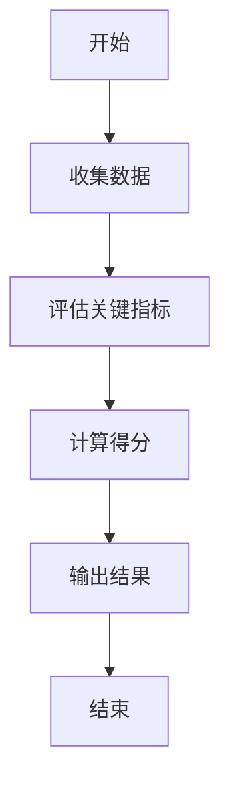
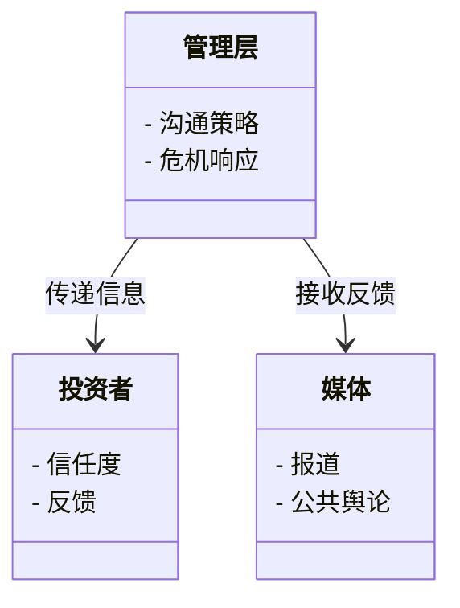
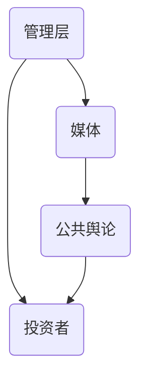
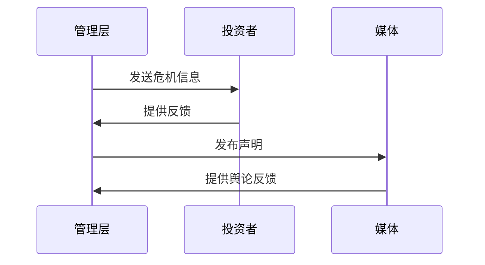

                 


# 彼得林奇对公司管理层危机沟通能力的案例研究

> **关键词**：彼得·林奇、危机沟通、公司管理层、案例研究、沟通能力、投资管理、风险管理

> **摘要**：本文通过分析彼得·林奇对公司管理层在危机中的沟通能力的研究，探讨了危机沟通的关键要素、核心概念、评估模型及其在实际案例中的应用。通过多个经典案例分析，本文揭示了危机沟通对公司价值和声誉的影响，并提出了提升管理层危机沟通能力的最佳实践。

---

## 第一部分：背景介绍

### 第1章：危机沟通的重要性

#### 1.1 什么是危机沟通
- **1.1.1 危机沟通的定义**
  危机沟通是指在企业面临重大危机时，管理层通过信息传递与利益相关者进行有效沟通的过程。这种沟通旨在化解危机、维护企业声誉并最大程度地减少损失。

- **1.1.2 危机沟通的核心要素**
  - 信息的准确性：确保传递的信息真实可靠。
  - 沟通的双向性：不仅是管理层向外界传递信息，也包括从利益相关者处获取反馈。
  - 沟通的实时性：在危机发生时，及时的沟通能够有效缓解紧张局势。

- **1.1.3 危机沟通的边界与外延**
  危机沟通不仅限于危机发生时的沟通，还包括危机前的准备和危机后的总结与改进。其外延涉及企业内部沟通和外部沟通两个方面。

#### 1.2 彼得·林奇与公司管理层的沟通能力
- **1.2.1 彼得·林奇的背景介绍**
  彼得·林奇是美国著名的投资经理，以其在富达投资管理公司的卓越表现而闻名。他的投资策略不仅注重企业的财务表现，还关注管理层的沟通能力。

- **1.2.2 管理层危机沟通能力的重要性**
  在危机中，管理层的沟通能力直接关系到企业的生存与发展。有效的沟通能够稳定员工、投资者和客户的情绪，减少不必要的损失。

- **1.2.3 危机沟通对公司价值的影响**
  通过彼得·林奇的案例研究发现，危机沟通能力优秀的企业往往能够更快地从危机中恢复，并提升市场信任度。

### 第2章：彼得·林奇的案例研究背景

#### 2.1 危机沟通的典型场景
- **2.1.1 企业财务危机**
  当企业面临财务困难时，管理层的沟通策略直接关系到能否获得投资者的信任和支持。
- **2.1.2 企业声誉危机**
  在声誉危机中，管理层的沟通能力决定了企业能否挽回公众的信任。
- **2.1.3 企业战略调整**
  战略调整可能引发员工和客户的担忧，管理层需要通过有效的沟通缓解这些担忧。

#### 2.2 彼得·林奇研究的公司案例
- **2.2.1 案例一：安然事件**
  安然公司的财务造假事件是危机沟通的经典案例。彼得·林奇通过分析安然事件，揭示了管理层在危机中的沟通失败如何导致企业声誉的彻底崩塌。

- **2.2.2 案例二：雷曼兄弟破产**
  雷曼兄弟的破产是2008年金融危机的导火索。彼得·林奇研究了管理层在危机中的沟通策略，发现其缺乏透明度和及时性是导致危机扩大的主要原因。

- **2.2.3 案例三：通用电气的危机**
  通用电气在2019年的信用危机中，通过有效的沟通策略成功化解了危机，这一案例展示了优秀危机沟通能力的重要性。

---

## 第二部分：核心概念与联系

### 第3章：危机沟通的核心要素

#### 3.1 危机沟通的原理
- **3.1.1 信息传递的准确性**
  在危机中，任何错误的信息都可能引发更大的危机。因此，管理层必须确保传递的信息准确无误。

- **3.1.2 沟通的双向性**
  危机沟通不仅仅是管理层单向传递信息，还包括倾听利益相关者的意见和需求。

- **3.1.3 沟通的实时性**
  危机往往发展迅速，管理层必须在第一时间做出反应，及时传递信息。

#### 3.2 核心概念对比分析
- **3.2.1 危机沟通与日常沟通的对比**
  - 日常沟通注重效率和效果，而危机沟通更注重准确性和及时性。
  - 日常沟通可以适当延后，而危机沟通必须实时进行。

- **3.2.2 管理层沟通与员工沟通的对比**
  - 管理层的沟通对象主要是投资者和媒体，而员工沟通的对象是内部员工。
  - 管理层的沟通内容更关注企业战略和财务状况，而员工沟通更关注工作安排和内部政策。

- **3.2.3 危机沟通与企业文化的联系**
  企业文化决定了管理层的沟通风格。优秀的企业文化能够培养出具备危机沟通能力的管理层。

#### 3.3 ER实体关系图
```mermaid
er
  actor 管理层
  actor 投资者
  actor 媒体
  actor 董事会
  relation 沟通
  relation 信任
  relation 危机
```

---

## 第三部分：算法原理讲解

### 第4章：危机沟通能力评估模型

#### 4.1 模型概述
- **4.1.1 模型的输入**
  - 企业的危机类型（财务危机、声誉危机等）
  - 管理层的沟通策略
  - 利益相关者的反馈

- **4.1.2 模型的输出**
  - 危机沟通能力的评分（0-100分）
  - 改进建议

- **4.1.3 模型的适用场景**
  - 企业危机发生前的准备
  - 危机发生时的实时评估
  - 危机后的总结与改进

#### 4.2 算法流程


#### 4.3 数学模型与公式
- **4.3.1 危机沟通能力评分公式**
  $$ \text{评分} = \sum (\text{因素}_i \times \text{权重}_i) $$
  其中，因素包括透明度、及时性和准确性，权重分别为0.4、0.3和0.3。

- **4.3.2 案例分析**
  假设某公司危机沟通能力的评估因素包括透明度、及时性和准确性，权重分别为0.4、0.3和0.3：
  $$ \text{评分} = (0.4 \times 0.8) + (0.3 \times 0.7) + (0.3 \times 0.6) = 0.32 + 0.21 + 0.18 = 0.71 \times 100 = 71分 $$

---

## 第四部分：系统分析与架构设计

### 第5章：系统功能设计

#### 5.1 领域模型


#### 5.2 系统架构设计


#### 5.3 系统接口设计
- **管理层接口**：提供信息传递和反馈接收的功能。
- **投资者接口**：展示企业信息和接收投资者反馈。
- **媒体接口**：接收媒体的报道和公共舆论。

#### 5.4 交互序列图


---

## 第五部分：项目实战

### 第6章：实际案例分析

#### 6.1 安然事件的分析
- **背景**：安然的财务造假事件导致公司破产。
- **沟通问题**：管理层隐瞒了财务问题，未能及时与投资者沟通。
- **结果**：企业声誉受损，投资者信任度下降。

#### 6.2 雷曼兄弟破产的分析
- **背景**：2008年金融危机中的雷曼兄弟破产。
- **沟通问题**：管理层缺乏透明度，未能及时向投资者传达公司状况。
- **结果**：危机迅速扩大，引发全球金融危机。

#### 6.3 通用电气的危机化解
- **背景**：2019年通用电气的信用危机。
- **沟通策略**：管理层及时向投资者传递信息，公开财务状况，安抚投资者情绪。
- **结果**：成功化解危机，企业声誉得到一定程度的恢复。

---

## 第六部分：最佳实践

### 第7章：提升危机沟通能力的策略

#### 7.1 提前制定危机沟通计划
- 明确危机中的沟通流程和责任人。
- 定期进行危机模拟演练。

#### 7.2 保持透明和诚实
- 在危机中，及时公开信息，避免隐瞒。
- 主动承认错误，并提出解决方案。

#### 7.3 建立有效的反馈机制
- 通过多种渠道收集利益相关者的反馈。
- 根据反馈调整沟通策略。

#### 7.4 培训和演练
- 定期为管理层提供危机沟通培训。
- 进行模拟危机演练，提高应对能力。

#### 7.5 小结
- 危机沟通能力是企业危机管理的关键。
- 通过彼得·林奇的案例研究，我们可以总结出有效的沟通策略和改进方法。

#### 7.6 注意事项
- 在危机中，避免过度自信，保持谦逊和开放的态度。
- 避免使用模糊的语言，确保信息传递的清晰和准确。

#### 7.7 拓展阅读
- 《危机沟通：理论与实践》
- 彼得·林奇的投资经典著作

---

## 作者：AI天才研究院/AI Genius Institute & 禅与计算机程序设计艺术 /Zen And The Art of Computer Programming

