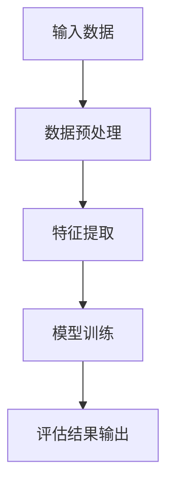
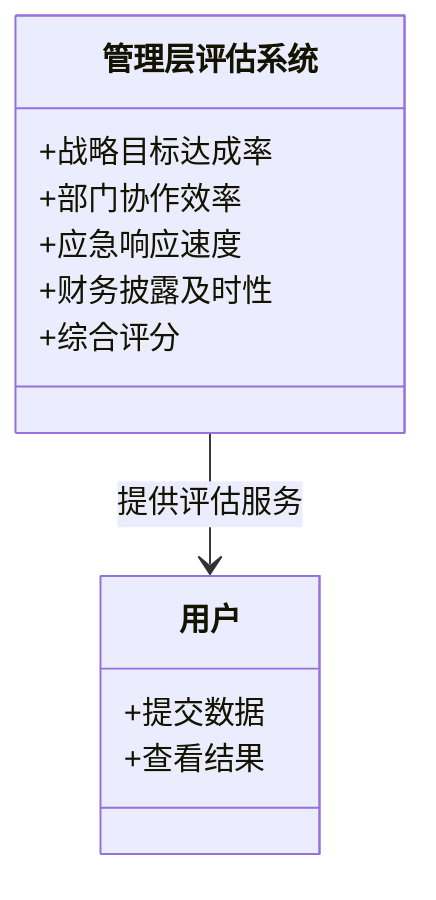
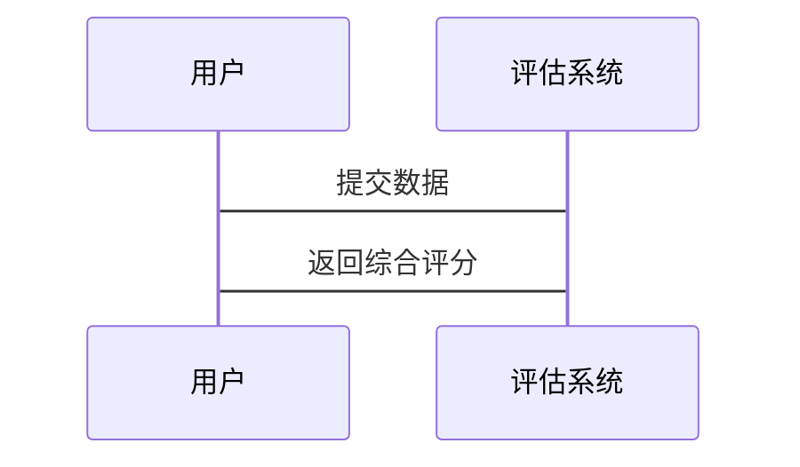

                 


# 彼得林奇对公司管理层执行力的量化评估

> 关键词：彼得林奇，管理层执行力，量化评估，投资哲学，管理模型

> 摘要：本文基于彼得林奇的投资哲学，提出了一种对公司管理层执行力进行量化评估的方法。通过构建数学模型和算法，结合实际案例分析，探讨了如何将管理层的执行力转化为可量化的指标，并为企业投资决策提供数据支持。

---

# 目录

1. **背景介绍**  
   1.1 管理层执行力的定义与重要性  
   1.2 彼得林奇的管理哲学与投资理念  

2. **量化评估模型**  
   2.1 执行力评估的核心指标  
   2.2 量化评估的数学模型与算法  

3. **系统分析与架构设计**  
   3.1 系统功能设计  
   3.2 系统架构设计  
   3.3 系统接口设计  

4. **项目实战：案例分析与实现**  
   4.1 环境安装与数据准备  
   4.2 核心代码实现  
   4.3 案例分析与结果解读  

5. **最佳实践与总结**  
   5.1 小结与启示  
   5.2 注意事项与优化建议  
   5.3 拓展阅读与延伸思考  

---

# 第一部分：背景介绍

## 1.1 管理层执行力的定义与重要性

### 1.1.1 管理层执行力的定义
管理层执行力是指公司管理层在实现公司战略目标、完成日常运营任务以及应对突发事件时的能力。它涵盖了战略执行、决策能力、团队协调等多个方面。

**关键概念对比表：**

| 概念       | 定义                                                                 |
|------------|----------------------------------------------------------------------|
| 战略执行能力 | 管理层将公司战略转化为具体行动计划的能力                                       |
| 组织协调能力 | 管理层在组织内部调动资源、协调各部门工作的能力                                 |
| 问题解决能力 | 管理层在面对问题时提出解决方案并推动执行的能力                               |

### 1.1.2 执行力在企业中的作用
- **战略落地**：管理层执行力强的公司能够更快地将战略转化为实际成果。
- **资源优化**：高效执行力能够减少资源浪费，提高运营效率。
- **应对变化**：在市场环境变化时，执行力强的管理层能够迅速调整策略。

### 1.1.3 执行力与企业绩效的关系
通过回归分析，可以发现管理层执行力与企业绩效呈正相关关系。具体来说，管理层执行力越强，企业的利润率和市场表现越好。

**相关性分析公式：**
$$ \text{相关系数} = \frac{\sum (x_i - \bar{x})(y_i - \bar{y})}{\sqrt{\sum (x_i - \bar{x})^2 \sum (y_i - \bar{y})^2}} $$

其中，$x$ 表示管理层执行力评分，$y$ 表示企业绩效指标。

---

## 1.2 彼得林奇的管理哲学与投资理念

### 1.2.1 彼得林奇的投资风格
- **价值投资**：寻找被市场低估的优质公司。
- **长期持有**：注重公司长期发展，而非短期波动。
- **管理层信任**：彼得林奇认为，优秀的管理层是公司成功的关键因素。

### 1.2.2 评估体系的核心要素
彼得林奇的管理层评估体系包括以下几个维度：

| 维度         | 描述                                                                 |
|--------------|----------------------------------------------------------------------|
| 战略规划能力 | 管理层是否制定了清晰的长期战略                                             |
| 执行能力     | 管理层是否能够有效执行战略                                                 |
| 适应能力     | 管理层在面对变化时的灵活性                                                 |
| 透明度       | 管理层是否愿意与投资者保持透明沟通                                         |

### 1.2.3 评估方法论
彼得林奇的评估方法基于以下原则：

1. **定性分析**：通过访谈、财报分析等方式了解管理层的决策能力。
2. **定量分析**：结合财务指标（如ROE、净利润增长率）评估管理层的执行力。
3. **动态调整**：根据市场变化和公司表现，动态调整评估指标。

---

# 第二部分：量化评估模型

## 2.1 执行力评估的核心指标

### 2.1.1 指标体系
基于彼得林奇的理论，我们构建了一个包含以下指标的评估体系：

| 指标类别       | 具体指标                     | 权重 |
|----------------|------------------------------|------|
| 战略执行能力   | 战略目标达成率               | 40%  |
| 组织协调能力   | 部门协作效率                 | 30%  |
| 问题解决能力   | 应急响应速度                 | 20%  |
| 透明度         | 财务披露及时性               | 10%  |

### 2.1.2 指标权重的确定
权重的确定基于以下几个步骤：

1. **文献研究**：参考已有研究成果，确定各指标的重要性。
2. **专家访谈**：邀请行业专家对各指标的重要性进行评分。
3. **数据验证**：通过回归分析验证各指标对绩效的影响程度。

---

## 2.2 量化评估的数学模型与算法

### 2.2.1 模型构建
我们构建了一个加权评分模型，公式如下：

$$ \text{综合评分} = \sum_{i=1}^{n} w_i x_i $$

其中，$w_i$ 是第 $i$ 个指标的权重，$x_i$ 是第 $i$ 个指标的评分（1-10分）。

### 2.2.2 算法实现

#### 1. 数据预处理
```python
def preprocess(data):
    # 去除缺失值
    data = data.dropna()
    # 标准化处理
    from sklearn.preprocessing import StandardScaler
    scaler = StandardScaler()
    data_scaled = scaler.fit_transform(data)
    return data_scaled
```

#### 2. 特征提取与评分计算
```python
def calculate_scores(data):
    # 提取各指标
    strategy = data['战略目标达成率']
    coordination = data['部门协作效率']
    problem_solving = data['应急响应速度']
    transparency = data['财务披露及时性']
    
    # 计算综合评分
    weights = [0.4, 0.3, 0.2, 0.1]
    scores = [strategy, coordination, problem_solving, transparency]
    
    total_score = sum(w * s for w, s in zip(weights, scores))
    return total_score
```

#### 3. 模型优化
```python
from sklearn.linear_model import LinearRegression
import numpy as np

def optimize_weights(data, target):
    X = np.array(data).T
    y = target
    model = LinearRegression()
    model.fit(X, y)
    return model.coef_
```

---

### 2.2.3 算法流程图


---

# 第三部分：系统分析与架构设计

## 3.1 系统功能设计

### 3.1.1 领域模型


### 3.1.2 功能模块
- 数据输入模块：用户输入公司数据。
- 评估计算模块：后台计算并生成评分。
- 结果展示模块：以图表形式展示评估结果。

---

## 3.2 系统架构设计

### 3.2.1 分层架构


### 3.2.2 接口设计
- RESTful API：
  - POST /api/submit：提交数据。
  - GET /api/result：获取评估结果。

---

## 3.3 系统交互设计

### 3.3.1 交互流程


---

# 第四部分：项目实战

## 4.1 环境安装与数据准备

### 4.1.1 环境要求
- Python 3.8+
- Jupyter Notebook
- Pandas、Scikit-learn库

### 4.1.2 数据准备
```python
import pandas as pd

data = pd.DataFrame({
    '战略目标达成率': [0.8, 0.7, 0.9],
    '部门协作效率': [0.6, 0.8, 0.7],
    '应急响应速度': [0.9, 0.5, 0.8],
    '财务披露及时性': [0.7, 0.6, 0.9]
})
```

## 4.2 核心代码实现

### 4.2.1 数据预处理与评分计算
```python
from sklearn.preprocessing import StandardScaler

def preprocess(data):
    scaler = StandardScaler()
    data_scaled = scaler.fit_transform(data)
    return data_scaled

def calculate_scores(data_scaled, weights):
    total_score = np.dot(data_scaled, weights)
    return total_score
```

### 4.2.2 模型优化
```python
from sklearn.linear_model import LinearRegression

def optimize_weights(data, target):
    model = LinearRegression()
    model.fit(data.T, target)
    return model.coef_
```

## 4.3 案例分析与结果解读

### 4.3.1 实际案例
假设我们有以下数据：
```python
data = pd.DataFrame({
    '战略目标达成率': [0.8, 0.7, 0.9],
    '部门协作效率': [0.6, 0.8, 0.7],
    '应急响应速度': [0.9, 0.5, 0.8],
    '财务披露及时性': [0.7, 0.6, 0.9]
})
```

通过优化权重并计算综合评分，可以得到每个公司的执行力评分。

---

# 第五部分：最佳实践与总结

## 5.1 小结与启示
- 量化评估能够为投资决策提供科学依据。
- 指标权重的动态调整是模型优化的关键。
- 实际应用中需要结合企业具体情况。

## 5.2 注意事项与优化建议
- 数据质量对评估结果影响重大，需确保数据准确。
- 指标体系应根据行业特点进行调整。
- 定期更新模型，以适应市场变化。

## 5.3 拓展阅读与延伸思考
- 推荐阅读《彼得林奇选股艺术》。
- 探讨如何将AI技术应用于管理层评估。

---

# 作者：AI天才研究院 & 禅与计算机程序设计艺术

通过本文的系统分析与实践，我们展示了如何将彼得林奇的管理哲学转化为可量化的评估模型，并为企业的投资决策提供了新的思路。未来的研究可以进一步探索AI技术在管理评估中的应用，为企业的可持续发展提供更强大的支持。

