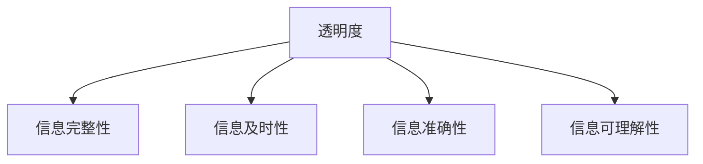
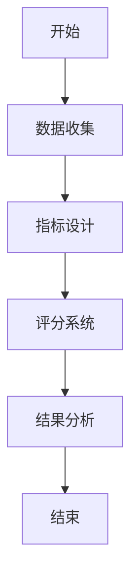
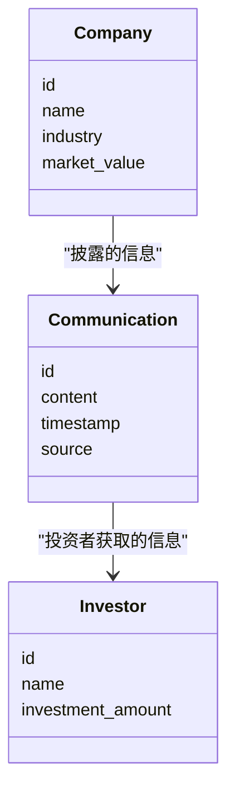
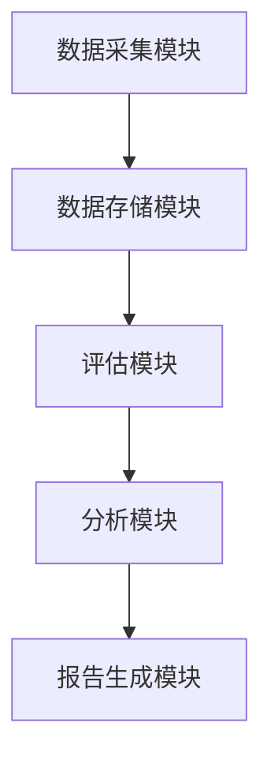
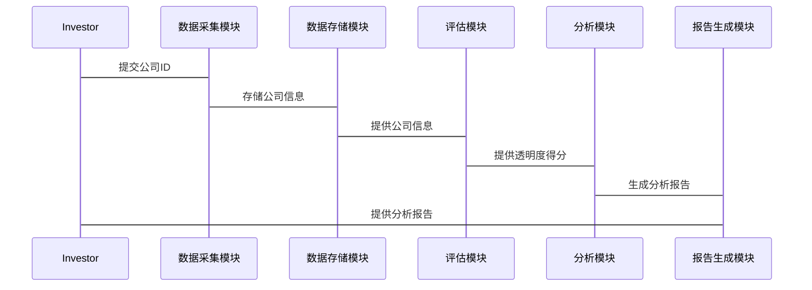

                 


# 彼得林奇对公司管理层沟通透明度的量化评估方法

> 关键词：彼得林奇、公司管理层、沟通透明度、量化评估、投资决策

> 摘要：本文详细探讨了彼得·林奇对公司管理层沟通透明度的量化评估方法，分析了其背后的逻辑与数学模型，通过实际案例展示了如何将理论应用于实践，为投资者提供了科学的决策工具。

---

# 第一部分: 背景介绍

## 第1章: 问题背景

### 1.1 投资者与公司管理层沟通的重要性
- **问题背景**：投资者与公司管理层之间的沟通直接影响投资决策的准确性和效率。透明的沟通有助于投资者了解公司的真实情况，从而做出明智的投资决策。
- **透明度的定义**：透明度是指公司在信息传递过程中公开、准确、及时地披露相关信息的程度。
- **透明度的重要性**：透明度高的公司更容易获得投资者的信任，从而提升公司价值和市场表现。

### 1.2 沟通透明度对投资决策的影响
- **信息不对称**：在投资活动中，信息不对称可能导致投资者无法准确评估公司的价值，从而影响投资决策。
- **透明度的作用**：通过提高透明度，公司能够减少信息不对称，增强投资者的信任，进而提升公司的市场价值。

### 1.3 当前沟通透明度评估的挑战
- **评估标准不统一**：目前缺乏统一的透明度评估标准，导致评估结果难以比较。
- **数据获取困难**：公司管理层的沟通信息分散在多种渠道，获取和整理这些数据需要大量资源。
- **评估方法单一**：传统的评估方法多基于定性分析，难以量化透明度的具体程度。

---

## 第2章: 问题描述

### 2.1 沟通透明度的定义
- **定义**：沟通透明度是指公司在与投资者、股东和其他利益相关者沟通时，信息的公开性、准确性和及时性的程度。
- **核心特征**：包括信息的完整性、及时性、准确性和可理解性。

### 2.2 透明度在公司治理中的作用
- **提升信任**：透明度高的公司更容易获得投资者的信任，从而提升公司的市场价值。
- **降低风险**：通过透明的沟通，公司可以及时发现和解决潜在问题，降低经营风险。

### 2.3 透明度与公司价值的关系
- **正相关关系**：透明度高的公司通常具有更高的市场价值，因为投资者更容易评估公司的潜力和风险。
- **长期影响**：透明度不仅影响短期市场表现，还影响公司的长期发展和品牌价值。

---

## 第3章: 问题解决

### 3.1 构建透明度评估框架的目标
- **目标**：建立一个科学、统一的透明度评估框架，帮助投资者量化评估公司管理层的沟通透明度。
- **框架的设计原则**：科学性、可操作性、可比较性。

### 3.2 透明度评估框架的必要性
- **必要性**：统一的评估框架能够为投资者提供一致的评估标准，便于比较和决策。
- **框架的结构**：包括数据收集、指标设计、评分系统、结果分析等部分。

### 3.3 透明度评估的边界与外延
- **边界**：评估范围仅限于公司管理层的沟通行为，不包括其他方面的信息。
- **外延**：评估结果可以用于投资决策、公司治理优化等方面。

---

## 第4章: 概念结构与核心要素组成

### 4.1 概念结构图


### 4.2 核心要素分析
- **信息完整性**：公司披露的信息是否全面，是否涵盖了所有重要方面。
- **信息及时性**：公司披露信息的速度是否及时，是否在关键事件发生后尽快公布。
- **信息准确性**：披露的信息是否准确无误，是否符合事实。
- **信息可理解性**：信息是否清晰易懂，是否便于投资者理解和分析。

### 4.3 要素之间的关系
- **相互关联**：信息完整性、及时性、准确性和可理解性是相互关联的，共同构成透明度的整体。
- **权重不同**：不同要素在评估中的权重可能不同，需根据实际情况进行调整。

---

# 第二部分: 核心概念与联系

## 第5章: 核心概念原理

### 5.1 透明度的定义与属性
- **定义**：透明度是公司与利益相关者之间信息传递的开放性和清晰度。
- **属性特征**：
  | 特征 | 描述 |
  |------|------|
  | 完整性 | 信息是否全面 |
  | 及时性 | 信息是否及时 |
  | 准确性 | 信息是否正确 |
  | 可理解性 | 信息是否清晰 |

### 5.2 ER实体关系图
```mermaid
erDiagram
    ++attributes
    Company : id, name, industry, market_value
    Communication : id, content, timestamp, source
    Investor : id, name, investment_amount
    +
    Company o-<> Communication: "披露的信息"
    Communication o-<> Investor: "投资者获取的信息"
```

---

## 第6章: 算法原理讲解

### 6.1 透明度评估算法

#### 6.1.1 算法流程图


#### 6.1.2 算法步骤说明
1. **数据收集**：收集公司管理层的沟通记录，包括财报、会议纪要、投资者电话会议等。
2. **指标设计**：根据透明度的核心要素，设计评估指标，如信息完整性、及时性、准确性、可理解性。
3. **评分系统**：为每个指标赋予权重，并根据实际表现进行评分。
4. **结果分析**：综合各个指标的评分，计算出透明度得分，并进行分析。

### 6.2 数学模型与公式

#### 6.2.1 透明度得分计算公式
$$ \text{透明度得分} = \sum_{i=1}^{n} (w_i \times s_i) $$
其中，\( w_i \) 是第 \( i \) 个指标的权重，\( s_i \) 是第 \( i \) 个指标的评分。

#### 6.2.2 示例计算
假设指标及其权重如下：
| 指标         | 权重（%） |
|--------------|-----------|
| 信息完整性    | 40        |
| 信息及时性    | 30        |
| 信息准确性    | 20        |
| 信息可理解性  | 10        |

假设评分如下：
| 指标         | 评分（分） |
|--------------|-----------|
| 信息完整性    | 85        |
| 信息及时性    | 70        |
| 信息准确性    | 90        |
| 信息可理解性  | 80        |

计算透明度得分：
$$ \text{透明度得分} = (0.4 \times 85) + (0.3 \times 70) + (0.2 \times 90) + (0.1 \times 80) = 34 + 21 + 18 + 8 = 81 $$

---

## 第7章: 系统分析与架构设计方案

### 7.1 系统功能设计

#### 7.1.1 领域模型


#### 7.1.2 功能模块
- **数据采集模块**：负责收集公司管理层的沟通记录。
- **评估模块**：根据指标和权重，计算透明度得分。
- **分析模块**：对评估结果进行分析，生成报告。

### 7.2 系统架构设计

#### 7.2.1 系统架构图


#### 7.2.2 接口设计
- 数据采集模块接口：用于接收公司管理层的沟通记录。
- 评估模块接口：用于接收指标和权重，计算透明度得分。
- 分析模块接口：用于接收评估结果，生成分析报告。

#### 7.2.3 交互序列图


---

## 第8章: 项目实战

### 8.1 环境安装

#### 8.1.1 安装工具
- **Python**：用于数据处理和计算。
- **Mermaid**：用于绘制图表。
- **LaTeX**：用于公式排版。

#### 8.1.2 安装步骤
1. 下载并安装Python。
2. 安装Mermaid扩展插件。
3. 安装LaTeX编辑器。

### 8.2 核心代码实现

#### 8.2.1 透明度得分计算代码
```python
def calculate_transparency_score(weights, scores):
    score = 0
    for w, s in zip(weights, scores):
        score += w * s
    return score

weights = [0.4, 0.3, 0.2, 0.1]
scores = [85, 70, 90, 80]

transparency_score = calculate_transparency_score(weights, scores)
print(f"透明度得分: {transparency_score}")
```

#### 8.2.2 代码解读
- **函数定义**：`calculate_transparency_score`函数用于计算透明度得分。
- **输入参数**：`weights`是指标的权重列表，`scores`是指标的评分列表。
- **计算过程**：遍历权重和评分，计算加权得分之和。
- **输出结果**：打印透明度得分。

### 8.3 实际案例分析

#### 8.3.1 案例分析
假设我们有两家公司，A和B，它们的透明度指标如下：
- **公司A**：
  | 指标         | 权重（%） | 评分 |
  |--------------|-----------|------|
  | 信息完整性    | 40        | 85   |
  | 信息及时性    | 30        | 70   |
  | 信息准确性    | 20        | 90   |
  | 信息可理解性  | 10        | 80   |
- **公司B**：
  | 指标         | 权重（%） | 评分 |
  |--------------|-----------|------|
  | 信息完整性    | 40        | 75   |
  | 信息及时性    | 30        | 80   |
  | 信息准确性    | 20        | 85   |
  | 信息可理解性  | 10        | 70   |

计算透明度得分：
- **公司A**：透明度得分 = (0.4×85) + (0.3×70) + (0.2×90) + (0.1×80) = 81
- **公司B**：透明度得分 = (0.4×75) + (0.3×80) + (0.2×85) + (0.1×70) = 74

#### 8.3.2 结果分析
公司A的透明度得分为81，高于公司B的74。这意味着公司A在沟通透明度方面表现更好，投资者可以考虑优先投资公司A。

---

## 第9章: 最佳实践、小结、注意事项和拓展阅读

### 9.1 最佳实践
- **定期评估**：建议定期评估公司的透明度，及时调整评估策略。
- **数据更新**：及时更新公司管理层的沟通记录，确保数据的最新性。

### 9.2 小结
本文详细探讨了彼得·林奇对公司管理层沟通透明度的量化评估方法，通过理论分析和实际案例，展示了如何将透明度评估应用于投资决策。

### 9.3 注意事项
- **数据准确性**：评估结果依赖于数据的准确性，需确保数据来源可靠。
- **权重调整**：根据实际情况调整各指标的权重，以反映不同的关注点。

### 9.4 拓展阅读
- **相关书籍**：《彼得·林奇的投资策略》。
- **学术论文**：探讨透明度与公司价值关系的研究论文。

---

# 第三部分: 结语

## 作者信息

作者：AI天才研究院/AI Genius Institute & 禅与计算机程序设计艺术/Zen And The Art of Computer Programming

---

通过本文的详细分析和实际案例，读者可以深入了解彼得·林奇的透明度评估方法，并将其应用于实际投资决策中，从而提升投资效率和准确性。

