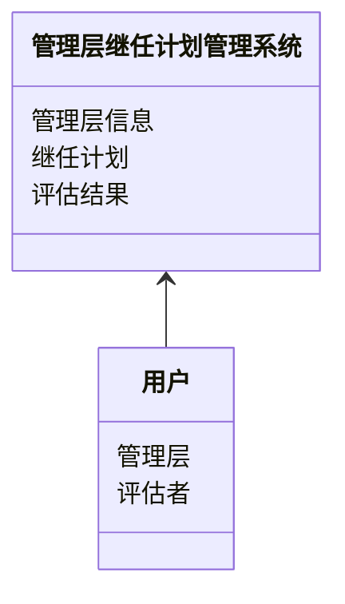
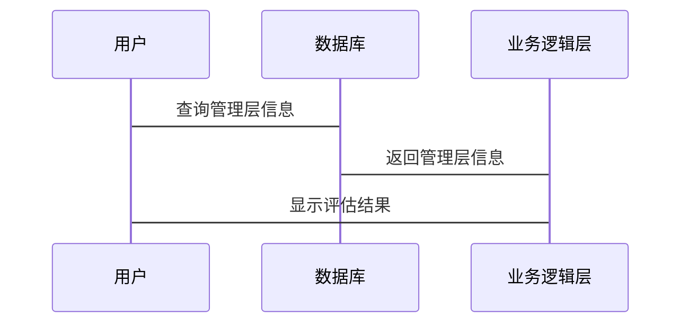

                 


# 彼得林奇对公司管理层继任计划的评估

> 关键词：彼得林奇，管理层继任计划，投资评估，企业管理，领导力评估

> 摘要：本文深入分析了彼得林奇对公司管理层继任计划的评估方法，探讨了其独特的投资理念、管理层评估模型和创新的评估工具，结合实际案例，详细解读了如何在企业管理中应用这些方法。

---

## 第1章: 管理层继任计划的背景与重要性

### 1.1 管理层继任计划的核心概念

#### 1.1.1 管理层继任计划的定义

管理层继任计划是指企业为确保在关键管理岗位出现空缺时，能够及时找到合适的接替者而制定的一系列规划。它涉及对现有管理团队的能力评估、潜力挖掘以及后备人才培养。

#### 1.1.2 管理层继任计划的重要性

- 确保企业稳定发展
- 优化管理团队结构
- 提高企业抗风险能力
- 为企业长期战略目标提供支持

#### 1.1.3 彼得林奇对管理层继任计划的特殊视角

彼得林奇以其独特的投资理念闻名，他不仅关注企业的财务表现，更注重管理层的能力和行为模式。他认为，优秀的管理层是企业长期价值增长的关键。

### 1.2 彼得林奇投资方法论的概述

#### 1.2.1 彼得林奇的投资理念

彼得林奇主张长期投资，注重企业的基本面分析，尤其是管理层的能力和决策质量。

#### 1.2.2 彼得林奇的选股标准

- 行业地位
- 财务健康性
- 管理层质量
- 市场竞争力

#### 1.2.3 彼得林奇对管理层的评估标准

- 领导能力
- 战略规划能力
- 团队协作能力
- 企业忠诚度

---

## 第2章: 管理层继任计划的评估框架

### 2.1 管理层继任计划的评估维度

#### 2.1.1 管理能力评估

- 问题解决能力
- 战略思维能力
- 执行能力

#### 2.1.2 领导力评估

- 激励能力
- 团队建设能力
- 沟通能力

#### 2.1.3 战略规划能力评估

- 长期目标设定
- 资源分配能力
- 风险管理能力

### 2.2 彼得林奇的管理层评估模型

#### 2.2.1 模型的构成要素

- 管理层能力
- 企业战略
- 市场环境
- 财务表现

#### 2.2.2 模型的评估流程

1. 确定评估目标
2. 收集相关数据
3. 分析管理层能力
4. 评估企业战略
5. 综合得出结论

#### 2.2.3 模型的数学表达式

$$
\text{管理层评估分数} = \frac{(\text{管理能力} + \text{领导力} + \text{战略规划})}{3}
$$

---

## 第3章: 彼得林奇的管理层继任评估方法

### 3.1 传统管理层评估方法的局限性

#### 3.1.1 基于财务指标的评估

- 优点：客观、可量化
- 缺点：忽视非财务因素

#### 3.1.2 基于市场表现的评估

- 优点：反映企业整体表现
- 缺点：受外部因素影响大

#### 3.1.3 基于管理经验的评估

- 优点：注重实际经验
- 缺点：主观性强

### 3.2 彼得林奇的创新评估方法

#### 3.2.1 以股东价值为导向的评估

- 通过股东价值的变化评估管理层的绩效。

#### 3.2.2 以企业长期发展为导向的评估

- 评估管理层的长期战略规划能力。

#### 3.2.3 以管理层行为模式为导向的评估

- 通过管理层的决策和行为模式评估其能力。

---

## 第4章: 管理层继任计划的评估工具

### 4.1 评估工具的分类

#### 4.1.1 财务指标分析工具

- 营业利润率
- 净利润率
- 资产回报率

#### 4.1.2 非财务指标分析工具

- 市场占有率
- 客户满意度
- 员工满意度

#### 4.1.3 综合评估工具

- 加权评分法
- 层次分析法

### 4.2 彼得林奇使用的评估工具

#### 4.2.1 股东价值评估工具

$$
\text{股东价值} = \text{净利润} - \text{债务}
$$

#### 4.2.2 企业成长性评估工具

$$
\text{年增长率} = \frac{\text{今年销售额} - \text{去年销售额}}{\text{去年销售额}} \times 100\%
$$

#### 4.2.3 管理层行为模式分析工具

通过分析管理层的决策速度、决策质量和决策一致性，评估其能力。

---

## 第5章: 系统分析与架构设计方案

### 5.1 问题场景介绍

企业需要一个系统化的方法来评估管理层的继任计划，确保在管理层变动时，企业能够平稳过渡。

### 5.2 项目介绍

开发一个基于彼得林奇评估模型的管理层继任计划管理系统。

### 5.3 系统功能设计

#### 5.3.1 领域模型



#### 5.3.2 系统架构设计


#### 5.3.3 系统接口设计

- 输入接口：管理层信息输入
- 输出接口：评估结果输出

#### 5.3.4 系统交互设计



---

## 第6章: 项目实战

### 6.1 环境安装

- 安装Python和相关库（如pandas、numpy）

### 6.2 核心实现源代码

```python
import pandas as pd
import numpy as np

def evaluate_management团队(管理层信息):
    管理能力 = 管理层信息['管理能力']
    领导力 = 管理层信息['领导力']
    战略规划能力 = 管理层信息['战略规划能力']
    总分 = (管理能力 + 领导力 + 战略规划能力) / 3
    return 总分

管理层信息 = pd.DataFrame({
    '管理能力': [8, 7, 9],
    '领导力': [8, 8, 7],
    '战略规划能力': [7, 9, 8]
})

评估结果 = evaluate_management团队(管理层信息)
print(评估结果)
```

### 6.3 应用解读

- 代码实现彼得林奇的评估模型
- 评估结果为企业管理层的综合能力评分

---

## 第7章: 最佳实践与小结

### 7.1 最佳实践

- 定期更新管理层信息
- 结合企业实际情况调整评估模型
- 培养后备管理人才

### 7.2 小结

彼得林奇的管理层继任计划评估方法为企业的管理决策提供了重要参考，结合系统化的评估工具和方法，企业可以更好地制定管理层继任计划。

### 7.3 注意事项

- 评估结果仅供参考，需结合实际情况
- 数据收集需准确
- 评估模型需定期优化

### 7.4 拓展阅读

- 彼得林奇的其他投资理念
- 其他管理学家的管理层评估方法

---

作者：AI天才研究院/AI Genius Institute & 禅与计算机程序设计艺术 /Zen And The Art of Computer Programming

