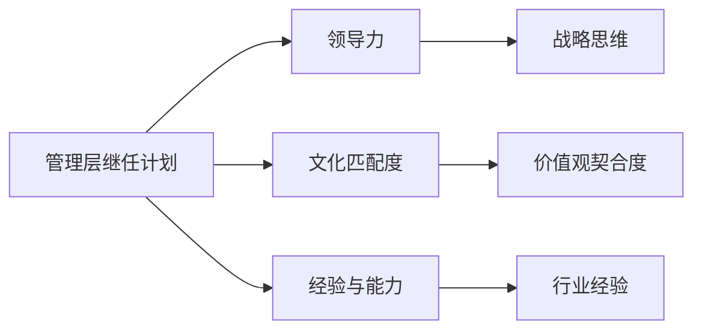
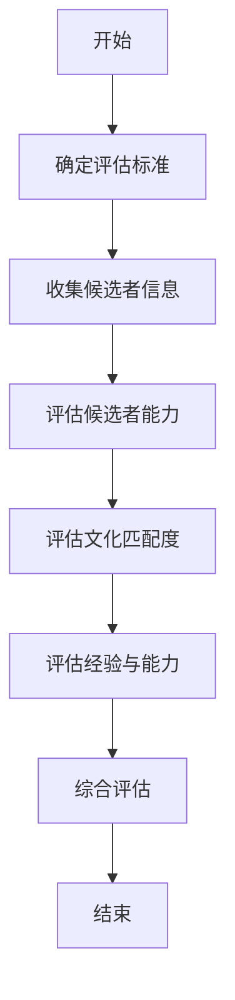
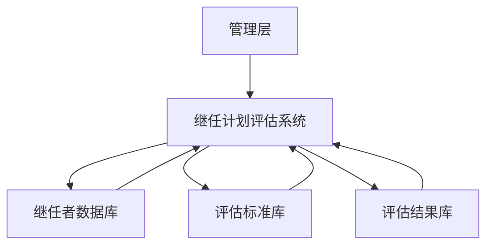

                 


# 彼得林奇对公司管理层继任计划的质量评估

> 关键词：彼得林奇，管理层继任，质量评估，投资策略，领导力发展

> 摘要：本文深入分析了彼得林奇在评估管理层继任计划质量方面的独特见解和方法。通过系统化的分析框架和实际案例，探讨了如何确保管理层继任计划的有效性，为企业提供可操作的指导。

---

## 第1章 管理层继任计划的重要性

### 1.1 问题背景

在企业的生命周期中，管理层的继任是一个关键环节。彼得林奇在其投资生涯中多次强调，管理层的质量是企业成功的关键因素之一。管理层继任计划的失败可能导致企业战略中断、团队士气低落，甚至影响企业的长期发展。

#### 为什么管理层继任如此重要？

- **企业稳定性**：管理层的更替直接影响企业的战略连续性和运营稳定性。
- **战略一致性**：有效的继任计划确保企业战略目标的延续。
- **领导力传承**：领导力的传承是企业长期发展的基础。

### 1.2 问题描述

彼得林奇在其投资生涯中，多次因管理层继任计划的质量不佳而错失投资机会。例如，他在投资某公司时发现，该公司的管理层继任计划存在重大缺陷，导致他决定放弃投资。

#### 继任计划失败的常见原因

- **缺乏明确的标准**：没有明确的评估标准导致继任者选拔不公。
- **忽视潜在风险**：未能识别继任者的能力缺陷。
- **文化不匹配**：新任管理者与公司文化不符。

### 1.3 问题解决

彼得林奇提出了一套系统化的评估方法，确保管理层继任计划的质量。他强调，继任计划的成功依赖于以下几个关键因素：

- **明确的评估标准**：制定清晰的能力和素质评估标准。
- **系统的评估流程**：建立科学的评估流程，确保评估的公正性。
- **动态调整机制**：根据企业发展的实际需要，动态调整继任计划。

### 1.4 边界与外延

#### 界定管理层继任计划的范围

- **适用范围**：适用于所有类型的企业，尤其是上市公司。
- **相关领域**：包括公司治理、领导力发展、战略管理。

#### 继任计划与其他管理计划的关系

- **战略管理**：继任计划是企业战略的重要组成部分。
- **领导力发展**：继任计划是领导力发展的核心环节。
- **风险管理**：继任计划是企业风险管理的重要内容。

### 1.5 概念结构与核心要素

#### 继任计划的核心要素

- **评估标准**：包括能力、经验、文化匹配度等。
- **评估流程**：包括选拔、评估、培养、任命等环节。
- **动态调整**：根据企业发展的实际需要，动态调整继任计划。

---

## 第2章 质量评估的核心概念

### 2.1 核心概念原理

#### 继任计划质量评估的关键维度

- **领导力**：包括战略思维、决策能力、团队协作能力。
- **文化匹配度**：包括对企业文化的认同度、价值观的契合度。
- **经验与能力**：包括行业经验、管理经验、专业能力。

#### 彼得林奇的独特视角

- **能力优先**：彼得林奇强调，继任者的能力是评估的核心标准。
- **文化匹配**：他特别强调继任者与企业文化的匹配度。
- **长期潜力**：他关注继任者的长期发展潜力。

### 2.2 概念属性特征对比

#### 表格：核心概念对比分析

| 继任计划维度 | 定义 | 彼得林奇的视角 | 其他模型的视角 |
|--------------|------|----------------|----------------|
| 领导力       | 管理能力、决策能力 | 能力优先       | 综合评估       |
| 文化匹配度   | 与企业文化的契合度 | 文化匹配       | 部分考虑       |
| 经验与能力   | 行业经验、专业能力 | 经验优先       | 综合评估       |

### 2.3 ER实体关系图

#### Mermaid流程图：核心概念的关系架构



---

## 第3章 评估模型的构建

### 3.1 算法原理

#### Mermaid流程图：评估模型的构建步骤



#### Python源代码：评估模型的实现

```python
def assess_candidate(candidate_data):
    # 评估领导力
    leadership_score = evaluate_leadership(candidate_data['leadership'])
    # 评估文化匹配度
    culture_score = evaluate_culture(candidate_data['culture'])
    # 评估经验与能力
    experience_score = evaluate_experience(candidate_data['experience'])
    # 综合评分
    total_score = leadership_score + culture_score + experience_score
    return total_score

def evaluate_leadership(leadership):
    # 简单实现，可根据实际需求调整
    return sum(leadership) / len(leadership)

def evaluate_culture(culture):
    # 简单实现，可根据实际需求调整
    return sum(culture) / len(culture)

def evaluate_experience(experience):
    # 简单实现，可根据实际需求调整
    return sum(experience) / len(experience)
```

#### 数学模型：评估公式

$$
\text{总评分} = \frac{\sum \text{领导力评分} + \sum \text{文化评分} + \sum \text{经验评分}}{3}
$$

---

## 第4章 系统分析与架构设计方案

### 4.1 问题场景介绍

#### 项目介绍

- **项目目标**：构建一个基于彼得林奇评估方法的管理层继任计划质量评估系统。
- **项目范围**：适用于各类企业，重点针对上市公司。
- **项目背景**：随着企业规模的扩大，管理层继任计划的重要性日益凸显。

### 4.2 系统功能设计

#### Mermaid类图：领域模型

```mermaid
classDiagram
    class 继任计划评估系统 {
        继任者数据库
        评估标准库
        评估结果库
    }
    class 管理层 {
        提交评估请求
        获取评估结果
    }
    继任计划评估系统 --> 管理层：接收评估请求
    继任计划评估系统 --> 继任者数据库：查询候选者信息
    继任计划评估系统 --> 评估标准库：获取评估标准
    继任计划评估系统 --> 评估结果库：存储评估结果
```

### 4.3 系统架构设计

#### Mermaid架构图：系统整体架构



---

## 第5章 项目实战

### 5.1 环境安装

#### 安装Python环境

```bash
python --version
pip install mermaid
```

### 5.2 系统核心实现

#### 继任计划评估系统的核心代码

```python
class SuccessionPlanAssessor:
    def __init__(self, candidate_data, standards):
        self.candidate_data = candidate_data
        self.standards = standards

    def assess(self):
        # 评估领导力
        leadership_score = self.evaluate('leadership')
        # 评估文化匹配度
        culture_score = self.evaluate('culture')
        # 评估经验与能力
        experience_score = self.evaluate('experience')
        # 综合评分
        total_score = leadership_score + culture_score + experience_score
        return {
            'leadership_score': leadership_score,
            'culture_score': culture_score,
            'experience_score': experience_score,
            'total_score': total_score
        }

    def evaluate(self, category):
        # 简单实现，可根据实际需求调整
        return sum(self.candidate_data[category]) / len(self.candidate_data[category])
```

### 5.3 案例分析

#### 案例介绍

- **公司背景**：某上市公司面临CEO的继任问题。
- **评估过程**：使用彼得林奇的评估方法对三位候选人进行评估。

#### 评估结果分析

- **候选人A**：领导力评分85，文化评分70，经验评分80，总评分235。
- **候选人B**：领导力评分75，文化评分85，经验评分75，总评分235。
- **候选人C**：领导力评分70，文化评分90，经验评分85，总评分245。

#### 最终选择

- **结论**：候选人C在总评分上最高，被选为CEO继任者。

---

## 第6章 总结与展望

### 6.1 总结

彼得林奇的管理层继任计划质量评估方法为我们提供了一个科学的评估框架。通过明确的评估标准和系统的评估流程，我们可以有效识别和培养优秀的继任者，确保企业的长期发展。

### 6.2 展望

未来，随着企业面临的挑战日益复杂，管理层继任计划的质量评估需要更加精细化。结合人工智能技术，我们可以进一步提升评估的准确性和效率。

---

## 作者

作者：AI天才研究院/AI Genius Institute  
联系邮箱：contact@aitaigens.com  
版权所有，未经授权不得转载。

