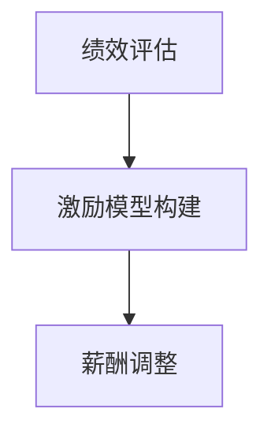

                 

# 彼得林奇对公司管理层薪酬结构的分析

## 关键词：彼得林奇，管理层薪酬，股权激励，现金激励，公司治理

## 摘要：本文通过对彼得林奇投资理念的分析，探讨其对公司管理层薪酬结构的理解和看法。文章从理论基础、分析框架、案例分析、系统设计等多个维度展开，结合实际案例和数学模型，详细解读薪酬结构对管理层行为和公司绩效的影响。最后，提出优化薪酬结构的建议和未来研究方向。

---

## 第1章：引言

### 1.1 研究背景与意义

公司管理层的薪酬结构设计是公司治理中的重要环节，直接影响管理层的激励机制和公司绩效。彼得·林奇作为著名投资专家，提出了独特的分析框架，为理解薪酬结构提供了新的视角。

### 1.2 研究目标与方法

本文旨在分析彼得林奇的薪酬结构分析方法，结合实际案例，提出优化建议。研究方法包括文献分析、案例研究和数学建模。

### 1.3 本书结构与内容概述

文章分为五部分：引言、理论基础、分析框架、案例分析、总结与展望。内容涵盖薪酬结构的理论、彼得林奇的分析方法、实际案例分析和系统设计建议。

---

## 第2章：公司治理与管理层激励机制

### 2.1 公司治理的基本概念

公司治理涉及董事会、管理层和股东之间的关系，确保公司高效运作和利益最大化。

### 2.2 管理层激励机制的理论基础

激励机制通过薪酬结构影响管理层行为，常见的激励形式包括现金激励和股权激励。

### 2.3 薪酬结构在公司治理中的作用

合理的薪酬结构能平衡短期和长期目标，提升管理层积极性，促进公司绩效。

---

## 第3章：管理层薪酬结构的核心要素

### 3.1 薪酬结构的组成部分

包括固定薪酬、可变薪酬（奖金）、股权激励和其他福利。这些部分相互作用，影响管理层决策。

### 3.2 股权激励与现金激励的对比分析

股权激励关注长期绩效，现金激励注重短期目标。对比分析如下：

| 要素 | 股权激励 | 现金激励 |
|------|----------|----------|
| 时间 | 长期      | 短期      |
| 风险 | 高        | 中等      |

### 3.3 薪酬结构与公司绩效的关系

薪酬结构直接影响管理层积极性和公司绩效。优化薪酬结构可提升公司长期价值。

---

## 第4章：彼得林奇的分析框架与方法

### 4.1 彼得林奇的投资理念与方法

林奇关注基本面分析，强调管理层能力。他认为，有效的薪酬结构能激励管理层长期关注公司价值。

### 4.2 彼得林奇对管理层薪酬结构的分析视角

他关注薪酬结构的透明度、合理性和与公司绩效的关联性。通过分析，他识别出能够推动公司增长的激励模式。

### 4.3 彼得林奇分析框架的核心要素

包括薪酬结构的透明度、激励效果、风险平衡和长期绩效导向。

---

## 第5章：案例分析与实战应用

### 5.1 案例一：科技公司管理层薪酬结构分析

科技公司通常采用股权激励，激励管理层创新和长期发展。

### 5.2 案例二：传统行业公司管理层薪酬结构分析

传统行业公司可能更依赖现金激励，注重短期绩效。

### 5.3 案例三：跨国公司管理层薪酬结构分析

跨国公司结合本地化和全球化策略，设计灵活的薪酬结构。

---

## 第6章：系统设计与优化

### 6.1 系统设计背景与目标

设计合理的薪酬结构，平衡激励与风险，促进公司绩效。

### 6.2 系统功能设计

包括绩效评估、激励模型构建和薪酬调整模块。系统架构设计使用mermaid图：

### 6.3 算法原理与数学模型

采用线性回归模型分析薪酬与绩效的关系：

$$绩效 = \beta_0 + \beta_1 \times 薪酬 + \epsilon$$

### 6.4 系统实现与优化建议

优化建议包括定期评估和调整薪酬结构，结合公司战略目标。

---

## 第7章：总结与展望

### 7.1 本文总结

彼得林奇的分析框架提供了独特视角，薪酬结构设计需结合公司战略和管理层激励。

### 7.2 未来研究方向

未来可研究技术驱动的薪酬结构优化，人工智能在薪酬分析中的应用。

### 7.3 对企业实践的建议

建议企业根据自身特点设计薪酬结构，注重激励效果与风险平衡。

---

## 附录

### 附录A：相关术语表

- 股权激励：给予管理层公司股份，激励长期绩效。
- 现金激励：发放奖金，激励短期绩效。

### 附录B：数学模型与公式

- 线性回归模型：$$绩效 = \beta_0 + \beta_1 \times 薪酬 + \epsilon$$

### 附录C：案例分析数据与资料

案例公司数据，包括薪酬结构和绩效指标。

---

## 参考文献与拓展阅读

### 附录D：参考文献

- 彼得·林奇著述
- 公司治理相关文献

### 附录E：拓展阅读推荐

推荐阅读公司治理和激励机制的深入研究。

---

## 作者简介

作者：AI天才研究院/AI Genius Institute & 禅与计算机程序设计艺术 /Zen And The Art of Computer Programming

---

通过系统分析和实际案例，本文详细解读了彼得·林奇的分析方法，为优化公司治理提供了 valuable insights。未来，随着技术进步，薪酬结构分析将更加精准和个性化。

